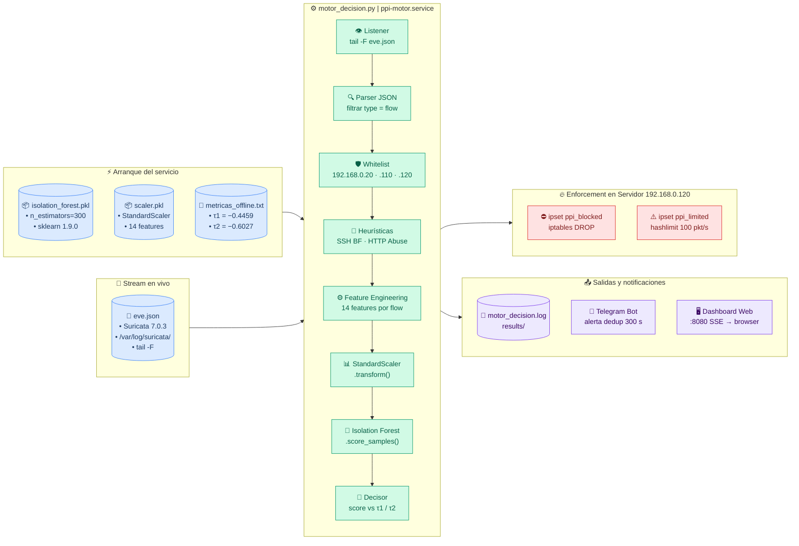
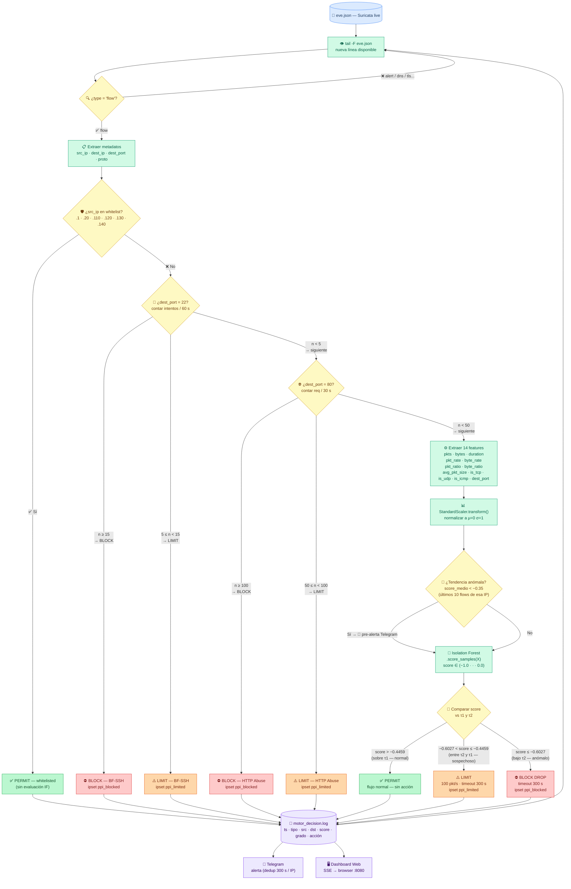
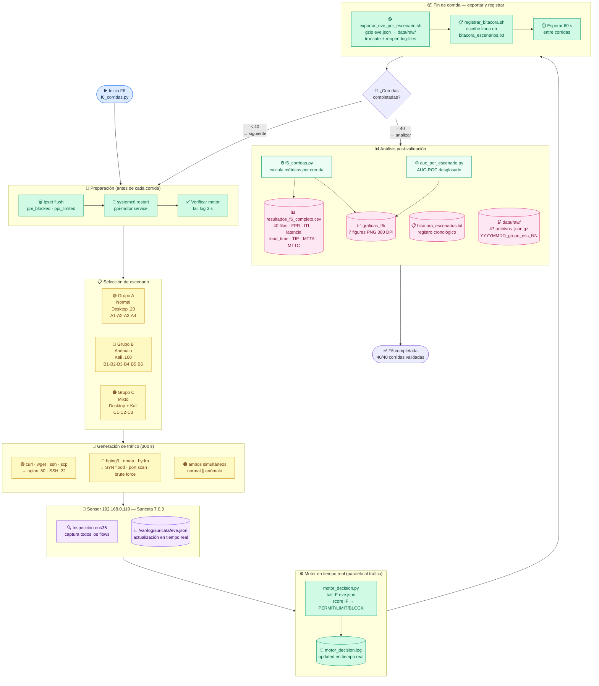
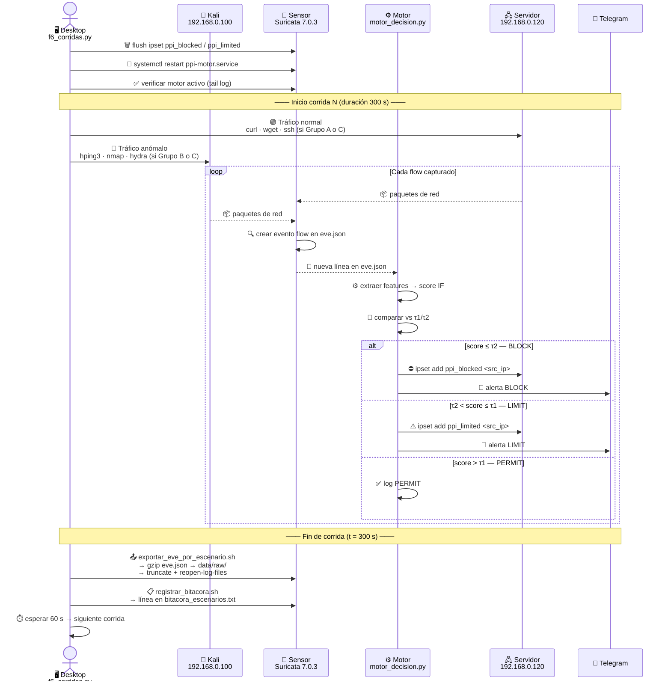

# Diagramas de Flujo — Fase 4 y Fase 6

**PPI — Detección Temprana de Comportamientos Anómalos en Redes de Datos mediante Aprendizaje Automático y un Mecanismo de Control en Tiempo Real**
Universidad Peruana Unión · Junio 2026

---

## Fase 4 — Motor de Decisión (`motor_decision.py`)

El motor es el núcleo del sistema: consume el stream en vivo de Suricata, aplica el modelo y emite decisiones de control en tiempo real. Combina dos tipos de detección: **heurística** (contadores de eventos por IP) y **ML** (score Isolation Forest).

---

### Diagrama 4.1 — Arquitectura general (Entradas → Motor → Salidas)



---

### Diagrama 4.2 — Flujo de decisión por flow (lógica interna)



---

### Tabla de componentes — Fase 4

| Componente | Tipo | Ruta / Dirección | Descripción |
|---|---|---|---|
| `eve.json` | 📜 Stream | `/var/log/suricata/eve.json` | Eventos de red en tiempo real — Suricata 7.0.3 |
| `isolation_forest.pkl` | 📦 Modelo | `models/` | Isolation Forest n=300, sklearn 1.9.0 |
| `scaler.pkl` | 📦 Modelo | `models/` | StandardScaler ajustado sobre 53,708 flows Grupo A |
| `metricas_offline.txt` | 📄 Config | `results/` | τ1=−0.4459 (Youden) · τ2=−0.6027 (FPR≤2%) |
| `motor_decision.py` | ⚙️ Proceso | `scripts/` | Bucle principal: tail → features → IF → decisión |
| `ppi-motor.service` | 🔧 Servicio | systemd sensor | Mantiene el motor activo y lo reinicia si cae |
| `ipset ppi_blocked` | 🔥 Kernel | 192.168.0.120 | Set netfilter para DROP (BLOCK) |
| `ipset ppi_limited` | 🔥 Kernel | 192.168.0.120 | Set netfilter para hashlimit 100 pkt/s (LIMIT) |
| `motor_decision.log` | 📝 Log | `results/` | Registro de cada decisión con score y features |
| `Telegram Bot` | 📱 Alerta | relay :8889 → api.telegram.org | Alertas de BLOCK/LIMIT con dedup 300 s por IP |
| `dashboard_web.py` | 🖥️ Web | `:8080 SSE` | Dashboard en tiempo real vía Server-Sent Events |

---

### Umbrales del decisor

```
score ∈ (−1.0) ──────────────────────────────────────── (0.0)
          │                   │              │
         ─0.8    BLOCK       ─0.6027   LIMIT   ─0.4459   PERMIT
                ⛔ DROP        τ2 ───────────── τ1        ✅ ok
                              ⚠️ 100 pkt/s
```

| Zona | Rango de score | Acción | Criterio de derivación |
|---|---|---|---|
| **PERMIT** | score > −0.4459 | Sin restricción | τ1 = índice de Youden (TPR − FPR máximo) |
| **LIMIT** | −0.6027 < score ≤ −0.4459 | hashlimit 100 pkt/s · timeout 300 s | τ2 = FPR ≤ 2% en tráfico normal |
| **BLOCK** | score ≤ −0.6027 | iptables DROP · timeout 300 s | Bajo τ2 |

---

## Fase 6 — Validación (40 corridas)

La Fase 6 ejecuta el motor en operación continua durante 40 corridas independientes, cubriendo los 13 escenarios definidos. Cada corrida sigue un protocolo fijo: preparar → generar tráfico → exportar → registrar → analizar.

---

### Diagrama 6.1 — Pipeline completo de validación



---

### Diagrama 6.2 — Detalle de una corrida individual



---

### Tabla de componentes — Fase 6

| Componente | Tipo | Origen / Nodo | Descripción |
|---|---|---|---|
| `f6_corridas.py` | ⚙️ Script | Desktop .20 | Orquestador: lanza tráfico, controla tiempos, recolecta métricas |
| Scripts de escenario (A1–C3) | ⚙️ Scripts | Desktop .20 / Kali .100 | Generan tráfico normal o anómalo según el escenario |
| `curl · wget · ssh · scp` | 🟢 Tool | Desktop .20 | Tráfico normal hacia nginx :80 y SSH :22 |
| `hping3 · nmap · hydra` | 🔴 Tool | Kali .100 | Ataques controlados: flood, scan, brute force |
| Suricata 7.0.3 | 📡 Servicio | Sensor .110 | Captura todos los flows en ens35 → eve.json |
| `eve.json` | 📜 Stream | Sensor .110 | Eventos de red en vivo — rotado al fin de cada corrida |
| `motor_decision.py` | ⚙️ Proceso | Sensor .110 | Procesa flows en tiempo real durante las 300 s |
| `exportar_eve_por_escenario.sh` | ⚙️ Script | Sensor .110 | Comprime eve.json → `.json.gz`, trunca y reabre el log |
| `registrar_bitacora.sh` | ⚙️ Script | Sensor .110 | Agrega línea de metadatos a `bitacora_escenarios.txt` |
| `data/raw/*.json.gz` | 🗜️ Archivo | Sensor .110 | 47 capturas comprimidas — nomenclatura `YYYYMMDD_grupo_esc_NN_eve.json.gz` |
| `motor_decision.log` | 📝 Log | Sensor .110 | Registro de 40 corridas — fuente para `f6_corridas.py` |
| `f6_corridas.py` (análisis) | ⚙️ Script | Sensor .110 | Lee el log, calcula FPR · ITL · latencia · lead_time · TIE · MTTA · MTTC |
| `resultados_f6_completo.csv` | 📊 Datos | `results/` | 40 filas × N columnas — resultado oficial de la Fase 6 |
| `graficas_f6/` | 📈 Gráficas | `results/` | 7 figuras PNG 300 DPI para el informe |
| `bitacora_escenarios.txt` | 📋 Registro | `docs/bitacora/` | Historial cronológico de todas las corridas ejecutadas |

---

### Grupos y distribución de las 40 corridas

```mermaid
gantt
    title Distribución de las 40 corridas de validación F6
    dateFormat  X
    axisFormat  Corrida %s

    section 🟢 Normal (A1–A4)
    Corridas 1–10  : 1, 10

    section 🟠 Mixto (C1–C3)
    Corridas 11–20 : 11, 20

    section 🔁 Reevaluación
    Corridas 21–30 : 21, 30

    section 🏁 Final
    Corridas 31–40 : 31, 40
```



| Grupo | Corridas | Escenarios | Tráfico anómalo | Detección esperada |
|---|---|---|---|---|
| **Normal** | 1 – 10 | A1 · A2 · A3 · A4 | Ninguno | ITL=0% · Disponibilidad=100% |
| **Mixto** | 11 – 20 | C1 · C2 · C3 | SYN flood · port scan · UDP flood | BLOCK + LIMIT · ITL=0% |
| **Reevaluación** | 21 – 30 | C1 · C2 · C3 | Mismos escenarios mixtos | Robustez y reproducibilidad |
| **Final** | 31 – 40 | C1 · C2 · C3 | Mismos escenarios mixtos | Validación de cierre |

---

### Métricas calculadas por corrida

| Métrica | Símbolo | Descripción |
|---|---|---|
| Falsos Positivos | FPR | % flows legítimos con score < τ1 |
| Interrupción Tráfico Legítimo | ITL | % flows normales bloqueados o limitados por error |
| Latencia de decisión | lat_ms | Tiempo medio entre lectura del flow y emisión de la decisión (ms) |
| Lead time | LT_s | Segundos desde inicio del ataque hasta primer log BLOCK/LIMIT |
| Tasa de Intervención Efectiva | TIE | % flows anómalos que recibieron BLOCK o LIMIT |
| Mean Time To Alert | MTTA_s | Tiempo desde inicio ataque hasta primer Telegram enviado |
| Mean Time To Contain | MTTC_s | Tiempo desde inicio ataque hasta primer ipset aplicado en servidor |
| Disponibilidad | disp | Servidor responde curl/ping durante la corrida (0=caída / 1=ok) |

---

*Diagramas generados el 2026-06-19.*
*Scripts fuente: `scripts/motor_decision.py` · `scripts/f6_corridas.py` · `scripts/capture/exportar_eve_por_escenario.sh`*
