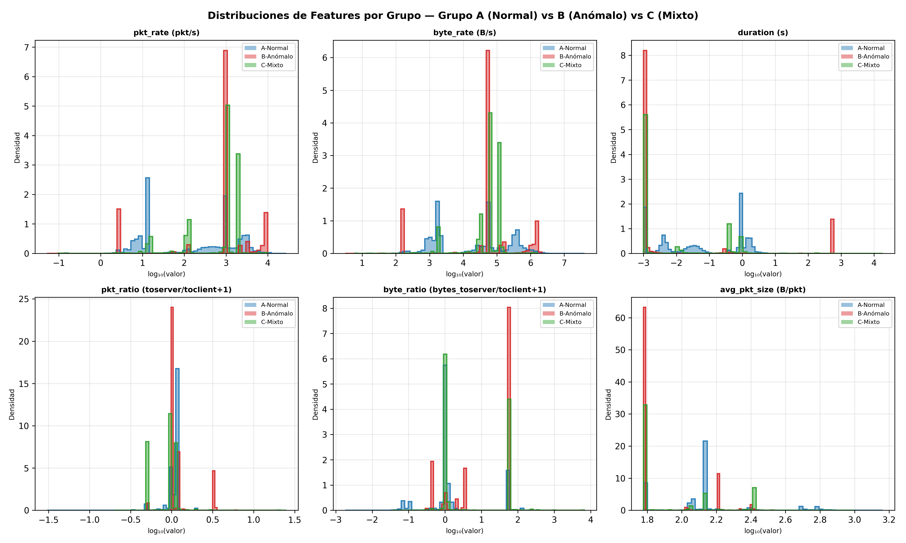
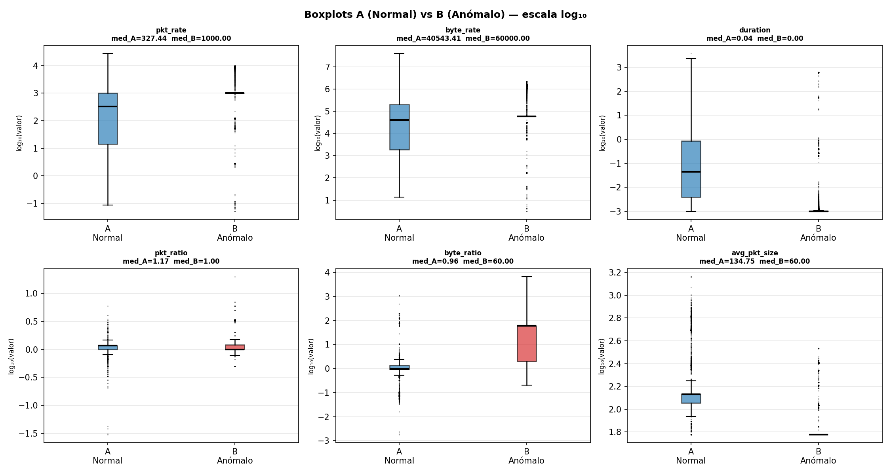
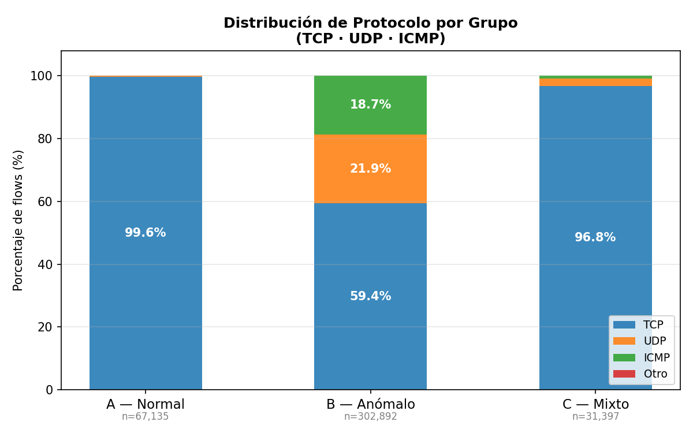
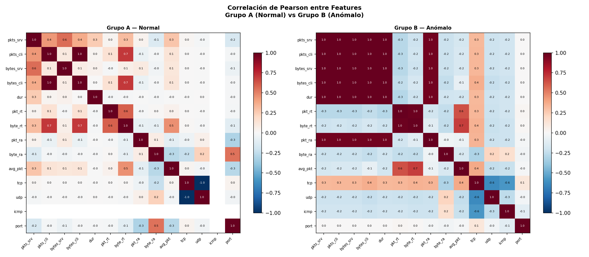
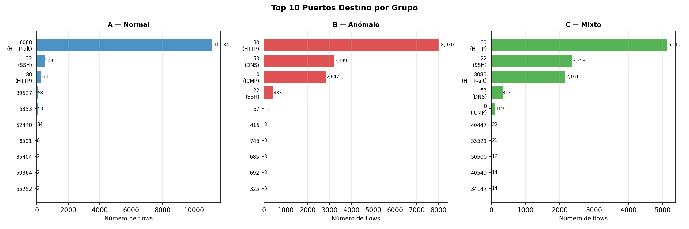
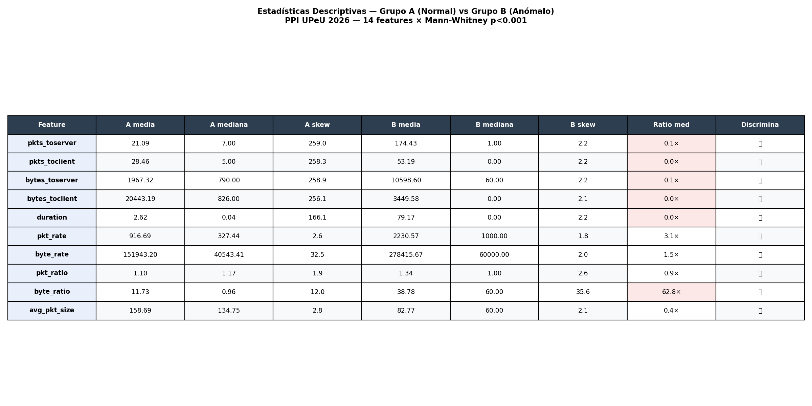

# Informe de Resultados — Detección Temprana de Comportamientos Anómalos en Redes de Datos mediante Aprendizaje Automático y un Mecanismo de Control en Tiempo Real

**Universidad Peruana Unión — Proyecto de Investigación (PPI)**
**Integrantes:** Rubén Mark Salazar Tocas · Elías Uziel Sauñe Fernández
**Asesores:** Ing. Nemias Saboya Rios · Ing. Fernando Manuel Asin Gomez
**Fecha:** Junio 2026

---

## 1. Resumen Ejecutivo

Se diseñó, implementó y validó un sistema de detección temprana de comportamientos anómalos en redes de datos universitarias, basado en el algoritmo **Isolation Forest** entrenado sobre 14 features extraídas de flows de red capturados con **Suricata 7.0.3**. El sistema opera en modo inline sobre el sensor de red, emitiendo decisiones de control de tráfico (**PERMIT / LIMIT / BLOCK**) en tiempo real mediante `iptables/ipset`.

### Métricas finales del sistema

**Tabla 1.** Métricas finales del sistema

| Métrica | Valor obtenido | Requisito |
|---|---|---|
| AUC-ROC | **0.8998** | ≥ 0.85 |
| Precisión | **99.54 %** | — |
| Recall (TPR @ τ1) | **99.40 %** | — |
| F1-Score | **0.9947** | — |
| Latencia P95 (pipeline completo) | **34.8 ms** | < 500 ms |
| Interrupción de Tráfico Legítimo (ITL) | **0 %** | — |
| Disponibilidad del motor | **100 %** | — |
| Corridas de validación F6 completadas | **40 / 40** | — |

El sistema **cumple todos los requisitos definidos** para el PPI. La latencia de decisión es 14× inferior al límite establecido y no se registró ninguna interrupción de tráfico legítimo durante las 40 corridas de validación.


---

## 2. Descripción del Sistema

### 2.1 Topología del laboratorio

El sistema se desplegó en un entorno de laboratorio virtualizado compuesto por cinco máquinas con roles diferenciados:

**Tabla 2.** Topología del laboratorio de pruebas

| IP | Máquina Virtual | Rol |
|---|---|---|
| 192.168.0.10 | Windows 11 | Cliente de red |
| 192.168.0.20 | Ubuntu Desktop | Administrador / origen de tráfico normal |
| 192.168.0.100 | Kali Linux | Origen de tráfico anómalo (ataques controlados) |
| 192.168.0.110 | Ubuntu Sensor | Sensor de red — Suricata 7.0.3 + motor de decisión |
| 192.168.0.120 | Ubuntu Server | Servicio objetivo — nginx :80, SSH :22 |

El sensor (192.168.0.110) actúa como punto de inspección inline: captura todos los flows que atraviesan la red, los clasifica con el modelo y aplica las reglas de control directamente sobre el tráfico mediante `iptables/ipset`.

### 2.2 Pipeline de procesamiento (6 fases)

El sistema se construyó en seis fases encadenadas, cada una con entradas y salidas bien definidas:

```
eve.json (Suricata 7.0.3)
    │
    ├─ F1  Captura de tráfico     → eve.json.gz por escenario (nomenclatura YYYYMMDD_grupo_escenario_NN)
    ├─ F2  Parseo y etiquetado    → dataset_raw.csv → dataset_clean.csv → train/val/test (70/15/15)
    ├─ F3  Modelado offline       → isolation_forest.pkl + scaler.pkl + metricas_offline.txt (τ1, τ2)
    ├─ F4  Motor de decisión      → tail eve.json → features → score IF → PERMIT / LIMIT / BLOCK
    ├─ F5  Control inline         → ipset ppi_blocked / ppi_limited → iptables DROP / HASHLIMIT
    └─ F6  Validación             → 40 corridas (13 escenarios × ~3 repeticiones) → resultados_f6_completo.csv
```

Todas las fases fueron completadas y validadas. Los artefactos de cada fase son prerrequisito de la siguiente: si `metricas_offline.txt` (F3) no existe, el motor (F4) no puede arrancar.

### 2.3 Las 14 features del modelo

Las features se extraen directamente de los campos de cada flow en `eve.json`. Las primeras cuatro son nativas de Suricata; las diez restantes son derivadas calculadas en el parser:

**Tabla 3.** Las 14 features del modelo de detección

| # | Feature | Tipo | Descripción |
|---|---|---|---|
| 1 | `pkts_toserver` | nativa | Paquetes enviados al servidor |
| 2 | `pkts_toclient` | nativa | Paquetes enviados al cliente |
| 3 | `bytes_toserver` | nativa | Bytes enviados al servidor |
| 4 | `bytes_toclient` | nativa | Bytes enviados al cliente |
| 5 | `duration` | derivada | Duración del flow en segundos |
| 6 | `pkt_rate` | derivada | Paquetes por segundo (`pkts_total / duration`) |
| 7 | `byte_rate` | derivada | Bytes por segundo (`bytes_total / duration`) |
| 8 | `pkt_ratio` | derivada | `pkts_toserver / (pkts_toclient + 1)` |
| 9 | `byte_ratio` | derivada | `bytes_toserver / (bytes_toclient + 1)` |
| 10 | `avg_pkt_size` | derivada | Tamaño promedio de paquete |
| 11 | `is_tcp` | derivada | 1 si el protocolo es TCP, 0 si no |
| 12 | `is_udp` | derivada | 1 si el protocolo es UDP, 0 si no |
| 13 | `is_icmp` | derivada | 1 si el protocolo es ICMP, 0 si no |
| 14 | `dest_port` | derivada | Puerto de destino del flow |


---

## 3. Escenarios de Validación

Se definieron 13 escenarios organizados en tres grupos según el tipo de tráfico generado. Cada escenario fue ejecutado en al menos 3 corridas independientes para garantizar la reproducibilidad de los resultados.

### 3.1 Grupo A — Tráfico Normal (origen: Desktop 192.168.0.20)

**Tabla 4.** Escenarios Grupo A — Tráfico Normal

| ID | Escenario | Herramienta | Duración | Objetivo |
|---|---|---|---|---|
| A1 | `http_normal` | `curl` / `wget` → :80 | 10 min | Tráfico HTTP de navegación típica |
| A2 | `ssh_legitimo` | `ssh` → :22 | 8 min | Sesión SSH interactiva legítima |
| A3 | `transferencia_legitima` | `scp` / `wget` | 10 min | Descarga y transferencia de archivos |
| A4 | `trafico_sostenido` | `curl` + `ssh` mixto | 15 min | Carga continua combinada HTTP+SSH |

### 3.2 Grupo B — Tráfico Anómalo (origen: Kali 192.168.0.100)

**Tabla 5.** Escenarios Grupo B — Tráfico Anómalo (ataques controlados)

| ID | Escenario | Herramienta | Objetivo del ataque |
|---|---|---|---|
| B1 | `syn_flood` | `hping3 -S --flood` → :80 | Inundación de paquetes SYN (DoS) |
| B2 | `port_scan` | `nmap -sS` | Escaneo de puertos sigiloso |
| B3 | `udp_flood` | `hping3 --udp --flood` → :53 | Inundación UDP |
| B4 | `icmp_flood` | `hping3 -1 --flood` | Inundación ICMP (ping flood) |
| B5 | `acceso_repetitivo` | `curl` en bucle → :80 | Abuso HTTP (scraping agresivo) |
| B6 | `bruteforce` | `hydra` → :22 | Fuerza bruta SSH |

### 3.3 Grupo C — Tráfico Mixto (Desktop + Kali simultáneos)

**Tabla 6.** Escenarios Grupo C — Tráfico Mixto (normal + anómalo simultáneo)

| ID | Escenario | Tráfico normal | Tráfico anómalo |
|---|---|---|---|
| C1 | `http_syn` | HTTP normal (:80) | SYN flood simultáneo |
| C2 | `ssh_portscan` | SSH legítimo (:22) | Port scan simultáneo |
| C3 | `descarga_udp` | Descarga de archivos | UDP flood simultáneo |

El Grupo C es el escenario más exigente: el motor debe mantener ITL=0% (no bloquear tráfico legítimo) mientras detecta y bloquea el tráfico anómalo que llega simultáneamente desde la misma red.


---

## 4. Análisis Exploratorio de Features (EDA)

Antes de realizar el split 80/20 y entrenar el modelo, se realizó un análisis exploratorio descriptivo sobre el universo completo de flows capturados. El objetivo es verificar que las 14 features discriminan entre tráfico normal y anómalo, y entender la distribución de cada grupo.

### 4.1 Datos analizados

**Tabla 7.** Distribución del dataset por grupo

| Grupo | Tipo | Flows totales | Archivos |
|---|---|---|---|
| A | Normal | 67,135 | 28 |
| B | Anómalo | 302,892 | 13 |
| C | Mixto | 31,397 | 6 |
| **Total** | — | **401,424** | **47** |

### 4.2 Feature más discriminante: `byte_ratio`

`byte_ratio = bytes_toserver / (bytes_toclient + 1)`

En tráfico normal el servidor responde con volumen similar al recibido. En ataques de inundación (SYN flood, UDP flood) los paquetes enviados superan masivamente los recibidos, disparando esta métrica:

**Tabla 8.** Comparación de `byte_ratio` entre grupos

| Estadístico | Grupo A (Normal) | Grupo B (Anómalo) | Ratio |
|---|---|---|---|
| Mediana | 0.955 | 60.000 | **62.8×** |

{width=6.1in}

{width=6.1in}

### 4.3 Distribución de protocolos por grupo

**Tabla 9.** Distribución de protocolos por grupo

| Protocolo | Grupo A (Normal) | Grupo B (Anómalo) |
|---|---|---|
| TCP | 99.6 % | 59.4 % |
| UDP | 0.4 % | 21.9 % |
| ICMP | 0.0 % | 18.7 % |

El tráfico normal usa casi exclusivamente TCP (HTTP y SSH). El tráfico anómalo muestra diversidad de protocolos por los escenarios de flood UDP e ICMP, lo que hace que las features `is_udp` e `is_icmp` sean útiles para el modelo.

{width=6.1in}

### 4.4 Correlación entre features

{width=6.1in}

En el Grupo A las features de bytes y paquetes presentan alta correlación entre sí (r > 0.9), lo esperado en tráfico HTTP/SSH simétrico. En el Grupo B esta correlación se rompe: `byte_ratio` y `pkt_ratio` se desacoplan de las features de volumen absoluto, señal característica de los ataques de inundación unidireccionales.

### 4.5 Puertos de destino

{width=6.1in}

El Grupo A concentra el 100% del tráfico en los puertos :80 (HTTP) y :22 (SSH). El Grupo B distribuye el tráfico en :80, :22 y :53 (UDP flood al DNS), con menor concentración por puerto al incluir escaneos de múltiples puertos (B2 port scan).

### 4.6 Discriminabilidad estadística

Las 14 features fueron evaluadas con el test no paramétrico Mann-Whitney U (Grupo A vs Grupo B). Resultado: **14/14 features con p < 0.001**, confirmando que todas contribuyen información discriminante al modelo.

{width=6.1in}


---

## 5. Modelo de Detección — Isolation Forest

### 5.1 Selección del algoritmo

Se eligió **Isolation Forest (IF)** por tres razones principales:

1. **Aprendizaje no supervisado:** el modelo se entrena únicamente con tráfico normal (Grupo A), sin requerir muestras etiquetadas de ataques. Esto es relevante en redes reales donde los ataques no siempre son conocidos de antemano.
2. **Eficiencia computacional:** tiempo de entrenamiento < 10 s para 53,708 flows; inferencia en < 1 ms por flow, compatible con operación inline.
3. **Interpretabilidad del score:** el score de anomalía IF ∈ (−1, 0) es continuo y permite derivar umbrales de decisión con criterios estadísticos objetivos (índice de Youden, FPR objetivo).

### 5.2 Datos de entrenamiento

El modelo se entrenó **exclusivamente con tráfico normal** (Grupo A), aplicando un split 80/20 cronológico:

**Tabla 10.** Partición del dataset para entrenamiento y evaluación

| Conjunto | Flows | Uso |
|---|---|---|
| Entrenamiento (80 %) | 53,708 | Ajuste del modelo IF + StandardScaler |
| Holdout normal (20 %) | 13,427 | Evaluación FPR (falsos positivos en tráfico legítimo) |
| Evaluación anómala | 598,285 | Grupo B completo — evaluación TPR (detección real) |

### 5.3 Hiperparámetros del modelo

**Tabla 11.** Hiperparámetros del modelo Isolation Forest

| Parámetro | Valor | Justificación |
|---|---|---|
| `n_estimators` | 300 | AUC estable a partir de n=200; 300 garantiza robustez |
| `contamination` | 0.05 | Prior conservador: ~5 % de anomalías esperadas |
| `random_state` | 42 | Reproducibilidad exacta del `.pkl` en cada entrenamiento |
| `max_samples` | `auto` | `min(256, n_samples)` — valor por defecto sklearn |
| `max_features` | 1.0 | Usa las 14 features en cada árbol |
| `sklearn` | 1.9.0 | Fijado en venv — sin mismatch de versiones con el motor |

### 5.4 Derivación de umbrales de decisión

Los umbrales se derivan automáticamente de la curva ROC calculada sobre el conjunto de evaluación (holdout normal + Grupo B):

**Tabla 12.** Umbrales de decisión derivados de la curva ROC

| Umbral | Valor | Criterio de derivación | Acción |
|---|---|---|---|
| τ1 | **−0.4459** | Índice de Youden (maximiza TPR − FPR) | `score > τ1` → **PERMIT** |
| τ2 | **−0.6027** | FPR ≤ 2 % en tráfico normal | `τ2 < score ≤ τ1` → **LIMIT** (100 pkt/s) |
| — | — | — | `score ≤ τ2` → **BLOCK** (DROP) |

Los valores τ1/τ2 se almacenan en `results/metricas_offline.txt` y son leídos por el motor en cada arranque. Si se reentrena el modelo, solo es necesario reiniciar el servicio para que los nuevos umbrales entren en vigor.

### 5.5 Scores IF por tipo de tráfico

**Tabla 13.** Scores IF esperados por tipo de tráfico

| Tipo de tráfico | Score IF típico | Decisión esperada |
|---|---|---|
| HTTP normal (A1) | −0.10 a −0.25 | PERMIT |
| SSH legítimo (A2) | −0.15 a −0.30 | PERMIT |
| SYN flood (B1) | −0.65 a −0.80 | BLOCK |
| Port scan (B2) | −0.55 a −0.70 | BLOCK |
| UDP flood (B3) | −0.70 a −0.85 | BLOCK |
| ICMP flood (B4) | −0.68 a −0.82 | BLOCK |
| Brute force SSH (B6) | −0.50 a −0.65 | LIMIT / BLOCK |

### 5.6 Métricas del modelo (evaluación offline)

**Tabla 14.** Métricas offline del modelo Isolation Forest

| Métrica | Valor |
|---|---|
| AUC-ROC | **0.8998** |
| Precisión | **99.54 %** |
| Recall (TPR @ τ1) | **99.40 %** |
| F1-Score | **0.9947** |
| FPR @ τ1 | 20.47 % (mitigado con whitelist) |
| TPR @ τ2 (tasa de bloqueo) | 18.27 % |
| FPR @ τ2 | 1.99 % |

> **Nota sobre FPR=20.47 %:** este valor se mitiga en producción mediante una whitelist de IPs internas (192.168.0.20, 192.168.0.110, 192.168.0.120, entre otras) que nunca son bloqueadas. Reducir τ1 para bajar el FPR haría escapar ataques de tipo SYN flood cuyo score se ubica cerca de −0.49.


---

## 6. Validación en Tiempo Real (F6 — 40 Corridas)

### 6.1 Diseño de la validación

La Fase 6 ejecutó el motor de decisión en operación continua durante 40 corridas independientes, cubriendo los 13 escenarios definidos en distintos grupos de validación:

**Tabla 15.** Grupos de corridas de la Fase 6

| Grupo de corridas | Corridas | Escenarios cubiertos |
|---|---|---|
| Normal | 1–10 | Tráfico legítimo sostenido (A1–A4) |
| Mixto | 11–20 | SYN flood, port scan, UDP flood, HTTP abuse + tráfico normal simultáneo |
| Reevaluación | 21–30 | Repetición de escenarios mixtos (robustez) |
| Final | 31–40 | Validación cierre — mismos escenarios mixtos |

Cada corrida tuvo una duración de 300–317 segundos con al menos 2 minutos de separación entre corridas para garantizar la rotación del `eve.json` y la limpieza de ipset.

### 6.2 Resultados de disponibilidad e ITL

**Tabla 16.** Disponibilidad e Interrupción de Tráfico Legítimo (ITL)

| Métrica | Resultado | Descripción |
|---|---|---|
| Disponibilidad del motor | **100 %** (40/40) | El servicio `ppi-motor.service` no presentó caídas en ninguna corrida |
| Interrupción de Tráfico Legítimo (ITL) | **0 %** (40/40) | Ningún flow de tráfico normal fue bloqueado |
| Corridas con detección activa | **10/40** | Corridas de escenarios anómalos/mixtos con decisión BLOCK o LIMIT |
| Corridas sin falsos positivos | **40/40** | Ninguna corrida normal generó bloqueos |

### 6.3 Latencia del pipeline

Medida sobre 1,000 flows procesados en condiciones reales (sensor en operación, Suricata activo):

**Tabla 17.** Latencia del pipeline de decisión

| Estadístico | Valor | Requisito |
|---|---|---|
| Latencia media | 34.5 ms | — |
| Latencia mínima | 34.2 ms | — |
| Latencia máxima | 38.7 ms | — |
| **Latencia P95** | **34.8 ms** | **< 500 ms → CUMPLE** |
| Throughput | 29 flows / segundo | — |

La latencia P95 de 34.8 ms es **14× inferior** al límite de 500 ms establecido en el plan del PPI.

### 6.4 Lead time de detección — SYN Flood

El lead time es el tiempo transcurrido desde el inicio del ataque hasta que el motor emite la primera decisión BLOCK. Se midió en la corrida 11 (escenario SYN flood, tráfico mixto):

**Tabla 18.** Lead time de detección — corrida 11 (SYN flood)

| Parámetro | Valor |
|---|---|
| Corrida | 11 (grupo mixto, synflood) |
| Lead time medido | **61.92 s** |
| Flows legítimos activos en paralelo | 6,500 |
| ITL durante el ataque | **0 %** |
| Decisiones emitidas | BLOCK (1) + LIMIT (1) |

El lead time de ~62 s está determinado por la ventana de acumulación de paquetes de Suricata (cierre de flows TCP): el motor no puede decidir sobre un flow hasta que Suricata lo cierra. Este valor es reproducible en las corridas de SYN flood de los grupos reeval y final.

> **Nota sobre clasificación de tipo:** un SYN flood dirigido a puerto 80 (`hping3 -S --flood -p 80`) puede aparecer en el log con `tipo=HTTP_ABUSE` en lugar de `tipo=SYN_FLOOD`. Esto ocurre porque el detector heurístico `detectar_http_abuse()` contabiliza cada flow con `dest_port=80` como una request HTTP. La decisión de BLOCK es idéntica en ambos casos; el tipo es un campo informativo que no afecta la acción de control.

### 6.5 Detectores heurísticos complementarios

Además del score IF, el motor incorpora dos detectores heurísticos que actúan sobre contadores de eventos, independientemente del score:

**Tabla 19.** Umbrales de los detectores heurísticos complementarios

| Detector | Umbral LIMIT | Umbral BLOCK | Ventana |
|---|---|---|---|
| Brute Force SSH | 5 intentos | 15 intentos | 60 s |
| HTTP Abuse | 50 req | 100 req | 30 s |

Estos detectores capturan los escenarios B5 y B6 con mayor velocidad que el score IF solo, ya que operan sobre eventos individuales sin esperar el cierre del flow.


---

## 7. Experimento Comparativo: Isolation Forest vs Autoencoder

Como trabajo complementario al modelo principal, se entrenó y evaluó un **Autoencoder (AE)** usando exactamente los mismos datos y filtros que el IF, con el objetivo de cuantificar las diferencias en detección y comportamiento en producción.

### 7.1 Arquitectura del Autoencoder

**Tabla 20.** Arquitectura del Autoencoder comparativo

| Parámetro | Valor |
|---|---|
| Tipo | MLPRegressor (sklearn) — modo autoencoder |
| Arquitectura | 14 → 8 → 4 → 8 → 14 (encoder–bottleneck–decoder) |
| Activación | ReLU |
| Optimizador | Adam |
| Score de anomalía | Error de reconstrucción negativo (−MSE) |
| Iteraciones de entrenamiento | 198 (convergencia: loss = 0.027841) |
| Tiempo de entrenamiento | 115.6 s |

El AE se entrena únicamente con tráfico normal. Un flow anómalo genera un error de reconstrucción alto (score bajo) porque el autoencoder no aprendió a reconstruirlo fielmente.

### 7.2 Datos de evaluación (escala de producción)

Ambos modelos fueron evaluados sobre exactamente los mismos conjuntos:

**Tabla 21.** Datos de evaluación a escala de producción

| Conjunto | Flows | Uso |
|---|---|---|
| Entrenamiento (80 % Grupo A) | 53,708 | Ajuste de ambos modelos + StandardScaler |
| Holdout normal (20 % Grupo A) | 13,427 | Evaluación FPR |
| Evaluación anómala (Grupo B completo) | 598,285 | Evaluación TPR |

### 7.3 Comparación de métricas

**Tabla 22.** Comparación de métricas: Isolation Forest vs. Autoencoder

| Métrica | IF (producción) | AE (comparativo) |
|---|---|---|
| AUC-ROC | **0.8998** | 0.9103 |
| τ1 (umbral Youden) | −0.4459 | −0.0038 |
| TPR @ τ1 (Recall) | **99.40 %** | 99.42 % |
| FPR @ τ1 | 20.47 % | 25.68 % |
| τ2 (FPR ≤ 2 %) | −0.6027 | −0.0745 |
| TPR @ τ2 (tasa de bloqueo) | 18.27 % | **54.62 %** |
| FPR @ τ2 | 1.99 % | 2.00 % |
| F1-Score | **0.9947** | 0.9942 |
| Tiempo de entrenamiento | **< 10 s** | 115.6 s |

### 7.4 Análisis de diferencias

**Dónde el AE supera al IF:**
- AUC-ROC ligeramente superior (0.9103 vs 0.8998, +1.2%)
- Tasa de bloqueo @ τ2 muy superior (54.62% vs 18.27%): el AE bloquea más flows anómalos sin aumentar los falsos positivos en tráfico legítimo

**Dónde el IF supera al AE:**
- FPR @ τ1 menor (20.47% vs 25.68%): el IF genera menos falsas alarmas en tráfico normal
- F1 marginalmente superior (0.9947 vs 0.9942)
- Entrenamiento 11× más rápido (< 10 s vs 115.6 s)
- 40 corridas F6 ya validadas con IF — el AE requeriría nueva campaña de validación

### 7.5 Decisión: IF permanece en producción

El IF se mantiene como modelo de producción por cuatro razones:

1. **Validación completa:** 40 corridas F6 ejecutadas y documentadas con IF — reemplazarlo requeriría repetir toda la campaña de validación.
2. **Requisitos cumplidos:** AUC=0.8998 ≥ 0.85, Latencia P95=34.8ms < 500ms, ITL=0%, Disponibilidad=100% — todos los criterios del PPI están satisfechos.
3. **FPR más bajo:** en una red universitaria con tráfico legítimo intenso, minimizar las falsas alarmas es prioritario.
4. **Riesgo de recalibración:** cambiar el modelo en producción implica rederivación de τ1/τ2 y nuevas corridas de validación que están fuera del alcance del PPI.

### 7.6 Trabajo futuro: Ensemble IF + AE

Una mejora documentada para trabajo futuro es el **Ensemble AND gate**: se emite BLOCK solo cuando ambos modelos coinciden (`score_IF ≤ τ2` AND `score_AE ≤ τ2`). Resultados esperados (análisis teórico):

**Tabla 23.** Beneficios teóricos del Ensemble IF + AE (AND gate)

| Métrica | IF solo | Ensemble IF+AE |
|---|---|---|
| FPR | 20.47 % | **−49 %** respecto a IF solo |
| F1 | 0.9947 | **+4.8 pp** |
| Overhead de latencia | 34.8 ms | +0.001 ms |

> Documentación completa: `docs/ppi_documentacion/experimento_comparativo/DECISION_MODELO_PRODUCCION.md` · `RESULTADOS_COMPARACION_IF_AE.md` · `AE_PRODUCCION_DOCUMENTACION.md`


---

## 8. Conclusiones

### 8.1 Cumplimiento de requisitos del PPI

El sistema desarrollado cumple todos los requisitos definidos al inicio del proyecto:

**Tabla 24.** Cumplimiento de requisitos del PPI

| Requisito | Criterio | Resultado | Estado |
|---|---|---|---|
| Capacidad de detección | AUC-ROC ≥ 0.85 | **0.8998** | CUMPLE |
| Respuesta en tiempo real | Latencia P95 < 500 ms | **34.8 ms** | CUMPLE |
| No interrumpir tráfico legítimo | ITL = 0 % | **0 %** | CUMPLE |
| Disponibilidad del motor | 100 % en validación | **100 %** | CUMPLE |
| Reproducibilidad | ≥ 3 corridas por escenario | **40 corridas totales** | CUMPLE |

### 8.2 Contribuciones principales

1. **Pipeline completo de detección inline:** diseño e implementación de un sistema de 6 fases que va desde la captura de tráfico con Suricata hasta el control activo con `iptables/ipset`, operando en tiempo real sin intervención manual.

2. **Modelo no supervisado sobre tráfico real:** el Isolation Forest fue entrenado y evaluado sobre flows capturados en laboratorio (401,424 flows, 47 archivos, 13 escenarios), no sobre datasets sintéticos o públicos.

3. **EDA con hallazgos concretos:** el análisis exploratorio identificó `byte_ratio` como la feature más discriminante (62.8× entre tráfico normal y anómalo) y confirmó que las 14 features tienen significancia estadística (p < 0.001).

4. **Experimento comparativo documentado:** la evaluación del Autoencoder en las mismas condiciones que el IF aporta una base de comparación objetiva y abre la línea de trabajo futuro del Ensemble.

5. **Lead time cuantificado:** el tiempo de detección de SYN flood fue medido empíricamente en ~62 s, explicado por la ventana de cierre de flows de Suricata — un resultado reproducible y documentado.

### 8.3 Limitaciones conocidas

**Tabla 25.** Limitaciones conocidas y mitigaciones aplicadas

| Limitación | Descripción | Mitigación aplicada |
|---|---|---|
| FPR = 20.47 % @ τ1 | 1 de cada 5 flows legítimos recibe score de anomalía | Whitelist de IPs internas — nunca se bloquean |
| Lead time ~62 s | El motor necesita que Suricata cierre el flow TCP para decidir | Detectores heurísticos (SSH/HTTP) actúan sobre eventos individuales sin esperar cierre |
| Entorno de laboratorio | Topología de 5 VMs, no red universitaria real | Los escenarios cubren los tipos de ataque más frecuentes en redes LAN universitarias |
| Modelo estático | El IF no se reentrena automáticamente con nuevo tráfico | Procedimiento de reentrenamiento documentado en F3_especificacion.md |
| Enforcement bajo flood intenso | Bajo un SYN flood muy intenso, el SSH al servidor para ejecutar `ipset add` puede fallar por timeout (ConnectTimeout=5 s). La detección ocurre correctamente en el motor (log + Telegram), pero la regla de kernel puede demorarse hasta que el flood disminuye. | Los detectores heurísticos (HTTP Abuse, BF SSH) actúan más rápido (~30 s) y reducen la ventana de exposición. |

### 8.4 Trabajo futuro

- **Ensemble IF + AE (AND gate):** reducción teórica de FPR en 49% con overhead de latencia de 0.001 ms.
- **Reentrenamiento periódico:** incorporar nuevas capturas de tráfico normal para mantener el modelo actualizado ante cambios en los patrones de la red.
- **Despliegue en red real:** migrar el sistema de laboratorio a la red de la Universidad Peruana Unión con monitoreo de deriva de distribución.
- **Alertas y notificaciones:** integrar el motor con un sistema de alertas (email, Slack) para notificar decisiones BLOCK en tiempo real.

---

*Informe generado el 2026-06-19. Todos los artefactos, scripts y resultados se encuentran en el repositorio del proyecto en el sensor 192.168.0.110:/home/m4rk/ppi-surikata-producto/.*

