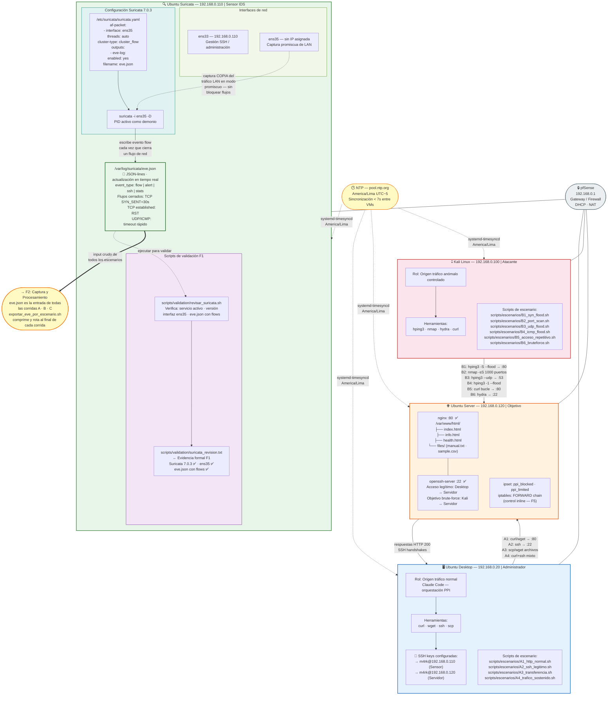
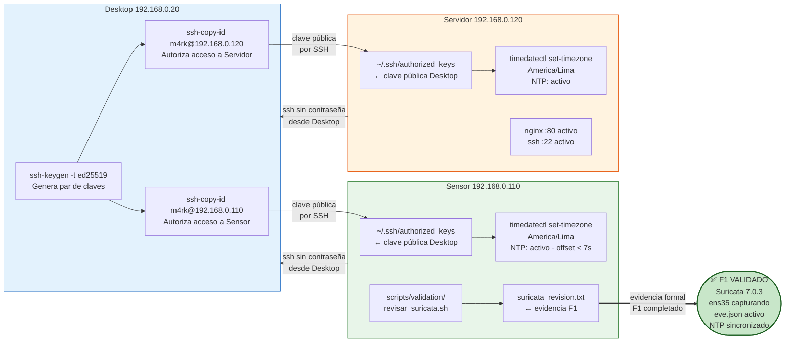
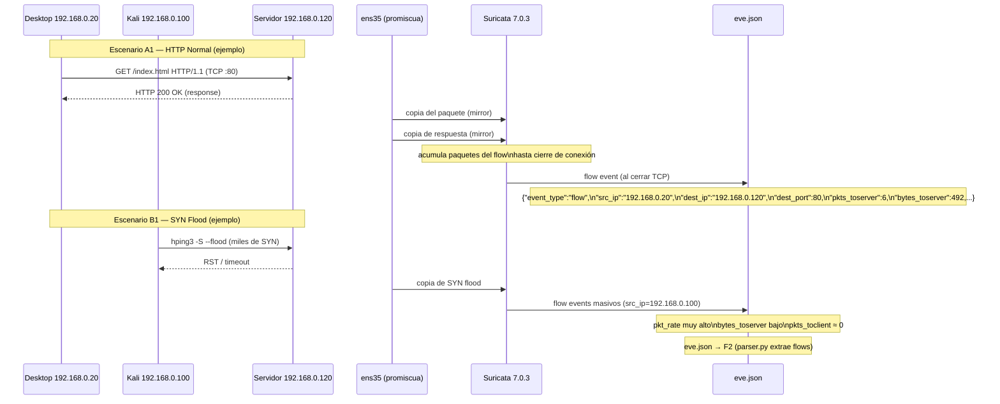

# F1 — Diagrama: Entorno de Laboratorio

**Proyecto:** Sistema de Detección Temprana de Comportamientos Anómalos en Redes de Datos  
**Institución:** Universidad Peruana Unión — PPI 2026  
**Estudiante:** Rubén Mark Salazar Tocas  
**Fase:** F1 — Preparación del Entorno de Laboratorio  
**Estado:** ✅ Completado — 15 de junio 2026  

---

## Diagrama 1 — Topología de Red y Flujo de Captura



---

## Diagrama 2 — Flujo de Scripts y Archivos F1



---

## Diagrama 3 — Flujo de Captura Suricata en Detalle



---

## Descripción de nodos clave

### Sensor — 192.168.0.110

| Componente | Detalle |
|---|---|
| `ens33` | Interfaz de gestión con IP 192.168.0.110 — SSH de administración |
| `ens35` | Interfaz de captura sin IP — modo promiscuo — espeja todo el tráfico LAN |
| `/etc/suricata/suricata.yaml` | Configura af-packet en ens35, outputs eve-log en /var/log/suricata/ |
| `suricata -i ens35 -D` | Proceso demonio activo — escribe flow events al cerrar cada conexión |
| `/var/log/suricata/eve.json` | Output principal — JSON-lines — entrada de todos los scripts de F2 |
| `scripts/validation/revisar_suricata.sh` | Verifica: `systemctl is-active`, versión, interfaz, eventos en eve.json |
| `scripts/validation/suricata_revision.txt` | Evidencia formal de F1 — confirma entorno listo |

### Timeouts de flow en Suricata (relevantes para el modelo)

| Protocolo | Estado | Timeout | Impacto en detección |
|---|---|---|---|
| TCP | SYN_SENT (sin respuesta) | 30 s | SYN Flood → flow cerrado rápido |
| TCP | RST / FIN | Inmediato | Conexiones normales → flow exacto |
| TCP | Established | 600 s | SSH sessions largas |
| UDP | — | 30 s | UDP Flood → flows rápidos |
| ICMP | — | 30 s | ICMP Flood → flows rápidos |

### NTP — Sincronización América/Lima

```
Servidor NTP: pool.ntp.org
Zona horaria: America/Lima (UTC − 5, sin DST)
Aplicado en: Desktop · Sensor · Servidor · Kali
Offset entre VMs: < 7 segundos
Impacto: timestamps en eve.json y motor_decision.log coherentes
```

---

## Conector → F2

```
eve.json (F1 output)
    │
    ▼  scripts/capture/exportar_eve_por_escenario.sh
    │  (ejecutado desde Desktop vía SSH al Sensor al final de cada corrida)
    │
    ▼
data/raw/YYYYMMDD_grupo_escenario_NN_eve.json.gz
    │
    ▼  F2: parser.py → etiquetar_limpiar.py → particionar_estadisticos.py
```

**F1 entrega:** entorno de red funcional con Suricata capturando en ens35 y generando eve.json verificado.  
**F1 no hace:** procesamiento de datos, entrenamiento, ni bloqueo de IPs — eso es F2–F5.
