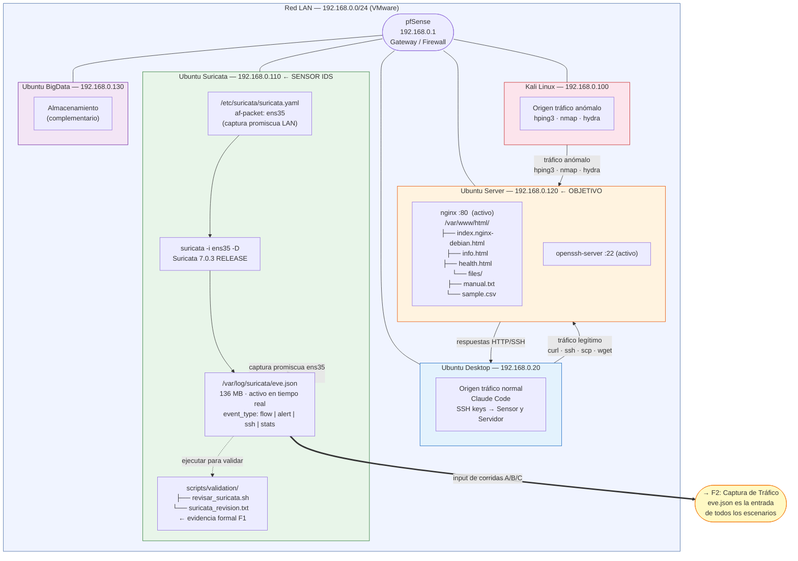

# F1 — Entorno de Laboratorio

**Fecha de cierre:** 10 de mayo 2026
**Objetivo:** Desplegar la red virtualizada, instalar Suricata y validar la captura de tráfico en eve.json.

---

## Diagrama



---

## Descripción por nodo

### Red LAN — 192.168.0.0/24

Desplegada en VMware con 5 VMs activas y una complementaria:

| VM | IP | OS | Rol en el PPI |
|---|---|---|---|
| pfSense | 192.168.0.1 | pfSense | Gateway y firewall de laboratorio |
| Ubuntu Desktop | 192.168.0.20 | Ubuntu 22.04 Desktop | Origen tráfico normal · Claude Code |
| Kali Linux | 192.168.0.100 | Kali Linux 2024 | Origen tráfico anómalo controlado |
| Ubuntu Suricata | **192.168.0.110** | Ubuntu Server 22.04 | **Sensor IDS** (Suricata 7.0.3) |
| Ubuntu Server | **192.168.0.120** | Ubuntu Server 22.04 | **Objetivo**: nginx :80, SSH :22 |
| Ubuntu BigData | 192.168.0.130 | Ubuntu Server 22.04 | Almacenamiento complementario |

---

### Sensor — 192.168.0.110

#### `/etc/suricata/suricata.yaml`
Configuración principal de Suricata. Sección relevante:
```yaml
af-packet:
  - interface: ens35    # captura promiscua de la LAN 192.168.0.0/24
```

#### `suricata -i ens35 -D`
Proceso corriendo como demonio. Interfaz `ens35` monitorea todo el tráfico entre VMs.

#### `/var/log/suricata/eve.json` ← **output clave de F1**
Archivo JSON-lines generado en tiempo real. Cada línea es un evento. Los eventos relevantes para el PPI:

| event_type | Descripción |
|---|---|
| `flow` | Resumen de flujo TCP/UDP/ICMP al cierre — **input del modelo** |
| `alert` | Alerta de regla Suricata |
| `ssh` | Metadata de sesiones SSH |
| `stats` | Estadísticas del sensor |

Ejemplo de evento flow capturado (real):
```json
{
  "timestamp": "2026-06-02T04:09:02+0000",
  "flow_id": 188776050051964,
  "event_type": "flow",
  "src_ip": "192.168.0.100",
  "src_port": 42112,
  "dest_ip": "192.168.0.120",
  "dest_port": 80,
  "proto": "TCP",
  "flow": {
    "pkts_toserver": 6,  "pkts_toclient": 4,
    "bytes_toserver": 492, "bytes_toclient": 555,
    "start": "2026-06-02T04:09:02+0000",
    "end":   "2026-06-02T04:09:02+0000"
  }
}
```

#### `scripts/validation/revisar_suricata.sh`
Script de validación ejecutado el 10/05/2026. Verifica: servicio activo, versión, interfaz, eve.json con flows y stats.

#### `scripts/validation/suricata_revision.txt` ← **evidencia formal F1**
Salida del script de validación. Confirma: Suricata 7.0.3 · ens35 · eve.json con eventos flow ✅

---

### Servidor — 192.168.0.120

#### nginx :80 — `/var/www/html/`
Superficie de tráfico HTTP normal (escenarios A1, A3, A4) y de abuso (B5, C1, C3):
```
/var/www/html/
├── index.nginx-debian.html   (responde HTTP 200)
├── info.html
├── health.html
└── files/
    ├── manual.txt
    └── sample.csv
```
Estado actual: `systemctl is-active nginx → active`

#### openssh-server :22
Servicio SSH activo. Usado para:
- Tráfico legítimo: escenarios A2, A4, C2 (Desktop → Servidor)
- Objetivo de brute force: escenario B6 (Kali → Servidor con hydra)

---

## Conector → F2

El `eve.json` generado en F1 es la **entrada de todos los escenarios de F2**. Al finalizar cada corrida de captura, el script `exportar_eve_por_escenario.sh` comprime el estado actual de `/var/log/suricata/eve.json` y lo guarda en `data/raw/` con nombre trazable.

```
/var/log/suricata/eve.json  →  data/raw/YYYYMMDD_grupo_escenario_NN_eve.json.gz
```
