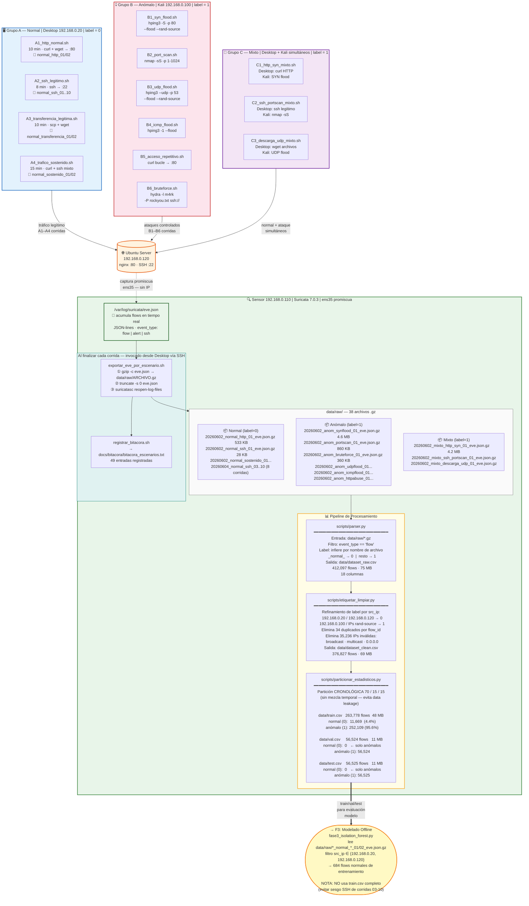
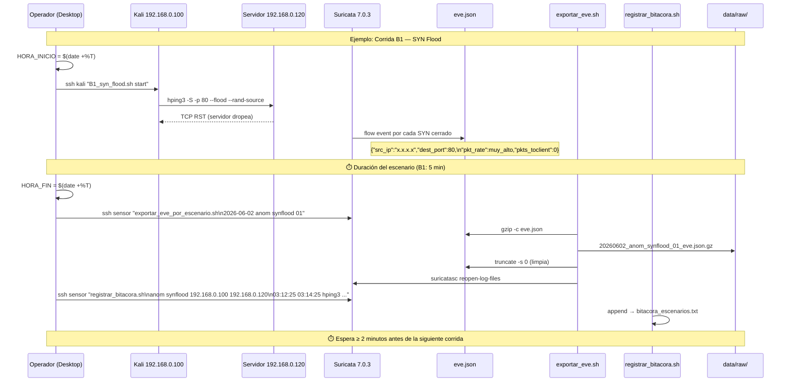
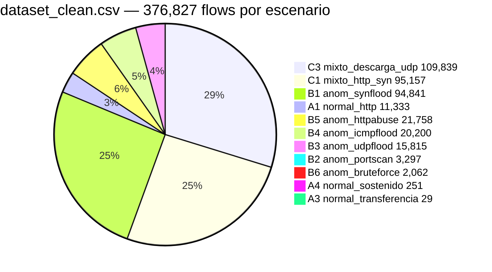
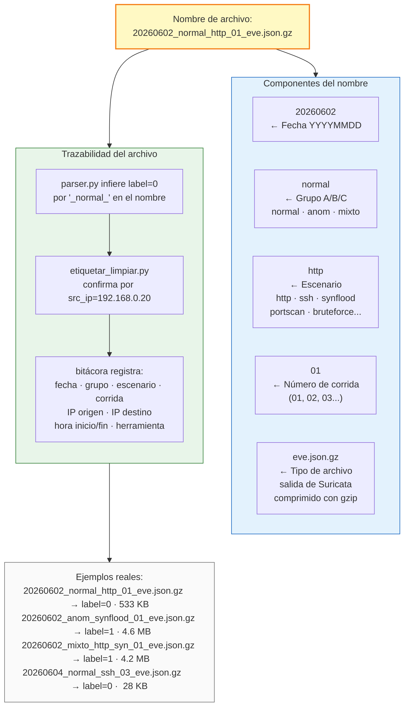
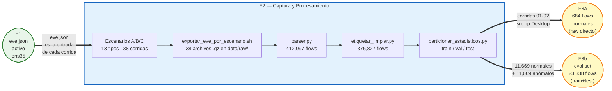

# F2 — Diagrama: Captura de Tráfico y Pipeline de Datos

**Proyecto:** Sistema de Detección Temprana de Comportamientos Anómalos en Redes de Datos  
**Institución:** Universidad Peruana Unión — PPI 2026  
**Estudiante:** Rubén Mark Salazar Tocas  
**Fase:** F2 — Captura de Tráfico y Construcción del Dataset  
**Fechas:** 2 – 4 de junio 2026  
**Estado:** ✅ Completado — 38 corridas · 376,827 flows · 49 entradas de bitácora  

---

## Diagrama 1 — Visión General: Escenarios → Dataset → F3

---

## Diagrama 2 — Ciclo de Vida de una Corrida Completa

---

## Diagrama 3 — Transformación del Dataset Paso a Paso

```mermaid
flowchart LR

    subgraph RAW["data/raw/  38 archivos .gz"]
        R1["20260602_normal_http_01.gz\n20260602_normal_ssh_01.gz\n20260602_normal_sostenido_01.gz\n20260602_normal_transferencia_01.gz\n20260604_normal_ssh_03..10.gz  (8 archivos)\n..."]
        R2["20260602_anom_synflood_01.gz\n20260602_anom_portscan_01.gz\n20260602_anom_udpflood_01.gz\n20260602_anom_icmpflood_01.gz\n20260602_anom_httpabuse_01.gz\n20260602_anom_bruteforce_01.gz"]
        R3["20260602_mixto_http_syn_01.gz\n20260602_mixto_ssh_portscan_01.gz\n20260602_mixto_descarga_udp_01.gz"]
    end

    subgraph P1B["parser.py"]
        direction TB
        P1_IN["Lee todos los .gz\nFiltro: event_type == 'flow'"]
        P1_LBL["Label por nombre:\n_normal_ → 0\nresto    → 1"]
        P1_OUT["dataset_raw.csv\n412,097 flows\n75 MB\n18 columnas"]
        P1_IN --> P1_LBL --> P1_OUT
    end

    subgraph P2B["etiquetar_limpiar.py"]
        direction TB
        P2_IP["Refina label por src_ip\n192.168.0.20 → 0 (normal)\n192.168.0.100 → 1 (anómalo)\nIPs rand-source → 1"]
        P2_DUP["Elimina 34 duplicados\n(mismo flow_id)"]
        P2_INV["Elimina 35,236 IPs inválidas\nbroadcast · multicast\n0.0.0.0 · *.255"]
        P2_OUT["dataset_clean.csv\n376,827 flows · 69 MB\nNormal:   11,669  (3.1%)\nAnómalo: 365,158 (96.9%)"]
        P2_IP --> P2_DUP --> P2_INV --> P2_OUT
    end

    subgraph P3B["particionar_estadisticos.py"]
        direction TB
        P3_ORD["Ordena por timestamp\npartición CRONOLÓGICA\n(sin shuffle — evita leakage)"]
        TRAIN["train.csv\n263,778 flows  48 MB\n70% cronológico\nNormal:  11,669\nAnóm: 252,109"]
        VAL["val.csv\n56,524 flows  11 MB\n15% cronológico\nNormal:  0\nAnóm: 56,524"]
        TEST["test.csv\n56,525 flows  11 MB\n15% cronológico\nNormal:  0\nAnóm: 56,525"]
        P3_ORD --> TRAIN & VAL & TEST
    end

    subgraph F3_USE["Uso en F3 (IF entrenamiento)"]
        F3_RAW["Lee raw/*_normal_*_01/02.gz\nFiltro: src_ip Desktop/Servidor\n→ 684 flows normales\n(corridas 01-02 únicamente)"]
        F3_NOTE["⚠️ No usa train.csv\nEvita sesgo SSH\nde corridas 03-10"]
    end

    subgraph F3_EVAL["Uso en F3/F4 (evaluación)"]
        EVAL_SET["Eval balanceado 50/50:\n11,669 normales de train.csv\n11,669 anómalos de test.csv\n= 23,338 flows total\npara comparar modelos"]
    end

    RAW --> P1B --> P2B --> P3B
    TRAIN -.->|"684 normales\ncorridas 01-02"| F3_USE
    TRAIN & TEST -.->|"evaluación\nAUC · F1 · Recall"| F3_EVAL

    style RAW    fill:#fafafa,stroke:#757575
    style P1B    fill:#e3f2fd,stroke:#1565c0
    style P2B    fill:#e8f5e9,stroke:#2e7d32
    style P3B    fill:#fff3e0,stroke:#e65100
    style F3_USE fill:#fffde7,stroke:#f9a825,stroke-width:2px
    style F3_EVAL fill:#f3e5f5,stroke:#6a1b9a
    style TRAIN  fill:#c8e6c9,stroke:#1b5e20
    style VAL    fill:#bbdefb,stroke:#1565c0
    style TEST   fill:#ffccbc,stroke:#bf360c
```

---

## Diagrama 4 — Distribución del Dataset por Escenario

---

## Diagrama 5 — Nomenclatura de Archivos y Trazabilidad

---

## Diagrama 6 — Conector Completo F1 → F2 → F3

---

## Resumen de archivos producidos en F2

| Archivo | Ruta | Tamaño | Descripción |
|---|---|---|---|
| `*.gz` (38 archivos) | `data/raw/` | 4 MB – 4.6 MB c/u | Eve.json comprimido por corrida |
| `dataset_raw.csv` | `data/` | 75 MB | 412,097 flows sin limpiar |
| `dataset_clean.csv` | `data/` | 69 MB | 376,827 flows limpios y etiquetados |
| `train.csv` | `data/` | 48 MB | 263,778 flows (70% cronológico) |
| `val.csv` | `data/` | 11 MB | 56,524 flows (15%) |
| `test.csv` | `data/` | 11 MB | 56,525 flows (15%) |
| `bitacora_escenarios.txt` | `docs/bitacora/` | — | 49 corridas registradas |
| `resumen_estadistico.txt` | `data/` | — | Stats del dataset por escenario |
