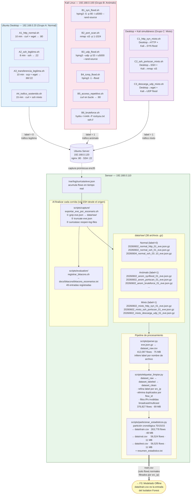

# F2 — Captura de Tráfico

**Fechas de ejecución:** 2 – 4 de junio 2026
**Objetivo:** Generar un dataset etiquetado de flujos de red con 13 escenarios controlados (normal, anómalo y mixto) que sirva como entrada al modelo de detección.

---

## Diagrama



---

## Descripción por nodo

### Grupo A — Tráfico Normal (label = 0)
Ejecutado desde **Ubuntu Desktop 192.168.0.20** hacia el servidor. Genera el perfil de comportamiento legítimo que el modelo aprenderá.

| Script | Ruta real en sensor | Herramienta | Duración | Justificación |
|---|---|---|---|---|
| A1_http_normal.sh | `scripts/capture/A1_http_normal.sh` | curl + wget → :80 | 10 min | Tráfico web cotidiano |
| A2_ssh_legitimo.sh | `scripts/capture/A2_ssh_legitimo.sh` | ssh → :22 | 8 min | Administración remota normal |
| A3_transferencia_legitima.sh | `scripts/capture/A3_transferencia_legitima.sh` | scp + wget | 10 min | Transferencia de archivos |
| A4_trafico_sostenido.sh | `scripts/capture/A4_trafico_sostenido.sh` | curl + ssh mixto | 15 min | Tráfico continuo realista |

---

### Grupo B — Tráfico Anómalo (label = 1)
Ejecutado desde **Kali Linux 192.168.0.100**. Representa los vectores de ataque documentados en ENISA 2025, Cloudflare Q2-2025, DBIR 2024 y MITRE ATT&CK.

| Script | Ruta real en sensor | Comando clave | Justificación |
|---|---|---|---|
| B1_syn_flood.sh | `scripts/capture/B1_syn_flood.sh` | `hping3 -S -p 80 -i u5000 --rand-source` | Cloudflare/ENISA DDoS L3/L4 |
| B2_port_scan.sh | `scripts/capture/B2_port_scan.sh` | `nmap -sS -p 1-1024` | MITRE T1046 · Fortinet 2026 |
| B3_udp_flood.sh | `scripts/capture/B3_udp_flood.sh` | `hping3 --udp -p 53 -i u5000 --rand-source` | Cloudflare UDP amplification |
| B4_icmp_flood.sh | `scripts/capture/B4_icmp_flood.sh` | `hping3 -1 --flood` | Prueba robustez sensor |
| B5_acceso_repetitivo.sh | `scripts/capture/B5_acceso_repetitivo.sh` | `curl en bucle → :80` | Cloudflare app layer abuse |
| B6_bruteforce.sh | `scripts/capture/B6_bruteforce.sh` | `hydra -l m4rk -P rockyou.txt ssh://` | DBIR 2024 · Fortinet 2026 |

---

### Grupo C — Tráfico Mixto (label = 1)
Desktop y Kali atacan **simultáneamente**. El objetivo es capturar flows legítimos y anómalos entremezclados, condición real de operación del sistema.

| Script | Ruta real en sensor | Normal (Desktop) | Anómalo (Kali) |
|---|---|---|---|
| C1_http_syn_mixto.sh | `scripts/capture/C1_http_syn_mixto.sh` | curl HTTP | SYN flood --rand-source |
| C2_ssh_portscan_mixto.sh | `scripts/capture/C2_ssh_portscan_mixto.sh` | SSH legítimo | nmap -sS |
| C3_descarga_udp_mixto.sh | `scripts/capture/C3_descarga_udp_mixto.sh` | wget descargas | UDP flood |

---

### Scripts auxiliares en el sensor

#### `scripts/capture/exportar_eve_por_escenario.sh`
Invocado vía SSH al final de cada corrida desde el equipo origen. Hace tres cosas:
1. `gzip -c /var/log/suricata/eve.json > data/raw/YYYYMMDD_grupo_escenario_NN_eve.json.gz`
2. `sudo truncate -s 0 /var/log/suricata/eve.json` — limpia el log
3. `sudo suricatasc -c reopen-log-files` — Suricata reabre el archivo limpio

**Nomenclatura real de archivos generados:**
```
data/raw/
├── 20260602_normal_http_01_eve.json.gz       (533 KB)
├── 20260602_anom_synflood_01_eve.json.gz     (4.6 MB)
├── 20260602_mixto_http_syn_01_eve.json.gz    (4.2 MB)
├── 20260604_normal_ssh_03_eve.json.gz        (~28 KB)
└── ... (38 archivos total)
```

#### `scripts/evaluation/registrar_bitacora.sh`
Agrega una línea al archivo `docs/bitacora/bitacora_escenarios.txt`. Formato real:
```
2026-06-02 | normal | http | 192.168.0.20 -> 192.168.0.120 | 01:09:22 - 01:19:23 | curl_wget | 20260602_normal_http_01_eve.json
2026-06-02 | anom   | synflood | 192.168.0.100 -> 192.168.0.120 | 03:12:25 - 03:14:25 | hping3 | 20260602_anom_synflood_01_eve.json
```
Total registrado: **49 entradas**.

---

### Pipeline de procesamiento

#### `scripts/parser.py` → `data/dataset_raw.csv`
Lee cada `.gz` de `data/raw/`, filtra `event_type=flow`, extrae 18 columnas. Infiere `label` por nombre de archivo (`_normal_` → 0, resto → 1).

Columnas extraídas: `timestamp, flow_id, src_ip, src_port, dest_ip, dest_port, proto, app_proto, bytes_toserver, bytes_toclient, pkts_toserver, pkts_toclient, flow_start, flow_end, duration, escenario, corrida, label`

**Salida:** `data/dataset_raw.csv` — 412,097 flows · 75 MB

#### `scripts/etiquetar_limpiar.py` → `data/dataset_clean.csv`
- Refina label por `src_ip`: `192.168.0.20` → 0 (normal), `192.168.0.100` → 1 (anómalo)
- IPs random de `--rand-source` → label = 1
- Elimina: 34 duplicados por `flow_id`, 35,236 IPs inválidas (broadcast/multicast/`0.0.0.0`)

**Salida:** `data/dataset_clean.csv` — 376,827 flows · 69 MB

#### `scripts/particionar_estadisticos.py` → `data/train.csv / val.csv / test.csv`
Partición **cronológica** (sin mezcla temporal, para evitar fuga de datos):

| Conjunto | Ruta real | Flows | Normal (0) | Anómalo (1) | Tamaño |
|---|---|---|---|---|---|
| Entrenamiento | `data/train.csv` | 263,778 | 11,669 | 252,109 | 48 MB |
| Validación | `data/val.csv` | 56,524 | 0 | 56,524 | 11 MB |
| Test | `data/test.csv` | 56,525 | 0 | 56,525 | 11 MB |

**Distribución del dataset limpio por escenario:**

| Escenario | Flows | Label |
|---|---|---|
| mixto_descarga (C3) | 109,839 | 1 |
| anom_synflood (B1) | 94,841 | 1 |
| mixto_http (C1) | 95,157 | 1 |
| anom_httpabuse (B5) | 21,758 | 1 |
| anom_icmpflood (B4) | 20,200 | 1 |
| **normal_http (A1)** | **11,333** | **0** |
| anom_udpflood (B3) | 15,815 | 1 |
| anom_portscan (B2) | 3,297 | 1 |
| anom_bruteforce (B6) | 2,062 | 1 |
| normal_sostenido (A4) | 251 | 0 |
| normal_transferencia (A3) | 29 | 0 |

> **Nota de diseño:** El dataset tiene desbalance severo (96.9% anómalo). Isolation Forest no depende del balance ya que es no supervisado — se entrena **solo con los 684 flows normales filtrados por** `src_ip == 192.168.0.20`.

---

## Conector → F3

La partición `data/train.csv` pasa a F3, pero Isolation Forest **no usa todas las filas** — el script `fase3_isolation_forest.py` aplica un segundo filtro `src_ip ∈ {192.168.0.20, 192.168.0.120}` sobre los archivos raw para extraer exactamente **684 flows normales limpios** de las corridas 01 y 02. Esto evita contaminación por tráfico anómalo histórico acumulado en eve.json.

```
data/raw/*_normal_*_eve.json.gz  →  filtro src_ip Desktop  →  684 flows de entrenamiento
```
