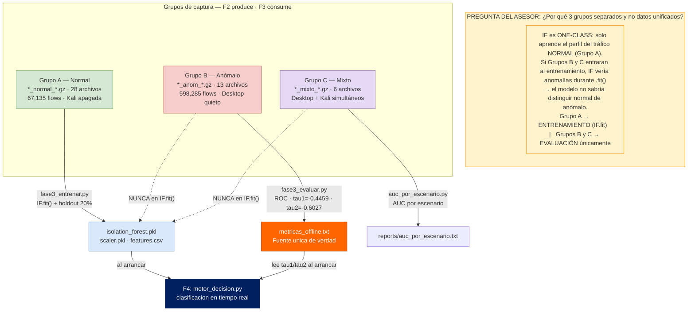

# F2 — Diagrama: Captura de Tráfico por Grupos (A · B · C)

**Instrucciones:** Abrir Draw.io → Extras → Edit Diagram → pegar el XML → OK

---

## Diagrama Mermaid (paradigma one-class · roles de los 3 grupos)

> **Respuesta al asesor:** Los 3 grupos son separados BY DESIGN, no por error. Isolation Forest es one-class: solo puede aprender de datos **normales**. Mezclar B y C en el entrenamiento rompería el paradigma.



---

## Diagrama Draw.io (XML completo)

```xml
<?xml version="1.0" encoding="UTF-8"?>
<mxGraphModel dx="1422" dy="762" grid="1" gridSize="10" guides="1"
  tooltips="1" connect="1" arrows="1" fold="1" page="0"
  pageScale="1" pageWidth="1654" pageHeight="1169" math="0" shadow="0">
  <root>
    <mxCell id="0" />
    <mxCell id="1" parent="0" />

    <!-- ══════════════════════════════════════════════════════════
         TÍTULO
    ══════════════════════════════════════════════════════════ -->
    <mxCell id="title" value="F2 — Captura de Tráfico por Grupos  |  PPI UPeU 2026  |  Salida: 47 archivos .gz"
      style="text;html=1;strokeColor=none;fillColor=#002060;fontColor=#ffffff;
             align=center;verticalAlign=middle;fontSize=14;fontStyle=1;rounded=1;"
      vertex="1" parent="1">
      <mxGeometry x="60" y="15" width="1280" height="42" as="geometry" />
    </mxCell>

    <!-- ══════════════════════════════════════════════════════════
         SENSOR — Suricata + eve.json (centro, compartido)
    ══════════════════════════════════════════════════════════ -->
    <mxCell id="sensor_bg" value=""
      style="rounded=1;whiteSpace=wrap;html=1;fillColor=#dae8fc;strokeColor=#6c8ebf;"
      vertex="1" parent="1">
      <mxGeometry x="480" y="200" width="450" height="290" as="geometry" />
    </mxCell>
    <mxCell id="sensor_hdr" value="&lt;b&gt;Ubuntu Sensor 192.168.0.110&lt;/b&gt;"
      style="text;html=1;strokeColor=none;fillColor=#6c8ebf;fontColor=#ffffff;
             align=center;fontSize=12;fontStyle=1;rounded=1;"
      vertex="1" parent="1">
      <mxGeometry x="480" y="200" width="450" height="30" as="geometry" />
    </mxCell>
    <mxCell id="suricata" value="&lt;b&gt;Suricata 7.0.3&lt;/b&gt;&lt;br/&gt;IDS pasivo — interfaz ens35&lt;br/&gt;Captura: TODOS los flows de la red&lt;br/&gt;Servicio: suricata.service"
      style="rounded=1;whiteSpace=wrap;html=1;fillColor=#0050ef;strokeColor=#003399;
             fontColor=#ffffff;fontSize=11;arcSize=8;"
      vertex="1" parent="1">
      <mxGeometry x="500" y="244" width="410" height="90" as="geometry" />
    </mxCell>
    <mxCell id="eve_json" value="&lt;b&gt;/var/log/suricata/eve.json&lt;/b&gt;&lt;br/&gt;Registro EVE JSON en tiempo real&lt;br/&gt;event_type: flow · alert · http · ssh"
      style="shape=mxgraph.flowchart.document;whiteSpace=wrap;html=1;
             fillColor=#dae8fc;strokeColor=#6c8ebf;fontSize=11;"
      vertex="1" parent="1">
      <mxGeometry x="510" y="354" width="410" height="75" as="geometry" />
    </mxCell>

    <!-- ══════════════════════════════════════════════════════════
         SERVIDOR OBJETIVO (centro-arriba)
    ══════════════════════════════════════════════════════════ -->
    <mxCell id="server" value="&lt;b&gt;Server 192.168.0.120&lt;/b&gt;&lt;br/&gt;nginx:80 · SSH:22&lt;br/&gt;&lt;i&gt;destino de todo el tráfico&lt;/i&gt;"
      style="rounded=1;whiteSpace=wrap;html=1;fillColor=#d5e8d4;strokeColor=#82b366;fontSize=11;"
      vertex="1" parent="1">
      <mxGeometry x="540" y="85" width="320" height="80" as="geometry" />
    </mxCell>

    <!-- ══════════════════════════════════════════════════════════
         SCRIPT DE EXPORTACIÓN (centro-abajo del sensor)
    ══════════════════════════════════════════════════════════ -->
    <mxCell id="exportar_sh" value="&lt;b&gt;exportar_eve_por_escenario.sh&lt;/b&gt;&lt;br/&gt;1. gzip -c eve.json → .gz&lt;br/&gt;2. truncate -s 0 eve.json&lt;br/&gt;3. suricatasc reopen-log-files&lt;br/&gt;&lt;i&gt;(llamado vía SSH al fin de cada escenario)&lt;/i&gt;"
      style="rounded=1;whiteSpace=wrap;html=1;fillColor=#ffe6cc;strokeColor=#d79b00;
             fontSize=10;arcSize=8;"
      vertex="1" parent="1">
      <mxGeometry x="490" y="520" width="430" height="95" as="geometry" />
    </mxCell>

    <!-- ══════════════════════════════════════════════════════════
         GRUPO A — NORMAL (izquierda)
    ══════════════════════════════════════════════════════════ -->
    <mxCell id="grupoA_bg" value=""
      style="rounded=1;whiteSpace=wrap;html=1;fillColor=#f0fff0;strokeColor=#82b366;"
      vertex="1" parent="1">
      <mxGeometry x="55" y="65" width="370" height="580" as="geometry" />
    </mxCell>
    <mxCell id="grupoA_hdr" value="GRUPO A — Normal puro"
      style="text;html=1;strokeColor=none;fillColor=#82b366;fontColor=#ffffff;
             align=center;fontSize=12;fontStyle=1;rounded=1;"
      vertex="1" parent="1">
      <mxGeometry x="55" y="65" width="370" height="30" as="geometry" />
    </mxCell>
    <mxCell id="grupoA_cond" value="&lt;b&gt;Condición:&lt;/b&gt; Kali APAGADA&lt;br/&gt;&lt;b&gt;Motor:&lt;/b&gt; DETENIDO"
      style="rounded=1;whiteSpace=wrap;html=1;fillColor=#82b366;strokeColor=#5a8a5a;
             fontColor=#ffffff;fontSize=10;"
      vertex="1" parent="1">
      <mxGeometry x="70" y="103" width="340" height="38" as="geometry" />
    </mxCell>
    <mxCell id="desktop" value="&lt;b&gt;Desktop 192.168.0.20&lt;/b&gt;&lt;br/&gt;Ubuntu 22.04"
      style="rounded=1;whiteSpace=wrap;html=1;fillColor=#d5e8d4;strokeColor=#82b366;fontSize=11;"
      vertex="1" parent="1">
      <mxGeometry x="130" y="152" width="220" height="55" as="geometry" />
    </mxCell>
    <mxCell id="escA" value="&lt;b&gt;A1&lt;/b&gt; http_normal — curl → nginx:80 (10 min)&lt;br/&gt;&lt;b&gt;A2&lt;/b&gt; ssh_legitimo — ssh → :22 (8 min)&lt;br/&gt;&lt;b&gt;A3&lt;/b&gt; transferencia — scp/wget (10 min)&lt;br/&gt;&lt;b&gt;A4&lt;/b&gt; trafico_sostenido — mixto (15 min)"
      style="rounded=1;whiteSpace=wrap;html=1;fillColor=#d5e8d4;strokeColor=#82b366;
             fontSize=10;align=left;"
      vertex="1" parent="1">
      <mxGeometry x="70" y="222" width="340" height="90" as="geometry" />
    </mxCell>
    <mxCell id="gzA" value="&lt;b&gt;data/raw/*_normal_*.eve.json.gz&lt;/b&gt;&lt;br/&gt;28 archivos — Grupos A1-A4&lt;br/&gt;Fechas: 20260602, 20260604, 20260615&lt;br/&gt;&lt;i&gt;→ F3: fase3_entrenar.py (entrenamiento + holdout)&lt;/i&gt;"
      style="shape=mxgraph.flowchart.stored_data;whiteSpace=wrap;html=1;
             fillColor=#d5e8d4;strokeColor=#82b366;fontSize=10;fontStyle=1;"
      vertex="1" parent="1">
      <mxGeometry x="70" y="520" width="340" height="95" as="geometry" />
    </mxCell>

    <!-- ══════════════════════════════════════════════════════════
         GRUPO B — ANÓMALO (derecha)
    ══════════════════════════════════════════════════════════ -->
    <mxCell id="grupoB_bg" value=""
      style="rounded=1;whiteSpace=wrap;html=1;fillColor=#fff0f0;strokeColor=#b85450;"
      vertex="1" parent="1">
      <mxGeometry x="975" y="65" width="370" height="580" as="geometry" />
    </mxCell>
    <mxCell id="grupoB_hdr" value="GRUPO B — Anómalo puro"
      style="text;html=1;strokeColor=none;fillColor=#b85450;fontColor=#ffffff;
             align=center;fontSize=12;fontStyle=1;rounded=1;"
      vertex="1" parent="1">
      <mxGeometry x="975" y="65" width="370" height="30" as="geometry" />
    </mxCell>
    <mxCell id="grupoB_cond" value="&lt;b&gt;Condición:&lt;/b&gt; Desktop QUIETO&lt;br/&gt;&lt;b&gt;Motor:&lt;/b&gt; DETENIDO"
      style="rounded=1;whiteSpace=wrap;html=1;fillColor=#b85450;strokeColor=#8a3a38;
             fontColor=#ffffff;fontSize=10;"
      vertex="1" parent="1">
      <mxGeometry x="990" y="103" width="340" height="38" as="geometry" />
    </mxCell>
    <mxCell id="kali" value="&lt;b&gt;Kali 192.168.0.100&lt;/b&gt;&lt;br/&gt;Kali 2024"
      style="rounded=1;whiteSpace=wrap;html=1;fillColor=#f8cecc;strokeColor=#b85450;fontSize=11;"
      vertex="1" parent="1">
      <mxGeometry x="1050" y="152" width="220" height="55" as="geometry" />
    </mxCell>
    <mxCell id="escB" value="&lt;b&gt;B1&lt;/b&gt; syn_flood — hping3 -S --flood :80 (10 min)&lt;br/&gt;&lt;b&gt;B2&lt;/b&gt; port_scan — nmap -sS 1-1024 (10 min)&lt;br/&gt;&lt;b&gt;B3&lt;/b&gt; udp_flood — hping3 --udp :53 (10 min)&lt;br/&gt;&lt;b&gt;B4&lt;/b&gt; icmp_flood — hping3 -1 --flood (10 min)&lt;br/&gt;&lt;b&gt;B5&lt;/b&gt; http_abuse — curl bucle rápido (10 min)&lt;br/&gt;&lt;b&gt;B6&lt;/b&gt; bruteforce — hydra ssh:22 (10 min)"
      style="rounded=1;whiteSpace=wrap;html=1;fillColor=#f8cecc;strokeColor=#b85450;
             fontSize=10;align=left;"
      vertex="1" parent="1">
      <mxGeometry x="990" y="222" width="340" height="110" as="geometry" />
    </mxCell>
    <mxCell id="gzB" value="&lt;b&gt;data/raw/*_anom_*.eve.json.gz&lt;/b&gt;&lt;br/&gt;13 archivos — Ataques B1-B6&lt;br/&gt;Fechas: 20260602, 20260604, 20260615&lt;br/&gt;&lt;i&gt;→ F3: fase3_evaluar.py (curva ROC, τ1/τ2)&lt;/i&gt;"
      style="shape=mxgraph.flowchart.stored_data;whiteSpace=wrap;html=1;
             fillColor=#f8cecc;strokeColor=#b85450;fontSize=10;fontStyle=1;"
      vertex="1" parent="1">
      <mxGeometry x="990" y="520" width="340" height="95" as="geometry" />
    </mxCell>

    <!-- ══════════════════════════════════════════════════════════
         GRUPO C — MIXTO (abajo-centro)
    ══════════════════════════════════════════════════════════ -->
    <mxCell id="grupoC_bg" value=""
      style="rounded=1;whiteSpace=wrap;html=1;fillColor=#f5f0ff;strokeColor=#9673a6;"
      vertex="1" parent="1">
      <mxGeometry x="290" y="650" width="820" height="175" as="geometry" />
    </mxCell>
    <mxCell id="grupoC_hdr" value="GRUPO C — Mixto controlado (Desktop + Kali simultáneos · Motor DETENIDO)"
      style="text;html=1;strokeColor=none;fillColor=#9673a6;fontColor=#ffffff;
             align=center;fontSize=12;fontStyle=1;rounded=1;"
      vertex="1" parent="1">
      <mxGeometry x="290" y="650" width="820" height="30" as="geometry" />
    </mxCell>
    <mxCell id="escC" value="&lt;b&gt;C1&lt;/b&gt; http_synflood — Desktop: curl→:80 · Kali: hping3 -S --flood→:80 (10 min)&lt;br/&gt;&lt;b&gt;C2&lt;/b&gt; ssh_portscan — Desktop: ssh→:22 · Kali: nmap -sS 1-1024 (10 min)&lt;br/&gt;&lt;b&gt;C3&lt;/b&gt; transfer_udpflood — Desktop: scp/wget · Kali: hping3 --udp --flood→:53 (10 min)"
      style="rounded=1;whiteSpace=wrap;html=1;fillColor=#e6d9f5;strokeColor=#9673a6;
             fontSize=10;align=left;"
      vertex="1" parent="1">
      <mxGeometry x="305" y="690" width="500" height="85" as="geometry" />
    </mxCell>
    <mxCell id="gzC" value="&lt;b&gt;data/raw/*_mixto_*.eve.json.gz&lt;/b&gt;&lt;br/&gt;6 archivos — C1-C3&lt;br/&gt;&lt;i&gt;→ F3: auc_por_escenario.py&lt;/i&gt;"
      style="shape=mxgraph.flowchart.stored_data;whiteSpace=wrap;html=1;
             fillColor=#e6d9f5;strokeColor=#9673a6;fontSize=10;fontStyle=1;"
      vertex="1" parent="1">
      <mxGeometry x="820" y="685" width="265" height="90" as="geometry" />
    </mxCell>

    <!-- ══════════════════════════════════════════════════════════
         BITÁCORA (abajo-izquierda)
    ══════════════════════════════════════════════════════════ -->
    <mxCell id="bitacora" value="&lt;b&gt;bitacora_escenarios.txt&lt;/b&gt;&lt;br/&gt;64 líneas — registrar_bitacora.sh&lt;br/&gt;&lt;i&gt;docs/bitacora/&lt;/i&gt;"
      style="shape=mxgraph.flowchart.document;whiteSpace=wrap;html=1;
             fillColor=#fff2cc;strokeColor=#d6b656;fontSize=10;"
      vertex="1" parent="1">
      <mxGeometry x="70" y="655" width="200" height="75" as="geometry" />
    </mxCell>

    <!-- ══════════════════════════════════════════════════════════
         CONECTORES — GRUPO A
    ══════════════════════════════════════════════════════════ -->
    <mxCell id="e_desk_srv" value="tráfico normal&lt;br/&gt;A1-A4"
      style="edgeStyle=orthogonalEdgeStyle;rounded=0;exitX=1;exitY=0.5;entryX=0;entryY=0.5;
             strokeColor=#82b366;fontColor=#3a6b3a;fontSize=10;fontStyle=1;"
      edge="1" source="desktop" target="server" parent="1">
      <mxGeometry relative="1" as="geometry" />
    </mxCell>
    <mxCell id="e_desk_escA" value="ejecuta"
      style="edgeStyle=orthogonalEdgeStyle;rounded=0;exitX=0.5;exitY=1;entryX=0.5;entryY=0;
             strokeColor=#82b366;fontSize=10;"
      edge="1" source="desktop" target="escA" parent="1">
      <mxGeometry relative="1" as="geometry" />
    </mxCell>
    <mxCell id="e_escA_export" value="fin escenario&lt;br/&gt;→ SSH sensor"
      style="edgeStyle=orthogonalEdgeStyle;rounded=0;exitX=1;exitY=0.5;entryX=0;entryY=0.3;
             strokeColor=#d79b00;fontSize=10;"
      edge="1" source="escA" target="exportar_sh" parent="1">
      <mxGeometry relative="1" as="geometry" />
    </mxCell>
    <mxCell id="e_export_gzA" value=".gz normal"
      style="edgeStyle=orthogonalEdgeStyle;rounded=0;exitX=0;exitY=1;entryX=0.5;entryY=0;
             strokeColor=#82b366;fontColor=#3a6b3a;fontSize=10;"
      edge="1" source="exportar_sh" target="gzA" parent="1">
      <mxGeometry relative="1" as="geometry" />
    </mxCell>

    <!-- ══════════════════════════════════════════════════════════
         CONECTORES — GRUPO B
    ══════════════════════════════════════════════════════════ -->
    <mxCell id="e_kali_srv" value="tráfico anómalo&lt;br/&gt;B1-B6"
      style="edgeStyle=orthogonalEdgeStyle;rounded=0;exitX=0;exitY=0.5;entryX=1;entryY=0.5;
             strokeColor=#b85450;fontColor=#7a0000;fontSize=10;fontStyle=1;"
      edge="1" source="kali" target="server" parent="1">
      <mxGeometry relative="1" as="geometry" />
    </mxCell>
    <mxCell id="e_kali_escB" value="ejecuta"
      style="edgeStyle=orthogonalEdgeStyle;rounded=0;exitX=0.5;exitY=1;entryX=0.5;entryY=0;
             strokeColor=#b85450;fontSize=10;"
      edge="1" source="kali" target="escB" parent="1">
      <mxGeometry relative="1" as="geometry" />
    </mxCell>
    <mxCell id="e_escB_export" value="fin escenario&lt;br/&gt;→ SSH sensor"
      style="edgeStyle=orthogonalEdgeStyle;rounded=0;exitX=0;exitY=0.5;entryX=1;entryY=0.3;
             strokeColor=#d79b00;fontSize=10;"
      edge="1" source="escB" target="exportar_sh" parent="1">
      <mxGeometry relative="1" as="geometry" />
    </mxCell>
    <mxCell id="e_export_gzB" value=".gz anómalo"
      style="edgeStyle=orthogonalEdgeStyle;rounded=0;exitX=1;exitY=1;entryX=0.5;entryY=0;
             strokeColor=#b85450;fontColor=#7a0000;fontSize=10;"
      edge="1" source="exportar_sh" target="gzB" parent="1">
      <mxGeometry relative="1" as="geometry" />
    </mxCell>

    <!-- ══════════════════════════════════════════════════════════
         CONECTORES — SURICATA / EVE.JSON
    ══════════════════════════════════════════════════════════ -->
    <mxCell id="e_srv_suri" value="copia pasiva&lt;br/&gt;(ens35)"
      style="edgeStyle=orthogonalEdgeStyle;rounded=0;exitX=0.5;exitY=1;entryX=0.5;entryY=0;
             strokeColor=#0050ef;fontColor=#003399;fontSize=10;dashed=1;dashPattern=8 4;"
      edge="1" source="server" target="suricata" parent="1">
      <mxGeometry relative="1" as="geometry" />
    </mxCell>
    <mxCell id="e_suri_eve" value="escribe flows"
      style="edgeStyle=orthogonalEdgeStyle;rounded=0;exitX=0.5;exitY=1;entryX=0.5;entryY=0;
             strokeColor=#0050ef;fontColor=#003399;fontSize=10;"
      edge="1" source="suricata" target="eve_json" parent="1">
      <mxGeometry relative="1" as="geometry" />
    </mxCell>
    <mxCell id="e_eve_export" value="fin de escenario"
      style="edgeStyle=orthogonalEdgeStyle;rounded=0;exitX=0.5;exitY=1;entryX=0.5;entryY=0;
             strokeColor=#d79b00;fontSize=10;"
      edge="1" source="eve_json" target="exportar_sh" parent="1">
      <mxGeometry relative="1" as="geometry" />
    </mxCell>

    <!-- CONECTORES — BITÁCORA -->
    <mxCell id="e_export_bita" value="registrar"
      style="edgeStyle=orthogonalEdgeStyle;rounded=0;exitX=0;exitY=1;entryX=0.5;entryY=0;
             strokeColor=#d6b656;fontSize=10;dashed=1;"
      edge="1" source="exportar_sh" target="bitacora" parent="1">
      <mxGeometry relative="1" as="geometry" />
    </mxCell>

    <!-- CONECTORES — GRUPO C -->
    <mxCell id="e_export_gzC" value=".gz mixto"
      style="edgeStyle=orthogonalEdgeStyle;rounded=0;exitX=0.5;exitY=1;entryX=0.5;entryY=0;
             strokeColor=#9673a6;fontColor=#6a3d9a;fontSize=10;"
      edge="1" source="exportar_sh" target="grupoC_bg" parent="1">
      <mxGeometry relative="1" as="geometry" />
    </mxCell>

    <!-- ══════════════════════════════════════════════════════════
         NOTA: SIN PROCESAMIENTO INTERMEDIO
    ══════════════════════════════════════════════════════════ -->
    <mxCell id="nota_f3" value="&lt;b&gt;F2 termina aquí.&lt;/b&gt; No hay parser.py ni CSVs intermedios.&lt;br/&gt;Los .gz son leídos directamente por F3: fase3_entrenar.py · fase3_evaluar.py · auc_por_escenario.py"
      style="text;html=1;strokeColor=#d79b00;fillColor=#fff2cc;
             align=center;fontSize=11;rounded=1;fontStyle=1;"
      vertex="1" parent="1">
      <mxGeometry x="290" y="840" width="820" height="45" as="geometry" />
    </mxCell>

    <!-- ══════════════════════════════════════════════════════════
         LEYENDA
    ══════════════════════════════════════════════════════════ -->
    <mxCell id="leg_bg" value=""
      style="rounded=1;whiteSpace=wrap;html=1;fillColor=#f9f9f9;strokeColor=#cccccc;"
      vertex="1" parent="1">
      <mxGeometry x="60" y="900" width="1280" height="55" as="geometry" />
    </mxCell>
    <mxCell id="leg1" value="Grupo A — Normal puro (label=0)"
      style="rounded=1;html=1;fillColor=#d5e8d4;strokeColor=#82b366;fontSize=10;"
      vertex="1" parent="1">
      <mxGeometry x="75" y="913" width="240" height="30" as="geometry" />
    </mxCell>
    <mxCell id="leg2" value="Grupo B — Anómalo puro (label=1)"
      style="rounded=1;html=1;fillColor=#f8cecc;strokeColor=#b85450;fontSize=10;"
      vertex="1" parent="1">
      <mxGeometry x="325" y="913" width="240" height="30" as="geometry" />
    </mxCell>
    <mxCell id="leg3" value="Grupo C — Mixto controlado"
      style="rounded=1;html=1;fillColor=#e6d9f5;strokeColor=#9673a6;fontSize=10;"
      vertex="1" parent="1">
      <mxGeometry x="575" y="913" width="220" height="30" as="geometry" />
    </mxCell>
    <mxCell id="leg4" value="Sensor IDS (Suricata)"
      style="rounded=1;html=1;fillColor=#dae8fc;strokeColor=#6c8ebf;fontSize=10;"
      vertex="1" parent="1">
      <mxGeometry x="805" y="913" width="200" height="30" as="geometry" />
    </mxCell>
    <mxCell id="leg5" value="Scripts bash de automatización"
      style="rounded=1;html=1;fillColor=#ffe6cc;strokeColor=#d79b00;fontSize=10;"
      vertex="1" parent="1">
      <mxGeometry x="1015" y="913" width="230" height="30" as="geometry" />
    </mxCell>

    <!-- ══════════════════════════════════════════════════════════
         CALLOUT: PARADIGMA ONE-CLASS — respuesta al asesor
    ══════════════════════════════════════════════════════════ -->
    <mxCell id="oc_bg" value=""
      style="rounded=1;whiteSpace=wrap;html=1;fillColor=#fff3cd;strokeColor=#ff9900;"
      vertex="1" parent="1">
      <mxGeometry x="1380" y="65" width="265" height="490" as="geometry" />
    </mxCell>
    <mxCell id="oc_hdr" value="PARADIGMA ONE-CLASS"
      style="text;html=1;strokeColor=none;fillColor=#ff9900;fontColor=#000000;
             align=center;fontSize=13;fontStyle=1;rounded=1;"
      vertex="1" parent="1">
      <mxGeometry x="1380" y="65" width="265" height="30" as="geometry" />
    </mxCell>
    <mxCell id="oc_body"
      value="&lt;b&gt;Pregunta del asesor:&lt;/b&gt;&lt;br/&gt;¿Por qué 3 grupos separados&lt;br/&gt;y no datos unificados?&lt;br/&gt;&lt;br/&gt;IF es &lt;b&gt;ONE-CLASS&lt;/b&gt;: solo aprende&lt;br/&gt;el perfil del tráfico &lt;b&gt;NORMAL&lt;/b&gt;.&lt;br/&gt;&lt;br/&gt;Si B y C entraran al entrenamiento,&lt;br/&gt;IF vería anomalías durante .fit()&lt;br/&gt;→ el modelo no sabría distinguir&lt;br/&gt;normal de anómalo.&lt;br/&gt;&lt;br/&gt;&lt;b&gt;Grupo A&lt;/b&gt; → IF.fit()&lt;br/&gt;&lt;i&gt;(entrenamiento)&lt;/i&gt;&lt;br/&gt;&lt;br/&gt;&lt;b&gt;Grupos B y C&lt;/b&gt; → EVALUACIÓN&lt;br/&gt;&lt;i&gt;(ROC / AUC / tau1 / tau2)&lt;/i&gt;&lt;br/&gt;&lt;br/&gt;Los 3 grupos son separados&lt;br/&gt;&lt;b&gt;BY DESIGN&lt;/b&gt; — no es un error.&lt;br/&gt;&lt;br/&gt;&lt;i&gt;Ref: docs/ppi_documentacion/&lt;br/&gt;experimento_comparativo/&lt;br/&gt;COMPARACION_IF_VS_ALTERNATIVAS.md&lt;/i&gt;"
      style="text;html=1;strokeColor=none;fillColor=#fff3cd;fontColor=#000000;
             align=left;verticalAlign=top;fontSize=11;spacingLeft=8;spacingTop=8;"
      vertex="1" parent="1">
      <mxGeometry x="1380" y="100" width="265" height="455" as="geometry" />
    </mxCell>

  </root>
</mxGraphModel>
```
