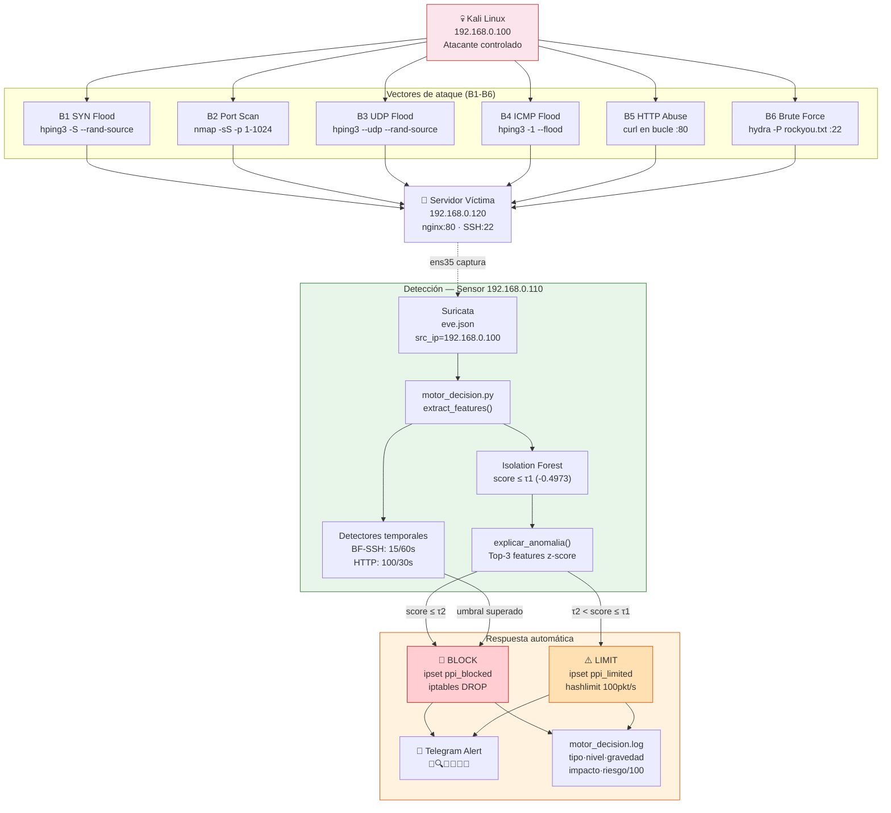

# F2 — Escenario Anómalo: Diagramas Completos

**Proyecto:** PPI UPeU 2026
**Escenario:** Tráfico anómalo (Grupo B: B1-B6) — label = 1

> **Datos reales:** 157,973 flows anómalos capturados · pkt_rate μ=3,111/s · score IF μ=-0.655 · BLOCK+LIMIT: 83.5% del tráfico anómalo

---

## 1. Diagrama Lógico — Flujo de Detección y Respuesta



---

## 2. Diagrama Físico — Topología con Acción de Bloqueo

```xml
<?xml version="1.0" encoding="UTF-8"?>
<mxGraphModel dx="1422" dy="762" grid="1" gridSize="10" guides="1"
  tooltips="1" connect="1" arrows="1" fold="1" page="1"
  pageScale="1" pageWidth="1169" pageHeight="827" math="0" shadow="0">
  <root>
    <mxCell id="0"/><mxCell id="1" parent="0"/>

    <!-- Título -->
    <mxCell id="2" value="F2 — ESCENARIO ANÓMALO (Grupo B) — PPI UPeU 2026"
      style="text;html=1;strokeColor=none;fillColor=none;align=center;
             fontSize=16;fontStyle=1;fontColor=#c62828;"
      vertex="1" parent="1">
      <mxGeometry x="60" y="20" width="1040" height="30" as="geometry"/>
    </mxCell>
    <mxCell id="3" value="157,973 flows anómalos · pkt_rate μ=3,111/s · score IF μ=-0.655 · Lead Time=26s · MTTC=28s"
      style="text;html=1;strokeColor=none;fillColor=none;align=center;fontSize=10;fontColor=#555;"
      vertex="1" parent="1">
      <mxGeometry x="60" y="50" width="1040" height="20" as="geometry"/>
    </mxCell>

    <!-- Kali Linux -->
    <mxCell id="10" value="&lt;b&gt;Kali Linux&lt;/b&gt;&lt;br&gt;192.168.0.100&lt;br&gt;─────────────&lt;br&gt;B1: hping3 SYN flood&lt;br&gt;B2: nmap -sS&lt;br&gt;B3: hping3 UDP flood&lt;br&gt;B4: hping3 ICMP flood&lt;br&gt;B5: curl bucle :80&lt;br&gt;B6: hydra :22"
      style="shape=mxgraph.cisco.computers_and_peripherals.pc;sketch=0;
             html=1;fillColor=#f8cecc;strokeColor=#c62828;
             fontColor=#c62828;align=center;fontSize=9;fontStyle=1;"
      vertex="1" parent="1">
      <mxGeometry x="60" y="250" width="120" height="190" as="geometry"/>
    </mxCell>

    <!-- Servidor Víctima -->
    <mxCell id="20" value="&lt;b&gt;Servidor Víctima&lt;/b&gt;&lt;br&gt;192.168.0.120&lt;br&gt;─────────────&lt;br&gt;nginx :80&lt;br&gt;SSH   :22&lt;br&gt;─────────────&lt;br&gt;ipset ppi_blocked&lt;br&gt;ipset ppi_limited&lt;br&gt;iptables DROP&lt;br&gt;hashlimit 100pkt/s"
      style="shape=mxgraph.cisco.servers.standard_server;sketch=0;
             html=1;fillColor=#ffe6cc;strokeColor=#d79b00;
             fontColor=#7d4b00;align=center;fontSize=9;fontStyle=1;"
      vertex="1" parent="1">
      <mxGeometry x="800" y="230" width="120" height="200" as="geometry"/>
    </mxCell>

    <!-- Sensor -->
    <mxCell id="30" value="&lt;b&gt;Sensor 192.168.0.110&lt;/b&gt;&lt;br&gt;─────────────&lt;br&gt;Suricata 7.0.3&lt;br&gt;ens35 promiscuo&lt;br&gt;─────────────&lt;br&gt;motor_decision.py&lt;br&gt;isolation_forest.pkl&lt;br&gt;clasificador.py&lt;br&gt;─────────────&lt;br&gt;Lead Time: 26s&lt;br&gt;MTTC: 28s"
      style="shape=mxgraph.cisco.servers.standard_server;sketch=0;
             html=1;fillColor=#d5e8d4;strokeColor=#82b366;
             fontColor=#2e7d32;align=center;fontSize=9;fontStyle=1;"
      vertex="1" parent="1">
      <mxGeometry x="430" y="200" width="130" height="230" as="geometry"/>
    </mxCell>

    <!-- BLOCK box -->
    <mxCell id="40" value="🚨 &lt;b&gt;BLOCK&lt;/b&gt;&lt;br&gt;sudo ipset add ppi_blocked&lt;br&gt;192.168.0.100 timeout 300&lt;br&gt;─────────────&lt;br&gt;iptables: DROP&lt;br&gt;Timeout: 300s auto"
      style="rounded=1;whiteSpace=wrap;html=1;fillColor=#f8cecc;
             strokeColor=#c62828;fontColor=#c62828;fontSize=10;fontStyle=1;"
      vertex="1" parent="1">
      <mxGeometry x="640" y="480" width="180" height="100" as="geometry"/>
    </mxCell>

    <!-- LIMIT box -->
    <mxCell id="41" value="⚠️ &lt;b&gt;LIMIT&lt;/b&gt;&lt;br&gt;sudo ipset add ppi_limited&lt;br&gt;192.168.0.100 timeout 300&lt;br&gt;─────────────&lt;br&gt;hashlimit: 100pkt/s&lt;br&gt;burst: 150"
      style="rounded=1;whiteSpace=wrap;html=1;fillColor=#ffe6cc;
             strokeColor=#d79b00;fontColor=#7d4b00;fontSize=10;fontStyle=1;"
      vertex="1" parent="1">
      <mxGeometry x="430" y="480" width="180" height="100" as="geometry"/>
    </mxCell>

    <!-- Telegram -->
    <mxCell id="42" value="📱 Telegram&lt;br&gt;🌊 SYN_FLOOD riesgo=89/100&lt;br&gt;🔍 PORT_SCAN riesgo=60/100&lt;br&gt;💧 UDP_FLOOD riesgo=95/100&lt;br&gt;📡 ICMP_FLOOD riesgo=91/100&lt;br&gt;🌐 HTTP_ABUSE riesgo=69/100&lt;br&gt;🔑 BF_SSH riesgo=95/100"
      style="rounded=1;whiteSpace=wrap;html=1;fillColor=#e1f5fe;
             strokeColor=#0277bd;fontColor=#01579b;fontSize=9;arcSize=20;"
      vertex="1" parent="1">
      <mxGeometry x="830" y="490" width="210" height="130" as="geometry"/>
    </mxCell>

    <!-- vSwitch -->
    <mxCell id="50" value="VMware vSwitch"
      style="shape=mxgraph.cisco.switches.workgroup_switch;sketch=0;
             html=1;fillColor=#f5f5f5;strokeColor=#666666;
             align=center;fontSize=10;"
      vertex="1" parent="1">
      <mxGeometry x="420" y="430" width="160" height="40" as="geometry"/>
    </mxCell>

    <!-- Tráfico anómalo: Kali → Servidor (rojo, grueso) -->
    <mxCell id="60" value="94,841 SYN flows · 94,841 flows → BLOCK/LIMIT&lt;br&gt;B1: pkt_rate 2,875/s · score -0.608&lt;br&gt;B3: pkt_rate 1,080/s · score -0.713 → BLOCK 91%&lt;br&gt;B4: pkt_rate 1,000/s · score -0.691 · is_icmp=1&lt;br&gt;B2: dest_port variado · score -0.646 · 93.6% LIMIT&lt;br&gt;B5: 21,758 flows · detector 100 req/30s → BLOCK&lt;br&gt;B6: 2,062 flows · detector 15/60s → BLOCK"
      style="edgeStyle=orthogonalEdgeStyle;html=1;strokeColor=#c62828;
             strokeWidth=3;dashed=1;endArrow=block;endFill=1;
             fontColor=#c62828;fontSize=8;labelBackgroundColor=#fff;"
      edge="1" source="10" target="20" parent="1">
      <mxGeometry relative="1" as="geometry">
        <Array as="points">
          <mxPoint x="220" y="340"/>
          <mxPoint x="860" y="340"/>
        </Array>
      </mxGeometry>
    </mxCell>

    <!-- Captura Suricata -->
    <mxCell id="61" value="captura ens35"
      style="edgeStyle=orthogonalEdgeStyle;html=1;strokeColor=#2e7d32;
             strokeWidth=1;dashed=1;endArrow=open;fontSize=9;"
      edge="1" source="30" target="50" parent="1">
      <mxGeometry relative="1" as="geometry"/>
    </mxCell>

    <!-- Motor → BLOCK -->
    <mxCell id="62" value="score ≤ τ2(-0.6873)"
      style="edgeStyle=orthogonalEdgeStyle;html=1;strokeColor=#c62828;
             strokeWidth=2;endArrow=block;endFill=1;fontSize=9;"
      edge="1" source="30" target="40" parent="1">
      <mxGeometry relative="1" as="geometry"/>
    </mxCell>

    <!-- Motor → LIMIT -->
    <mxCell id="63" value="τ2 &lt; score ≤ τ1"
      style="edgeStyle=orthogonalEdgeStyle;html=1;strokeColor=#d79b00;
             strokeWidth=2;endArrow=block;endFill=1;fontSize=9;"
      edge="1" source="30" target="41" parent="1">
      <mxGeometry relative="1" as="geometry"/>
    </mxCell>

    <!-- BLOCK → Servidor (SSH) -->
    <mxCell id="64" value="SSH: ipset add"
      style="edgeStyle=orthogonalEdgeStyle;html=1;strokeColor=#c62828;
             strokeWidth=2;endArrow=block;endFill=1;fontSize=9;"
      edge="1" source="40" target="20" parent="1">
      <mxGeometry relative="1" as="geometry"/>
    </mxCell>

    <!-- Telegram -->
    <mxCell id="65" value="alerta"
      style="edgeStyle=orthogonalEdgeStyle;html=1;strokeColor=#0277bd;
             strokeWidth=1;dashed=1;endArrow=open;fontSize=9;"
      edge="1" source="30" target="42" parent="1">
      <mxGeometry relative="1" as="geometry"/>
    </mxCell>
  </root>
</mxGraphModel>
```

---

## 3. Diagrama de Flujo — Ciclo de Detección y Respuesta

```
ATAQUE INICIADO (ej: B1 SYN Flood desde Kali 192.168.0.100)
│
├─ t=0s: bash B1_syn_flood.sh en Kali
│         hping3 -S -p 80 -i u5000 --rand-source 192.168.0.120
│         → genera 2,875 flows TCP SYN por segundo
│
├─ t=0–15s: Suricata acumula flows en eve.json
│           timeout TCP establecido: ~15-20s hasta que cierra el flow
│
├─ t=~16s: Primer flow llega al motor:
│    e = {"src_ip":"x.x.x.x","dest_port":80,"proto":"TCP",
│          "flow":{"pkts_toserver":8,"bytes_toserver":480,...}}
│
│    X_raw = extract_features(e)
│         = [8, 2, 480, 120, 0.141, 2875, 334882, 4.0, 4.0, 50, 1, 0, 0, 80]
│    X     = scaler.transform(X_raw)
│    score = clf.score_samples(X)[0] = -0.676
│
│    accion = decidir(-0.676):
│             -0.676 > τ2(-0.6873) → no BLOCK
│             -0.676 ≤ τ1(-0.4973) → LIMIT
│             → accion = 'LIMIT'
│
│    razon = explicar_anomalia():
│             pkt_ratio:z=+4.2 | pkt_rate:z=+13.8 | byte_rate:z=+2.9
│
├─ t=~26s: Lead Time — primera detección registrada en log:
│    WARNING | ANOMALÍA | tipo=SYN_FLOOD | nivel=ALTO | riesgo=89/100
│             src=x.x.x.x dst=192.168.0.120:80 score=-0.676
│             razón=[pkt_ratio:z=+4.2 | pkt_rate:z=+13.8 | ...]
│             | LIMIT → LIMITED x.x.x.x
│
├─ t=~28s: MTTC — primera acción aplicada en servidor:
│    ssh m4rk@192.168.0.120 "sudo ipset add ppi_limited x.x.x.x timeout 300"
│    → tráfico de esa IP limitado a 100 pkt/s
│    → flows subsiguientes de la misma IP: LIMIT (ya limitado)
│
│    Telegram: 🌊 PPI ALERTA — SYN_FLOOD
│              Accion: LIMIT | Riesgo: 89/100 | MITRE: T1498.001
│
├─ t=300s: Timeout automático → IP removida de ppi_limited por kernel
│
FIN CORRIDA B1 | Lead Time: 26s | MTTC: 28s | TIE: 100%
```

---

## 4. Explicación Técnica por Escenario

| Ataque | Herramienta | Patrón de flow | Score IF | Zona | Acción |
|---|---|---|---|---|---|
| B1 SYN Flood | hping3 -S --rand-source | pkt_rate 2,875/s · TCP · pkt_ratio alto | -0.608 | LIMIT 68% / BLOCK 15% | LIMIT/BLOCK según flow |
| B2 Port Scan | nmap -sS -p 1-1024 | 1 pkts_toserver · 0 bytes_toclient · dest_port variado | -0.646 | LIMIT 93.6% | LIMIT |
| B3 UDP Flood | hping3 --udp --rand-source | is_udp=1 · pkt_rate 1,080/s · score muy negativo | -0.713 | BLOCK 91% | BLOCK |
| B4 ICMP Flood | hping3 -1 --flood | is_icmp=1 · avg_pkt_size=30B · pkt_rate 1,000/s | -0.691 | BLOCK 29% / LIMIT 71% | BLOCK/LIMIT |
| B5 HTTP Abuse | curl en bucle 0.1s | dest_port=80 · 21,758 flows · detector temporal | -0.502 | LIMIT 43% | Detector: BLOCK 100/30s |
| B6 Brute Force | hydra -P rockyou.txt | dest_port=22 · duration=0.001s · alto pkt_rate | -0.435 | PERMIT 78%* | Detector: BLOCK 15/60s |

*B6 modelo base no detecta → detector temporal es obligatorio

---

## 5. Entradas y Salidas

### Entradas del escenario anómalo

| Parámetro | Valor |
|---|---|
| VM origen | Kali Linux 192.168.0.100 |
| Scripts ejecutados | B1-B6_*.sh |
| Destino | Ubuntu Server 192.168.0.120 |
| Protocolos | TCP (SYN, SSH, HTTP), UDP, ICMP |
| Herramientas | hping3 3.0, nmap 7.94, hydra 9.4, curl |
| Duración por corrida | 2–5 minutos |

### Salidas del escenario anómalo

| Artefacto | Contenido | Ejemplo |
|---|---|---|
| Archivos raw | eve.json.gz por corrida | `20260602_anom_synflood_01_eve.json.gz` (4.6 MB) |
| Log decisiones | WARNING por cada anomalía | `tipo=SYN_FLOOD\|riesgo=89/100\|LIMIT` |
| ipset ppi_blocked | IPs bloqueadas (timeout 300s) | `ipset list ppi_blocked → Members: x.x.x.x` |
| ipset ppi_limited | IPs limitadas (timeout 300s) | `ipset list ppi_limited → Members: y.y.y.y` |
| Alertas Telegram | Por BLOCK/LIMIT con tipo+riesgo | 🌊 SYN_FLOOD riesgo=89/100 |

---

## 6. Parámetros Monitoreados

| Feature | Normal | B1 SYN | B2 Scan | B3 UDP | B4 ICMP | B5 HTTP | B6 BF |
|---|---|---|---|---|---|---|---|
| `pkt_rate` | ~1,170/s | **2,875/s** | 1,292/s | 1,080/s | 1,000/s | **7,231/s** | **9,653/s** |
| `byte_rate` | ~88K/s | 335K/s | 80K/s | 65K/s | 60K/s | **986K/s** | **1,349K/s** |
| `is_tcp` | 1 | **1** | **1** | 0 | 0 | **1** | **1** |
| `is_udp` | 0 | 0 | 0 | **1** | 0 | 0 | 0 |
| `is_icmp` | 0 | 0 | 0 | 0 | **1** | 0 | 0 |
| `avg_pkt_size` | ~39B | 67B | 35B | 31B | **30B** | 100B | 127B |
| `dest_port` | 80/22 | **80** | **variado** | **53** | 0 | **80** | **22** |
| `Score IF` | -0.426 | -0.608 | -0.646 | **-0.713** | **-0.691** | -0.502 | -0.435 |
| `BLOCK%` | 0% | 15% | 5% | **91%** | **29%** | 0.6% | 0% |
| `LIMIT%` | 96% | 68% | 94% | 9% | 71% | 43% | 22% |

---

*Archivo: `F2_Escenario_Anomalo.drawio.md` — PPI UPeU 2026*
