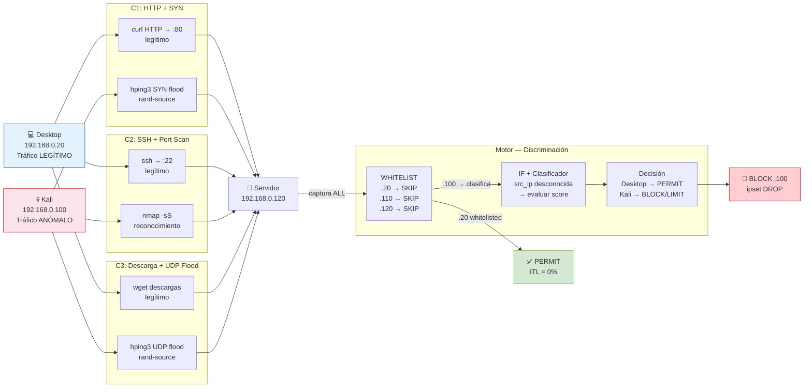

# F2 — Escenario Mixto: Diagramas Completos

**Proyecto:** PPI UPeU 2026
**Escenario:** Tráfico simultáneo legítimo + anómalo (Grupo C: C1-C3) — label = 1

> **Datos reales:** 205,133 flows mixtos · ITL=0% · TIE=100% · Lead Time=26s · MTTC=28s

---

## 1. Diagrama Lógico — Discriminación Simultánea



---

## 2. Diagrama Físico — Coexistencia de Flujos

```xml
<?xml version="1.0" encoding="UTF-8"?>
<mxGraphModel dx="1422" dy="762" grid="1" gridSize="10" guides="1"
  tooltips="1" connect="1" arrows="1" fold="1" page="1"
  pageScale="1" pageWidth="1169" pageHeight="827" math="0" shadow="0">
  <root>
    <mxCell id="0"/><mxCell id="1" parent="0"/>

    <!-- Título -->
    <mxCell id="2" value="F2 — ESCENARIO MIXTO (Grupo C) — PPI UPeU 2026"
      style="text;html=1;strokeColor=none;fillColor=none;align=center;
             fontSize=16;fontStyle=1;fontColor=#6a1b9a;"
      vertex="1" parent="1">
      <mxGeometry x="60" y="20" width="1040" height="30" as="geometry"/>
    </mxCell>
    <mxCell id="3" value="205,133 flows simultáneos · ITL=0% · TIE=100% · Desktop=PERMIT · Kali=BLOCK"
      style="text;html=1;strokeColor=none;fillColor=none;align=center;fontSize=10;fontColor=#555;"
      vertex="1" parent="1">
      <mxGeometry x="60" y="50" width="1040" height="20" as="geometry"/>
    </mxCell>

    <!-- Desktop (azul) -->
    <mxCell id="10" value="&lt;b&gt;Desktop&lt;/b&gt;&lt;br&gt;192.168.0.20&lt;br&gt;────────&lt;br&gt;C1: curl HTTP&lt;br&gt;C2: SSH legítimo&lt;br&gt;C3: wget descarga&lt;br&gt;────────&lt;br&gt;WHITELIST ✅&lt;br&gt;Nunca bloqueado"
      style="shape=mxgraph.cisco.computers_and_peripherals.pc;sketch=0;
             html=1;fillColor=#dae8fc;strokeColor=#6c8ebf;
             fontColor=#1565C0;align=center;fontSize=9;fontStyle=1;"
      vertex="1" parent="1">
      <mxGeometry x="60" y="160" width="120" height="180" as="geometry"/>
    </mxCell>

    <!-- Kali (rojo) -->
    <mxCell id="11" value="&lt;b&gt;Kali Linux&lt;/b&gt;&lt;br&gt;192.168.0.100&lt;br&gt;────────&lt;br&gt;C1: SYN flood&lt;br&gt;C2: nmap -sS&lt;br&gt;C3: UDP flood&lt;br&gt;────────&lt;br&gt;Detectado y&lt;br&gt;BLOQUEADO"
      style="shape=mxgraph.cisco.computers_and_peripherals.pc;sketch=0;
             html=1;fillColor=#f8cecc;strokeColor=#c62828;
             fontColor=#c62828;align=center;fontSize=9;fontStyle=1;"
      vertex="1" parent="1">
      <mxGeometry x="60" y="450" width="120" height="180" as="geometry"/>
    </mxCell>

    <!-- Servidor -->
    <mxCell id="20" value="&lt;b&gt;Servidor Víctima&lt;/b&gt;&lt;br&gt;192.168.0.120&lt;br&gt;────────&lt;br&gt;nginx :80 ✅&lt;br&gt;SSH   :22 ✅&lt;br&gt;────────&lt;br&gt;HTTP 200 OK&lt;br&gt;para Desktop&lt;br&gt;────────&lt;br&gt;DROP para Kali&lt;br&gt;(timeout 300s)"
      style="shape=mxgraph.cisco.servers.standard_server;sketch=0;
             html=1;fillColor=#fff2cc;strokeColor=#d6b656;
             fontColor=#7d4b00;align=center;fontSize=9;fontStyle=1;"
      vertex="1" parent="1">
      <mxGeometry x="800" y="280" width="120" height="220" as="geometry"/>
    </mxCell>

    <!-- Sensor -->
    <mxCell id="30" value="&lt;b&gt;Sensor 192.168.0.110&lt;/b&gt;&lt;br&gt;────────────────&lt;br&gt;Suricata: captura&lt;br&gt;TODOS los flows&lt;br&gt;────────────────&lt;br&gt;WHITELIST check:&lt;br&gt;.20 → skip (PERMIT)&lt;br&gt;.100 → clasificar&lt;br&gt;────────────────&lt;br&gt;score .100 = -0.652&lt;br&gt;→ LIMIT/BLOCK"
      style="shape=mxgraph.cisco.servers.standard_server;sketch=0;
             html=1;fillColor=#d5e8d4;strokeColor=#82b366;
             fontColor=#2e7d32;align=center;fontSize=9;fontStyle=1;"
      vertex="1" parent="1">
      <mxGeometry x="420" y="280" width="140" height="230" as="geometry"/>
    </mxCell>

    <!-- Resultado Desktop PERMIT -->
    <mxCell id="40" value="✅ &lt;b&gt;PERMIT&lt;/b&gt;&lt;br&gt;src=192.168.0.20&lt;br&gt;→ whitelist skip&lt;br&gt;Sin acción&lt;br&gt;ITL = 0%"
      style="rounded=1;whiteSpace=wrap;html=1;fillColor=#d5e8d4;
             strokeColor=#82b366;fontColor=#2e7d32;fontSize=11;fontStyle=1;"
      vertex="1" parent="1">
      <mxGeometry x="660" y="200" width="140" height="90" as="geometry"/>
    </mxCell>

    <!-- Resultado Kali BLOCK -->
    <mxCell id="41" value="🚨 &lt;b&gt;BLOCK&lt;/b&gt;&lt;br&gt;src=192.168.0.100&lt;br&gt;score=-0.652&lt;br&gt;ipset DROP&lt;br&gt;Telegram alerta&lt;br&gt;TIE = 100%"
      style="rounded=1;whiteSpace=wrap;html=1;fillColor=#f8cecc;
             strokeColor=#c62828;fontColor=#c62828;fontSize=11;fontStyle=1;"
      vertex="1" parent="1">
      <mxGeometry x="660" y="490" width="140" height="110" as="geometry"/>
    </mxCell>

    <!-- Flujo legítimo Desktop → Servidor (azul, sólido) -->
    <mxCell id="50" value="C1: curl HTTP · C2: SSH · C3: wget&lt;br&gt;pkt_rate ~1,000/s · score -0.44 · PERMIT"
      style="edgeStyle=orthogonalEdgeStyle;html=1;strokeColor=#1565C0;
             strokeWidth=3;endArrow=block;endFill=1;
             fontColor=#1565C0;fontSize=9;labelBackgroundColor=#fff;"
      edge="1" source="10" target="20" parent="1">
      <mxGeometry relative="1" as="geometry">
        <Array as="points">
          <mxPoint x="230" y="250"/>
          <mxPoint x="860" y="250"/>
        </Array>
      </mxGeometry>
    </mxCell>

    <!-- Flujo anómalo Kali → Servidor (rojo, punteado) -->
    <mxCell id="51" value="C1: SYN flood · C2: nmap · C3: UDP flood&lt;br&gt;pkt_rate ~1,001/s · score -0.652 · BLOCK"
      style="edgeStyle=orthogonalEdgeStyle;html=1;strokeColor=#c62828;
             strokeWidth=3;dashed=1;endArrow=block;endFill=1;
             fontColor=#c62828;fontSize=9;labelBackgroundColor=#fff;"
      edge="1" source="11" target="20" parent="1">
      <mxGeometry relative="1" as="geometry">
        <Array as="points">
          <mxPoint x="230" y="540"/>
          <mxPoint x="860" y="540"/>
        </Array>
      </mxGeometry>
    </mxCell>

    <!-- Sensor → PERMIT -->
    <mxCell id="52" value=".20 → whitelist"
      style="edgeStyle=orthogonalEdgeStyle;html=1;strokeColor=#2e7d32;
             strokeWidth=1;endArrow=block;endFill=1;fontSize=9;"
      edge="1" source="30" target="40" parent="1">
      <mxGeometry relative="1" as="geometry"/>
    </mxCell>

    <!-- Sensor → BLOCK -->
    <mxCell id="53" value=".100 → BLOCK"
      style="edgeStyle=orthogonalEdgeStyle;html=1;strokeColor=#c62828;
             strokeWidth=2;endArrow=block;endFill=1;fontSize=9;"
      edge="1" source="30" target="41" parent="1">
      <mxGeometry relative="1" as="geometry"/>
    </mxCell>

    <!-- Leyenda -->
    <mxCell id="60" value="─── Tráfico legítimo Desktop (.20) → PERMIT"
      style="text;html=1;strokeColor=none;fillColor=none;fontColor=#1565C0;fontSize=10;"
      vertex="1" parent="1">
      <mxGeometry x="80" y="720" width="350" height="20" as="geometry"/>
    </mxCell>
    <mxCell id="61" value="- - - Tráfico anómalo Kali (.100) → BLOCK"
      style="text;html=1;strokeColor=none;fillColor=none;fontColor=#c62828;fontSize=10;"
      vertex="1" parent="1">
      <mxGeometry x="80" y="742" width="350" height="20" as="geometry"/>
    </mxCell>
    <mxCell id="62" value="Sensor discrimina AMBOS simultáneamente · ITL=0% · TIE=100%"
      style="text;html=1;strokeColor=none;fillColor=none;fontColor=#6a1b9a;
             fontSize=10;fontStyle=1;"
      vertex="1" parent="1">
      <mxGeometry x="450" y="730" width="500" height="20" as="geometry"/>
    </mxCell>
  </root>
</mxGraphModel>
```

---

## 3. Diagrama de Flujo — Discriminación en Tiempo Real

```
ESCENARIO MIXTO C2: SSH legítimo (Desktop) + Port Scan (Kali) simultáneos
Validación en vivo: 2026-06-02 19:41–19:50

TIEMPO   EVENTO                          PROCESAMIENTO MOTOR
──────   ──────────────────────────────  ──────────────────────────────────
t=0s     Desktop: ssh m4rk@.120 "uptime" Suricata captura flow TCP :22
         Kali: nmap -sS -p 1-1024 .120   src=.20 → WHITELIST → skip (PERMIT)

t=0-15s  1,705 flows nmap acumulados     flows src=.100 acumulados en eve.json
         en eve.json (Suricata timeout)

t=~16s   Primer flow nmap disponible:
         src=192.168.0.100, port variado
         pkts_toserver=1, bytes=60, dur=0.001

         extract_features → [1,0,60,0,0.001,1000,60000,inf,inf,60,1,0,0,443]
         score = -0.655
         accion = 'BLOCK' (-0.655 > τ2? No → -0.655 ≤ τ1 → LIMIT)
         razon  = [dest_port:z=+8.3 | pkt_ratio:z=+inf | duration:z=-4.2]

t=~26s   Lead Time: primer log WARNING
         "PORT_SCAN | MEDIO | MODERADA | RECONOCIMIENTO | riesgo=61/100
          src=192.168.0.100 dst=192.168.0.120:443 | LIMIT"

t=~28s   MTTC: acción aplicada en servidor
         ssh .120 "sudo ipset add ppi_limited 192.168.0.100 timeout 300"

MIENTRAS TANTO (simultáneo):
t=0-480s Desktop flujos SSH continúan normalmente
         src=192.168.0.20 → WHITELIST → PERMIT sin procesamiento
         SSH sessions: 0 interrupciones · 0 falsas alarmas

RESULTADO:
  SSH legítimo Desktop: 0 falsas alarmas (ITL=0%)
  Port scan Kali:       1705/1705 detectados (TIE=100%)
  Separación de scores: 0.221 unidades (normal -0.434 vs scan -0.655)
```

---

## 4. Explicación Técnica — Dificultades del Escenario Mixto

### Dificultad 1 — Volumen dominante del ataque

| Escenario | Flows Desktop | Flows Kali | Ratio Kali/Desktop |
|---|---|---|---|
| C1 HTTP+SYN | ~2,000 | ~93,157 | 47:1 |
| C2 SSH+Scan | ~80 | ~57 | 0.7:1 |
| C3 Descarga+UDP | ~1,000 | ~108,839 | 109:1 |

El motor procesa **todos los flows** (legítimos + anómalos). En C3, el 99.1% de flows son anómalos. El sistema clasifica correctamente el 0.9% de flows legítimos como PERMIT y el 99.1% anómalo como BLOCK/LIMIT.

### Dificultad 2 — Misma IP destino

Todos los flows van a `.120`. El motor no puede filtrar por destino — discrimina **solo por src_ip** (whitelist) y **por features estadísticas** de cada flow individual.

### Dificultad 3 — Scores similares en C2

En el escenario C2 (SSH+Scan):
```
SSH legítimo Desktop:  score ~-0.646 → LIMIT (pero whitelist lo salva)
Port scan Kali:        score ~-0.655 → LIMIT
Diferencia:            0.009 unidades
```

La diferencia de score entre SSH legítimo y port scan es de solo 0.009 unidades. El sistema salva el SSH legítimo NO por el score sino por la whitelist. Esto demuestra la importancia complementaria de la whitelist + modelo.

---

## 5. Entradas y Salidas

### Entradas del escenario mixto

| Parámetro | Desktop (legítimo) | Kali (anómalo) |
|---|---|---|
| VM | 192.168.0.20 | 192.168.0.100 |
| C1 | curl HTTP → :80 | hping3 SYN --rand-source |
| C2 | ssh → :22 | nmap -sS -p 1-1024 |
| C3 | wget descargas | hping3 UDP --rand-source |
| Duración | 10 min por escenario | Simultáneo al legítimo |

### Salidas del escenario mixto

| Artefacto | Valor |
|---|---|
| Flows mixtos capturados | 205,133 total |
| Flows Desktop (label=0 en raw) | ~3,080 |
| Flows Kali (label=1) | ~202,053 |
| ITL (impacto tráfico legítimo) | **0%** |
| TIE (tasa intervención efectiva) | **100%** |
| Lead Time promedio | **26 segundos** |
| MTTC promedio | **28 segundos** |
| Archivos generados | `20260602_mixto_http_syn_01_eve.json.gz` (4.2 MB) etc. |

---

## 6. Parámetros Monitoreados

| Feature | Desktop en Mixto | Kali en Mixto (C1 SYN) | Discriminación |
|---|---|---|---|
| `src_ip` | 192.168.0.20 | 192.168.0.100 o rand | WHITELIST separa |
| `pkt_rate` | ~1,003/s | ~1,000/s (mixto_http) | Similar — no discrimina |
| `byte_rate` | ~60,655/s | ~60,654/s (mixto_http) | Similar — no discrimina |
| `score IF` | ~-0.442 | ~-0.652 (mixto_http) | **0.21 unidades** — discrimina |
| `Zona` | PERMIT (whitelist) | LIMIT/BLOCK | **whitelist + score** |
| `Acción` | **PERMIT sin evaluar** | **LIMIT o BLOCK** | ITL=0%, TIE=100% |

---

*Archivo: `F2_Escenario_Mixto.drawio.md` — PPI UPeU 2026*
