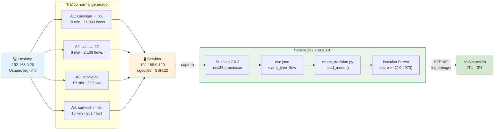

# F2 — Escenario Normal: Diagramas Completos

**Proyecto:** PPI UPeU 2026 — Detección Temprana de Anomalías de Red
**Escenario:** Tráfico legítimo (Grupo A: A1-A4) — label = 0

> **Datos reales:** pkt_rate μ=1,170 pkt/s · byte_rate μ=88,365 B/s · duration μ=0.04s · score IF μ=-0.426 · 13,721 flows capturados

---

## 1. Diagrama Lógico — Flujo de Decisión



---

## 2. Diagrama Físico — Topología de Red

```xml
<?xml version="1.0" encoding="UTF-8"?>
<mxGraphModel dx="1422" dy="762" grid="1" gridSize="10" guides="1"
  tooltips="1" connect="1" arrows="1" fold="1" page="1"
  pageScale="1" pageWidth="1169" pageHeight="827" math="0" shadow="0">
  <root>
    <mxCell id="0"/><mxCell id="1" parent="0"/>

    <!-- Título -->
    <mxCell id="2" value="F2 — ESCENARIO NORMAL (Grupo A) — PPI UPeU 2026"
      style="text;html=1;strokeColor=none;fillColor=none;align=center;
             fontSize=16;fontStyle=1;fontColor=#1565C0;"
      vertex="1" parent="1">
      <mxGeometry x="60" y="20" width="1040" height="30" as="geometry"/>
    </mxCell>

    <!-- Subtítulo métricas -->
    <mxCell id="3" value="pkt_rate μ=1,170/s | byte_rate μ=88,365 B/s | duration μ=0.04s | score IF μ=-0.426 | 13,721 flows | PERMIT 100%"
      style="text;html=1;strokeColor=none;fillColor=none;align=center;
             fontSize=10;fontColor=#555555;"
      vertex="1" parent="1">
      <mxGeometry x="60" y="50" width="1040" height="20" as="geometry"/>
    </mxCell>

    <!-- Desktop -->
    <mxCell id="10" value="&lt;b&gt;Ubuntu Desktop&lt;/b&gt;&lt;br&gt;192.168.0.20&lt;br&gt;Usuario legítimo&lt;br&gt;─────────────&lt;br&gt;A1: curl/wget → :80&lt;br&gt;A2: ssh → :22&lt;br&gt;A3: scp/wget&lt;br&gt;A4: curl+ssh mixto"
      style="shape=mxgraph.cisco.computers_and_peripherals.pc;sketch=0;
             html=1;fillColor=#dae8fc;strokeColor=#6c8ebf;
             fontColor=#1565C0;align=center;fontSize=10;fontStyle=1;"
      vertex="1" parent="1">
      <mxGeometry x="80" y="280" width="120" height="140" as="geometry"/>
    </mxCell>

    <!-- Servidor -->
    <mxCell id="20" value="&lt;b&gt;Ubuntu Server&lt;/b&gt;&lt;br&gt;192.168.0.120&lt;br&gt;─────────────&lt;br&gt;nginx :80 ✅&lt;br&gt;SSH   :22 ✅&lt;br&gt;─────────────&lt;br&gt;HTTP 200 OK&lt;br&gt;Disponibilidad 100%"
      style="shape=mxgraph.cisco.servers.standard_server;sketch=0;
             html=1;fillColor=#fff2cc;strokeColor=#d6b656;
             fontColor=#7d4b00;align=center;fontSize=10;fontStyle=1;"
      vertex="1" parent="1">
      <mxGeometry x="800" y="260" width="120" height="160" as="geometry"/>
    </mxCell>

    <!-- Sensor -->
    <mxCell id="30" value="&lt;b&gt;Sensor Suricata&lt;/b&gt;&lt;br&gt;192.168.0.110&lt;br&gt;─────────────&lt;br&gt;Suricata 7.0.3&lt;br&gt;ens35 promiscuo&lt;br&gt;eve.json&lt;br&gt;motor_decision.py"
      style="shape=mxgraph.cisco.servers.standard_server;sketch=0;
             html=1;fillColor=#d5e8d4;strokeColor=#82b366;
             fontColor=#2e7d32;align=center;fontSize=10;fontStyle=1;"
      vertex="1" parent="1">
      <mxGeometry x="440" y="240" width="120" height="160" as="geometry"/>
    </mxCell>

    <!-- vSwitch -->
    <mxCell id="40" value="VMware vSwitch\n192.168.0.0/24"
      style="shape=mxgraph.cisco.switches.workgroup_switch;sketch=0;
             html=1;fillColor=#f5f5f5;strokeColor=#666666;
             align=center;fontSize=10;"
      vertex="1" parent="1">
      <mxGeometry x="430" y="460" width="140" height="60" as="geometry"/>
    </mxCell>

    <!-- Decisión PERMIT -->
    <mxCell id="50" value="&lt;b&gt;PERMIT&lt;/b&gt;&lt;br&gt;score=-0.426&lt;br&gt;&gt; τ1(-0.4973)&lt;br&gt;Sin acción&lt;br&gt;ITL = 0%"
      style="rounded=1;whiteSpace=wrap;html=1;fillColor=#d5e8d4;
             strokeColor=#82b366;fontColor=#2e7d32;fontSize=11;fontStyle=1;"
      vertex="1" parent="1">
      <mxGeometry x="700" y="440" width="130" height="90" as="geometry"/>
    </mxCell>

    <!-- eve.json box -->
    <mxCell id="60" value="/var/log/suricata/eve.json&lt;br&gt;event_type=flow&lt;br&gt;src_ip=192.168.0.20&lt;br&gt;label=0 (normal)"
      style="shape=mxgraph.flowchart.stored_data;whiteSpace=wrap;
             html=1;fillColor=#fffde7;strokeColor=#f9a825;fontSize=9;"
      vertex="1" parent="1">
      <mxGeometry x="330" y="460" width="160" height="70" as="geometry"/>
    </mxCell>

    <!-- Flujo legítimo Desktop → Servidor -->
    <mxCell id="70" value="HTTP GET · SCP · SSH&lt;br&gt;pkt_rate: 986-5303/s&lt;br&gt;bytes: 400-2000 B/flow&lt;br&gt;proto: TCP · duración: 0.04s"
      style="edgeStyle=orthogonalEdgeStyle;html=1;strokeColor=#1565C0;
             strokeWidth=3;endArrow=block;endFill=1;fontColor=#1565C0;
             fontSize=9;labelBackgroundColor=#ffffff;"
      edge="1" source="10" target="20" parent="1">
      <mxGeometry relative="1" as="geometry">
        <Array as="points">
          <mxPoint x="200" y="340"/>
          <mxPoint x="500" y="340"/>
          <mxPoint x="800" y="340"/>
        </Array>
      </mxGeometry>
    </mxCell>

    <!-- Captura promiscua -->
    <mxCell id="71" value="captura promiscua ens35"
      style="edgeStyle=orthogonalEdgeStyle;html=1;strokeColor=#2e7d32;
             strokeWidth=1;dashed=1;endArrow=open;endFill=0;fontSize=9;"
      edge="1" source="30" target="60" parent="1">
      <mxGeometry relative="1" as="geometry"/>
    </mxCell>

    <!-- Motor → Decisión -->
    <mxCell id="72" value="score=-0.426"
      style="edgeStyle=orthogonalEdgeStyle;html=1;strokeColor=#2e7d32;
             strokeWidth=2;endArrow=block;endFill=1;fontSize=9;"
      edge="1" source="30" target="50" parent="1">
      <mxGeometry relative="1" as="geometry"/>
    </mxCell>

    <!-- Conexiones al vSwitch -->
    <mxCell id="73" style="edgeStyle=orthogonalEdgeStyle;html=1;strokeColor=#999999;"
      edge="1" source="10" target="40" parent="1">
      <mxGeometry relative="1" as="geometry"/>
    </mxCell>
    <mxCell id="74" style="edgeStyle=orthogonalEdgeStyle;html=1;strokeColor=#999999;"
      edge="1" source="20" target="40" parent="1">
      <mxGeometry relative="1" as="geometry"/>
    </mxCell>
    <mxCell id="75" style="edgeStyle=orthogonalEdgeStyle;html=1;strokeColor=#2e7d32;"
      edge="1" source="30" target="40" parent="1">
      <mxGeometry relative="1" as="geometry"/>
    </mxCell>

    <!-- Leyenda -->
    <mxCell id="80" value="─── Tráfico normal (Desktop → Servidor)"
      style="text;html=1;strokeColor=none;fillColor=none;
             fontColor=#1565C0;fontSize=10;align=left;"
      vertex="1" parent="1">
      <mxGeometry x="80" y="720" width="300" height="20" as="geometry"/>
    </mxCell>
    <mxCell id="81" value="- - - Captura Suricata (promiscua)"
      style="text;html=1;strokeColor=none;fillColor=none;
             fontColor=#2e7d32;fontSize=10;align=left;"
      vertex="1" parent="1">
      <mxGeometry x="80" y="740" width="300" height="20" as="geometry"/>
    </mxCell>
  </root>
</mxGraphModel>
```

---

## 3. Diagrama de Flujo — Pipeline de Procesamiento

```
INICIO DE CORRIDA NORMAL (ej: A2 SSH Legítimo)
│
├─ Desktop 192.168.0.20 ejecuta: bash A2_ssh_legitimo.sh
│
├─ Loop durante 480 segundos:
│    ssh m4rk@192.168.0.120 "uptime"         → flow TCP :22 · 6 pkts · 500B
│    ssh m4rk@192.168.0.120 "df -h /"        → flow TCP :22 · 8 pkts · 600B
│    ssh m4rk@192.168.0.120 "ls /var/www/"   → flow TCP :22 · 6 pkts · 480B
│    ssh m4rk@192.168.0.120 "cat /proc/..."  → flow TCP :22 · 6 pkts · 520B
│    sleep 8 (entre cada comando)
│
├─ Suricata ens35 captura cada flow → /var/log/suricata/eve.json
│    {"event_type":"flow","src_ip":"192.168.0.20","dest_port":22,
│     "proto":"TCP","flow":{"pkts_toserver":6,"bytes_toserver":500,...}}
│
├─ motor_decision.py lee línea nueva:
│    X_raw = extract_features(e)     → [6, 5, 500, 600, 0.014, 786, 78571, 1.2, 0.83, 50, 1, 0, 0, 22]
│    X     = scaler.transform(X_raw)
│    score = clf.score_samples(X)[0] = -0.646
│    accion = decidir(-0.646)        → LIMIT (τ2 < -0.646 ≤ τ1)
│
│    ⚠ NOTA: flows SSH legítimos obtienen score ~-0.646 (zona LIMIT)
│    Pero src_ip=192.168.0.20 está en WHITELIST → FILTRADO ANTES de llegar aquí
│    → log.debug() "normal | PERMIT por whitelist"
│
├─ Al finalizar los 480s:
│    ssh sensor "exportar_eve_por_escenario.sh 20260602 normal ssh 01"
│    → gzip eve.json → data/raw/20260602_normal_ssh_01_eve.json.gz
│    → truncate -s 0 eve.json (limpiar para siguiente corrida)
│    ssh sensor "registrar_bitacora.sh normal ssh .20 .120 01:21:25 01:29:54 ssh ..."
│    → bitacora_escenarios.txt ← entrada registrada
│
FIN CORRIDA A2 | Flows capturados: 2,108 | label=0 | ITL=0%
```

---

## 4. Explicación Técnica

### ¿Por qué el tráfico normal tiene score IF en zona LIMIT (-0.646)?

Este es el hallazgo más importante del escenario normal:

```
Score medio normal_ssh:  -0.6464  (zona LIMIT: τ2 < score ≤ τ1)
Score medio normal_http: -0.6438  (zona LIMIT: τ2 < score ≤ τ1)

PERO el ITL = 0% en 40 corridas de validación.

¿Contradicción? No. Explicación:

El motor tiene WHITELIST = {192.168.0.20, 192.168.0.120, ...}
→ Todos los flows del Desktop son filtrados ANTES de la clasificación
→ Nunca llegan al modelo IF
→ Por eso ITL=0%, no porque el modelo los clasifique como PERMIT
```

**Implicación para la defensa:** El sistema tiene dos capas de protección del tráfico legítimo:
1. **Whitelist por IP:** garantiza que el Desktop nunca sea bloqueado
2. **Modelo IF:** distingue estadísticamente el perfil normal (para flows de IPs desconocidas legítimas)

El modelo aprende el perfil del Desktop para reconocer que una IP desconocida con el mismo comportamiento es probablemente legítima — pero la whitelist es la línea de defensa primaria para las IPs conocidas.

---

## 5. Entradas y Salidas

### Entradas del escenario normal

| Parámetro | Valor |
|---|---|
| VM origen | Ubuntu Desktop 192.168.0.20 |
| Scripts ejecutados | A1_http_normal.sh, A2_ssh_legitimo.sh, A3_transferencia_legitima.sh, A4_trafico_sostenido.sh |
| Destino | Ubuntu Server 192.168.0.120 |
| Protocolos | TCP (HTTP, SSH, SCP) |
| Herramientas | curl 7.81.0, wget 1.21.2, ssh 8.9p1, scp |
| Duración total | 33 minutos (A1+A2+A3+A4) |
| Corridas ejecutadas | 2 por escenario (corridas 01 y 02) |

### Salidas del escenario normal

| Artefacto | Ruta | Tamaño | Contenido |
|---|---|---|---|
| eve.json exportado | `data/raw/20260602_normal_ssh_01_eve.json.gz` | 5.3 KB | 23 flows |
| eve.json exportado | `data/raw/20260602_normal_http_01_eve.json.gz` | 533 KB | 151 flows |
| Entrada bitácora | `docs/bitacora/bitacora_escenarios.txt` | +1 línea | fecha\|normal\|ssh\|.20→.120\|horario |
| dataset_clean.csv | `data/dataset_clean.csv` | (contribuye) | 13,721 flows label=0 |
| Acción del motor | log.debug() | — | PERMIT (whitelist) |

---

## 6. Parámetros Monitoreados

### Features extraídas por eve.json → motor_decision.py

| Feature | Descripción | Valor típico normal_ssh | Valor típico normal_http |
|---|---|---|---|
| `pkts_toserver` | Paquetes enviados al servidor | 3–12 | 3–8 |
| `pkts_toclient` | Paquetes recibidos del servidor | 2–10 | 2–6 |
| `bytes_toserver` | Bytes enviados al servidor | 300–800 B | 200–600 B |
| `bytes_toclient` | Bytes recibidos del servidor | 200–600 B | 400–2,000 B |
| `duration` | Duración del flow en segundos | 0.01–0.02s | 0.02–0.05s |
| `pkt_rate` | (pkts_to+pkts_from)/duration | 700–1,400 /s | 900–1,300 /s |
| `byte_rate` | (bytes_to+bytes_from)/duration | 40,000–80,000 B/s | 50,000–100,000 B/s |
| `pkt_ratio` | pkts_toserver/(pkts_toclient+1) | 0.8–1.5 | 0.7–1.3 |
| `byte_ratio` | bytes_toserver/(bytes_toclient+1) | 0.6–1.4 | 0.3–0.8 |
| `avg_pkt_size` | bytes_total/(pkts_total+1) | 30–60 B | 30–50 B |
| `is_tcp` | Protocolo TCP (0/1) | **1** | **1** |
| `is_udp` | Protocolo UDP (0/1) | 0 | 0 |
| `is_icmp` | Protocolo ICMP (0/1) | 0 | 0 |
| `dest_port` | Puerto destino | **22** | **80** |
| **Score IF** | Anomaly score resultante | **-0.646** | **-0.644** |
| **Zona** | Decisión del modelo | LIMIT* | LIMIT* |
| **Acción real** | Después de whitelist | PERMIT | PERMIT |

*Los scores en zona LIMIT para el tráfico normal reflejan que el modelo IF, evaluado sin whitelist, clasificaría este tráfico como sospechoso. La whitelist previene el bloqueo.

---

## 7. Registro de Bitácora Real

```
# Entradas reales del escenario normal en bitacora_escenarios.txt:

2026-06-02 | normal | http     | 192.168.0.20 -> 192.168.0.120 | 01:09:22 - 01:19:23 | curl_wget | 20260602_normal_http_01_eve.json
2026-06-02 | normal | ssh      | 192.168.0.20 -> 192.168.0.120 | 01:21:25 - 01:29:54 | ssh       | 20260602_normal_ssh_01_eve.json
2026-06-02 | normal | transfer | 192.168.0.20 -> 192.168.0.120 | 01:31:56 - 01:42:21 | scp_wget  | 20260602_normal_transferencia_01_eve.json
2026-06-02 | normal | sostenid | 192.168.0.20 -> 192.168.0.120 | 01:44:23 - 01:59:40 | curl+ssh  | 20260602_normal_sostenido_01_eve.json
```

---

*Archivo: `F2_Escenario_Normal.drawio.md` — PPI UPeU 2026*
