# F3 — Diagramas de Arquitectura Data Engineering

**Proyecto:** PPI UPeU 2026 — Detección Temprana de Anomalías en Red  
**Fase:** F3 — Modelado Offline  
**Compatibilidad:** Draw.io (diagrams.net) — copiar el XML en Extras > Edit Diagram

---

## Diagrama 1 — Lógico: Componentes y Relaciones

```xml
<mxfile>
  <diagram name="F3_Logico_Componentes">
    <mxGraphModel dx="1422" dy="762" grid="1" gridSize="10" guides="1" tooltips="1" connect="1" arrows="1" fold="1" page="1" pageScale="1" pageWidth="1654" pageHeight="1169" math="0" shadow="0">
      <root>
        <mxCell id="0"/>
        <mxCell id="1" parent="0"/>

        <!-- CAPA 1: FUENTES DE DATOS -->
        <mxCell id="10" value="FUENTES DE DATOS" style="text;html=1;strokeColor=none;fillColor=none;align=center;verticalAlign=middle;whiteSpace=wrap;rounded=0;fontSize=13;fontStyle=1;fontColor=#1a237e;" vertex="1" parent="1">
          <mxGeometry x="40" y="30" width="220" height="30" as="geometry"/>
        </mxCell>
        <mxCell id="11" value="Desktop .20&#xa;(Tráfico Normal)&#xa;curl · wget · ssh · scp" style="rounded=1;whiteSpace=wrap;html=1;fillColor=#e8f5e9;strokeColor=#2e7d32;fontSize=11;" vertex="1" parent="1">
          <mxGeometry x="40" y="70" width="150" height="70" as="geometry"/>
        </mxCell>
        <mxCell id="12" value="Kali .100&#xa;(Tráfico Anómalo)&#xa;hping3 · nmap · hydra" style="rounded=1;whiteSpace=wrap;html=1;fillColor=#ffebee;strokeColor=#c62828;fontSize=11;" vertex="1" parent="1">
          <mxGeometry x="210" y="70" width="150" height="70" as="geometry"/>
        </mxCell>
        <mxCell id="13" value="Red 192.168.0.0/24" style="rounded=1;whiteSpace=wrap;html=1;fillColor=#e3f2fd;strokeColor=#1565c0;fontSize=11;" vertex="1" parent="1">
          <mxGeometry x="125" y="170" width="150" height="40" as="geometry"/>
        </mxCell>

        <!-- CAPA 2: SENSOR -->
        <mxCell id="20" value="SENSOR (192.168.0.110)" style="text;html=1;strokeColor=none;fillColor=none;align=center;verticalAlign=middle;whiteSpace=wrap;rounded=0;fontSize=13;fontStyle=1;fontColor=#1a237e;" vertex="1" parent="1">
          <mxGeometry x="440" y="30" width="260" height="30" as="geometry"/>
        </mxCell>
        <mxCell id="21" value="Suricata 7.0.3&#xa;ens35 — modo pasivo&#xa;DPI por flow" style="rounded=1;whiteSpace=wrap;html=1;fillColor=#fff3e0;strokeColor=#e65100;fontSize=11;" vertex="1" parent="1">
          <mxGeometry x="440" y="70" width="170" height="70" as="geometry"/>
        </mxCell>
        <mxCell id="22" value="eve.json&#xa;JSON Lines&#xa;/var/log/suricata/" style="shape=cylinder3;whiteSpace=wrap;html=1;fillColor=#fce4ec;strokeColor=#880e4f;fontSize=11;" vertex="1" parent="1">
          <mxGeometry x="650" y="65" width="130" height="80" as="geometry"/>
        </mxCell>

        <!-- CAPA 3: PROCESAMIENTO OFFLINE -->
        <mxCell id="30" value="PROCESAMIENTO OFFLINE" style="text;html=1;strokeColor=none;fillColor=none;align=center;verticalAlign=middle;whiteSpace=wrap;rounded=0;fontSize=13;fontStyle=1;fontColor=#1a237e;" vertex="1" parent="1">
          <mxGeometry x="440" y="180" width="340" height="30" as="geometry"/>
        </mxCell>
        <mxCell id="31" value="parser.py&#xa;eve.json.gz → CSV" style="rounded=1;whiteSpace=wrap;html=1;fillColor=#e8eaf6;strokeColor=#283593;fontSize=11;" vertex="1" parent="1">
          <mxGeometry x="440" y="220" width="150" height="50" as="geometry"/>
        </mxCell>
        <mxCell id="32" value="etiquetar_limpiar.py&#xa;Dedup · filtros · etiquetado" style="rounded=1;whiteSpace=wrap;html=1;fillColor=#e8eaf6;strokeColor=#283593;fontSize=11;" vertex="1" parent="1">
          <mxGeometry x="610" y="220" width="170" height="50" as="geometry"/>
        </mxCell>
        <mxCell id="33" value="particionar_estadisticos.py&#xa;70/15/15 cronológico" style="rounded=1;whiteSpace=wrap;html=1;fillColor=#e8eaf6;strokeColor=#283593;fontSize=11;" vertex="1" parent="1">
          <mxGeometry x="440" y="290" width="170" height="50" as="geometry"/>
        </mxCell>
        <mxCell id="34" value="fase3_isolation_forest.py&#xa;14 features · StandardScaler&#xa;IF n=300" style="rounded=1;whiteSpace=wrap;html=1;fillColor=#e8eaf6;strokeColor=#283593;fontSize=11;" vertex="1" parent="1">
          <mxGeometry x="630" y="290" width="170" height="60" as="geometry"/>
        </mxCell>
        <mxCell id="35" value="auc_roc_umbrales.py&#xa;τ1=-0.4973 · τ2=-0.6873" style="rounded=1;whiteSpace=wrap;html=1;fillColor=#e8eaf6;strokeColor=#283593;fontSize=11;" vertex="1" parent="1">
          <mxGeometry x="440" y="370" width="170" height="50" as="geometry"/>
        </mxCell>

        <!-- CAPA 4: ALMACENAMIENTO -->
        <mxCell id="40" value="ALMACENAMIENTO" style="text;html=1;strokeColor=none;fillColor=none;align=center;verticalAlign=middle;whiteSpace=wrap;rounded=0;fontSize=13;fontStyle=1;fontColor=#1a237e;" vertex="1" parent="1">
          <mxGeometry x="880" y="30" width="260" height="30" as="geometry"/>
        </mxCell>
        <mxCell id="41" value="dataset_clean.csv&#xa;376,827 flows · 69 MB" style="shape=cylinder3;whiteSpace=wrap;html=1;fillColor=#e8f5e9;strokeColor=#2e7d32;fontSize=11;" vertex="1" parent="1">
          <mxGeometry x="880" y="70" width="150" height="70" as="geometry"/>
        </mxCell>
        <mxCell id="42" value="train.csv (70%)&#xa;val.csv (15%)&#xa;test.csv (15%)" style="shape=cylinder3;whiteSpace=wrap;html=1;fillColor=#e3f2fd;strokeColor=#1565c0;fontSize=11;" vertex="1" parent="1">
          <mxGeometry x="880" y="170" width="150" height="80" as="geometry"/>
        </mxCell>
        <mxCell id="43" value="isolation_forest.pkl&#xa;scaler.pkl&#xa;features.csv" style="shape=cylinder3;whiteSpace=wrap;html=1;fillColor=#fff3e0;strokeColor=#e65100;fontSize=11;" vertex="1" parent="1">
          <mxGeometry x="880" y="280" width="150" height="80" as="geometry"/>
        </mxCell>
        <mxCell id="44" value="umbrales_finales.txt&#xa;τ1 · τ2 · detectores" style="shape=cylinder3;whiteSpace=wrap;html=1;fillColor=#fce4ec;strokeColor=#880e4f;fontSize=11;" vertex="1" parent="1">
          <mxGeometry x="880" y="390" width="150" height="70" as="geometry"/>
        </mxCell>

        <!-- CAPA 5: MODELO LIVE -->
        <mxCell id="50" value="INFERENCIA EN TIEMPO REAL (F4+F5)" style="text;html=1;strokeColor=none;fillColor=none;align=center;verticalAlign=middle;whiteSpace=wrap;rounded=0;fontSize=13;fontStyle=1;fontColor=#1a237e;" vertex="1" parent="1">
          <mxGeometry x="440" y="460" width="400" height="30" as="geometry"/>
        </mxCell>
        <mxCell id="51" value="motor_decision.py&#xa;tail eve.json live&#xa;34.8ms P95" style="rounded=1;whiteSpace=wrap;html=1;fillColor=#f3e5f5;strokeColor=#6a1b9a;fontSize=11;" vertex="1" parent="1">
          <mxGeometry x="440" y="500" width="160" height="60" as="geometry"/>
        </mxCell>
        <mxCell id="52" value="PERMIT / LIMIT / BLOCK&#xa;ipset ppi_blocked&#xa;ipset ppi_limited" style="rounded=1;whiteSpace=wrap;html=1;fillColor=#ffebee;strokeColor=#c62828;fontSize=11;" vertex="1" parent="1">
          <mxGeometry x="620" y="500" width="160" height="60" as="geometry"/>
        </mxCell>
        <mxCell id="53" value="Telegram Bot&#xa;Score · MITRE · CVSS" style="rounded=1;whiteSpace=wrap;html=1;fillColor=#e8f5e9;strokeColor=#2e7d32;fontSize=11;" vertex="1" parent="1">
          <mxGeometry x="800" y="500" width="150" height="60" as="geometry"/>
        </mxCell>

        <!-- FLECHAS -->
        <mxCell id="100" edge="1" source="11" target="13" parent="1"><mxGeometry relative="1" as="geometry"/></mxCell>
        <mxCell id="101" edge="1" source="12" target="13" parent="1"><mxGeometry relative="1" as="geometry"/></mxCell>
        <mxCell id="102" edge="1" source="13" target="21" parent="1"><mxGeometry relative="1" as="geometry"/></mxCell>
        <mxCell id="103" edge="1" source="21" target="22" parent="1"><mxGeometry relative="1" as="geometry"/></mxCell>
        <mxCell id="104" edge="1" source="22" target="31" parent="1"><mxGeometry relative="1" as="geometry"/></mxCell>
        <mxCell id="105" edge="1" source="31" target="32" parent="1"><mxGeometry relative="1" as="geometry"/></mxCell>
        <mxCell id="106" edge="1" source="32" target="41" parent="1"><mxGeometry relative="1" as="geometry"/></mxCell>
        <mxCell id="107" edge="1" source="32" target="33" parent="1"><mxGeometry relative="1" as="geometry"/></mxCell>
        <mxCell id="108" edge="1" source="33" target="42" parent="1"><mxGeometry relative="1" as="geometry"/></mxCell>
        <mxCell id="109" edge="1" source="33" target="34" parent="1"><mxGeometry relative="1" as="geometry"/></mxCell>
        <mxCell id="110" edge="1" source="34" target="43" parent="1"><mxGeometry relative="1" as="geometry"/></mxCell>
        <mxCell id="111" edge="1" source="34" target="35" parent="1"><mxGeometry relative="1" as="geometry"/></mxCell>
        <mxCell id="112" edge="1" source="35" target="44" parent="1"><mxGeometry relative="1" as="geometry"/></mxCell>
        <mxCell id="113" edge="1" source="43" target="51" parent="1"><mxGeometry relative="1" as="geometry"/></mxCell>
        <mxCell id="114" edge="1" source="44" target="51" parent="1"><mxGeometry relative="1" as="geometry"/></mxCell>
        <mxCell id="115" edge="1" source="22" target="51" parent="1" style="dashed=1;"><mxGeometry relative="1" as="geometry"/></mxCell>
        <mxCell id="116" edge="1" source="51" target="52" parent="1"><mxGeometry relative="1" as="geometry"/></mxCell>
        <mxCell id="117" edge="1" source="51" target="53" parent="1"><mxGeometry relative="1" as="geometry"/></mxCell>
      </root>
    </mxGraphModel>
  </diagram>
</mxfile>
```

---

## Diagrama 2 — Flujo de Datos: Transformación Paso a Paso

```xml
<mxfile>
  <diagram name="F3_Flujo_Transformacion">
    <mxGraphModel dx="1200" dy="800" grid="1" gridSize="10">
      <root>
        <mxCell id="0"/><mxCell id="1" parent="0"/>

        <!-- PASO 1 -->
        <mxCell id="1a" value="Tráfico de Red&#xa;192.168.0.0/24" style="ellipse;whiteSpace=wrap;html=1;fillColor=#e3f2fd;strokeColor=#1565c0;fontSize=12;fontStyle=1;" vertex="1" parent="1">
          <mxGeometry x="500" y="20" width="200" height="60" as="geometry"/>
        </mxCell>
        <mxCell id="arrow1" value="ens35 promiscua" style="edgeStyle=orthogonalEdgeStyle;" edge="1" source="1a" target="2a" parent="1"><mxGeometry relative="1" as="geometry"/></mxCell>

        <!-- PASO 2 -->
        <mxCell id="2a" value="Suricata 7.0.3&#xa;DPI · Flow tracking · Timeout" style="rounded=1;whiteSpace=wrap;html=1;fillColor=#fff3e0;strokeColor=#e65100;fontSize=12;" vertex="1" parent="1">
          <mxGeometry x="500" y="120" width="200" height="60" as="geometry"/>
        </mxCell>
        <mxCell id="note2" value="Entrada: paquetes raw&#xa;Salida: eve.json&#xa;(event_type=flow)" style="text;html=1;fontSize=10;fontColor=#757575;align=left;" vertex="1" parent="1">
          <mxGeometry x="720" y="130" width="200" height="40" as="geometry"/>
        </mxCell>
        <mxCell id="arrow2" value="parser.py" style="edgeStyle=orthogonalEdgeStyle;" edge="1" source="2a" target="3a" parent="1"><mxGeometry relative="1" as="geometry"/></mxCell>

        <!-- PASO 3 -->
        <mxCell id="3a" value="dataset_raw.csv&#xa;Campos crudos sin normalizar" style="shape=cylinder3;whiteSpace=wrap;html=1;fillColor=#e8eaf6;strokeColor=#283593;fontSize=12;" vertex="1" parent="1">
          <mxGeometry x="500" y="220" width="200" height="70" as="geometry"/>
        </mxCell>
        <mxCell id="note3" value="Filtra event_type=flow&#xa;Extrae: src_ip, dest_port,&#xa;proto, pkts_*, bytes_*,&#xa;timestamps" style="text;html=1;fontSize=10;fontColor=#757575;align=left;" vertex="1" parent="1">
          <mxGeometry x="720" y="225" width="200" height="60" as="geometry"/>
        </mxCell>
        <mxCell id="arrow3" value="etiquetar_limpiar.py" style="edgeStyle=orthogonalEdgeStyle;" edge="1" source="3a" target="4a" parent="1"><mxGeometry relative="1" as="geometry"/></mxCell>

        <!-- PASO 4 -->
        <mxCell id="4a" value="dataset_clean.csv&#xa;376,827 flows · etiquetado dual" style="shape=cylinder3;whiteSpace=wrap;html=1;fillColor=#e8f5e9;strokeColor=#2e7d32;fontSize=12;" vertex="1" parent="1">
          <mxGeometry x="500" y="330" width="200" height="70" as="geometry"/>
        </mxCell>
        <mxCell id="note4" value="-34 duplicados eliminados&#xa;-35,236 IPs inválidas&#xa;Normal: 11,669 (3.1%)&#xa;Anomalous: 365,158 (96.9%)" style="text;html=1;fontSize=10;fontColor=#757575;align=left;" vertex="1" parent="1">
          <mxGeometry x="720" y="335" width="200" height="60" as="geometry"/>
        </mxCell>
        <mxCell id="arrow4" value="particionar_estadisticos.py" style="edgeStyle=orthogonalEdgeStyle;" edge="1" source="4a" target="5a" parent="1"><mxGeometry relative="1" as="geometry"/></mxCell>

        <!-- PASO 5 -->
        <mxCell id="5a" value="train / val / test&#xa;70% / 15% / 15%&#xa;Partición cronológica" style="rounded=1;whiteSpace=wrap;html=1;fillColor=#e3f2fd;strokeColor=#1565c0;fontSize=12;" vertex="1" parent="1">
          <mxGeometry x="500" y="440" width="200" height="70" as="geometry"/>
        </mxCell>
        <mxCell id="note5" value="Cronológico: sin data leakage&#xa;train: 263,778 flows&#xa;val:   56,524 flows&#xa;test:  56,525 flows" style="text;html=1;fontSize=10;fontColor=#757575;align=left;" vertex="1" parent="1">
          <mxGeometry x="720" y="445" width="200" height="60" as="geometry"/>
        </mxCell>
        <mxCell id="arrow5" value="fase3_isolation_forest.py" style="edgeStyle=orthogonalEdgeStyle;" edge="1" source="5a" target="6a" parent="1"><mxGeometry relative="1" as="geometry"/></mxCell>

        <!-- PASO 6 -->
        <mxCell id="6a" value="14 Features + StandardScaler&#xa;fit en 684 flows normales" style="rounded=1;whiteSpace=wrap;html=1;fillColor=#f3e5f5;strokeColor=#6a1b9a;fontSize=12;" vertex="1" parent="1">
          <mxGeometry x="500" y="550" width="200" height="70" as="geometry"/>
        </mxCell>
        <mxCell id="note6" value="Features derivadas: pkt_rate,&#xa;byte_rate, ratios, avg_pkt_size&#xa;Scaler: μ y σ de normales SOLO" style="text;html=1;fontSize=10;fontColor=#757575;align=left;" vertex="1" parent="1">
          <mxGeometry x="720" y="555" width="200" height="60" as="geometry"/>
        </mxCell>
        <mxCell id="arrow6" value="IsolationForest(n=300)" style="edgeStyle=orthogonalEdgeStyle;" edge="1" source="6a" target="7a" parent="1"><mxGeometry relative="1" as="geometry"/></mxCell>

        <!-- PASO 7 -->
        <mxCell id="7a" value="isolation_forest.pkl&#xa;scaler.pkl · features.csv&#xa;AUC-ROC: 0.9440" style="shape=cylinder3;whiteSpace=wrap;html=1;fillColor=#fff3e0;strokeColor=#e65100;fontSize=12;" vertex="1" parent="1">
          <mxGeometry x="500" y="660" width="200" height="80" as="geometry"/>
        </mxCell>
        <mxCell id="note7" value="τ1=-0.4973 (Youden)&#xa;τ2=-0.6873 (FPR≤2%)&#xa;Latencia P95: 34.8ms" style="text;html=1;fontSize=10;fontColor=#757575;align=left;" vertex="1" parent="1">
          <mxGeometry x="720" y="670" width="200" height="60" as="geometry"/>
        </mxCell>
        <mxCell id="arrow7" value="motor_decision.py (live)" style="edgeStyle=orthogonalEdgeStyle;" edge="1" source="7a" target="8a" parent="1"><mxGeometry relative="1" as="geometry"/></mxCell>

        <!-- PASO 8 -->
        <mxCell id="8a" value="PERMIT / LIMIT / BLOCK&#xa;ipset en servidor .120&#xa;+ Alerta Telegram" style="ellipse;whiteSpace=wrap;html=1;fillColor=#ffebee;strokeColor=#c62828;fontSize=12;fontStyle=1;" vertex="1" parent="1">
          <mxGeometry x="500" y="780" width="200" height="70" as="geometry"/>
        </mxCell>

      </root>
    </mxGraphModel>
  </diagram>
</mxfile>
```

---

## Diagrama 3 — Procesamiento: Capas Tecnológicas

```mermaid
flowchart TD

    subgraph RED["Capa 0 — Red"]
        N["Desktop .20 (normal)&#10;Kali .100 (anómalo)&#10;Server .120 (destino)"]
    end

    subgraph CAPTURA["Capa 1 — Captura (Suricata 7.0.3)"]
        S["ens35 promiscua&#10;DPI · Flow timeout&#10;→ eve.json (JSON Lines)"]
    end

    subgraph INGESTION["Capa 2 — Ingestión (parser.py)"]
        P["Lee eve.json.gz&#10;Filtra event_type=flow&#10;→ dataset_raw.csv"]
    end

    subgraph PREP["Capa 3 — Preparación (etiquetar_limpiar.py)"]
        L["Dedup: -34 filas&#10;Filtro IPs: -35,236 filas&#10;Etiquetado dual&#10;→ dataset_clean.csv (376,827)"]
    end

    subgraph PART["Capa 4 — Partición (particionar_estadisticos.py)"]
        T["Orden cronológico&#10;70% → train.csv (263,778)&#10;15% → val.csv  (56,524)&#10;15% → test.csv (56,525)"]
    end

    subgraph FEAT["Capa 5 — Feature Engineering"]
        F["14 features derivadas&#10;StandardScaler fit en 684 flows&#10;→ X_scaled ∈ ℝⁿˣ¹⁴"]
    end

    subgraph MODEL["Capa 6 — Modelado (fase3_isolation_forest.py)"]
        M["IsolationForest&#10;n_estimators=300&#10;contamination=0.05&#10;→ isolation_forest.pkl + scaler.pkl"]
    end

    subgraph THRESH["Capa 7 — Umbrales (auc_roc_umbrales.py)"]
        U["Curva ROC · AUC=0.9440&#10;τ1=-0.4973 (Youden)&#10;τ2=-0.6873 (FPR≤2%)&#10;→ umbrales_finales.txt"]
    end

    subgraph LIVE["Capa 8 — Inferencia Live (motor_decision.py)"]
        direction LR
        MV["tail eve.json&#10;→ extract_features()&#10;→ scaler.transform()&#10;→ clf.score_samples()"]
        DEC["score > τ1 → PERMIT&#10;τ2 &lt; score ≤ τ1 → LIMIT&#10;score ≤ τ2 → BLOCK"]
        MV --> DEC
    end

    subgraph CTRL["Capa 9 — Control Inline (F5)"]
        direction LR
        IP["ipset ppi_blocked&#10;ipset ppi_limited&#10;timeout 300s"]
        TG["Telegram Bot&#10;Score · MITRE · CVSS"]
    end

    RED --> CAPTURA --> INGESTION --> PREP --> PART --> FEAT --> MODEL --> THRESH --> LIVE --> CTRL

    style RED fill:#e3f2fd,stroke:#1565c0
    style CAPTURA fill:#fff3e0,stroke:#e65100
    style INGESTION fill:#e8eaf6,stroke:#283593
    style PREP fill:#e8eaf6,stroke:#283593
    style PART fill:#e8eaf6,stroke:#283593
    style FEAT fill:#f3e5f5,stroke:#6a1b9a
    style MODEL fill:#fff3e0,stroke:#e65100
    style THRESH fill:#fce4ec,stroke:#880e4f
    style LIVE fill:#e8f5e9,stroke:#2e7d32
    style CTRL fill:#ffebee,stroke:#c62828
```


