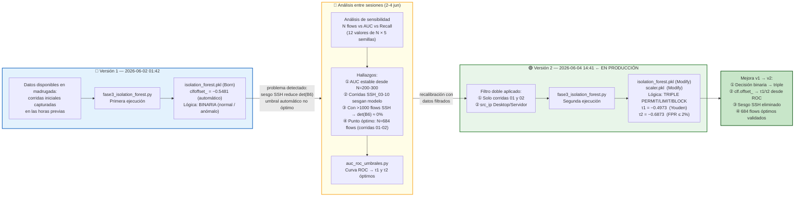
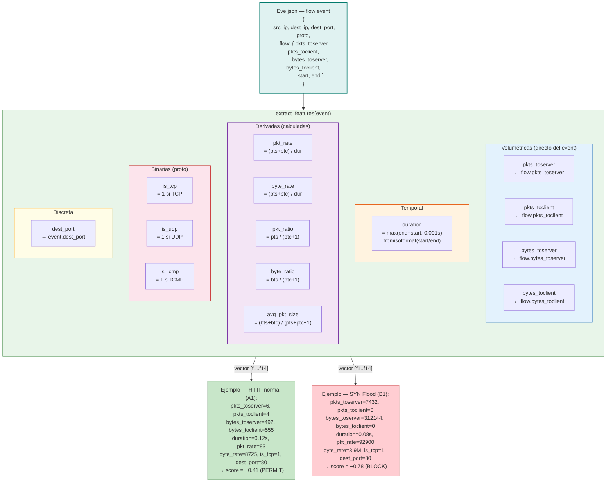
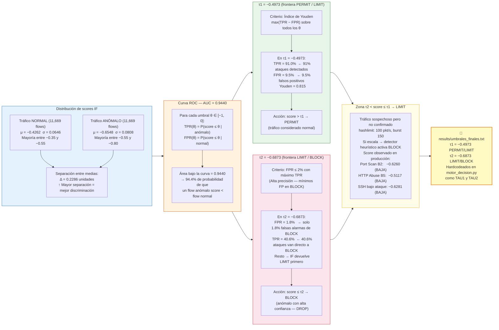
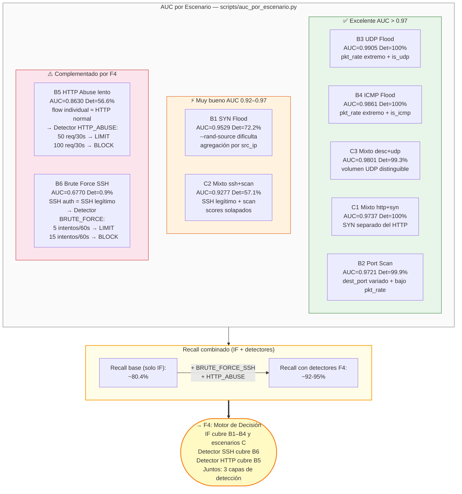
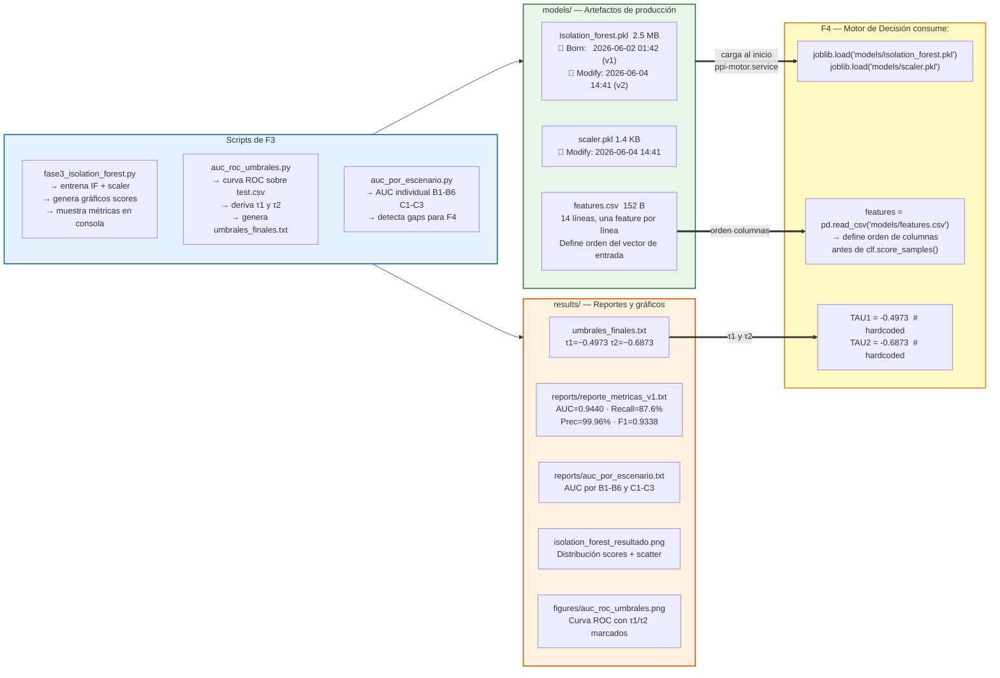

# F3 — Diagrama: Modelado Offline · Isolation Forest

**Proyecto:** Sistema de Detección Temprana de Comportamientos Anómalos en Redes de Datos  
**Institución:** Universidad Peruana Unión — PPI 2026  
**Estudiante:** Rubén Mark Salazar Tocas  
**Fase:** F3 — Modelado Offline  
**Fechas:** 2 – 4 de junio 2026 (entrenamiento v1 → recalibración v2)  
**Estado:** ✅ Completado — AUC-ROC=0.9440 · τ1=−0.4973 · τ2=−0.6873  

---

## Diagrama 1 — Pipeline Completo: Datos → Modelo → Umbrales

```mermaid
flowchart TD

    %% ── ENTRADAS ───────────────────────────────────────────────
    subgraph INPUT["📥 Entrada — data/raw/ en Sensor 192.168.0.110"]
        direction LR
        RAW_N["📦 Corridas normales 01 y 02\nnormal_http_01/02_eve.json.gz\nnormal_ssh_01/02_eve.json.gz\nnormal_sostenido_01/02_eve.json.gz\nnormal_transferencia_01/02_eve.json.gz"]
        FILTER["🔽 Filtro doble (en fase3_isolation_forest.py)\n① solo archivos corridas _01_ y _02_\n② src_ip ∈ {192.168.0.20, 192.168.0.120}\nEVITA contaminación de eve.json acumulado"]
        FLOWS684["✅ 684 flows normales puros\nhttp:         345 flows (50.4%)\nsostenido:    252 flows (36.8%)\nssh:           58 flows  (8.5%)\ntransferencia:  29 flows  (4.2%)"]
        RAW_N --> FILTER --> FLOWS684
    end

    %% ── FEATURE ENGINEERING ─────────────────────────────────────
    subgraph FE["⚙️ Feature Engineering — extract_features()"]
        direction TB
        FE_RAW["Por cada flow event en eve.json:"]
        FE_VOL["Volumétricas (4)\npkts_toserver · pkts_toclient\nbytes_toserver · bytes_toclient"]
        FE_TMP["Temporal (1)\nduration = flow.end − flow.start  (mín. 0.001s)"]
        FE_DER["Derivadas (5)\npkt_rate  = (pkts_to + pkts_from) / duration\nbyte_rate = (bytes_to + bytes_from) / duration\npkt_ratio  = pkts_toserver / (pkts_toclient + 1)\nbyte_ratio = bytes_toserver / (bytes_toclient + 1)\navg_pkt_size = (bytes_to+bytes_from) / (pkts_to+pkts_from+1)"]
        FE_BIN["Binarias (3)\nis_tcp  = 1 si proto=='TCP'\nis_udp  = 1 si proto=='UDP'\nis_icmp = 1 si proto in ('ICMP','IPV6-ICMP')"]
        FE_DSC["Discreta (1)\ndest_port  ← puerto destino del servidor"]
        FE_MAT["DataFrame 684 × 14\n(filas × features)"]
        FE_RAW --> FE_VOL & FE_TMP & FE_DER & FE_BIN & FE_DSC --> FE_MAT
    end

    %% ── SCALER ───────────────────────────────────────────────────
    subgraph SCALER["📐 StandardScaler — scaler.fit(X_normal_684)"]
        direction LR
        SC_FIT["Calcula μ y σ SOLO de flows normales\nmean_  = media de cada feature en tráfico legítimo\nscale_ = desviación estándar por feature"]
        SC_TRF["X_scaled = (X − μ) / σ\nCada feature centrada en 0, escala 1\nAnómalos → z-scores extremos por definición"]
        SC_OUT["📄 models/scaler.pkl  1.4 KB\nUsado en producción para transformar\ncada flow nuevo antes de predecir"]
        SC_FIT --> SC_TRF --> SC_OUT
    end

    %% ── ISOLATION FOREST ──────────────────────────────────────────
    subgraph IF_TRAIN["🌲 IsolationForest — clf.fit(X_scaled_normal)"]
        direction TB
        IF_PARAMS["Hiperparámetros:\nn_estimators = 300   ← más árboles = scores más estables\ncontamination = 0.05 ← 5% de ruido esperado en normal\nmax_samples = 'auto' ← 256 por árbol\nrandom_state = 42    ← reproducibilidad\nn_jobs = -1          ← paraleliza en 4 cores"]
        IF_ALGO["Algoritmo:\n① 300 árboles aleatorios sobre submuestra de 256 flows\n② Cada árbol: feature aleatoria → split aleatorio\n③ Un flow anómalo se aísla con MENOS particiones\n④ score = 2^(−media_prof / c(256))\n   más negativo → más fácil de aislar → más anómalo"]
        IF_OUT["📄 models/isolation_forest.pkl  2.5 MB\nclfoffset_ = −0.5481  (v1: umbral automático)"]
        IF_PARAMS --> IF_ALGO --> IF_OUT
    end

    %% ── EVALUACIÓN ───────────────────────────────────────────────
    subgraph EVAL["📊 Evaluación — auc_roc_umbrales.py"]
        direction TB
        EVAL_SET["Conjunto de evaluación balanceado 50/50:\n11,669 flows normales  ← de train.csv\n11,669 flows anómalos  ← de test.csv\nTotal: 23,338 flows"]
        SCORES["Distribución de scores:\nTráfico NORMAL:   μ = −0.4262  σ = 0.0646\nTráfico ANÓMALO:  μ = −0.6548  σ = 0.0808\nSeparación:       Δ = 0.229 unidades"]
        ROC_CURVE["Curva ROC\nAUC-ROC = 0.9440\n(94.4% de discriminación)\n→ results/figures/auc_roc_umbrales.png"]
        EVAL_SET --> SCORES --> ROC_CURVE
    end

    %% ── UMBRALES ────────────────────────────────────────────────
    subgraph UMBRALES["🎯 Derivación de Umbrales — auc_roc_umbrales.py"]
        direction TB
        TAU1["τ1 = −0.4973\nCriterio: Índice de Youden máximo\n  max(TPR − FPR)\nTPR = 91.0%  FPR = 9.5%\nFrontera PERMIT ↔ LIMIT"]
        TAU2["τ2 = −0.6873\nCriterio: FPR ≤ 2% con máximo TPR\n  FPR = 1.8%  TPR = 40.6%\nFrontera LIMIT ↔ BLOCK"]
        DECISION["Lógica triple resultante:\nscore > −0.4973        → PERMIT\n−0.6873 < score ≤ −0.4973 → LIMIT\nscore ≤ −0.6873        → BLOCK"]
        UMBRALES_FILE["📄 results/umbrales_finales.txt\n(τ1 · τ2 · criterios · métricas)"]
        TAU1 & TAU2 --> DECISION --> UMBRALES_FILE
    end

    %% ── ARTEFACTOS ───────────────────────────────────────────────
    subgraph MODELS["📦 Artefactos persistidos — models/"]
        M1["isolation_forest.pkl  2.5 MB\nBorn:  2026-06-02 01:42 (v1)\nModify: 2026-06-04 14:41 (v2 ← en producción)"]
        M2["scaler.pkl  1.4 KB\nModify: 2026-06-04 14:41"]
        M3["features.csv  152 B\nLista ordenada de 14 features"]
    end

    %% ── FLUJO ────────────────────────────────────────────────────
    FLOWS684 --> FE_RAW
    FE_MAT --> SC_FIT
    SC_TRF --> IF_PARAMS
    IF_OUT -->|"clf.score_samples(X_test)"| EVAL_SET
    ROC_CURVE --> TAU1
    ROC_CURVE --> TAU2
    IF_OUT --> M1
    SC_OUT --> M2
    FE_MAT -->|"models/features.csv"| M3

    %% ── AUC POR ESCENARIO ────────────────────────────────────────
    subgraph AUC_ESC["📈 AUC por Escenario — auc_por_escenario.py"]
        direction TB
        AUC_TABLE["results/reports/auc_por_escenario.txt\n\nUDP Flood  B3   AUC=0.9905  Det=100%  ✅ Excelente\nICMP Flood B4   AUC=0.9861  Det=100%  ✅ Excelente\nMixto C3        AUC=0.9801  Det=99.3% ✅ Excelente\nMixto C1        AUC=0.9737  Det=100%  ✅ Excelente\nPort Scan  B2   AUC=0.9721  Det=99.9% ✅ Excelente\nSYN Flood  B1   AUC=0.9529  Det=72.2% ⚡ Muy bueno\nMixto C2        AUC=0.9277  Det=57.1% ⚡ Muy bueno\nHTTP Abuse B5   AUC=0.8630  Det=56.6% ⚠️ → detector HTTP\nBrute F.   B6   AUC=0.6770  Det=0.9%  ⚠️ → detector SSH"]
    end
    IF_OUT --> AUC_ESC

    %% ── CONECTOR F4 ──────────────────────────────────────────────
    F4_CONN(["→ F4: Motor de Decisión\nmodels/isolation_forest.pkl  (joblib.load)\nmodels/scaler.pkl             (joblib.load)\nTAU1 = −0.4973  (hardcoded)\nTAU2 = −0.6873  (hardcoded)\nB5/B6 → detectores temporales complementan IF"])
    MODELS ==>|"cargados al inicio\ndel motor"| F4_CONN
    UMBRALES_FILE ==>|"τ1 · τ2 a\nmotor_decision.py"| F4_CONN

    %% ── ESTILOS ──────────────────────────────────────────────────
    style INPUT    fill:#e3f2fd,stroke:#1565c0,stroke-width:2px
    style FE       fill:#e8f5e9,stroke:#2e7d32,stroke-width:2px
    style SCALER   fill:#fff3e0,stroke:#e65100,stroke-width:2px
    style IF_TRAIN fill:#f3e5f5,stroke:#6a1b9a,stroke-width:2px
    style EVAL     fill:#fce4ec,stroke:#c62828,stroke-width:2px
    style UMBRALES fill:#fffde7,stroke:#f9a825,stroke-width:2px
    style MODELS   fill:#e0f2f1,stroke:#00796b,stroke-width:2px
    style AUC_ESC  fill:#fafafa,stroke:#757575
    style F4_CONN  fill:#fff9c4,stroke:#f57f17,stroke-width:2px
```



---

## Diagrama 2 — Recalibración: v1 (2 jun) → v2 (4 jun)



---

## Diagrama 3 — Feature Engineering: Cómo se Construyen las 14 Features



---

## Diagrama 4 — Derivación de τ1 y τ2 desde la Curva ROC



---

## Diagrama 5 — Análisis de Sensibilidad: N Flows vs Rendimiento

```mermaid
flowchart TD

    subgraph METODO["Metodología del análisis"]
        direction LR
        M1S["Pool: 1,977 flows normales\n(data/raw/*_normal_*_eve.json.gz)"]
        M2S["Para cada N ∈\n{50,100,200,300,400,\n500,684,800,1000,1500}"]
        M3S["5 semillas × N\n= 50-100 modelos\ncada uno evaluado en\nflows normales no usados\n+ 5,000 flows anómalos"]
        M1S --> M2S --> M3S
    end

    subgraph TABLA["Resultados — AUC y Recall(τ1)"]
        direction TB
        T_HEAD["  N   |  AUC  | ±std  | Recall"]
        T_50  ["  50  | 0.922 | 0.035 | 0.993 ← alta varianza"]
        T_200 [" 200  | 0.931 | 0.028 | 0.993"]
        T_300 [" 300  | 0.929 | 0.018 | 0.993 ← varianza cae"]
        T_500 [" 500  | 0.937 | 0.011 | 0.993"]
        T_684 [" 684★ | 0.935 | 0.013 | 0.993 ← ELEGIDO"]
        T_800 [" 800  | 0.940 | 0.014 | 0.993"]
        T_1000["1000  | 0.936 | 0.005 | 0.993"]
        T_1500["1500  | 0.935 | 0.004 | 0.993"]
        T_HEAD --> T_50 --> T_200 --> T_300 --> T_500 --> T_684 --> T_800 --> T_1000 --> T_1500
    end

    subgraph HALLAZGOS["3 Hallazgos clave"]
        direction TB
        H1["① Recall(τ1) = 0.993\n   CONSTANTE para todo N desde 50 hasta 1500\n   → la detección no depende del tamaño"]
        H2["② AUC se estabiliza en N ≈ 200–300\n   N=684 está en la meseta óptima\n   N=1500 da AUC=0.935 (igual que 684)"]
        H3["③ N=684 no es arbitrario\n   Es el punto donde ssh=8.5% del total\n   Con corridas 03-10: ssh=65% → det(B6)=0%\n   Filtrar a corridas 01-02 preserva detección B6"]
        H1 --> H2 --> H3
    end

    METODO --> TABLA
    TABLA --> HALLAZGOS

    CONCL["✅ Conclusión:\n684 flows es suficiente porque:\n- AUC(684)=0.935 ≈ AUC(1500)=0.935\n- Recall es constante desde N=50\n- std=0.013 (baja varianza, modelo estable)\n- Usar más datos introduce sesgo SSH"]
    HALLAZGOS --> CONCL

    style METODO    fill:#e3f2fd,stroke:#1565c0
    style TABLA     fill:#fafafa,stroke:#757575
    style HALLAZGOS fill:#e8f5e9,stroke:#2e7d32
    style CONCL     fill:#c8e6c9,stroke:#1b5e20,stroke-width:2px
    style T_684     fill:#fff9c4,stroke:#f57f17,stroke-width:2px
```

---

## Diagrama 6 — AUC por Escenario y Detecciones Complementarias



---

## Diagrama 7 — Artefactos Generados y Conector a F4


