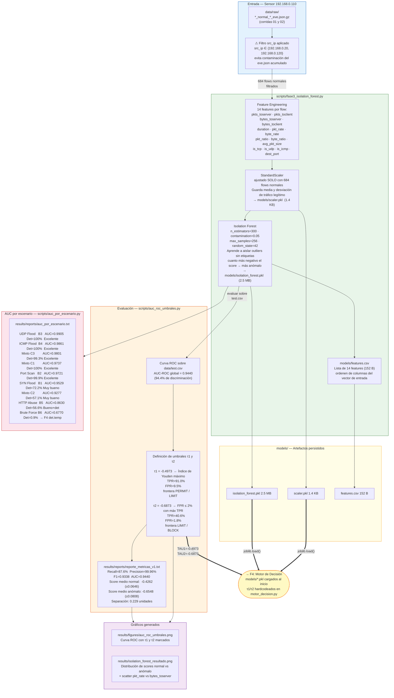

# F3 — Modelado Offline: Isolation Forest

**Fecha de ejecución:** 2 – 4 de junio 2026
**Objetivo:** Entrenar un modelo de detección de anomalías no supervisado sobre los flujos normales capturados en F2, y definir los umbrales τ1/τ2 a partir de la curva ROC.

---

## Diagrama



---

## Descripción por nodo

### Entrada: 684 flows normales

El script lee directamente los archivos `.gz` de `data/raw/` aplicando el filtro `src_ip ∈ {192.168.0.20, 192.168.0.120}`. **No usa `train.csv`** porque el `eve.json` de Suricata acumula históricamente todo el tráfico: los archivos etiquetados "normal" también contienen flows de ataques ejecutados en sesiones posteriores. El filtro por IP es la única forma de garantizar pureza.

Corridas usadas para entrenamiento: **A1-A4 corridas 01 y 02** únicamente.

| Escenario | Flows normales filtrados |
|---|---|
| normal_http (01, 02) | 345 |
| normal_sostenido (01, 02) | 252 |
| normal_ssh (01, 02) | 58 |
| normal_transferencia (01, 02) | 29 |
| **TOTAL** | **684** |

---

### `scripts/fase3_isolation_forest.py`

#### Feature Engineering — 14 features

| Feature | Tipo | Descripción |
|---|---|---|
| `pkts_toserver` | Volumétrico | Paquetes enviados al servidor |
| `pkts_toclient` | Volumétrico | Paquetes recibidos del servidor |
| `bytes_toserver` | Volumétrico | Bytes enviados al servidor |
| `bytes_toclient` | Volumétrico | Bytes recibidos del servidor |
| `duration` | Temporal | Duración del flow en segundos |
| `pkt_rate` | Derivado | (pkts_to + pkts_from) / duration |
| `byte_rate` | Derivado | (bytes_to + bytes_from) / duration |
| `pkt_ratio` | Derivado | pkts_toserver / (pkts_toclient + 1) |
| `byte_ratio` | Derivado | bytes_toserver / (bytes_toclient + 1) |
| `avg_pkt_size` | Derivado | (bytes_to + bytes_from) / (pkts_to + pkts_from + 1) |
| `is_tcp` | Binario | 1 si proto == TCP |
| `is_udp` | Binario | 1 si proto == UDP |
| `is_icmp` | Binario | 1 si proto == ICMP |
| `dest_port` | Numérico | Puerto destino del servidor |

#### `StandardScaler` — `models/scaler.pkl` (1.4 KB)
Ajustado **exclusivamente** con los 684 flows normales. Guarda:
- `scaler.mean_` — media de cada feature en tráfico legítimo
- `scaler.scale_` — desviación estándar de cada feature en tráfico legítimo

Esto significa que cualquier flow anómalo producirá z-scores altos al transformar con este scaler. Es la base del módulo de explainabilidad de F4 (`explicar_anomalia()`).

#### `IsolationForest` — `models/isolation_forest.pkl` (2.5 MB)

| Parámetro | Valor | Justificación |
|---|---|---|
| `n_estimators` | 300 | Mayor estabilidad de scores que el default (100) |
| `contamination` | 0.05 | 5% de ruido esperado en tráfico normal |
| `max_samples` | 256 (auto) | Submuestreo eficiente para los árboles |
| `random_state` | 42 | Reproducibilidad del experimento |
| `clf.offset_` | -0.5481 | Umbral base calculado por `contamination=0.05` |

**Principio:** el algoritmo construye árboles de decisión aleatorios. Un punto anómalo es más fácil de aislar (requiere menos particiones) que uno normal. El `score_samples()` devuelve un valor negativo: más negativo = más anómalo.

```
score > -0.5481   →  predicción: NORMAL
score ≤ -0.5481   →  predicción: ANÓMALO
```

---

### `scripts/auc_roc_umbrales.py` → Umbrales τ1 y τ2

El umbral base `-0.5481` no es óptimo para una lógica de triple acción. La curva ROC permite elegir puntos de operación con propiedades específicas:

```
Score medio tráfico normal:  -0.4262  (±0.0646)
Score medio tráfico anómalo: -0.6548  (±0.0808)
Separación entre medias:      0.229 unidades  ← base de la discriminación
```

| Umbral | Valor | Criterio de selección | TPR | FPR | Acción en F4 |
|---|---|---|---|---|---|
| τ1 | **-0.4973** | Índice de Youden máximo (TPR − FPR) | 91.0% | 9.5% | frontera PERMIT / LIMIT |
| τ2 | **-0.6873** | FPR ≤ 2% con máximo TPR posible | 40.6% | 1.8% | frontera LIMIT / BLOCK |

**Lógica resultante:**
```
score > -0.4973              →  PERMIT  (normal con alta confianza)
-0.6873 < score ≤ -0.4973   →  LIMIT   (sospechoso — rate limit 100 pkt/s)
score ≤ -0.6873              →  BLOCK   (anómalo confirmado — DROP)
```

Estos valores están hardcodeados en `motor_decision.py` como `TAU1` y `TAU2`.

---

### Artefactos generados

| Archivo | Ruta real en sensor | Tamaño | Descripción |
|---|---|---|---|
| `isolation_forest.pkl` | `models/isolation_forest.pkl` | 2.5 MB | Modelo serializado con joblib |
| `scaler.pkl` | `models/scaler.pkl` | 1.4 KB | StandardScaler serializado |
| `features.csv` | `models/features.csv` | 152 B | Lista ordenada de 14 features |
| `reporte_metricas_v1.txt` | `results/reports/reporte_metricas_v1.txt` | — | AUC, τ1, τ2, métricas formales |
| `auc_por_escenario.txt` | `results/reports/auc_por_escenario.txt` | — | AUC individual B1-B6, C1-C3 |
| `auc_roc_umbrales.png` | `results/figures/auc_roc_umbrales.png` | 139 KB | Curva ROC con τ1/τ2 marcados |
| `isolation_forest_resultado.png` | `results/isolation_forest_resultado.png` | 194 KB | Distribución scores + scatter |

---

### Limitación conocida y su tratamiento en F4

| Escenario | Detección modelo | Causa | Solución en F4 |
|---|---|---|---|
| Brute Force SSH (B6) | 0.9% | Flows SSH individuales indistinguibles de SSH legítimo | Detector temporal: 15 intentos/60s → BLOCK |
| HTTP Abuse lento (B5) | 56.6% | curl lento imita HTTP normal por flow | Detector temporal: 100 req/30s → BLOCK |

---

## Conector → F4

Los tres artefactos de `models/` son cargados al inicio del motor de decisión:

```python
# En motor_decision.py — función load_model()
clf    = joblib.load("models/isolation_forest.pkl")   # 2.5 MB
scaler = joblib.load("models/scaler.pkl")              # 1.4 KB
# features.csv define el orden de columnas del vector de entrada

# Umbrales hardcodeados (derivados por auc_roc_umbrales.py)
TAU1 = -0.4973
TAU2 = -0.6873
```

El `scaler.mean_` y `scaler.scale_` también son usados por `explicar_anomalia()` para calcular los z-scores de cada feature en decisiones BLOCK/LIMIT.
