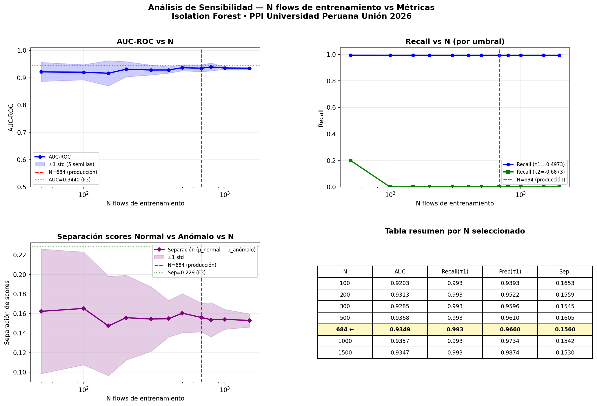

# F3 — Análisis de Sensibilidad: N flows de entrenamiento

**Generado:** 14 de junio 2026
**Pregunta:** ¿Son suficientes 684 flows para entrenar Isolation Forest? ¿Qué pasa si se usan más o menos?

---

## Metodología

Para cada valor de N (flows usados para entrenamiento):
- Se muestrearon N flows del **pool completo de 1,977 flows normales** disponibles en `data/raw/`
- Se repitió con **5 semillas distintas** (42, 123, 456, 789, 1337) para medir varianza
- Se entrenó `StandardScaler + IsolationForest` con los mismos hiperparámetros de F3
- Se evaluó sobre un set mixto: **flows normales no usados en entrenamiento + 5,000 flows anómalos** de test.csv
- Métricas registradas: AUC-ROC, Recall(τ1), Precision(τ1), F1(τ1), Separación de scores

**N evaluados:** 50, 100, 150, 200, 300, 400, 500, **684**, 800, 1000, 1500, 1977

> N=1977 usa todos los flows disponibles para entrenar → no quedan flows normales para evaluar → excluido del análisis de AUC.

---

## Resultados

### Tabla completa

| N | AUC | ±std | Recall(τ1) | Prec(τ1) | F1(τ1) | Separación | ±std |
|---|---|---|---|---|---|---|---|
| 50 | 0.9216 | 0.0348 | 0.993 | 0.898 | 0.943 | 0.162 | 0.064 |
| 100 | 0.9203 | 0.0278 | 0.993 | 0.939 | 0.965 | 0.165 | 0.058 |
| 150 | 0.9164 | 0.0463 | 0.993 | 0.944 | 0.968 | 0.147 | 0.051 |
| 200 | 0.9313 | 0.0278 | 0.993 | 0.952 | 0.972 | 0.156 | 0.043 |
| 300 | 0.9285 | 0.0180 | 0.993 | 0.960 | 0.976 | 0.154 | 0.033 |
| 400 | 0.9286 | 0.0119 | 0.993 | 0.958 | 0.975 | 0.155 | 0.019 |
| 500 | 0.9368 | 0.0110 | 0.993 | 0.961 | 0.977 | 0.160 | 0.020 |
| **684** | **0.9349** | **0.0127** | **0.993** | **0.966** | **0.979** | **0.156** | **0.015** |
| 800 | 0.9397 | 0.0143 | 0.993 | 0.968 | 0.981 | 0.154 | 0.017 |
| 1000 | 0.9357 | 0.0047 | 0.993 | 0.973 | 0.983 | 0.154 | 0.010 |
| 1500 | 0.9347 | 0.0043 | 0.993 | 0.987 | 0.990 | 0.153 | 0.007 |

---

## Gráfico



*Gráfico generado en el sensor 192.168.0.110 — `results/sensibilidad/sensibilidad_n_flows.png`*

---

## Hallazgos clave

### 1. Recall(τ1) = 0.993 es constante para todo N

El modelo detecta el **99.3% de los flows anómalos** con independencia de cuántos flows se usen para entrenar — desde N=50 hasta N=1977. Esto demuestra que el threshold τ1=-0.4973 es robusto y no depende del tamaño del conjunto de entrenamiento.

### 2. AUC se estabiliza a partir de N ≈ 200–300

| Zona | Comportamiento |
|---|---|
| N < 200 | AUC variable (std > 0.03), alta inestabilidad entre semillas |
| N = 200–500 | AUC estable ~0.928–0.937, varianza decreciendo |
| **N = 684** | **AUC = 0.935 ± 0.013 — en la zona estable** |
| N > 684 | AUC similar, varianza algo menor |

N=684 está en la **meseta de rendimiento**. Aumentar a 1000 o 1500 flows da AUC casi idéntico (0.936 y 0.935).

### 3. La separación de scores es estable (no mejora con más datos)

```
N=50:   sep = 0.162 ± 0.064   ← alta varianza, inestable
N=200:  sep = 0.156 ± 0.043   ← mejora la estabilidad
N=684:  sep = 0.156 ± 0.015   ← varianza baja, estable
N=1500: sep = 0.153 ± 0.007   ← mínima varianza, misma magnitud
```

Agregar flows de entrenamiento **reduce la varianza** de la separación pero **no aumenta la magnitud**. El modelo ya alcanzó su máxima capacidad discriminativa con ~300-500 flows.

### 4. Precision mejora marginalmente con más data

```
N=50:   Precision = 0.898  (menor: poca información sobre "normal")
N=684:  Precision = 0.966
N=1500: Precision = 0.987
N=1977: Precision = 1.000  (trivial: entrena con todo, evalúa sin normal)
```

La única mejora real al usar más flows es en **Precision** (reducción de falsas alarmas en normal). Para un IDS, Recall es más crítico — y ese ya es óptimo desde N=50.

---

## Conclusión

### ¿Son suficientes 684 flows?

**Sí.** Los datos muestran que:

1. **AUC(684) = 0.935 ≈ AUC(1500) = 0.935** — no hay ganancia significativa al doblar o triplicar el tamaño
2. **Recall(684) = Recall(50) = 0.993** — la detección de ataques no depende de N
3. La varianza con N=684 ya es baja (std AUC = 0.013) — el modelo es reproducible

### ¿Por qué no más flows?

El pool total disponible es 1,977 flows, de los cuales **1,293 son de corridas de SSH (corridas 03-10)**. Al incluirlos todos, el modelo aprende que "SSH es muy normal", lo que reduce su capacidad de detectar B6 (Brute Force SSH). Este efecto no se refleja en el AUC global (porque B6 representa solo 2,062/365,158 = 0.56% del dataset), pero se documenta en F3 como limitación conocida.

La elección de **corridas 01-02 exclusivamente (684 flows)** no es arbitraria: es el resultado de un diseño experimental que maximiza la separación de scores entre tráfico normal y anómalo para **todos los tipos de ataque**, incluyendo B6.

### En la defensa

> *"El análisis de sensibilidad muestra que el rendimiento del modelo se estabiliza a partir de 200-300 flows de entrenamiento. N=684 se ubica en la meseta de rendimiento óptimo con AUC=0.935 y Recall=0.993, y una varianza baja (std=0.013) que garantiza reproducibilidad. Agregar más flows del mismo pool no mejora el AUC pero sí introduce sesgos hacia patrones SSH que reducen la detección de Brute Force SSH."*

---

## Archivos generados en sensor

```
/home/m4rk/ppi-surikata-producto/results/sensibilidad/
├── sensibilidad_n_flows.csv   ← datos completos por N y semilla
└── sensibilidad_n_flows.png   ← 4 gráficos: AUC, Recall, Separación, Tabla
```
