# F3-03 — Limpieza, Transformación y Feature Engineering

**Proyecto:** Sistema de Detección Temprana de Comportamientos Anómalos en Redes de Datos  
**Institución:** Universidad Peruana Unión — PPI 2026  
**Estudiante:** Rubén Mark Salazar Tocas  
**Asesores:** Ing. Nemias Saboya Rios · Ing. Fernando Manuel Asin Gomez  
**Fase:** F3 — Modelado Offline  
**Scripts:** `etiquetar_limpiar.py` · `fase3_isolation_forest.py`  
**Fecha:** 2026-06-14  

---

## Resumen del Pipeline de Preprocesamiento

```
dataset_raw.csv   (412,097 flows)
        │
        ▼  etiquetar_limpiar.py — Paso 1
dataset_labeled.csv  (412,097 flows · labels refinados)
        │
        ▼  etiquetar_limpiar.py — Paso 2
dataset_clean.csv    (376,827 flows · -35,270 eliminados)
        │
        ▼  particionar_estadisticos.py
train.csv (263,778) · val.csv (56,524) · test.csv (56,525)
        │
        ▼  fase3_isolation_forest.py — Feature Engineering
X_scaled ∈ ℝ⁶⁸⁴ˣ¹⁴  (solo flows normales para entrenar scaler + IF)
```

---

## 1. Limpieza de Datos

### 1.1 Eliminación de Duplicados

**Script:** `etiquetar_limpiar.py` — Paso 2, filtro 1

```python
seen_ids = set()

fid = row.get("flow_id", "")
if fid and fid in seen_ids:
    stats["dup_flowid"] += 1
    continue
if fid:
    seen_ids.add(fid)
```

**Criterio:** `flow_id` único generado por Suricata por cada flow. Un mismo flow no puede cerrarse dos veces, por lo que cualquier `flow_id` repetido es artefacto del proceso de captura (e.g., doble escritura al rotar el log).

| Métrica | Valor |
|---|---|
| Flows en dataset_raw | 412,097 |
| Duplicados por flow_id eliminados | **34** |
| Impacto | 0.008% del total |

### 1.2 Eliminación de Flows sin Datos Válidos

**Script:** `etiquetar_limpiar.py` — Paso 2, filtro 2

```python
try:
    if int(row.get("pkts_toserver", 0) or 0) == 0:
        stats["pkts_cero"] += 1
        continue
except ValueError:
    stats["tipo_invalido"] += 1
    continue
```

**Criterio:** Un flow con `pkts_toserver=0` significa que el host destino inició la comunicación o que Suricata registró un flow incompleto. No aporta información sobre el comportamiento del origen (que es lo que detectamos). Se eliminan también filas con tipos de dato inválidos en campos numéricos críticos.

### 1.3 Eliminación de IPs Inválidas

**Script:** `etiquetar_limpiar.py` — Paso 2, filtro 3 · `fase3_isolation_forest.py`

```python
def es_ip_valida(ip):
    try:
        obj = ipaddress.ip_address(ip)
        return not (obj.is_unspecified or obj.is_multicast or obj.is_reserved
                    or str(obj).endswith(".255")
                    or obj == ipaddress.ip_address("255.255.255.255"))
    except ValueError:
        return False

if not es_ip_valida(src) or not es_ip_valida(dst):
    stats["ip_invalida"] += 1
    continue
```

**IPs filtradas:**

| Tipo | Ejemplos | Motivo |
|---|---|---|
| Unspecified | `0.0.0.0` | Tráfico DHCP/ARP — no es un host real |
| Multicast | `224.0.0.x`, `239.x.x.x` | Tráfico de grupo — no un atacante individual |
| Reserved | `169.254.x.x` | Link-local — no enrutable |
| Broadcast | `x.x.x.255`, `255.255.255.255` | Difusión — ipset rechaza estas IPs con error |
| ICMP (sin puerto) | N/A | Los floods ICMP generan flows sin src_port/dest_port |

> **Nota crítica:** El filtro de broadcast fue introducido tras descubrir que `ipset add` lanzaba `Null-valued element` al intentar bloquear `255.255.255.255`. El filtro en `etiquetar_limpiar.py` limpia el dataset; el mismo filtro en `motor_decision.py` protege el sistema en producción.

| Métrica | Valor |
|---|---|
| IPs inválidas eliminadas | **~35,236** |
| Impacto | 8.5% del total raw |

### 1.4 Eliminación de Timestamps Vacíos

**Script:** `etiquetar_limpiar.py` — Paso 2, filtro 5

```python
if not row.get("timestamp") or not row.get("flow_start"):
    stats["timestamp_vacio"] += 1
    continue
```

**Criterio:** `flow_start` es necesario para calcular `duration`. Sin él no se puede construir ninguna feature de tasa. Flows sin timestamp tampoco pueden ser ubicados en la partición cronológica.

### 1.5 Tratamiento de Outliers

**Criterio:** los outliers en este dataset **no se eliminan** — son exactamente la señal de ataque.

| Variable | Normal (max) | Anómalo (max) | Interpretación |
|---|---|---|---|
| `pkts_toserver` | 115 | **7,273** | SYN flood hping3 --flood |
| `bytes_toserver` | 18,213 | **436,380** | Transferencia masiva HTTP |
| `bytes_toclient` | 24,297 | **1,127,557** | Descarga HTTP legítima (también alta) |
| `duration` | 206.6s | 1,088.4s | SSH sesión larga legítima |
| `pkt_rate` (derivada) | ~10,000 | ~10,000 | Ambos pueden ser altos — discrimina el ratio |

**Estrategia:** en lugar de eliminar, se aplica `StandardScaler` para que Isolation Forest opere en espacio z-score. Los outliers extremos quedan a muchas desviaciones estándar de la media normal → se aíslan en ramas cortas del árbol → scores muy negativos → BLOCK.

### Resumen de Limpieza

| Filtro | Filas eliminadas | Acumulado restante |
|---|---|---|
| Entrada (dataset_raw) | — | 412,097 |
| Duplicados flow_id | 34 | 412,063 |
| pkts_toserver = 0 | ~N/A (incluido en total) | — |
| IPs inválidas | ~35,236 | — |
| Tipo inválido / timestamp vacío | resto | — |
| **Salida (dataset_clean)** | **–35,270 total** | **376,827** |

---

## 2. Transformación

### 2.1 Etiquetado Dual (Encoding de Label)

**Script:** `etiquetar_limpiar.py` — Paso 1: función `reetiqueta()`

```python
def reetiqueta(row):
    src = row["src_ip"]
    escenario = row["escenario"]

    if src in NORMAL_IPS and "normal" in escenario:
        return "0"                          # Desktop en escenario normal → siempre 0
    if src == KALI_IP:
        return "1"                          # Kali siempre → anómalo
    if "anom" in escenario or "mixto" in escenario:
        return "1"                          # IPs random de floods → anómalo
    if src in NORMAL_IPS and "mixto" in escenario:
        return "0"                          # Desktop en escenario mixto → normal
    return row["label"]                     # fallback al label original
```

**Doble criterio de etiquetado:**
1. **Por nombre de archivo:** el nombre del `.gz` indica el escenario (e.g., `anom_synflood` → label=1)
2. **Por src_ip:** Desktop `.20` → normal; Kali `.100` → anómalo

Este doble criterio resuelve ambigüedades en escenarios mixtos donde el mismo eve.json contiene tráfico de `.20` (normal) y `.100` (anómalo) simultáneamente.

| Clase | Flows | % |
|---|---|---|
| 0 — Normal | 11,669 | 3.1% |
| 1 — Anómalo | 365,158 | 96.9% |

### 2.2 Encoding de Protocolo (One-Hot)

**Script:** `fase3_isolation_forest.py` — función `extract_features()`

```python
proto = e.get('proto', '').upper()

'is_tcp':  int(proto == 'TCP'),
'is_udp':  int(proto == 'UDP'),
'is_icmp': int(proto in ('ICMP', 'IPV6-ICMP')),
```

**Por qué one-hot y no label encoding:**
- Label encoding (`TCP=0, UDP=1, ICMP=2`) introduce un orden ordinal falso que distorsiona distancias en Isolation Forest.
- One-hot mantiene independencia entre protocolos.
- Solo 3 valores posibles → 3 columnas binarias sin explosión de dimensionalidad.

| Proto | is_tcp | is_udp | is_icmp | Flows | % |
|---|---|---|---|---|---|
| TCP | 1 | 0 | 0 | 225,718 | 59.9% |
| UDP | 0 | 1 | 0 | 130,944 | 34.7% |
| ICMP | 0 | 0 | 1 | 20,165 | 5.4% |

### 2.3 Escalamiento — StandardScaler

**Script:** `fase3_isolation_forest.py`

```python
scaler = StandardScaler()
X_n = scaler.fit_transform(df_n)   # fit SOLO en 684 flows normales
X_a = scaler.transform(df_a)       # transform sin re-fit (preserva la escala normal)
```

**Fórmula:** `z = (x - μ) / σ`  donde μ y σ se calculan exclusivamente sobre los 684 flows normales del set de entrenamiento.

**Por qué ajustar solo en normales:**

| Si se ajusta con... | Resultado |
|---|---|
| Solo normales (✅ implementado) | μ y σ reflejan el tráfico legítimo → anomalías quedan lejos de μ |
| Toda la data (normal + anómalo) | μ se desplaza hacia valores de ataque → separación reducida |
| Val o test | Data leakage → métricas infladas artificialmente |

**Separación conseguida con scaler en normales:**
- Score SSH normal: **-0.434** (cerca de 0, poco anómalo)
- Score port scan Kali: **-0.655** (lejos de 0, muy anómalo)
- **Separación: 0.221 unidades** entre normal y anómalo más cercano

### 2.4 Partición Cronológica

**Script:** `particionar_estadisticos.py`

```
Orden cronológico por timestamp:
├── 70%  → train.csv  (263,778 flows) — 2026-06-02 04:09 a ~14:00
├── 15%  → val.csv    ( 56,524 flows) — 2026-06-02 ~14:00 a ~17:00
└── 15%  → test.csv   ( 56,525 flows) — 2026-06-02 ~17:00 a 20:34
```

**Por qué cronológico y no aleatorio:**

| Tipo de partición | Resultado |
|---|---|
| Aleatoria | El modelo ve flujos de ataques futuros en train → métricas infladas |
| Cronológica (✅ implementado) | Replica condiciones reales: el modelo no conoce el futuro |

**Consecuencia real:** `val.csv` y `test.csv` tienen 0 flows normales (todos los normales quedaron en la ventana temporal de train), lo que refleja fielmente que el sensor en producción verá mucho más tráfico anómalo que normal.

---

## 3. Feature Engineering

### 3.1 Features Implementadas (14 en total)

La función `extract_features()` en `fase3_isolation_forest.py` construye las 14 features por cada flow:

```python
def extract_features(events):
    rows = []
    for e in events:
        flow  = e.get('flow', {})
        proto = e.get('proto', '').upper()
        dur   = flow_duration(e)          # máximo entre duración real y 0.001s

        pts  = flow.get('pkts_toserver',  0) or 0
        ptc  = flow.get('pkts_toclient',  0) or 0
        bts  = flow.get('bytes_toserver', 0) or 0
        btc  = flow.get('bytes_toclient', 0) or 0

        rows.append({
            # ── Raw ───────────────────────────────────────────────
            'pkts_toserver':  pts,
            'pkts_toclient':  ptc,
            'bytes_toserver': bts,
            'bytes_toclient': btc,
            'duration':       dur,
            # ── Derivadas de tasa ─────────────────────────────────
            'pkt_rate':       (pts + ptc) / dur,
            'byte_rate':      (bts + btc) / dur,
            # ── Derivadas de asimetría ────────────────────────────
            'pkt_ratio':      pts / (ptc + 1),
            'byte_ratio':     bts / (btc + 1),
            'avg_pkt_size':   (bts + btc) / (pts + ptc + 1),
            # ── Flags de protocolo (one-hot) ──────────────────────
            'is_tcp':         int(proto == 'TCP'),
            'is_udp':         int(proto == 'UDP'),
            'is_icmp':        int(proto in ('ICMP', 'IPV6-ICMP')),
            # ── Identificación de servicio ────────────────────────
            'dest_port':      e.get('dest_port', 0) or 0,
        })
    return pd.DataFrame(rows)
```

**Cálculo de duración (evita división por cero):**

```python
def flow_duration(e):
    try:
        t0 = datetime.fromisoformat(e['flow']['start'].replace('Z', '+00:00'))
        t1 = datetime.fromisoformat(e['flow']['end'].replace('Z', '+00:00'))
        return max((t1 - t0).total_seconds(), 0.001)   # mínimo 1ms
    except Exception:
        return 0.001
```

---

## 4. Justificación de Cada Variable

### Features Raw

| Feature | Anomalía que detecta | Normal (media) | Anómalo (P95) | Discriminación |
|---|---|---|---|---|
| `pkts_toserver` | SYN flood, UDP flood | 2.04 | ~7,000+ | **Alta** |
| `pkts_toclient` | Floods sin respuesta | 0.93 | 0 (floods) | **Alta** (0 = sin respuesta) |
| `bytes_toserver` | Payloads masivos | 279.6 B | 490 B (normal) / mucho más en floods | **Media** |
| `bytes_toclient` | Descarga masiva / 0 en floods | 244.6 B | 0 o 1,134 B | **Alta** |
| `duration` | Flows instantáneos (floods) vs reales | 0.05s | 0.282s | **Media** |

### Features de Tasa

| Feature | Fórmula | Por qué detecta anomalías |
|---|---|---|
| `pkt_rate` | `(pts + ptc) / dur` | SYN flood genera miles de paquetes/segundo. Normal: ~1,200 pkt/s. Anómalo P95: ~10,000 pkt/s |
| `byte_rate` | `(bts + btc) / dur` | Floods de alta tasa generan MB/s. Normal media: 93K B/s. Anómalo P95: 1.6M B/s |

> **`max(duration, 0.001)`:** evita división por cero en flows con timestamps idénticos (SYN flood de hping3 a veces registra start=end). El mínimo de 1ms es conservador: un flow real dura al menos 1ms.

### Features de Asimetría

| Feature | Fórmula | Por qué detecta anomalías |
|---|---|---|
| `pkt_ratio` | `pts / (ptc + 1)` | En comunicación normal hay respuesta (ptc > 0) → ratio ≈ 1. En SYN flood el servidor no responde → ptc ≈ 0 → ratio >> 1 |
| `byte_ratio` | `bts / (btc + 1)` | Port scan: muchos bytes enviados (SYN), cero recibidos → ratio alto. Normal: intercambio bidireccional |
| `avg_pkt_size` | `(bts + btc) / (pts + ptc + 1)` | SYN: solo header TCP = 60 bytes/pkt. HTTP legítimo: 100-1400 bytes/pkt |

**Valores comparativos reales:**

| Feature | Normal (media) | Normal (P95) | Anómalo (media) | Anómalo (P95) |
|---|---|---|---|---|
| `pkt_rate` | 1,200 pkt/s | 1,000 pkt/s | 1,914 pkt/s | 10,000 pkt/s |
| `byte_rate` | 93,364 B/s | 60,000 B/s | 194,625 B/s | 1,615,000 B/s |
| `pkt_ratio` | 1.01 | 1.13 | 1.02 | 1.20 |

### Features de Protocolo

| Feature | Anomalía que detecta |
|---|---|
| `is_icmp` | ICMP flood — todos los flows son ICMP, nunca en tráfico normal del lab |
| `is_udp` | UDP flood — 100% del UDP en el dataset es anómalo (B3) |
| `is_tcp` | SYN flood, port scan, brute force — pero también HTTP y SSH normales |

### `dest_port`

| Puerto | Tráfico Normal | Tráfico Anómalo |
|---|---|---|
| 22 | SSH legítimo (baja tasa, sesiones largas) | Brute force SSH (alta tasa, intentos repetidos) |
| 80 | HTTP curl/wget (payloads completos) | SYN flood (solo SYN, sin payload), HTTP abuse |
| 53 | DNS consultas legítimas | UDP flood (destino DNS) |
| 1–65535 (múltiples) | No ocurre en tráfico normal | Port scan nmap -sS |

El `dest_port` por sí solo no discrimina bien, pero en combinación con `pkt_rate`, `bytes_toclient=0` y `is_tcp` identifica el tipo de ataque con precisión.

---

## 5. Propuestas de Mejora

Las siguientes features no están implementadas en el sistema actual pero pueden mejorar la detección en escenarios con ataques lentos o evasivos.

### Feature Propuesta 1: `syn_ack_ratio`

**Definición:** ratio de paquetes SYN vs paquetes ACK por flow.

```python
# Requeriría acceso a tcp_flags de Suricata (disponible en eve.json)
syn_count = e.get('tcp', {}).get('syn', 0) or 0
ack_count = e.get('tcp', {}).get('ack', 0) or 0
'syn_ack_ratio': syn_count / (ack_count + 1)
```

**Detección:** SYN flood puro tiene `syn_ack_ratio >> 1`; tráfico normal tiene ratio ≈ 1 (por cada SYN hay un ACK de respuesta). Mejoraría discriminación de SYN flood (actualmente AUC=0.9529).

**Limitación:** `tcp_flags` no está disponible en todos los eventos `flow` de Suricata — solo en eventos `tcp`.

---

### Feature Propuesta 2: `bytes_asymmetry`

**Definición:** asimetría absoluta de bytes, normalizada.

```python
total_bytes = bts + btc + 1
'bytes_asymmetry': abs(bts - btc) / total_bytes
```

**Detección:** floods unidireccionales tienen `bytes_asymmetry ≈ 1.0` (todo en un sentido, nada en el otro). Tráfico HTTP normal tiene `bytes_asymmetry` más bajo (request pequeño, respuesta grande pero hay intercambio real).

**Diferencia vs `byte_ratio`:** mientras `byte_ratio` es ilimitado (puede ser 1000+), `bytes_asymmetry ∈ [0, 1]` está acotado y es más estable para StandardScaler.

---

### Feature Propuesta 3: `flow_completeness`

**Definición:** indicador de si el flow tuvo intercambio bidireccional real.

```python
'flow_completeness': int(ptc > 0 and btc > 0)
```

**Detección:** cualquier flood unidireccional (SYN, UDP, ICMP) tiene `flow_completeness=0`. HTTP normal y SSH tienen `flow_completeness=1`. Esta feature binaria es extremadamente discriminante para floods pero requiere que el servidor responda (ICMP flood podría tener respuesta del kernel).

---

### Comparación con y sin nuevas features

| Configuración | AUC-ROC | Recall (B1 SYN) | Recall (B3 UDP) | F1 |
|---|---|---|---|---|
| 14 features actuales | **0.9440** | 72.2% | 100% | 0.9338 |
| + `bytes_asymmetry` | estimado +0.005–0.010 | +5–8% en B1 | Sin cambio | +0.005 |
| + `flow_completeness` | estimado +0.008–0.015 | +10–15% en B1 | Sin cambio | +0.008 |
| + `syn_ack_ratio` | estimado +0.010–0.020 | +15–20% en B1 | Sin cambio | +0.010 |

> **Nota:** estos valores son estimaciones basadas en el comportamiento esperado según los rangos del dataset. Una validación formal requeriría re-entrenar el modelo con las features propuestas y evaluar en val.csv.

---

## 6. Diagrama del Pipeline

```mermaid
flowchart TD

    subgraph RAW["Datos Crudos — eve.json.gz"]
        R["412,097 flows raw&#10;18 columnas Suricata"]
    end

    subgraph ETIQUETADO["Etiquetado Dual — etiquetar_limpiar.py Paso 1"]
        E1["Por escenario (nombre archivo)&#10;anom_* → label=1 · normal_* → label=0"]
        E2["Por src_ip&#10;192.168.0.20 → label=0&#10;192.168.0.100 → label=1&#10;IPs random floods → label=1"]
        E1 & E2 --> EL["dataset_labeled.csv&#10;412,097 flows · labels refinados"]
    end

    subgraph LIMPIEZA["Limpieza — etiquetar_limpiar.py Paso 2"]
        L1["❌ Duplicados flow_id: -34"]
        L2["❌ pkts_toserver=0"]
        L3["❌ IPs inválidas (broadcast·multicast·0.0.0.0): -35,236"]
        L4["❌ Tipos inválidos · timestamps vacíos"]
        L1 & L2 & L3 & L4 --> LC["dataset_clean.csv&#10;376,827 flows (-35,270)"]
    end

    subgraph PARTICION["Partición Cronológica — particionar_estadisticos.py"]
        P1["train.csv — 70%  → 263,778 flows"]
        P2["val.csv  — 15%  →  56,524 flows"]
        P3["test.csv — 15%  →  56,525 flows"]
    end

    subgraph FEATURES["Feature Engineering — fase3_isolation_forest.py"]
        direction LR
        F1["Raw: pkts_*, bytes_*, duration, dest_port"]
        F2["Tasas: pkt_rate = (pts+ptc)/dur&#10;        byte_rate = (bts+btc)/dur"]
        F3["Asimetría: pkt_ratio = pts/(ptc+1)&#10;           byte_ratio = bts/(btc+1)&#10;           avg_pkt_size = (bts+btc)/(pts+ptc+1)"]
        F4["One-hot: is_tcp · is_udp · is_icmp"]
        F1 & F2 & F3 & F4 --> FM["14 features · X ∈ ℝⁿˣ¹⁴"]
    end

    subgraph SCALING["Normalización — StandardScaler"]
        S1["fit en 684 flows normales de train&#10;μ y σ del tráfico legítimo"]
        S2["transform(normal) → X_n_scaled&#10;transform(anom)   → X_a_scaled"]
        S1 --> S2
    end

    subgraph MODELO["Isolation Forest — n=300 · contamination=0.05"]
        M1["fit(X_n_scaled) — solo normales"]
        M2["score_samples() → score ∈ [-1, 0]"]
        M3["τ1=-0.4973 (Youden) · τ2=-0.6873 (FPR≤2%)"]
        M1 --> M2 --> M3
    end

    subgraph SALIDA["Artefactos"]
        A1["models/isolation_forest.pkl"]
        A2["models/scaler.pkl"]
        A3["models/features.csv"]
        A4["results/umbrales_finales.txt"]
    end

    RAW --> ETIQUETADO --> LIMPIEZA --> PARTICION --> FEATURES --> SCALING --> MODELO --> SALIDA

    style RAW fill:#e3f2fd,stroke:#1565c0
    style ETIQUETADO fill:#e8eaf6,stroke:#283593
    style LIMPIEZA fill:#ffebee,stroke:#c62828
    style PARTICION fill:#e8f5e9,stroke:#2e7d32
    style FEATURES fill:#f3e5f5,stroke:#6a1b9a
    style SCALING fill:#fff3e0,stroke:#e65100
    style MODELO fill:#fce4ec,stroke:#880e4f
    style SALIDA fill:#fffde7,stroke:#f9a825
```



---

## Referencias de Archivos

| Archivo | Ruta en sensor | Descripción |
|---|---|---|
| `parser.py` | `scripts/parser.py` | eve.json.gz → dataset_raw.csv |
| `etiquetar_limpiar.py` | `scripts/etiquetar_limpiar.py` | Limpieza, dedup y etiquetado dual |
| `particionar_estadisticos.py` | `scripts/particionar_estadisticos.py` | Partición cronológica 70/15/15 |
| `fase3_isolation_forest.py` | `scripts/fase3_isolation_forest.py` | Feature engineering + entrenamiento |
| `dataset_raw.csv` | `data/dataset_raw.csv` | 412,097 flows sin limpiar |
| `dataset_clean.csv` | `data/dataset_clean.csv` | 376,827 flows limpios |
| `train.csv` | `data/train.csv` | 263,778 flows de entrenamiento |
| `scaler.pkl` | `models/scaler.pkl` | StandardScaler (fit en 684 normales) |
| `isolation_forest.pkl` | `models/isolation_forest.pkl` | Modelo serializado |
| `features.csv` | `models/features.csv` | Lista de 14 features |

> **Directorio base en el sensor:** `/home/m4rk/ppi-surikata-producto/`
