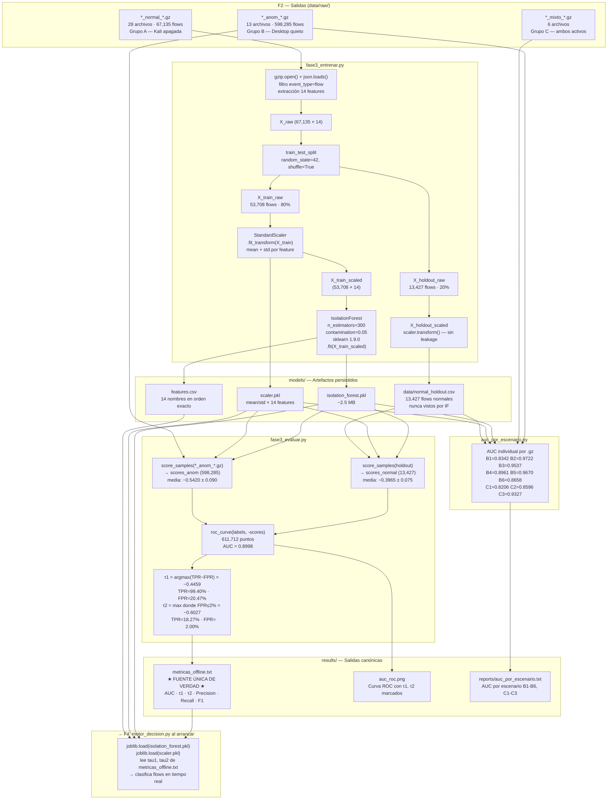

# F3 — Diagrama: Modelado Offline (Isolation Forest)

**Instrucciones Draw.io:** Extras → Edit Diagram → pegar XML → OK

---

## Diagrama Mermaid (vista rápida del flujo completo)



---

## Tabla de componentes

| Componente | Tipo | Ruta | Descripción |
|---|---|---|---|
| `fase3_entrenar.py` | Script Python | `scripts/fase3_entrenar.py` | Lee Grupo A, split 80/20, entrena IF, guarda PKL |
| `fase3_evaluar.py` | Script Python | `scripts/fase3_evaluar.py` | Construye ROC, deriva τ1/τ2, escribe metricas |
| `auc_por_escenario.py` | Script Python | `scripts/auc_por_escenario.py` | AUC individual por escenario B y C |
| `isolation_forest.pkl` | Modelo | `models/isolation_forest.pkl` | IsolationForest serializado (~2.5 MB) |
| `scaler.pkl` | Preprocesador | `models/scaler.pkl` | StandardScaler ajustado sobre X_train |
| `features.csv` | Metadatos | `models/features.csv` | 14 nombres de features en orden exacto |
| `normal_holdout.csv` | Dataset | `data/normal_holdout.csv` | 13,427 flows normales nunca vistos por IF |
| `metricas_offline.txt` | Config | `results/metricas_offline.txt` | **Fuente única de verdad** — τ1, τ2, AUC |
| `auc_roc.png` | Figura | `results/auc_roc.png` | Curva ROC con τ1 y τ2 marcados |
| `auc_por_escenario.txt` | Reporte | `results/reports/auc_por_escenario.txt` | AUC desglosado por tipo de ataque |

---

## Decisiones de diseño clave (por qué así y no de otra forma)

| Decisión | Alternativa descartada | Razón |
|---|---|---|
| Split 80/20 aleatorio | 70/15/15 cronológico | IF no tiene hiperparámetros para validar; el 15% de "val" sería desperdiciado |
| `fit_transform` solo en 80% | `fit_transform` en todo | Evita data leakage: el scaler no debe ver el holdout durante el ajuste |
| `score_samples()` (no `decision_function()`) | `decision_function()` | `score_samples()` retorna valores comparables directamente entre archivos y versiones de sklearn |
| Youden Index para τ1 | FPR≤5%, F1 max | Youden maximiza simultáneamente TPR y especificidad — estándar en literatura IDS |
| FPR≤2% para τ2 | Percentil fijo | Garantiza que BLOCK se aplique solo con altísima confianza, independiente del tamaño del dataset |
| n_estimators=300 | 100, 500 | Análisis de sensibilidad: AUC estable en n>200; 300 es punto de rendimientos decrecientes |
| contamination=0.05 | 0.01, 0.10 | Prior conservador para red universitaria; no afecta los árboles, solo el offset del score |

---

## Diagrama Draw.io (XML completo)

```xml
<?xml version="1.0" encoding="UTF-8"?>
<mxGraphModel dx="1422" dy="762" grid="1" gridSize="10" guides="1"
  tooltips="1" connect="1" arrows="1" fold="1" page="0"
  pageScale="1" pageWidth="1654" pageHeight="1169" math="0" shadow="0">
  <root>
    <mxCell id="0" /><mxCell id="1" parent="0" />

    <!-- TÍTULO -->
    <mxCell id="title" value="F3 — Modelado Offline: Isolation Forest  |  PPI UPeU 2026  |  sklearn 1.9.0"
      style="text;html=1;strokeColor=none;fillColor=#002060;fontColor=#ffffff;
             align=center;verticalAlign=middle;fontSize=14;fontStyle=1;rounded=1;"
      vertex="1" parent="1">
      <mxGeometry x="40" y="15" width="1560" height="42" as="geometry" />
    </mxCell>

    <!-- ══ ENTRADAS ══ -->
    <mxCell id="ga" value="&lt;b&gt;Grupo A — Normal&lt;/b&gt;&lt;br/&gt;data/raw/*_normal_*.gz&lt;br/&gt;28 archivos · 67,135 flows&lt;br/&gt;Kali apagada"
      style="rounded=1;whiteSpace=wrap;html=1;fillColor=#d5e8d4;strokeColor=#82b366;fontSize=10;"
      vertex="1" parent="1"><mxGeometry x="40" y="90" width="185" height="90" as="geometry"/></mxCell>

    <mxCell id="gb" value="&lt;b&gt;Grupo B — Anómalo&lt;/b&gt;&lt;br/&gt;data/raw/*_anom_*.gz&lt;br/&gt;13 archivos · 598,285 flows&lt;br/&gt;Desktop quieto"
      style="rounded=1;whiteSpace=wrap;html=1;fillColor=#f8cecc;strokeColor=#b85450;fontSize=10;"
      vertex="1" parent="1"><mxGeometry x="40" y="420" width="185" height="90" as="geometry"/></mxCell>

    <mxCell id="gc" value="&lt;b&gt;Grupo C — Mixto&lt;/b&gt;&lt;br/&gt;data/raw/*_mixto_*.gz&lt;br/&gt;6 archivos&lt;br/&gt;ambos activos"
      style="rounded=1;whiteSpace=wrap;html=1;fillColor=#e6d9f5;strokeColor=#9673a6;fontSize=10;"
      vertex="1" parent="1"><mxGeometry x="40" y="560" width="185" height="80" as="geometry"/></mxCell>

    <!-- ══ FASE3_ENTRENAR ══ -->
    <mxCell id="ent_bg" value=""
      style="rounded=1;whiteSpace=wrap;html=1;fillColor=#dae8fc;strokeColor=#6c8ebf;"
      vertex="1" parent="1"><mxGeometry x="285" y="70" width="420" height="340" as="geometry"/></mxCell>
    <mxCell id="ent_hdr" value="&lt;b&gt;fase3_entrenar.py&lt;/b&gt;"
      style="text;html=1;strokeColor=none;fillColor=#6c8ebf;fontColor=#ffffff;
             align=center;fontSize=12;fontStyle=1;rounded=1;"
      vertex="1" parent="1"><mxGeometry x="285" y="70" width="420" height="28" as="geometry"/></mxCell>

    <mxCell id="xraw" value="X_raw (67,135 × 14)&lt;br/&gt;gzip.open + filtro flow + 14 features"
      style="rounded=1;whiteSpace=wrap;html=1;fillColor=#e6f0ff;strokeColor=#6c8ebf;fontSize=10;"
      vertex="1" parent="1"><mxGeometry x="300" y="112" width="285" height="50" as="geometry"/></mxCell>

    <mxCell id="split" value="train_test_split(test_size=0.20, random_state=42)"
      style="rhombus;whiteSpace=wrap;html=1;fillColor=#fff2cc;strokeColor=#d6b656;fontSize=10;"
      vertex="1" parent="1"><mxGeometry x="320" y="178" width="245" height="60" as="geometry"/></mxCell>

    <mxCell id="xtrain" value="X_train (53,708 × 14)&lt;br/&gt;80%"
      style="rounded=1;whiteSpace=wrap;html=1;fillColor=#d5e8d4;strokeColor=#82b366;fontSize=10;"
      vertex="1" parent="1"><mxGeometry x="295" y="258" width="150" height="45" as="geometry"/></mxCell>

    <mxCell id="xhold" value="X_holdout (13,427 × 14)&lt;br/&gt;20% — nunca visto por IF"
      style="rounded=1;whiteSpace=wrap;html=1;fillColor=#ffe6cc;strokeColor=#d79b00;fontSize=10;fontStyle=2;"
      vertex="1" parent="1"><mxGeometry x="460" y="258" width="200" height="45" as="geometry"/></mxCell>

    <mxCell id="scaler" value="StandardScaler&lt;br/&gt;.fit_transform(X_train)&lt;br/&gt;mean+std por cada feature"
      style="rounded=1;whiteSpace=wrap;html=1;fillColor=#d5e8d4;strokeColor=#82b366;fontSize=10;"
      vertex="1" parent="1"><mxGeometry x="295" y="318" width="150" height="60" as="geometry"/></mxCell>

    <mxCell id="xtrs" value="X_train_scaled (53,708 × 14)"
      style="rounded=1;whiteSpace=wrap;html=1;fillColor=#d5e8d4;strokeColor=#82b366;fontSize=9;"
      vertex="1" parent="1"><mxGeometry x="295" y="388" width="150" height="28" as="geometry"/></mxCell>

    <!-- ══ MODELO IF ══ -->
    <mxCell id="ifbox" value="&lt;b&gt;IsolationForest&lt;/b&gt;&lt;br/&gt;n_estimators=300&lt;br/&gt;contamination=0.05&lt;br/&gt;random_state=42&lt;br/&gt;sklearn 1.9.0&lt;br/&gt;.fit(X_train_scaled)"
      style="rounded=1;whiteSpace=wrap;html=1;fillColor=#002060;strokeColor=#001030;
             fontColor=#ffffff;fontSize=11;fontStyle=1;"
      vertex="1" parent="1"><mxGeometry x="755" y="100" width="230" height="140" as="geometry"/></mxCell>

    <!-- ══ ARTEFACTOS PKL ══ -->
    <mxCell id="ifpkl" value="isolation_forest.pkl&lt;br/&gt;~2.5 MB · sklearn 1.9.0"
      style="shape=cylinder3;whiteSpace=wrap;html=1;boundedLbl=1;backgroundOutline=1;size=10;
             fillColor=#fff2cc;strokeColor=#d6b656;fontSize=10;"
      vertex="1" parent="1"><mxGeometry x="755" y="275" width="145" height="70" as="geometry"/></mxCell>

    <mxCell id="scalerpkl" value="scaler.pkl&lt;br/&gt;StandardScaler&lt;br/&gt;fit solo en 80%"
      style="shape=cylinder3;whiteSpace=wrap;html=1;boundedLbl=1;backgroundOutline=1;size=10;
             fillColor=#fff2cc;strokeColor=#d6b656;fontSize=10;"
      vertex="1" parent="1"><mxGeometry x="910" y="100" width="140" height="70" as="geometry"/></mxCell>

    <mxCell id="featcsv" value="features.csv&lt;br/&gt;14 nombres en&lt;br/&gt;orden exacto"
      style="shape=cylinder3;whiteSpace=wrap;html=1;boundedLbl=1;backgroundOutline=1;size=10;
             fillColor=#fff2cc;strokeColor=#d6b656;fontSize=10;"
      vertex="1" parent="1"><mxGeometry x="910" y="185" width="140" height="70" as="geometry"/></mxCell>

    <mxCell id="holdcsv" value="data/normal_holdout.csv&lt;br/&gt;13,427 flows normales&lt;br/&gt;&lt;i&gt;nunca vistos por IF&lt;/i&gt;"
      style="shape=cylinder3;whiteSpace=wrap;html=1;boundedLbl=1;backgroundOutline=1;size=10;
             fillColor=#ffe6cc;strokeColor=#d79b00;fontSize=10;fontStyle=2;"
      vertex="1" parent="1"><mxGeometry x="755" y="360" width="185" height="70" as="geometry"/></mxCell>

    <!-- ══ FASE3_EVALUAR ══ -->
    <mxCell id="eval_bg" value=""
      style="rounded=1;whiteSpace=wrap;html=1;fillColor=#dae8fc;strokeColor=#6c8ebf;"
      vertex="1" parent="1"><mxGeometry x="755" y="460" width="510" height="290" as="geometry"/></mxCell>
    <mxCell id="eval_hdr" value="&lt;b&gt;fase3_evaluar.py&lt;/b&gt;"
      style="text;html=1;strokeColor=none;fillColor=#6c8ebf;fontColor=#ffffff;
             align=center;fontSize=12;fontStyle=1;rounded=1;"
      vertex="1" parent="1"><mxGeometry x="755" y="460" width="510" height="28" as="geometry"/></mxCell>

    <mxCell id="scnorm" value="score_samples(holdout)&lt;br/&gt;13,427 scores normales&lt;br/&gt;media: −0.3965 ± 0.075"
      style="rounded=1;whiteSpace=wrap;html=1;fillColor=#d5e8d4;strokeColor=#82b366;fontSize=10;"
      vertex="1" parent="1"><mxGeometry x="768" y="498" width="215" height="60" as="geometry"/></mxCell>

    <mxCell id="scanom" value="score_samples(*_anom_*.gz)&lt;br/&gt;598,285 scores anómalos&lt;br/&gt;media: −0.5420 ± 0.090"
      style="rounded=1;whiteSpace=wrap;html=1;fillColor=#f8cecc;strokeColor=#b85450;fontSize=10;"
      vertex="1" parent="1"><mxGeometry x="1000" y="498" width="220" height="60" as="geometry"/></mxCell>

    <mxCell id="roc" value="roc_curve(labels, −scores)&lt;br/&gt;611,712 puntos&lt;br/&gt;AUC = 0.8998"
      style="rounded=1;whiteSpace=wrap;html=1;fillColor=#e6f0ff;strokeColor=#6c8ebf;fontSize=11;fontStyle=1;"
      vertex="1" parent="1"><mxGeometry x="875" y="575" width="220" height="65" as="geometry"/></mxCell>

    <mxCell id="tau" value="τ1 = argmax(TPR−FPR) = &lt;b&gt;−0.4459&lt;/b&gt;&lt;br/&gt;    TPR=99.40%  FPR=20.47%&lt;br/&gt;τ2 = max(FPR≤2%) = &lt;b&gt;−0.6027&lt;/b&gt;&lt;br/&gt;    TPR=18.27%  FPR= 2.00%"
      style="rounded=1;whiteSpace=wrap;html=1;fillColor=#ffe6cc;strokeColor=#d79b00;
             fontSize=10;fontStyle=1;"
      vertex="1" parent="1"><mxGeometry x="835" y="655" width="300" height="75" as="geometry"/></mxCell>

    <!-- ══ SALIDAS PRINCIPALES ══ -->
    <mxCell id="met" value="&lt;b&gt;metricas_offline.txt&lt;/b&gt;&lt;br/&gt;★ FUENTE ÚNICA DE VERDAD ★&lt;br/&gt;AUC=0.8998&lt;br/&gt;tau1=−0.4459  (Youden)&lt;br/&gt;tau2=−0.6027  (FPR≤2%)&lt;br/&gt;precision=0.9954  recall=0.9940  f1=0.9947"
      style="rounded=1;whiteSpace=wrap;html=1;fillColor=#FF6600;strokeColor=#CC4400;
             fontColor=#ffffff;fontSize=11;fontStyle=1;"
      vertex="1" parent="1"><mxGeometry x="1060" y="590" width="255" height="135" as="geometry"/></mxCell>

    <mxCell id="aucpng" value="auc_roc.png&lt;br/&gt;Curva ROC con&lt;br/&gt;τ1 y τ2 marcados"
      style="rounded=1;whiteSpace=wrap;html=1;fillColor=#fff2cc;strokeColor=#d6b656;fontSize=10;"
      vertex="1" parent="1"><mxGeometry x="1070" y="760" width="185" height="60" as="geometry"/></mxCell>

    <!-- ══ AUC_POR_ESCENARIO ══ -->
    <mxCell id="aucesc_bg" value=""
      style="rounded=1;whiteSpace=wrap;html=1;fillColor=#f5f0ff;strokeColor=#9673a6;"
      vertex="1" parent="1"><mxGeometry x="285" y="460" width="430" height="200" as="geometry"/></mxCell>
    <mxCell id="aucesc_hdr" value="&lt;b&gt;auc_por_escenario.py&lt;/b&gt;"
      style="text;html=1;strokeColor=none;fillColor=#9673a6;fontColor=#ffffff;
             align=center;fontSize=12;fontStyle=1;rounded=1;"
      vertex="1" parent="1"><mxGeometry x="285" y="460" width="430" height="28" as="geometry"/></mxCell>

    <mxCell id="aucesc_det" value="B1 SYN Flood: 0.8342  |  B2 Port Scan: 0.9722&lt;br/&gt;B3 UDP Flood: 0.9537  |  B4 ICMP Flood: 0.8961&lt;br/&gt;B5 HTTP Abuse: 0.9670  |  B6 BruteForce: 0.8658&lt;br/&gt;C1 http_syn: 0.8206 | C2 ssh_scan: 0.8596 | C3 udp: 0.9327"
      style="rounded=1;whiteSpace=wrap;html=1;fillColor=#e6d9f5;strokeColor=#9673a6;
             fontSize=10;align=left;spacingLeft=8;"
      vertex="1" parent="1"><mxGeometry x="298" y="500" width="404" height="80" as="geometry"/></mxCell>

    <mxCell id="aucesc_out" value="reports/auc_por_escenario.txt&lt;br/&gt;(no modifica metricas_offline.txt)"
      style="shape=cylinder3;whiteSpace=wrap;html=1;boundedLbl=1;backgroundOutline=1;size=10;
             fillColor=#e6d9f5;strokeColor=#9673a6;fontSize=10;"
      vertex="1" parent="1"><mxGeometry x="330" y="595" width="255" height="55" as="geometry"/></mxCell>

    <!-- ══ F4 (destino final) ══ -->
    <mxCell id="f4" value="&lt;b&gt;→ F4: motor_decision.py&lt;/b&gt;&lt;br/&gt;joblib.load(isolation_forest.pkl)&lt;br/&gt;joblib.load(scaler.pkl)&lt;br/&gt;lee tau1/tau2 de metricas_offline.txt&lt;br/&gt;→ clasifica flows en tiempo real"
      style="rounded=1;whiteSpace=wrap;html=1;fillColor=#002060;strokeColor=#001030;
             fontColor=#ffffff;fontSize=10;"
      vertex="1" parent="1"><mxGeometry x="1060" y="840" width="255" height="90" as="geometry"/></mxCell>

    <!-- ══ CONECTORES ══ -->
    <!-- Grupo A → entrenar -->
    <mxCell id="e1" value="67,135 flows" style="edgeStyle=orthogonalEdgeStyle;strokeColor=#82b366;strokeWidth=2;fontSize=9;"
      edge="1" source="ga" target="xraw" parent="1"><mxGeometry relative="1" as="geometry"/></mxCell>
    <!-- xraw → split -->
    <mxCell id="e2" value="" style="edgeStyle=orthogonalEdgeStyle;" edge="1" source="xraw" target="split" parent="1"><mxGeometry relative="1" as="geometry"/></mxCell>
    <!-- split → xtrain -->
    <mxCell id="e3" value="80%" style="edgeStyle=orthogonalEdgeStyle;strokeColor=#82b366;fontSize=9;" edge="1" source="split" target="xtrain" parent="1"><mxGeometry relative="1" as="geometry"/></mxCell>
    <!-- split → xhold -->
    <mxCell id="e4" value="20%" style="edgeStyle=orthogonalEdgeStyle;strokeColor=#d79b00;fontSize=9;" edge="1" source="split" target="xhold" parent="1"><mxGeometry relative="1" as="geometry"/></mxCell>
    <!-- xtrain → scaler -->
    <mxCell id="e5" value="" style="edgeStyle=orthogonalEdgeStyle;" edge="1" source="xtrain" target="scaler" parent="1"><mxGeometry relative="1" as="geometry"/></mxCell>
    <!-- scaler → xtrs -->
    <mxCell id="e6" value="" style="edgeStyle=orthogonalEdgeStyle;" edge="1" source="scaler" target="xtrs" parent="1"><mxGeometry relative="1" as="geometry"/></mxCell>
    <!-- xtrs → IF -->
    <mxCell id="e7" value=".fit()" style="edgeStyle=orthogonalEdgeStyle;strokeColor=#002060;strokeWidth=2;fontSize=10;" edge="1" source="xtrs" target="ifbox" parent="1"><mxGeometry relative="1" as="geometry"/></mxCell>
    <!-- scaler → scalerpkl -->
    <mxCell id="e8" value="" style="edgeStyle=orthogonalEdgeStyle;strokeColor=#d6b656;" edge="1" source="scaler" target="scalerpkl" parent="1"><mxGeometry relative="1" as="geometry"/></mxCell>
    <!-- IF → ifpkl -->
    <mxCell id="e9" value="joblib.dump" style="edgeStyle=orthogonalEdgeStyle;strokeColor=#d6b656;fontSize=9;" edge="1" source="ifbox" target="ifpkl" parent="1"><mxGeometry relative="1" as="geometry"/></mxCell>
    <!-- IF → featcsv -->
    <mxCell id="e10" value="" style="edgeStyle=orthogonalEdgeStyle;strokeColor=#d6b656;" edge="1" source="ifbox" target="featcsv" parent="1"><mxGeometry relative="1" as="geometry"/></mxCell>
    <!-- xhold → holdcsv -->
    <mxCell id="e11" value="scaler.transform()\nsin leakage" style="edgeStyle=orthogonalEdgeStyle;strokeColor=#d79b00;fontSize=9;" edge="1" source="xhold" target="holdcsv" parent="1"><mxGeometry relative="1" as="geometry"/></mxCell>
    <!-- holdcsv → scnorm -->
    <mxCell id="e12" value="referencia normal" style="edgeStyle=orthogonalEdgeStyle;strokeColor=#82b366;fontSize=9;" edge="1" source="holdcsv" target="scnorm" parent="1"><mxGeometry relative="1" as="geometry"/></mxCell>
    <!-- Grupo B → scanom -->
    <mxCell id="e13" value="598,285 flows" style="edgeStyle=orthogonalEdgeStyle;strokeColor=#b85450;strokeWidth=2;fontSize=9;" edge="1" source="gb" target="scanom" parent="1"><mxGeometry relative="1" as="geometry"/></mxCell>
    <!-- ifpkl → scnorm -->
    <mxCell id="e14" value="score_samples" style="edgeStyle=orthogonalEdgeStyle;strokeColor=#d6b656;fontSize=9;" edge="1" source="ifpkl" target="scnorm" parent="1"><mxGeometry relative="1" as="geometry"/></mxCell>
    <!-- ifpkl → scanom -->
    <mxCell id="e15" value="" style="edgeStyle=orthogonalEdgeStyle;strokeColor=#d6b656;" edge="1" source="ifpkl" target="scanom" parent="1"><mxGeometry relative="1" as="geometry"/></mxCell>
    <!-- scnorm + scanom → roc -->
    <mxCell id="e16" value="" style="edgeStyle=orthogonalEdgeStyle;" edge="1" source="scnorm" target="roc" parent="1"><mxGeometry relative="1" as="geometry"/></mxCell>
    <mxCell id="e17" value="" style="edgeStyle=orthogonalEdgeStyle;" edge="1" source="scanom" target="roc" parent="1"><mxGeometry relative="1" as="geometry"/></mxCell>
    <!-- roc → tau -->
    <mxCell id="e18" value="AUC=0.8998" style="edgeStyle=orthogonalEdgeStyle;fontSize=9;" edge="1" source="roc" target="tau" parent="1"><mxGeometry relative="1" as="geometry"/></mxCell>
    <!-- tau → met -->
    <mxCell id="e19" value="escribe" style="edgeStyle=orthogonalEdgeStyle;strokeColor=#FF6600;strokeWidth=2;fontSize=9;" edge="1" source="tau" target="met" parent="1"><mxGeometry relative="1" as="geometry"/></mxCell>
    <!-- roc → aucpng -->
    <mxCell id="e20" value="genera" style="edgeStyle=orthogonalEdgeStyle;fontSize=9;" edge="1" source="roc" target="aucpng" parent="1"><mxGeometry relative="1" as="geometry"/></mxCell>
    <!-- met → f4 -->
    <mxCell id="e21" value="τ1/τ2 al arrancar" style="edgeStyle=orthogonalEdgeStyle;strokeColor=#FF6600;strokeWidth=2;fontSize=9;" edge="1" source="met" target="f4" parent="1"><mxGeometry relative="1" as="geometry"/></mxCell>
    <!-- ifpkl → f4 -->
    <mxCell id="e22" value="" style="edgeStyle=orthogonalEdgeStyle;strokeColor=#d6b656;" edge="1" source="ifpkl" target="f4" parent="1"><mxGeometry relative="1" as="geometry"/></mxCell>
    <!-- Grupo B → auc_esc -->
    <mxCell id="e23" value="" style="edgeStyle=orthogonalEdgeStyle;strokeColor=#b85450;" edge="1" source="gb" target="aucesc_bg" parent="1"><mxGeometry relative="1" as="geometry"/></mxCell>
    <!-- Grupo C → auc_esc -->
    <mxCell id="e24" value="" style="edgeStyle=orthogonalEdgeStyle;strokeColor=#9673a6;" edge="1" source="gc" target="aucesc_bg" parent="1"><mxGeometry relative="1" as="geometry"/></mxCell>
    <!-- ifpkl → auc_esc -->
    <mxCell id="e25" value="" style="edgeStyle=orthogonalEdgeStyle;strokeColor=#d6b656;" edge="1" source="ifpkl" target="aucesc_bg" parent="1"><mxGeometry relative="1" as="geometry"/></mxCell>
    <!-- auc_esc → aucesc_out -->
    <mxCell id="e26" value="" style="edgeStyle=orthogonalEdgeStyle;" edge="1" source="aucesc_det" target="aucesc_out" parent="1"><mxGeometry relative="1" as="geometry"/></mxCell>

    <!-- LEYENDA -->
    <mxCell id="leg_bg" value="" style="rounded=1;whiteSpace=wrap;html=1;fillColor=#f9f9f9;strokeColor=#cccccc;"
      vertex="1" parent="1"><mxGeometry x="40" y="885" width="1240" height="50" as="geometry"/></mxCell>
    <mxCell id="leg1" value="Grupo A — Normal (train+holdout)"
      style="rounded=1;html=1;fillColor=#d5e8d4;strokeColor=#82b366;fontSize=10;"
      vertex="1" parent="1"><mxGeometry x="55" y="898" width="220" height="28" as="geometry"/></mxCell>
    <mxCell id="leg2" value="Grupo B — Anómalo (evaluación ROC)"
      style="rounded=1;html=1;fillColor=#f8cecc;strokeColor=#b85450;fontSize=10;"
      vertex="1" parent="1"><mxGeometry x="285" y="898" width="215" height="28" as="geometry"/></mxCell>
    <mxCell id="leg3" value="Grupo C — Mixto (AUC escenario)"
      style="rounded=1;html=1;fillColor=#e6d9f5;strokeColor=#9673a6;fontSize=10;"
      vertex="1" parent="1"><mxGeometry x="510" y="898" width="200" height="28" as="geometry"/></mxCell>
    <mxCell id="leg4" value="Scripts Python (fase3_*.py)"
      style="rounded=1;html=1;fillColor=#dae8fc;strokeColor=#6c8ebf;fontSize=10;"
      vertex="1" parent="1"><mxGeometry x="720" y="898" width="190" height="28" as="geometry"/></mxCell>
    <mxCell id="leg5" value="Artefactos (.pkl / .csv)"
      style="rounded=1;html=1;fillColor=#fff2cc;strokeColor=#d6b656;fontSize=10;"
      vertex="1" parent="1"><mxGeometry x="920" y="898" width="180" height="28" as="geometry"/></mxCell>
    <mxCell id="leg6" value="Fuente única de verdad"
      style="rounded=1;html=1;fillColor=#FF6600;strokeColor=#CC4400;fontColor=#fff;fontSize=10;"
      vertex="1" parent="1"><mxGeometry x="1110" y="898" width="165" height="28" as="geometry"/></mxCell>

  </root>
</mxGraphModel>
```
