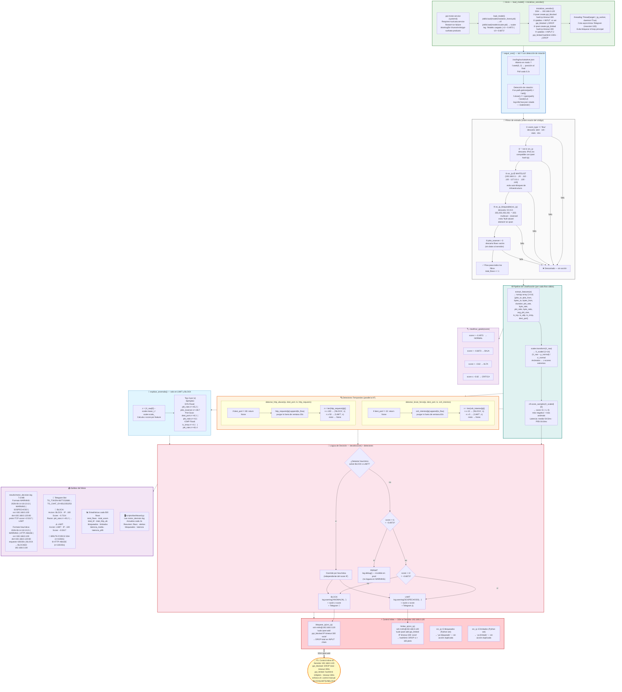
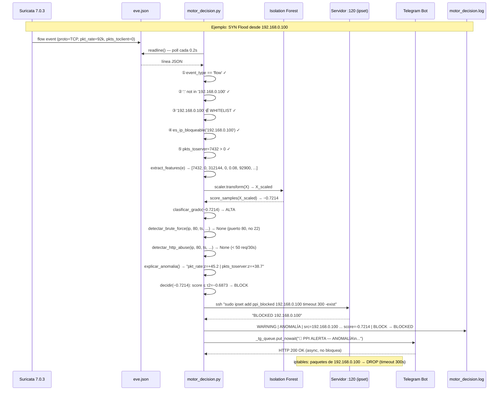
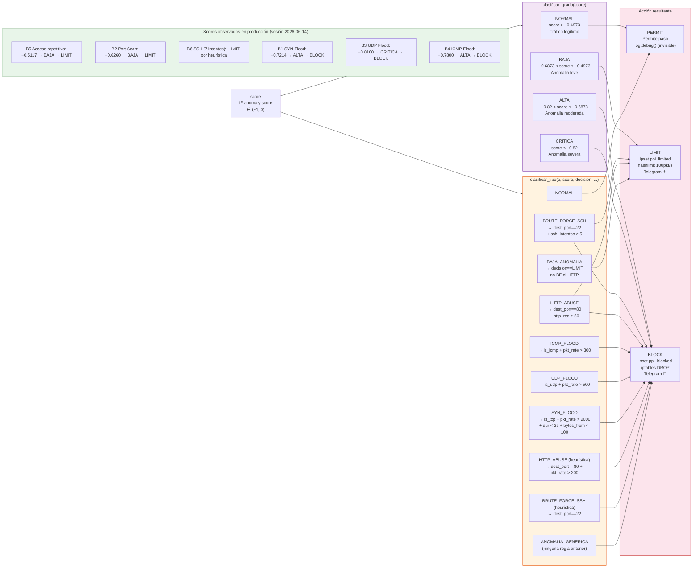
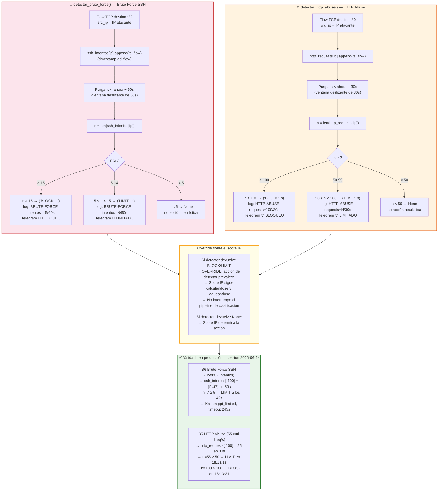
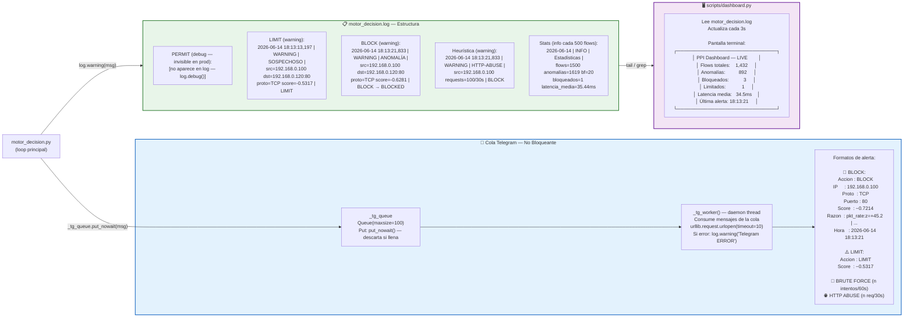
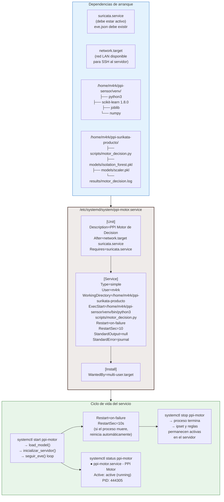
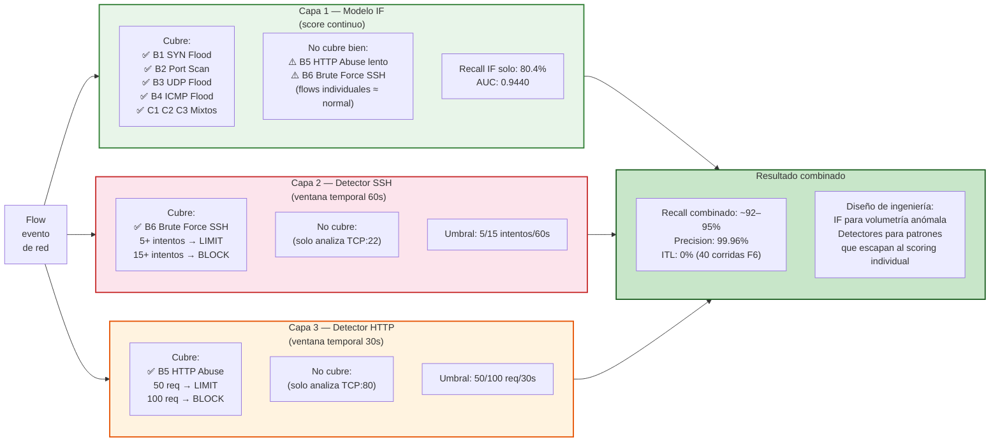

# F4 — Diagrama: Motor de Decisión

**Proyecto:** Sistema de Detección Temprana de Comportamientos Anómalos en Redes de Datos  
**Institución:** Universidad Peruana Unión — PPI 2026  
**Estudiante:** Rubén Mark Salazar Tocas  
**Fase:** F4 — Motor de Decisión (+ F5 Control Inline integrado)  
**Script:** `scripts/motor_decision.py` — 547 líneas  
**Servicio:** `ppi-motor.service` (systemd en sensor 192.168.0.110)  
**Estado:** ✅ En producción — Latencia P95=34.8ms · Telegram activo  

---

## Diagrama 1 — Arquitectura Completa del Motor de Decisión

---

## Diagrama 2 — Flujo de un Flow Individual (Traza Completa)

---

## Diagrama 3 — Sistema de Clasificación: Score → Grado → Tipo → Acción

---

## Diagrama 4 — Detectores Heurísticos: Ventanas Temporales

---

## Diagrama 5 — Telegram + Dashboard: Salidas en Tiempo Real

---

## Diagrama 6 — Servicio systemd y Dependencias

---

## Diagrama 7 — Las 3 Capas de Detección y su Complementariedad

---

## Resumen: Funciones clave de motor_decision.py

| Función | Líneas aprox. | Rol |
|---|---|---|
| `load_model()` | ~5 | Carga pkl con joblib, loguea τ1/τ2 |
| `inicializar_servidor()` | ~20 | SSH al servidor: crea ipsets y reglas iptables |
| `seguir_eve(path)` | ~15 | tail -f con detección de rotación |
| `es_ip_bloqueable(ip)` | ~7 | Filtra IPs inválidas para ipset |
| `extract_features(e)` | ~15 | Construye vector numpy 1×14 |
| `flow_duration(e)` | ~7 | Calcula duración en segundos |
| `decidir(score)` | ~5 | Devuelve PERMIT/LIMIT/BLOCK según τ1/τ2 |
| `clasificar_grado(score)` | ~5 | NORMAL/BAJA/ALTA/CRITICA |
| `clasificar_tipo(...)` | ~25 | Infiere tipo: SYN_FLOOD, BRUTE_FORCE... |
| `detectar_brute_force(...)` | ~15 | Ventana 60s, umbrales 5/15 |
| `detectar_http_abuse(...)` | ~15 | Ventana 30s, umbrales 50/100 |
| `explicar_anomalia(...)` | ~5 | Top-3 z-scores para LIMIT/BLOCK |
| `bloquear_ip(ip)` | ~8 | SSH → ipset add ppi_blocked |
| `limitar_ip(ip)` | ~8 | SSH → ipset add ppi_limited |
| `telegram_alerta(msg)` | ~5 | put_nowait a la cola async |
| `_tg_worker()` | ~12 | Thread daemon: consume cola y envía HTTP |
| `main()` | ~100 | Loop principal de procesamiento |
