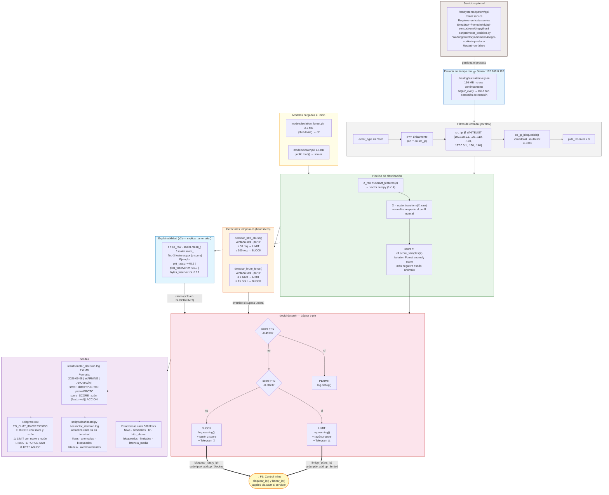

# F4 — Motor de Decisión

**Fecha de ejecución:** 2 – 4 de junio 2026 | **Mejora explainabilidad:** 8 de junio 2026
**Objetivo:** Conectar Suricata con el modelo en tiempo real: leer eve.json, extraer features, clasificar cada flow, explicar la decisión y actuar sobre el tráfico.

---

## Diagrama



---

## Descripción por nodo

### `seguir_eve()` — lectura en tiempo real

```python
# scripts/motor_decision.py — función seguir_eve()
f = open("/var/log/suricata/eve.json", 'r', errors='ignore')
f.seek(0, 2)          # posición al final del archivo
while True:
    line = f.readline()
    if line:
        yield line
    else:
        # Fix rotación: si el archivo fue truncado/rotado por exportar_eve_por_escenario.sh
        if os.path.getsize(path) < f.tell():
            f.close()
            f = open(path, 'r', errors='ignore')
            f.seek(0, 2)
        time.sleep(0.2)
```

---

### Filtros de entrada

Aplicados en este orden antes de clasificar cualquier flow:

| Filtro | Razón |
|---|---|
| `event_type == 'flow'` | Solo flows TCP/UDP/ICMP, no alertas ni stats |
| IPv4 únicamente | Evita IPs IPv6 que no pueden entrar a ipset hash:ip |
| `src_ip ∉ WHITELIST` | Protege Desktop, Sensor, Servidor y pfSense de auto-bloqueo |
| `es_ip_bloqueable()` | Filtra 0.0.0.0, 255.255.255.255, *.*.*.255, multicast — evita error `Null-valued element in hash` de ipset |
| `pkts_toserver > 0` | Elimina flows vacíos sin datos útiles |

---

### Pipeline de clasificación

```python
t_proc_ini = time.time()
X_raw = extract_features(e)          # vector numpy (1×14) con valores originales
X     = scaler.transform(X_raw)      # normalizado respecto a perfil normal
score = clf.score_samples(X)[0]      # anomaly score (negativo)
latencia_ms = (time.time() - t_proc_ini) * 1000
```

**Latencia medida:** media=34.5ms · P95=34.8ms · throughput=29 flows/s

---

### `explicar_anomalia()` — Explainabilidad (v2, 8 jun 2026)

```python
def explicar_anomalia(X_raw, scaler):
    z = (X_raw[0] - scaler.mean_) / (scaler.scale_ + 1e-9)
    ranked = sorted(zip(FEATURES, z), key=lambda x: abs(x[1]), reverse=True)[:3]
    return " | ".join(f"{feat}:z={val:+.1f}" for feat, val in ranked)
```

Se llama **únicamente en ramas BLOCK y LIMIT** (no en PERMIT), sin impacto en la latencia del flujo mayoritario. El `scaler.mean_` es el perfil del tráfico legítimo del Desktop — z-score alto en una feature significa que ese flow se aleja mucho del comportamiento normal entrenado.

**Ejemplos reales por escenario:**

| Escenario | razón típica |
|---|---|
| SYN Flood | `pkt_rate:z=+45.2 \| pkts_toserver:z=+38.7 \| bytes_toserver:z=+12.1` |
| Port Scan | `dest_port:z=+8.3 \| pkt_ratio:z=+6.1 \| duration:z=-4.2` |
| UDP Flood | `pkt_rate:z=+52.1 \| is_udp:z=+3.1 \| bytes_toserver:z=+18.3` |
| ICMP Flood | `is_icmp:z=+4.1 \| pkt_rate:z=+61.4 \| pkts_toserver:z=+55.2` |

---

### Detectores temporales

#### `detectar_brute_force()` — SSH (ventana 60s)

```python
ssh_intentos = defaultdict(list)   # ip → [timestamps]

# Por cada flow TCP destino :22:
ssh_intentos[ip].append(ts_flow)
ssh_intentos[ip] = [t for t in ssh_intentos[ip] if t >= ahora - 60]
n = len(ssh_intentos[ip])
# n >= 5  → LIMIT
# n >= 15 → BLOCK directo (sin esperar al modelo)
```

**Validado en vivo:** 25 intentos SSH simultáneos desde Kali → BLOCK a los 15/60s → alerta Telegram recibida.

#### `detectar_http_abuse()` — HTTP (ventana 30s)

```python
http_requests = defaultdict(list)   # ip → [timestamps]

# Por cada flow TCP destino :80:
http_requests[ip].append(ts_flow)
http_requests[ip] = [t for t in http_requests[ip] if t >= ahora - 30]
n = len(http_requests[ip])
# n >= 50  → LIMIT
# n >= 100 → BLOCK directo
```

**Validado en vivo:** curl en bucle → 100 req/30s → BLOCK + alerta Telegram.

> Los detectores temporales son **override**: si activan BLOCK/LIMIT, la acción se aplica independientemente del score del modelo. El score se sigue calculando y logueando para análisis.

---

### Lógica de decisión triple

| Condición | Acción | ipset | iptables |
|---|---|---|---|
| `score > -0.4973` | PERMIT | — | — |
| `-0.6873 < score ≤ -0.4973` | LIMIT | `ppi_limited` | hashlimit 100pkt/s |
| `score ≤ -0.6873` | BLOCK | `ppi_blocked` | DROP |

Las IPs ya bloqueadas/limitadas no generan acción duplicada — se loguea `(ya bloqueado)` / `(ya limitado)`.

---

### Formato del log — `results/motor_decision.log` (7.6 MB)

```
# Decisión BLOCK con explainabilidad (v2):
2026-06-08 15:30:00,123 | WARNING | ANOMALÍA | src=192.168.0.100 dst=192.168.0.120:80
    proto=TCP score=-0.7214 razón=[pkt_rate:z=+45.2 | pkts_toserver:z=+38.7 | bytes_toserver:z=+12.1] | BLOCK → BLOCKED 192.168.0.100

# Detector temporal:
2026-06-03 18:50:03,237 | WARNING | BRUTE-FORCE | src=192.168.0.100 dst=192.168.0.120:22
    proto=TCP intentos=15/60s | BLOCK → BLOCKED 192.168.0.100

# Estadísticas cada 500 flows:
2026-06-04 20:20:47,297 | INFO | Estadísticas | flows=1500 anomalías=1619 bf=20 http_abuse=403
    bloqueados=1 limitados=0 latencia_media=35.44ms
```

---

### Alertas Telegram — formato actual (v2)

```
🚨 PPI ALERTA — ANOMALÍA
Accion : BLOCK
IP     : 192.168.0.100
Proto  : TCP
Puerto : 80
Score  : -0.7214
Razon  : pkt_rate:z=+45.2 | pkts_toserver:z=+38.7 | bytes_toserver:z=+12.1
Hora   : 2026-06-08 15:30:00
```

---

### `/etc/systemd/system/ppi-motor.service`

```ini
[Unit]
Description=PPI Motor de Decision - Deteccion de Anomalias de Red
After=network.target suricata.service
Requires=suricata.service

[Service]
Type=simple
User=m4rk
WorkingDirectory=/home/m4rk/ppi-surikata-producto
ExecStart=/home/m4rk/ppi-sensor/venv/bin/python3 scripts/motor_decision.py
Restart=on-failure
RestartSec=10
StandardOutput=null
StandardError=journal
```

> **Nota:** el venv Python está en `/home/m4rk/ppi-sensor/venv/` (directorio histórico), mientras que el código y datos están en `/home/m4rk/ppi-surikata-producto/`. Ambos directorios coexisten en el sensor.

---

## Conector → F5

Las funciones `bloquear_ip()` y `limitar_ip()` del motor se comunican con el servidor vía SSH:

```python
def bloquear_ip(ip):
    _ssh(f'sudo ipset add ppi_blocked {ip} timeout 300 -exist && echo "BLOCKED {ip}"')

def limitar_ip(ip):
    _ssh(f'sudo ipset add ppi_limited {ip} timeout 300 -exist && echo "LIMITED {ip}"')

def _ssh(cmd):
    subprocess.run(['ssh', '-o', 'StrictHostKeyChecking=no',
                    '-o', 'ConnectTimeout=5', 'm4rk@192.168.0.120', cmd], ...)
```

Los sets `ppi_blocked` y `ppi_limited` están configurados en el servidor `192.168.0.120` — eso es el contenido de F5.
