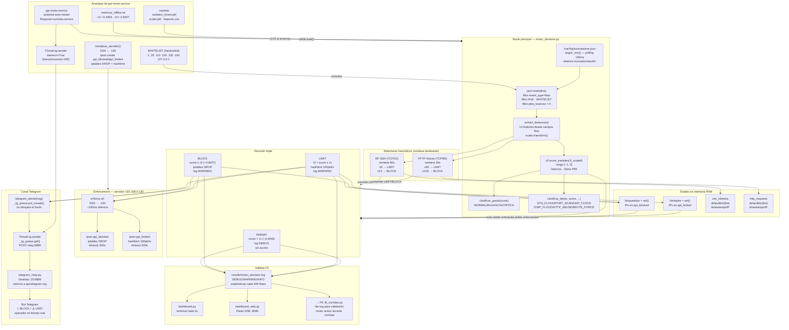

# F4 — Diagrama: Motor de Decisión en Tiempo Real

**Instrucciones Draw.io:** Extras → Edit Diagram → pegar XML → OK

---

## Diagrama Mermaid (flujo completo)



---

## Tabla de componentes

| Componente | Tipo | Ruta/Destino | Descripción |
|---|---|---|---|
| `motor_decision.py` | Script Python | `scripts/motor_decision.py` | Bucle principal: 558 líneas, bucle infinito sobre eve.json |
| `seguir_eve()` | Función | motor_decision.py:226 | tail -f con detección de truncado (polling 100ms) |
| `extract_features()` | Función | motor_decision.py:143 | Extrae las 14 features de un dict flow de eve.json |
| `detectar_brute_force()` | Función | motor_decision.py:329 | Ventana deslizante 60s, conteo por IP |
| `detectar_http_abuse()` | Función | motor_decision.py:308 | Ventana deslizante 30s, conteo por IP |
| `clasificar_grado()` | Función | motor_decision.py:261 | NORMAL/BAJA/ALTA/CRITICA según score |
| `clasificar_tipo()` | Función | motor_decision.py:269 | Nombre del ataque según features + heurísticos |
| `inicializar_servidor()` | Función | motor_decision.py:196 | Crea ipsets y reglas iptables al arrancar |
| `bloquear_ip()` | Función | motor_decision.py:174 | `_ssh("sudo ipset add ppi_blocked ...")` |
| `limitar_ip()` | Función | motor_decision.py:185 | `_ssh("sudo ipset add ppi_limited ...")` |
| `enforce.sh` | Script bash | `scripts/enforce.sh` | Control manual: BLOCK \| LIMIT \| UNBLOCK |
| `telegram_alerta()` | Función | motor_decision.py:108 | Encola mensaje en `_tg_queue` (no bloquea) |
| `_tg_worker()` | Thread daemon | motor_decision.py:93 | Consume la queue, POST al relay |
| `telegram_relay.py` | Script Python | `/home/m4rk/Descargas/` en Desktop | Relay HTTP:8889 → api.telegram.org |
| `motor_decision.log` | Log | `results/motor_decision.log` | Registro de todas las decisiones |
| `ppi_blocked` | ipset | Servidor .120 | hash:ip, timeout 300s → iptables DROP |
| `ppi_limited` | ipset | Servidor .120 | hash:ip, timeout 300s → hashlimit 100pkt/s |
| `ppi-motor.service` | systemd | `/etc/systemd/system/` | Type=simple, Restart=on-failure, RestartSec=10 |

---

## Constantes clave del motor

| Constante | Valor | Descripción |
|---|---|---|
| `TAU1` | −0.4459 | Umbral PERMIT/LIMIT — índice de Youden |
| `TAU2` | −0.6027 | Umbral LIMIT/BLOCK — FPR≤2% |
| `TIMEOUT_SEC` | 300 | Segundos que duran los bloqueos en ipset |
| `BF_VENTANA_SEG` | 60 | Ventana de observación para Brute Force SSH |
| `BF_UMBRAL_LIMIT` | 5 | Intentos SSH en 60s → LIMIT |
| `BF_UMBRAL_BLOCK` | 15 | Intentos SSH en 60s → BLOCK |
| `HTTP_VENTANA_SEG` | 30 | Ventana de observación para HTTP Abuse |
| `HTTP_UMBRAL_LIMIT` | 50 | Requests HTTP en 30s → LIMIT |
| `HTTP_UMBRAL_BLOCK` | 100 | Requests HTTP en 30s → BLOCK |
| `EVE_PATH` | `/var/log/suricata/eve.json` | Archivo monitoreado |
| `SERVIDOR` | `192.168.0.120` | Destino de todos los comandos SSH de enforcement |
| `TG_RELAY` | `http://192.168.0.20:8889/telegram` | Endpoint del relay Telegram |

---

## Diagrama Draw.io (XML)

```xml
<?xml version="1.0" encoding="UTF-8"?>
<mxGraphModel dx="1422" dy="762" grid="1" gridSize="10" guides="1"
  tooltips="1" connect="1" arrows="1" fold="1" page="0"
  pageScale="1" pageWidth="1900" pageHeight="1200" math="0" shadow="0">
  <root>
    <mxCell id="0"/><mxCell id="1" parent="0"/>

    <!-- TÍTULO -->
    <mxCell id="title" value="F4 — Motor de Decisión en Tiempo Real (motor_decision.py · 558 líneas)  |  PPI UPeU 2026"
      style="text;html=1;strokeColor=none;fillColor=#002060;fontColor=#ffffff;
             align=center;verticalAlign=middle;fontSize=13;fontStyle=1;rounded=1;"
      vertex="1" parent="1">
      <mxGeometry x="40" y="12" width="1820" height="38" as="geometry"/>
    </mxCell>

    <!-- ══ ARRANQUE ══ -->
    <mxCell id="met" value="&lt;b&gt;metricas_offline.txt&lt;/b&gt;&lt;br/&gt;τ1=−0.4459 · τ2=−0.6027&lt;br/&gt;leído al arrancar"
      style="rounded=1;whiteSpace=wrap;html=1;fillColor=#FF6600;strokeColor=#CC4400;
             fontColor=#ffffff;fontSize=10;fontStyle=1;"
      vertex="1" parent="1"><mxGeometry x="40" y="70" width="185" height="65" as="geometry"/></mxCell>

    <mxCell id="pkl" value="models/&lt;br/&gt;isolation_forest.pkl&lt;br/&gt;scaler.pkl · features.csv&lt;br/&gt;joblib.load() al arrancar"
      style="rounded=1;whiteSpace=wrap;html=1;fillColor=#fff2cc;strokeColor=#d6b656;fontSize=10;"
      vertex="1" parent="1"><mxGeometry x="240" y="70" width="185" height="65" as="geometry"/></mxCell>

    <mxCell id="svc" value="&lt;b&gt;ppi-motor.service&lt;/b&gt;&lt;br/&gt;Type=simple&lt;br/&gt;Restart=on-failure&lt;br/&gt;RestartSec=10"
      style="rounded=1;whiteSpace=wrap;html=1;fillColor=#f5f5f5;strokeColor=#666;fontSize=10;"
      vertex="1" parent="1"><mxGeometry x="440" y="70" width="175" height="65" as="geometry"/></mxCell>

    <mxCell id="wl" value="&lt;b&gt;WHITELIST&lt;/b&gt;&lt;br/&gt;.1 .20 .110 .120 .130 .140&lt;br/&gt;127.0.0.1&lt;br/&gt;nunca se evalúan"
      style="rounded=1;whiteSpace=wrap;html=1;fillColor=#e6f3ff;strokeColor=#4488aa;fontSize=10;"
      vertex="1" parent="1"><mxGeometry x="630" y="70" width="185" height="65" as="geometry"/></mxCell>

    <mxCell id="init" value="inicializar_servidor()&lt;br/&gt;SSH → .120&lt;br/&gt;ipset create ppi_blocked/limited&lt;br/&gt;iptables DROP + hashlimit"
      style="rounded=1;whiteSpace=wrap;html=1;fillColor=#dae8fc;strokeColor=#6c8ebf;fontSize=10;"
      vertex="1" parent="1"><mxGeometry x="830" y="70" width="210" height="65" as="geometry"/></mxCell>

    <mxCell id="tgt" value="Thread &lt;b&gt;tg-sender&lt;/b&gt;&lt;br/&gt;daemon=True&lt;br/&gt;Queue(maxsize=100)"
      style="rounded=1;whiteSpace=wrap;html=1;fillColor=#2AABEE;strokeColor=#1a8abc;
             fontColor=#fff;fontSize=10;"
      vertex="1" parent="1"><mxGeometry x="1060" y="70" width="175" height="65" as="geometry"/></mxCell>

    <!-- ══ EVE.JSON ══ -->
    <mxCell id="eve" value="&lt;b&gt;/var/log/suricata/eve.json&lt;/b&gt;&lt;br/&gt;seguir_eve() — polling 100ms&lt;br/&gt;detecta truncado: getsize() &lt; tell()&lt;br/&gt;→ seek(0) si rotado"
      style="shape=cylinder3;whiteSpace=wrap;html=1;boundedLbl=1;backgroundOutline=1;size=12;
             fillColor=#dae8fc;strokeColor=#6c8ebf;fontSize=10;"
      vertex="1" parent="1"><mxGeometry x="40" y="210" width="210" height="110" as="geometry"/></mxCell>

    <!-- ══ FILTROS ══ -->
    <mxCell id="filt" value="&lt;b&gt;Filtros de entrada&lt;/b&gt;&lt;br/&gt;event_type == 'flow'?&lt;br/&gt;':' in src_ip? (IPv6 → skip)&lt;br/&gt;src_ip in WHITELIST? (→ skip)&lt;br/&gt;pkts_toserver &gt; 0? (→ skip si 0)"
      style="rounded=1;whiteSpace=wrap;html=1;fillColor=#f5f5f5;strokeColor=#666;fontSize=10;align=left;spacingLeft=6;"
      vertex="1" parent="1"><mxGeometry x="290" y="215" width="240" height="100" as="geometry"/></mxCell>

    <!-- ══ FEATURES ══ -->
    <mxCell id="feat" value="&lt;b&gt;extract_features(e)&lt;/b&gt;&lt;br/&gt;14 features del dict flow&lt;br/&gt;scaler.transform([features])&lt;br/&gt;→ X_scaled (1×14)"
      style="rounded=1;whiteSpace=wrap;html=1;fillColor=#dae8fc;strokeColor=#6c8ebf;fontSize=10;"
      vertex="1" parent="1"><mxGeometry x="570" y="215" width="210" height="100" as="geometry"/></mxCell>

    <!-- ══ SCORE ══ -->
    <mxCell id="score" value="&lt;b&gt;clf.score_samples(X_scaled)&lt;/b&gt;&lt;br/&gt;score ∈ [−1, 0]&lt;br/&gt;latencia: ~34ms P95&lt;br/&gt;mide 'dificultad de aislar'"
      style="rounded=1;whiteSpace=wrap;html=1;fillColor=#002060;strokeColor=#001030;
             fontColor=#ffffff;fontSize=10;"
      vertex="1" parent="1"><mxGeometry x="820" y="215" width="210" height="100" as="geometry"/></mxCell>

    <!-- ══ HEURÍSTICOS ══ -->
    <mxCell id="bf" value="&lt;b&gt;BF-SSH detector&lt;/b&gt; (TCP/22)&lt;br/&gt;ventana 60s&lt;br/&gt;≥5 intentos → LIMIT&lt;br/&gt;≥15 intentos → BLOCK&lt;br/&gt;ssh_intentos[ip] = [t1,t2...]"
      style="rounded=1;whiteSpace=wrap;html=1;fillColor=#e1d5e7;strokeColor=#9673a6;fontSize=10;"
      vertex="1" parent="1"><mxGeometry x="290" y="360" width="220" height="100" as="geometry"/></mxCell>

    <mxCell id="http" value="&lt;b&gt;HTTP-Abuse detector&lt;/b&gt; (TCP/80)&lt;br/&gt;ventana 30s&lt;br/&gt;≥50 requests → LIMIT&lt;br/&gt;≥100 requests → BLOCK&lt;br/&gt;http_requests[ip] = [t1,t2...]"
      style="rounded=1;whiteSpace=wrap;html=1;fillColor=#e1d5e7;strokeColor=#9673a6;fontSize=10;"
      vertex="1" parent="1"><mxGeometry x="530" y="360" width="230" height="100" as="geometry"/></mxCell>

    <!-- ══ DECISIONES ══ -->
    <mxCell id="permit" value="&lt;b&gt;PERMIT&lt;/b&gt;&lt;br/&gt;score &gt; τ1 (−0.4459)&lt;br/&gt;log DEBUG&lt;br/&gt;sin acción de red"
      style="rounded=1;whiteSpace=wrap;html=1;fillColor=#d5e8d4;strokeColor=#82b366;fontSize=11;fontStyle=1;"
      vertex="1" parent="1"><mxGeometry x="1080" y="195" width="160" height="80" as="geometry"/></mxCell>

    <mxCell id="limitd" value="&lt;b&gt;LIMIT&lt;/b&gt;&lt;br/&gt;τ2 &lt; score ≤ τ1&lt;br/&gt;hashlimit 100 pkt/s&lt;br/&gt;log WARNING"
      style="rounded=1;whiteSpace=wrap;html=1;fillColor=#ffe6cc;strokeColor=#d6790a;fontSize=11;fontStyle=1;"
      vertex="1" parent="1"><mxGeometry x="1080" y="295" width="160" height="80" as="geometry"/></mxCell>

    <mxCell id="blockd" value="&lt;b&gt;BLOCK&lt;/b&gt;&lt;br/&gt;score ≤ τ2 (−0.6027)&lt;br/&gt;iptables DROP&lt;br/&gt;log WARNING"
      style="rounded=1;whiteSpace=wrap;html=1;fillColor=#f8cecc;strokeColor=#b85450;fontSize=11;fontStyle=1;"
      vertex="1" parent="1"><mxGeometry x="1080" y="395" width="160" height="80" as="geometry"/></mxCell>

    <!-- ══ MEMORIA ══ -->
    <mxCell id="mem_bg" value=""
      style="rounded=1;whiteSpace=wrap;html=1;fillColor=#f9f9f9;strokeColor=#aaa;"
      vertex="1" parent="1"><mxGeometry x="40" y="370" width="230" height="120" as="geometry"/></mxCell>
    <mxCell id="mem_hdr" value="&lt;b&gt;Estado en RAM (se pierde al reiniciar)&lt;/b&gt;"
      style="text;html=1;strokeColor=none;fillColor=#ccc;align=center;fontSize=9;fontStyle=1;rounded=1;"
      vertex="1" parent="1"><mxGeometry x="40" y="370" width="230" height="20" as="geometry"/></mxCell>
    <mxCell id="mem_det" value="bloqueados = set()&lt;br/&gt;limitados  = set()&lt;br/&gt;ssh_intentos  = defaultdict(list)&lt;br/&gt;http_requests = defaultdict(list)&lt;br/&gt;total_flows, latencias_ms..."
      style="text;html=1;strokeColor=none;fillColor=none;align=left;fontSize=9;spacingLeft=6;"
      vertex="1" parent="1"><mxGeometry x="40" y="392" width="230" height="95" as="geometry"/></mxCell>

    <!-- ══ ENFORCE ══ -->
    <mxCell id="enf" value="&lt;b&gt;enforce.sh&lt;/b&gt;&lt;br/&gt;SSH → m4rk@192.168.0.120&lt;br/&gt;~100ms latencia&lt;br/&gt;sudo ipset add/del"
      style="rounded=1;whiteSpace=wrap;html=1;fillColor=#dae8fc;strokeColor=#6c8ebf;fontSize=10;"
      vertex="1" parent="1"><mxGeometry x="1300" y="320" width="190" height="80" as="geometry"/></mxCell>

    <!-- ══ SERVIDOR .120 ══ -->
    <mxCell id="srv_bg" value=""
      style="rounded=1;whiteSpace=wrap;html=1;fillColor=#f5f5f5;strokeColor=#666;"
      vertex="1" parent="1"><mxGeometry x="1540" y="250" width="280" height="220" as="geometry"/></mxCell>
    <mxCell id="srv_hdr" value="&lt;b&gt;Servidor 192.168.0.120&lt;/b&gt;&lt;br/&gt;nginx:80 · SSH:22"
      style="text;html=1;strokeColor=none;fillColor=#666;fontColor=#fff;align=center;fontSize=10;fontStyle=1;rounded=1;"
      vertex="1" parent="1"><mxGeometry x="1540" y="250" width="280" height="28" as="geometry"/></mxCell>

    <mxCell id="ipbl" value="&lt;b&gt;ipset ppi_blocked&lt;/b&gt;&lt;br/&gt;hash:ip timeout 300s&lt;br/&gt;iptables -j DROP&lt;br/&gt;auto-expira en 300s"
      style="rounded=1;whiteSpace=wrap;html=1;fillColor=#f8cecc;strokeColor=#b85450;fontSize=10;"
      vertex="1" parent="1"><mxGeometry x="1555" y="286" width="245" height="75" as="geometry"/></mxCell>

    <mxCell id="iplt" value="&lt;b&gt;ipset ppi_limited&lt;/b&gt;&lt;br/&gt;hash:ip timeout 300s&lt;br/&gt;hashlimit 100pkt/s&lt;br/&gt;auto-expira en 300s"
      style="rounded=1;whiteSpace=wrap;html=1;fillColor=#ffe6cc;strokeColor=#d6790a;fontSize=10;"
      vertex="1" parent="1"><mxGeometry x="1555" y="375" width="245" height="75" as="geometry"/></mxCell>

    <!-- ══ TELEGRAM ══ -->
    <mxCell id="tg1" value="telegram_alerta(msg)&lt;br/&gt;_tg_queue.put_nowait()&lt;br/&gt;&lt;i&gt;no bloquea el bucle&lt;/i&gt;"
      style="rounded=1;whiteSpace=wrap;html=1;fillColor=#2AABEE;strokeColor=#1a8abc;
             fontColor=#fff;fontSize=10;"
      vertex="1" parent="1"><mxGeometry x="1300" y="460" width="200" height="65" as="geometry"/></mxCell>

    <mxCell id="tg2" value="Thread tg-sender&lt;br/&gt;_tg_queue.get()&lt;br/&gt;POST relay:8889"
      style="rounded=1;whiteSpace=wrap;html=1;fillColor=#2AABEE;strokeColor=#1a8abc;
             fontColor=#fff;fontSize=10;"
      vertex="1" parent="1"><mxGeometry x="1300" y="545" width="200" height="65" as="geometry"/></mxCell>

    <mxCell id="rel" value="telegram_relay.py&lt;br/&gt;Desktop .20:8889&lt;br/&gt;POST → api.telegram.org"
      style="rounded=1;whiteSpace=wrap;html=1;fillColor=#dae8fc;strokeColor=#6c8ebf;fontSize=10;"
      vertex="1" parent="1"><mxGeometry x="1300" y="630" width="200" height="65" as="geometry"/></mxCell>

    <mxCell id="bot" value="🚨 Bot Telegram&lt;br/&gt;Operador recibe alerta&lt;br/&gt;&lt; 5s desde detección"
      style="rounded=1;whiteSpace=wrap;html=1;fillColor=#2AABEE;strokeColor=#1a8abc;
             fontColor=#fff;fontSize=10;fontStyle=1;"
      vertex="1" parent="1"><mxGeometry x="1300" y="715" width="200" height="65" as="geometry"/></mxCell>

    <!-- ══ LOG + DASHBOARDS ══ -->
    <mxCell id="log" value="&lt;b&gt;motor_decision.log&lt;/b&gt;&lt;br/&gt;WARNING: LIMIT/BLOCK&lt;br/&gt;INFO: stats cada 500 flows&lt;br/&gt;DEBUG: PERMIT (silent)"
      style="shape=cylinder3;whiteSpace=wrap;html=1;boundedLbl=1;backgroundOutline=1;size=10;
             fillColor=#fff2cc;strokeColor=#d6b656;fontSize=10;"
      vertex="1" parent="1"><mxGeometry x="40" y="530" width="210" height="100" as="geometry"/></mxCell>

    <mxCell id="dash" value="dashboard.py&lt;br/&gt;terminal cada 3s"
      style="rounded=1;whiteSpace=wrap;html=1;fillColor=#d5e8d4;strokeColor=#82b366;fontSize=10;"
      vertex="1" parent="1"><mxGeometry x="270" y="530" width="155" height="60" as="geometry"/></mxCell>

    <mxCell id="dashw" value="dashboard_web.py&lt;br/&gt;Flask+SSE :8080&lt;br/&gt;http://.110:8080"
      style="rounded=1;whiteSpace=wrap;html=1;fillColor=#d5e8d4;strokeColor=#82b366;fontSize=10;"
      vertex="1" parent="1"><mxGeometry x="440" y="530" width="165" height="60" as="geometry"/></mxCell>

    <mxCell id="f6" value="→ F6: f6_corridas.py&lt;br/&gt;motor activo durante&lt;br/&gt;las 40 corridas"
      style="rounded=1;whiteSpace=wrap;html=1;fillColor=#002060;strokeColor=#001030;
             fontColor=#fff;fontSize=10;"
      vertex="1" parent="1"><mxGeometry x="270" y="610" width="165" height="65" as="geometry"/></mxCell>

    <!-- ══ CONECTORES ══ -->
    <mxCell id="e1" value="τ1/τ2" style="edgeStyle=orthogonalEdgeStyle;strokeColor=#CC4400;strokeWidth=2;fontSize=9;" edge="1" source="met" target="score" parent="1"><mxGeometry relative="1" as="geometry"/></mxCell>
    <mxCell id="e2" value="modelos" style="edgeStyle=orthogonalEdgeStyle;strokeColor=#d6b656;strokeWidth=2;fontSize=9;" edge="1" source="pkl" target="feat" parent="1"><mxGeometry relative="1" as="geometry"/></mxCell>
    <mxCell id="e3" value="inicia" style="edgeStyle=orthogonalEdgeStyle;dashed=1;strokeColor=#666;fontSize=9;" edge="1" source="svc" target="eve" parent="1"><mxGeometry relative="1" as="geometry"/></mxCell>
    <mxCell id="e4" value="init" style="edgeStyle=orthogonalEdgeStyle;strokeColor=#6c8ebf;fontSize=9;" edge="1" source="init" target="srv_bg" parent="1"><mxGeometry relative="1" as="geometry"/></mxCell>
    <mxCell id="e5" value="" style="edgeStyle=orthogonalEdgeStyle;strokeColor=#6c8ebf;fontSize=9;" edge="1" source="eve" target="filt" parent="1"><mxGeometry relative="1" as="geometry"/></mxCell>
    <mxCell id="e6" value="" style="edgeStyle=orthogonalEdgeStyle;" edge="1" source="filt" target="feat" parent="1"><mxGeometry relative="1" as="geometry"/></mxCell>
    <mxCell id="e7" value=".transform()" style="edgeStyle=orthogonalEdgeStyle;strokeColor=#002060;strokeWidth=2;fontSize=9;" edge="1" source="feat" target="score" parent="1"><mxGeometry relative="1" as="geometry"/></mxCell>
    <mxCell id="e8" value="score" style="edgeStyle=orthogonalEdgeStyle;strokeColor=#d5e8d4;strokeWidth=2;fontSize=9;" edge="1" source="score" target="permit" parent="1"><mxGeometry relative="1" as="geometry"/></mxCell>
    <mxCell id="e9" value="" style="edgeStyle=orthogonalEdgeStyle;strokeColor=#d6790a;strokeWidth=2;" edge="1" source="score" target="limitd" parent="1"><mxGeometry relative="1" as="geometry"/></mxCell>
    <mxCell id="e10" value="" style="edgeStyle=orthogonalEdgeStyle;strokeColor=#b85450;strokeWidth=2;" edge="1" source="score" target="blockd" parent="1"><mxGeometry relative="1" as="geometry"/></mxCell>
    <mxCell id="e11" value="override" style="edgeStyle=orthogonalEdgeStyle;strokeColor=#9673a6;strokeWidth=2;fontSize=9;" edge="1" source="bf" target="limitd" parent="1"><mxGeometry relative="1" as="geometry"/></mxCell>
    <mxCell id="e12" value="override" style="edgeStyle=orthogonalEdgeStyle;strokeColor=#9673a6;strokeWidth=2;fontSize=9;" edge="1" source="http" target="blockd" parent="1"><mxGeometry relative="1" as="geometry"/></mxCell>
    <mxCell id="e13" value="" style="edgeStyle=orthogonalEdgeStyle;strokeColor=#d6790a;" edge="1" source="limitd" target="enf" parent="1"><mxGeometry relative="1" as="geometry"/></mxCell>
    <mxCell id="e14" value="" style="edgeStyle=orthogonalEdgeStyle;strokeColor=#b85450;" edge="1" source="blockd" target="enf" parent="1"><mxGeometry relative="1" as="geometry"/></mxCell>
    <mxCell id="e15" value="ipset add ppi_limited" style="edgeStyle=orthogonalEdgeStyle;strokeColor=#d6790a;fontSize=9;" edge="1" source="enf" target="iplt" parent="1"><mxGeometry relative="1" as="geometry"/></mxCell>
    <mxCell id="e16" value="ipset add ppi_blocked" style="edgeStyle=orthogonalEdgeStyle;strokeColor=#b85450;fontSize=9;" edge="1" source="enf" target="ipbl" parent="1"><mxGeometry relative="1" as="geometry"/></mxCell>
    <mxCell id="e17" value="LIMIT/BLOCK" style="edgeStyle=orthogonalEdgeStyle;strokeColor=#2AABEE;strokeWidth=2;fontSize=9;" edge="1" source="blockd" target="tg1" parent="1"><mxGeometry relative="1" as="geometry"/></mxCell>
    <mxCell id="e18" value="" style="edgeStyle=orthogonalEdgeStyle;strokeColor=#2AABEE;" edge="1" source="tg1" target="tg2" parent="1"><mxGeometry relative="1" as="geometry"/></mxCell>
    <mxCell id="e19" value="POST JSON" style="edgeStyle=orthogonalEdgeStyle;strokeColor=#6c8ebf;dashed=1;fontSize=9;" edge="1" source="tg2" target="rel" parent="1"><mxGeometry relative="1" as="geometry"/></mxCell>
    <mxCell id="e20" value="HTTPS" style="edgeStyle=orthogonalEdgeStyle;dashed=1;fontSize=9;" edge="1" source="rel" target="bot" parent="1"><mxGeometry relative="1" as="geometry"/></mxCell>
    <mxCell id="e21" value="escribe" style="edgeStyle=orthogonalEdgeStyle;strokeColor=#d6b656;fontSize=9;" edge="1" source="score" target="log" parent="1"><mxGeometry relative="1" as="geometry"/></mxCell>
    <mxCell id="e22" value="" style="edgeStyle=orthogonalEdgeStyle;" edge="1" source="log" target="dash" parent="1"><mxGeometry relative="1" as="geometry"/></mxCell>
    <mxCell id="e23" value="" style="edgeStyle=orthogonalEdgeStyle;" edge="1" source="log" target="dashw" parent="1"><mxGeometry relative="1" as="geometry"/></mxCell>
    <mxCell id="e24" value="" style="edgeStyle=orthogonalEdgeStyle;strokeColor=#002060;" edge="1" source="log" target="f6" parent="1"><mxGeometry relative="1" as="geometry"/></mxCell>
    <mxCell id="e25" value="consulta" style="edgeStyle=orthogonalEdgeStyle;dashed=1;strokeColor=#4488aa;fontSize=9;" edge="1" source="wl" target="filt" parent="1"><mxGeometry relative="1" as="geometry"/></mxCell>
    <mxCell id="e26" value="feeds" style="edgeStyle=orthogonalEdgeStyle;strokeColor=#9673a6;fontSize=9;" edge="1" source="feat" target="bf" parent="1"><mxGeometry relative="1" as="geometry"/></mxCell>
    <mxCell id="e27" value="feeds" style="edgeStyle=orthogonalEdgeStyle;strokeColor=#9673a6;fontSize=9;" edge="1" source="feat" target="http" parent="1"><mxGeometry relative="1" as="geometry"/></mxCell>
    <mxCell id="e28" value="daemon" style="edgeStyle=orthogonalEdgeStyle;strokeColor=#2AABEE;dashed=1;fontSize=9;" edge="1" source="tgt" target="tg2" parent="1"><mxGeometry relative="1" as="geometry"/></mxCell>

    <!-- LEYENDA -->
    <mxCell id="leg" value="" style="rounded=1;whiteSpace=wrap;html=1;fillColor=#f9f9f9;strokeColor=#ccc;"
      vertex="1" parent="1"><mxGeometry x="40" y="790" width="1580" height="48" as="geometry"/></mxCell>
    <mxCell id="l1" value="PERMIT (normal)" style="rounded=1;html=1;fillColor=#d5e8d4;strokeColor=#82b366;fontSize=9;" vertex="1" parent="1"><mxGeometry x="55" y="804" width="145" height="26" as="geometry"/></mxCell>
    <mxCell id="l2" value="LIMIT (sospechoso)" style="rounded=1;html=1;fillColor=#ffe6cc;strokeColor=#d6790a;fontSize=9;" vertex="1" parent="1"><mxGeometry x="210" y="804" width="145" height="26" as="geometry"/></mxCell>
    <mxCell id="l3" value="BLOCK (anómalo)" style="rounded=1;html=1;fillColor=#f8cecc;strokeColor=#b85450;fontSize=9;" vertex="1" parent="1"><mxGeometry x="365" y="804" width="145" height="26" as="geometry"/></mxCell>
    <mxCell id="l4" value="Scripts Python" style="rounded=1;html=1;fillColor=#dae8fc;strokeColor=#6c8ebf;fontSize=9;" vertex="1" parent="1"><mxGeometry x="520" y="804" width="135" height="26" as="geometry"/></mxCell>
    <mxCell id="l5" value="Heurísticos" style="rounded=1;html=1;fillColor=#e1d5e7;strokeColor=#9673a6;fontSize=9;" vertex="1" parent="1"><mxGeometry x="665" y="804" width="115" height="26" as="geometry"/></mxCell>
    <mxCell id="l6" value="Telegram / Canal alertas" style="rounded=1;html=1;fillColor=#2AABEE;strokeColor=#1a8abc;fontColor=#fff;fontSize=9;" vertex="1" parent="1"><mxGeometry x="790" y="804" width="175" height="26" as="geometry"/></mxCell>
    <mxCell id="l7" value="ipset en servidor .120" style="rounded=1;html=1;fillColor=#f8cecc;strokeColor=#b85450;fontSize=9;" vertex="1" parent="1"><mxGeometry x="975" y="804" width="155" height="26" as="geometry"/></mxCell>
    <mxCell id="l8" value="Fuente única de verdad" style="rounded=1;html=1;fillColor=#FF6600;strokeColor=#CC4400;fontColor=#fff;fontSize=9;" vertex="1" parent="1"><mxGeometry x="1140" y="804" width="165" height="26" as="geometry"/></mxCell>
    <mxCell id="l9" value="Log / Artefactos" style="rounded=1;html=1;fillColor=#fff2cc;strokeColor=#d6b656;fontSize=9;" vertex="1" parent="1"><mxGeometry x="1315" y="804" width="135" height="26" as="geometry"/></mxCell>
    <mxCell id="l10" value="→ F6 / F5" style="rounded=1;html=1;fillColor=#002060;strokeColor=#001030;fontColor=#fff;fontSize=9;" vertex="1" parent="1"><mxGeometry x="1460" y="804" width="115" height="26" as="geometry"/></mxCell>

  </root>
</mxGraphModel>
```
