# F4 — Diagrama: Motor de Decisión en Tiempo Real

**Detección temprana de comportamientos anómalos en redes de datos mediante aprendizaje automático y un mecanismo de control en tiempo real**
PPI · Universidad Peruana Unión · 2026
Archivo: `scripts/motor_decision.py` · 616 líneas · Servicio: `ppi-motor.service`

> **v2 — 2026-06-19:** corregido orden de procesamiento (score IF antes que heurísticos),
> eliminado enforce.sh del flujo del motor (es control manual), añadidos FIX-04 (dedup Telegram),
> FIX-05 (pre-alerta tendencia), FIX-02 (byte_ratio/pkt_rate en alertas), es_ip_bloqueable().

---

## Diagrama Mermaid — Flujo completo corregido

```mermaid
flowchart TD
    classDef arranque fill:#FEF9C3,stroke:#CA8A04,color:#713F12
    classDef proceso  fill:#D1FAE5,stroke:#059669,color:#065F46
    classDef decision fill:#E0F2FE,stroke:#0284C7,color:#0C4A6E
    classDef heur     fill:#F3E8FF,stroke:#7C3AED,color:#3B0764
    classDef permit   fill:#BBF7D0,stroke:#16A34A,color:#14532D
    classDef limit    fill:#FED7AA,stroke:#EA580C,color:#7C2D12
    classDef block    fill:#FEE2E2,stroke:#DC2626,color:#7F1D1D
    classDef ram      fill:#F1F5F9,stroke:#64748B,color:#1E293B
    classDef salida   fill:#EDE9FE,stroke:#7C3AED,color:#3B0764
    classDef tg       fill:#DBEAFE,stroke:#2563EB,color:#1E3A5F

    %% ══ ARRANQUE ════════════════════════════════════════════════
    subgraph STARTUP["⚡ Arranque — ppi-motor.service"]
        direction LR
        MET[("📄 metricas_offline.txt\nτ1=−0.4459 · τ2=−0.6027\nleído al iniciar")]:::arranque
        PKL[("📦 isolation_forest.pkl\nscaler.pkl\njoblib.load()")]:::arranque
        WL["🛡️ WHITELIST\n.1 .20 .110 .120\n.130 .140 127.0.0.1"]:::arranque
        INIT["🔧 inicializar_servidor()\nSSH → .120\nipset create ppi_blocked/limited\niptables DROP + hashlimit"]:::arranque
        TGT["📨 Thread tg-sender\ndaemon=True\nQueue(maxsize=100)"]:::arranque
    end

    %% ══ ENTRADA ═════════════════════════════════════════════════
    EVE[("📜 /var/log/suricata/eve.json\nSuricata 7.0.3 — live")]:::proceso

    STARTUP --> EVE

    EVE --> TAIL
    TAIL["👁️ seguir_eve()\npolling 100 ms\ndetecta truncado/rotación"]:::proceso
    TAIL --> F1

    %% ══ FILTROS DE ENTRADA ═══════════════════════════════════════
    F1{"🔍 ¿event_type = 'flow'?\n¿src_ip IPv4?\n¿pkts_toserver > 0?"}:::decision
    F1 -->|"❌ No cumple"| TAIL
    F1 -->|"✅ Sí"| F2

    F2{"🛡️ ¿src_ip\nen WHITELIST?"}:::decision
    F2 -->|"✅ Sí — IP exenta"| P_WL["✅ PERMIT\nwhitelisted · sin evaluar"]:::permit
    F2 -->|"❌ No"| F3
    P_WL --> LOG

    F3{"🔒 es_ip_bloqueable()\n¿multicast / reserved\n/ broadcast?"}:::decision
    F3 -->|"❌ IP no bloqueable"| TAIL
    F3 -->|"✅ IP válida"| FEAT

    %% ══ ISOLATION FOREST (SIEMPRE PRIMERO) ══════════════════════
    FEAT["⚙️ extract_features(e)\n14 features del flow\npkts · bytes · duration\nratios · proto · port"]:::proceso
    FEAT --> SCALE

    SCALE["📊 scaler.transform(X)\nStandardScaler\nnormaliza a μ=0 · σ=1"]:::proceso
    SCALE --> IF_SC

    IF_SC["🌲 clf.score_samples(X_scaled)\nIsolation Forest · n=300\nscore ∈ (−1.0 · · · 0.0)\nlatencia: ~34 ms P95"]:::proceso
    IF_SC --> CALC

    CALC["🧮 Calcular para alertas\nbyte_ratio = bts/(btc+1)\npkt_rate = (pts+ptc)/dur\nts_flow del timestamp"]:::proceso
    CALC --> H_HTTP

    %% ══ HEURÍSTICAS (DESPUÉS DEL SCORE, ANTES DE DECIDIR) ═══════
    subgraph HEUR["🔎 Detectores Heurísticos — usan dest_port + timestamps, NO features normalizadas"]
        direction TB

        H_HTTP{"🌐 detectar_http_abuse()\ndest_port = 80?\ncontar req/IP · ventana 30 s"}:::heur
        H_HTTP -->|"n ≥ 100"| BLK_HTTP["⛔ BLOCK\nHTTP Abuse\nbloquear_ip() → _ssh()"]:::block
        H_HTTP -->|"50 ≤ n < 100"| LIM_HTTP["⚠️ LIMIT\nHTTP Abuse\nlimitar_ip() → _ssh()"]:::limit
        H_HTTP -->|"n < 50"| H_BF

        H_BF{"🔑 detectar_brute_force()\ndest_port = 22?\ncontar intentos/IP · ventana 60 s"}:::heur
        H_BF -->|"n ≥ 15"| BLK_BF["⛔ BLOCK\nBF-SSH\nbloquear_ip() → _ssh()"]:::block
        H_BF -->|"5 ≤ n < 15"| LIM_BF["⚠️ LIMIT\nBF-SSH\nlimitar_ip() → _ssh()"]:::limit
        H_BF -->|"n < 5"| PRE_AL
    end

    %% ══ FIX-05: PRE-ALERTA TENDENCIA ════════════════════════════
    PRE_AL{"👀 Tendencia anómala?\n_score_hist deque(maxlen=10)\nmedia < TAU_AVISO (−0.35)\nY score > TAU1 (aún PERMIT)"}:::decision
    PRE_AL -->|"Sí → 📱 AVISO\ntelegram_alerta_ip()"| DECID
    PRE_AL -->|"No"| DECID

    %% ══ DECISOR IF ═══════════════════════════════════════════════
    DECID["🏷️ clasificar_grado(score)\nNORMAL/BAJA/ALTA/CRITICA\nclasificar_tipo(e, score, ...)\nSYN_FLOOD/PORT_SCAN/etc."]:::proceso
    DECID --> TAU

    TAU{"📐 decidir(score)\nscore vs τ1 / τ2"}:::decision
    TAU -->|"score > −0.4459\nsobre τ1"| PERMIT["✅ PERMIT\nlog DEBUG\nsin acción"]:::permit
    TAU -->|"−0.6027 < score ≤ −0.4459\nentre τ2 y τ1"| LIMIT_IF["⚠️ LIMIT\nlimitar_ip() → _ssh()\nipset ppi_limited\nhashlimit 100 pkt/s · 300 s"]:::limit
    TAU -->|"score ≤ −0.6027\nbajo τ2"| BLOCK_IF["⛔ BLOCK\nbloquear_ip() → _ssh()\nipset ppi_blocked\nDROP · 300 s"]:::block

    %% ══ EVITAR DOBLE ENFORCEMENT ═════════════════════════════════
    MEM[("🧠 Estado RAM\nbloqueados = set()\nlimitados  = set()\nssh_intentos  defaultdict\nhttp_requests defaultdict\n_score_hist   dict de deques\n_last_tg_alert dict\ntotal_flows · latencias_ms")]:::ram

    BLOCK_IF -->|"¿ya en bloqueados?"| MEM
    LIMIT_IF -->|"¿ya en limitados\no bloqueados?"| MEM
    MEM -->|"nuevo → aplicar"| ENF
    MEM -->|"ya conocido → solo log.debug"| LOG

    %% ══ ENFORCEMENT ══════════════════════════════════════════════
    subgraph ENF["🔥 Enforcement · Servidor 192.168.0.120"]
        direction LR
        BLK_IP["⛔ ipset ppi_blocked\nhash:ip · timeout 300 s\niptables -j DROP"]:::block
        LIM_IP["⚠️ ipset ppi_limited\nhash:ip · timeout 300 s\nhashlimit 100 pkt/s\nburst 150"]:::limit
    end

    %% ══ FIX-04: CANAL TELEGRAM CON DEDUP ════════════════════════
    subgraph TG_CANAL["📱 Canal Telegram — con dedup por IP"]
        direction TB
        TG_IP["telegram_alerta_ip(ip, msg)\n_last_tg_alert[ip]\n¿ahora − last < TG_DEDUP_SEG (300 s)?"]:::tg
        TG_IP -->|"❌ dentro de 300 s\n→ suprimir"| TG_SUP["🔇 alerta suprimida\nlog.debug dedup"]:::ram
        TG_IP -->|"✅ fuera de ventana\n→ enviar"| TG_Q["_tg_queue\n.put_nowait(msg)"]:::tg
        TG_Q --> TG_W["Thread tg-sender\n_tg_queue.get()\nPOST relay :8889"]:::tg
        TG_W --> TG_R["telegram_relay.py\nDesktop .20:8889\n→ api.telegram.org"]:::tg
        TG_R --> TG_BOT["🤖 Bot Telegram\n🚨 BLOCK byte_ratio · pkt_rate\n⚠️ LIMIT byte_ratio · pkt_rate\n👀 AVISO tendencia"]:::tg
    end

    %% ══ SALIDAS ══════════════════════════════════════════════════
    LOG[("📝 motor_decision.log\nWARNING: LIMIT · BLOCK · heurísticos\nINFO: stats c/500 flows\nDEBUG: PERMIT · ya-bloqueado")]:::salida

    PERMIT    --> LOG
    LIMIT_IF  --> LOG
    BLOCK_IF  --> LOG
    BLK_HTTP  --> LOG
    LIM_HTTP  --> LOG
    BLK_BF    --> LOG
    LIM_BF    --> LOG

    BLOCK_IF  --> TG_IP
    LIMIT_IF  --> TG_IP
    BLK_HTTP  --> TG_IP
    LIM_HTTP  --> TG_IP
    BLK_BF    --> TG_IP
    LIM_BF    --> TG_IP

    LOG --> DASH["🖥️ dashboard.py\nterminal · cada 3 s"]:::salida
    LOG --> DASHW["🌐 dashboard_web.py\nFlask+SSE · :8080"]:::salida
    LOG --> F6OUT["→ F6\nf6_corridas.py\nlée log para validación"]:::salida
    LOG --> TAIL
```



---

## Orden de procesamiento corregido

```
Por cada flow en eve.json:

  1. json.loads()  →  filtros (type·IPv4·whitelist·es_ip_bloqueable·pkts>0)
  2. extract_features()  →  scaler.transform()  →  score_samples()   ← IF PRIMERO
  3. Calcular byte_ratio · pkt_rate · ts_flow  (para mensajes de alerta)
  4. detectar_http_abuse()   ← HTTP antes que SSH
  5. detectar_brute_force()  ← SSH segundo
  6. _score_hist[ip].append(score)  →  pre-alerta tendencia (FIX-05)
  7. decidir(score)  →  PERMIT / LIMIT / BLOCK
  8. Enforcement: bloquear_ip() / limitar_ip() → _ssh("sudo ipset add...")
  9. telegram_alerta_ip()  con dedup 300 s/IP  (FIX-04)
  10. log.warning / log.debug
  11. latencias_ms.append()  →  stats cada 500 flows
```

> ⚠️ **Nota importante:** el score IF **siempre se calcula** (paso 2),
> incluso cuando un heurístico (pasos 4–5) toma la decisión final.
> Los heurísticos usan `dest_port` y timestamps del flow, **no las features normalizadas**.
> `enforce.sh` NO es llamado por el motor — es solo para control manual externo.

---

## Escala de score y zonas de decisión

```
  score ∈  (−1.0) ────────────────────────────────────── (0.0)
            │                     │              │
          −0.82   ⛔ CRITICA     −0.6027  ⚠️  −0.4459   ✅ NORMAL
                   BLOCK          τ2  ── LIMIT ── τ1      PERMIT
                                  hashlimit 100 pkt/s
```

| Zona | Score | Acción | Grado | Criterio |
|---|---|---|---|---|
| ✅ **PERMIT** | > −0.4459 | Sin restricción | NORMAL | τ1 = índice de Youden |
| ⚠️ **LIMIT** | −0.6027 … −0.4459 | hashlimit 100 pkt/s · 300 s | BAJA | τ2 = FPR ≤ 2 % |
| ⛔ **BLOCK** (ALTA) | −0.82 … −0.6027 | DROP · 300 s | ALTA | Bajo τ2 |
| ⛔ **BLOCK** (CRÍTICA) | ≤ −0.82 | DROP · 300 s | CRITICA | Bajo τ2 |

---

## Tabla de componentes

| Componente | Tipo | Ruta / Nodo | Descripción |
|---|---|---|---|
| `motor_decision.py` | ⚙️ Script | `scripts/` · Sensor .110 | Bucle principal — 616 líneas |
| `seguir_eve()` | Función | motor:~226 | tail -F con detección de truncado (polling 100 ms) |
| `es_ip_bloqueable()` | Función | motor:~90 | Descarta IPs multicast / reserved / broadcast |
| `extract_features()` | Función | motor:~143 | Extrae 14 features del dict flow de eve.json |
| `load_model()` | Función | motor:~110 | joblib.load() de .pkl al arrancar |
| `flow_duration()` | Función | motor:~130 | Calcula duración del flow desde campos start/end |
| `decidir()` | Función | motor:~230 | Compara score vs τ1/τ2 → PERMIT/LIMIT/BLOCK |
| `clasificar_grado()` | Función | motor:~261 | NORMAL/BAJA/ALTA/CRITICA según score |
| `clasificar_tipo()` | Función | motor:~269 | SYN_FLOOD/PORT_SCAN/HTTP_ABUSE/BRUTE_FORCE/etc. |
| `detectar_http_abuse()` | Función | motor:~308 | Ventana 30 s · ≥50→LIMIT · ≥100→BLOCK |
| `detectar_brute_force()` | Función | motor:~329 | Ventana 60 s · ≥5→LIMIT · ≥15→BLOCK |
| `inicializar_servidor()` | Función | motor:~196 | Crea ipsets + reglas iptables al arrancar |
| `bloquear_ip()` | Función | motor:~174 | `_ssh("sudo ipset add ppi_blocked ...")` |
| `limitar_ip()` | Función | motor:~185 | `_ssh("sudo ipset add ppi_limited ...")` |
| `_ssh()` | Función | motor | SSH directo a .120 con ConnectTimeout=5 |
| `telegram_alerta_ip()` | Función | motor:~108 | Alerta con dedup 300 s/IP (FIX-04) |
| `telegram_alerta()` | Función | motor:~100 | Encola msg en `_tg_queue.put_nowait()` |
| `_tg_worker()` | Thread daemon | motor:~93 | Consume queue → POST relay :8889 |
| `telegram_relay.py` | ⚙️ Script | Desktop .20:8889 | Relay HTTP → api.telegram.org |
| `enforce.sh` | ⚙️ Script bash | `scripts/` | **Control MANUAL externo** — NO es llamado por el motor |
| `motor_decision.log` | 📝 Log | `results/` | Registro de decisiones — fuente del dashboard y F6 |
| `ppi_blocked` | 🔥 ipset | Servidor .120 | hash:ip · timeout 300 s · iptables DROP |
| `ppi_limited` | 🔥 ipset | Servidor .120 | hash:ip · timeout 300 s · hashlimit 100 pkt/s burst 150 |
| `ppi-motor.service` | 🔧 systemd | Sensor .110 | Type=simple · Restart=on-failure · RestartSec=10 |
| `dashboard_web.py` | 🌐 Web | Sensor .110:8080 | Flask + SSE — dashboard tiempo real |

---

## Constantes clave del motor

| Constante | Valor | Descripción |
|---|---|---|
| `TAU1` | −0.4459 | Umbral PERMIT/LIMIT — índice de Youden |
| `TAU2` | −0.6027 | Umbral LIMIT/BLOCK — FPR ≤ 2 % |
| `TIMEOUT_SEC` | 300 | Duración del bloqueo/límite en ipset (segundos) |
| `TG_DEDUP_SEG` | 300 | Supresión de alertas duplicadas por IP (FIX-04) |
| `TAU_AVISO` | −0.35 | Score medio bajo el cual se dispara pre-alerta (FIX-05) |
| `AVISO_MIN_FL` | 10 | Flows mínimos en historial para activar pre-alerta (FIX-05) |
| `BF_VENTANA_SEG` | 60 | Ventana de observación SSH Brute Force |
| `BF_UMBRAL_LIMIT` | 5 | Intentos SSH en ventana → LIMIT |
| `BF_UMBRAL_BLOCK` | 15 | Intentos SSH en ventana → BLOCK |
| `HTTP_VENTANA_SEG` | 30 | Ventana de observación HTTP Abuse |
| `HTTP_UMBRAL_LIMIT` | 50 | Requests HTTP en ventana → LIMIT |
| `HTTP_UMBRAL_BLOCK` | 100 | Requests HTTP en ventana → BLOCK |
| `EVE_PATH` | `/var/log/suricata/eve.json` | Archivo monitoreado |
| `SERVIDOR` | `192.168.0.120` | Destino SSH de enforcement |
| `TG_RELAY` | `http://192.168.0.20:8889/telegram` | Endpoint relay Telegram |

---

## Estado en memoria RAM (se pierde al reiniciar el motor)

| Variable | Tipo | Contenido |
|---|---|---|
| `bloqueados` | `set()` | IPs actualmente en `ppi_blocked` |
| `limitados` | `set()` | IPs actualmente en `ppi_limited` |
| `ssh_intentos` | `defaultdict(list)` | timestamps de intentos SSH por IP (ventana 60 s) |
| `http_requests` | `defaultdict(list)` | timestamps de requests HTTP por IP (ventana 30 s) |
| `_score_hist` | `dict[ip → deque(maxlen=10)]` | Historial de scores para pre-alerta (FIX-05) |
| `_last_tg_alert` | `dict[ip → timestamp]` | Última alerta Telegram enviada por IP (FIX-04) |
| `total_flows` | `int` | Contador de flows procesados |
| `total_anom` | `int` | Contador de anomalías detectadas |
| `total_bf` | `int` | Contador de BF-SSH detectados |
| `total_http_ab` | `int` | Contador de HTTP Abuse detectados |
| `latencias_ms` | `list` | Latencias recientes (se vacía c/500 flows) |

---

## Registro de cambios vs v1

| # | Cambio | Tipo |
|---|---|---|
| 1 | **Orden corregido:** IF score se calcula **antes** que los heurísticos | 🔴 Corrección crítica |
| 2 | **enforce.sh eliminado del flujo del motor** — es solo control manual | 🔴 Corrección crítica |
| 3 | **Orden heurísticos:** HTTP Abuse primero, BF-SSH segundo | 🔴 Corrección |
| 4 | **FIX-04:** `telegram_alerta_ip()` + dedup 300 s/IP añadido | 🟠 Elemento faltante |
| 5 | **FIX-05:** pre-alerta tendencia (`_score_hist`, `TAU_AVISO`) añadida | 🟠 Elemento faltante |
| 6 | **FIX-02:** `byte_ratio` y `pkt_rate` en mensajes Telegram | 🟠 Elemento faltante |
| 7 | **`es_ip_bloqueable()`** añadida al flujo de filtros | 🟠 Elemento faltante |
| 8 | **`_score_hist` y `_last_tg_alert`** añadidos al bloque RAM | 🟠 Elemento faltante |
| 9 | Tablas de constantes y componentes actualizadas | 🟡 Cosmético |
| 10 | Título del PPI actualizado al oficial | 🟡 Cosmético |
| 11 | Líneas del motor: 558 → 616 | 🟡 Cosmético |

---

## Diagrama Draw.io (XML) — actualizado

```xml
<?xml version="1.0" encoding="UTF-8"?>
<mxGraphModel dx="1422" dy="762" grid="1" gridSize="10" guides="1"
  tooltips="1" connect="1" arrows="1" fold="1" page="0"
  pageScale="1" pageWidth="1900" pageHeight="1400" math="0" shadow="0">
  <root>
    <mxCell id="0"/><mxCell id="1" parent="0"/>

    <!-- TÍTULO -->
    <mxCell id="title" value="F4 — Motor de Decisión en Tiempo Real · motor_decision.py (616 líneas)  |  PPI UPeU 2026"
      style="text;html=1;strokeColor=none;fillColor=#002060;fontColor=#ffffff;
             align=center;verticalAlign=middle;fontSize=13;fontStyle=1;rounded=1;"
      vertex="1" parent="1">
      <mxGeometry x="40" y="12" width="1820" height="38" as="geometry"/>
    </mxCell>

    <!-- ══ ARRANQUE ══ -->
    <mxCell id="met" value="&lt;b&gt;metricas_offline.txt&lt;/b&gt;&lt;br/&gt;τ1=−0.4459 · τ2=−0.6027&lt;br/&gt;leído al arrancar"
      style="rounded=1;whiteSpace=wrap;html=1;fillColor=#FEF9C3;strokeColor=#CA8A04;fontSize=10;fontStyle=1;"
      vertex="1" parent="1"><mxGeometry x="40" y="70" width="185" height="65" as="geometry"/></mxCell>

    <mxCell id="pkl" value="&lt;b&gt;isolation_forest.pkl&lt;/b&gt;&lt;br/&gt;scaler.pkl&lt;br/&gt;joblib.load() al arrancar"
      style="rounded=1;whiteSpace=wrap;html=1;fillColor=#FEF9C3;strokeColor=#CA8A04;fontSize=10;"
      vertex="1" parent="1"><mxGeometry x="240" y="70" width="185" height="65" as="geometry"/></mxCell>

    <mxCell id="svc" value="&lt;b&gt;ppi-motor.service&lt;/b&gt;&lt;br/&gt;Type=simple&lt;br/&gt;Restart=on-failure · RestartSec=10"
      style="rounded=1;whiteSpace=wrap;html=1;fillColor=#f5f5f5;strokeColor=#666;fontSize=10;"
      vertex="1" parent="1"><mxGeometry x="440" y="70" width="185" height="65" as="geometry"/></mxCell>

    <mxCell id="wl" value="&lt;b&gt;WHITELIST&lt;/b&gt;&lt;br/&gt;.1 .20 .110 .120 .130 .140&lt;br/&gt;127.0.0.1 — nunca se evalúan"
      style="rounded=1;whiteSpace=wrap;html=1;fillColor=#e6f3ff;strokeColor=#4488aa;fontSize=10;"
      vertex="1" parent="1"><mxGeometry x="640" y="70" width="200" height="65" as="geometry"/></mxCell>

    <mxCell id="init" value="&lt;b&gt;inicializar_servidor()&lt;/b&gt;&lt;br/&gt;SSH → .120&lt;br/&gt;ipset create + iptables DROP + hashlimit"
      style="rounded=1;whiteSpace=wrap;html=1;fillColor=#D1FAE5;strokeColor=#059669;fontSize=10;"
      vertex="1" parent="1"><mxGeometry x="856" y="70" width="210" height="65" as="geometry"/></mxCell>

    <mxCell id="tgt" value="&lt;b&gt;Thread tg-sender&lt;/b&gt;&lt;br/&gt;daemon=True · Queue(100)&lt;br/&gt;POST relay :8889"
      style="rounded=1;whiteSpace=wrap;html=1;fillColor=#DBEAFE;strokeColor=#2563EB;fontColor=#1E3A5F;fontSize=10;"
      vertex="1" parent="1"><mxGeometry x="1086" y="70" width="185" height="65" as="geometry"/></mxCell>

    <!-- ══ EVE.JSON ══ -->
    <mxCell id="eve" value="&lt;b&gt;/var/log/suricata/eve.json&lt;/b&gt;&lt;br/&gt;seguir_eve() · polling 100ms&lt;br/&gt;detecta truncado/rotación"
      style="shape=cylinder3;whiteSpace=wrap;html=1;boundedLbl=1;backgroundOutline=1;size=12;
             fillColor=#D1FAE5;strokeColor=#059669;fontSize=10;"
      vertex="1" parent="1"><mxGeometry x="40" y="210" width="210" height="100" as="geometry"/></mxCell>

    <!-- ══ FILTROS ══ -->
    <mxCell id="filt" value="&lt;b&gt;Filtros de entrada&lt;/b&gt;&lt;br/&gt;event_type == 'flow'?&lt;br/&gt;src_ip IPv4? (no ':')&lt;br/&gt;src_ip en WHITELIST? → skip&lt;br/&gt;es_ip_bloqueable()? → skip si no&lt;br/&gt;pkts_toserver &gt; 0? → skip si 0"
      style="rounded=1;whiteSpace=wrap;html=1;fillColor=#E0F2FE;strokeColor=#0284C7;fontSize=10;align=left;spacingLeft=6;"
      vertex="1" parent="1"><mxGeometry x="295" y="205" width="260" height="110" as="geometry"/></mxCell>

    <!-- ══ FEATURES + SCORE (PRIMERO) ══ -->
    <mxCell id="feat" value="&lt;b&gt;1. extract_features(e)&lt;/b&gt;&lt;br/&gt;14 features del flow&lt;br/&gt;scaler.transform() → X_scaled (1×14)"
      style="rounded=1;whiteSpace=wrap;html=1;fillColor=#D1FAE5;strokeColor=#059669;fontSize=10;"
      vertex="1" parent="1"><mxGeometry x="600" y="205" width="230" height="80" as="geometry"/></mxCell>

    <mxCell id="score" value="&lt;b&gt;2. clf.score_samples(X_scaled)&lt;/b&gt;&lt;br/&gt;score ∈ [−1, 0] · latencia ~34ms P95&lt;br/&gt;SIEMPRE se calcula (incluso si heurístico actúa)"
      style="rounded=1;whiteSpace=wrap;html=1;fillColor=#002060;strokeColor=#001030;
             fontColor=#ffffff;fontSize=10;"
      vertex="1" parent="1"><mxGeometry x="600" y="310" width="280" height="75" as="geometry"/></mxCell>

    <mxCell id="calc" value="&lt;b&gt;3. Calcular para alertas&lt;/b&gt;&lt;br/&gt;byte_ratio = bts/(btc+1)&lt;br/&gt;pkt_rate = (pts+ptc)/dur · ts_flow"
      style="rounded=1;whiteSpace=wrap;html=1;fillColor=#D1FAE5;strokeColor=#059669;fontSize=10;"
      vertex="1" parent="1"><mxGeometry x="600" y="410" width="240" height="75" as="geometry"/></mxCell>

    <!-- ══ HEURÍSTICOS (DESPUÉS DEL SCORE) ══ -->
    <mxCell id="heur_hdr" value="&lt;b&gt;Detectores Heurísticos&lt;/b&gt; (usan dest_port + timestamps, NO features normalizadas)"
      style="text;html=1;strokeColor=none;fillColor=#F3E8FF;align=left;fontSize=10;fontStyle=1;rounded=1;"
      vertex="1" parent="1"><mxGeometry x="295" y="400" width="280" height="26" as="geometry"/></mxCell>

    <mxCell id="http" value="&lt;b&gt;4. detectar_http_abuse()&lt;/b&gt;&lt;br/&gt;dest_port = 80 · ventana 30s&lt;br/&gt;≥50 req → LIMIT · ≥100 req → BLOCK"
      style="rounded=1;whiteSpace=wrap;html=1;fillColor=#F3E8FF;strokeColor=#7C3AED;fontSize=10;"
      vertex="1" parent="1"><mxGeometry x="295" y="434" width="260" height="75" as="geometry"/></mxCell>

    <mxCell id="bf" value="&lt;b&gt;5. detectar_brute_force()&lt;/b&gt;&lt;br/&gt;dest_port = 22 · ventana 60s&lt;br/&gt;≥5 int → LIMIT · ≥15 int → BLOCK"
      style="rounded=1;whiteSpace=wrap;html=1;fillColor=#F3E8FF;strokeColor=#7C3AED;fontSize=10;"
      vertex="1" parent="1"><mxGeometry x="295" y="524" width="260" height="75" as="geometry"/></mxCell>

    <!-- ══ PRE-ALERTA (FIX-05) ══ -->
    <mxCell id="prealert" value="&lt;b&gt;6. Pre-alerta tendencia (FIX-05)&lt;/b&gt;&lt;br/&gt;_score_hist[ip].append(score)&lt;br/&gt;si len==10 AND score &gt; τ1:&lt;br/&gt;  media = sum(hist)/10&lt;br/&gt;  si media &lt; TAU_AVISO (−0.35):&lt;br/&gt;  → telegram_alerta_ip() 👀 AVISO"
      style="rounded=1;whiteSpace=wrap;html=1;fillColor=#FEF9C3;strokeColor=#CA8A04;fontSize=10;align=left;spacingLeft=6;"
      vertex="1" parent="1"><mxGeometry x="295" y="614" width="260" height="110" as="geometry"/></mxCell>

    <!-- ══ DECISOR ══ -->
    <mxCell id="decid" value="&lt;b&gt;7. decidir(score)&lt;/b&gt; → PERMIT / LIMIT / BLOCK&lt;br/&gt;clasificar_grado() · clasificar_tipo()"
      style="rounded=1;whiteSpace=wrap;html=1;fillColor=#D1FAE5;strokeColor=#059669;fontSize=10;"
      vertex="1" parent="1"><mxGeometry x="900" y="500" width="260" height="65" as="geometry"/></mxCell>

    <!-- ══ DECISIONES ══ -->
    <mxCell id="permit" value="&lt;b&gt;✅ PERMIT&lt;/b&gt;&lt;br/&gt;score &gt; τ1 (−0.4459)&lt;br/&gt;log DEBUG · sin acción"
      style="rounded=1;whiteSpace=wrap;html=1;fillColor=#BBF7D0;strokeColor=#16A34A;fontSize=11;fontStyle=1;"
      vertex="1" parent="1"><mxGeometry x="1210" y="430" width="170" height="75" as="geometry"/></mxCell>

    <mxCell id="limitd" value="&lt;b&gt;⚠️ LIMIT&lt;/b&gt;&lt;br/&gt;τ2 &lt; score ≤ τ1&lt;br/&gt;limitar_ip() → _ssh()&lt;br/&gt;ipset ppi_limited · 300s"
      style="rounded=1;whiteSpace=wrap;html=1;fillColor=#FED7AA;strokeColor=#EA580C;fontSize=11;fontStyle=1;"
      vertex="1" parent="1"><mxGeometry x="1210" y="525" width="170" height="80" as="geometry"/></mxCell>

    <mxCell id="blockd" value="&lt;b&gt;⛔ BLOCK&lt;/b&gt;&lt;br/&gt;score ≤ τ2 (−0.6027)&lt;br/&gt;bloquear_ip() → _ssh()&lt;br/&gt;ipset ppi_blocked · DROP · 300s"
      style="rounded=1;whiteSpace=wrap;html=1;fillColor=#FEE2E2;strokeColor=#DC2626;fontSize=11;fontStyle=1;"
      vertex="1" parent="1"><mxGeometry x="1210" y="625" width="170" height="80" as="geometry"/></mxCell>

    <!-- ══ MEMORIA RAM ══ -->
    <mxCell id="mem_bg" value=""
      style="rounded=1;whiteSpace=wrap;html=1;fillColor=#F1F5F9;strokeColor=#64748B;"
      vertex="1" parent="1"><mxGeometry x="40" y="760" width="340" height="180" as="geometry"/></mxCell>
    <mxCell id="mem_hdr" value="&lt;b&gt;Estado en RAM (se pierde al reiniciar)&lt;/b&gt;"
      style="text;html=1;strokeColor=none;fillColor=#64748B;fontColor=#fff;align=center;fontSize=9;fontStyle=1;rounded=1;"
      vertex="1" parent="1"><mxGeometry x="40" y="760" width="340" height="22" as="geometry"/></mxCell>
    <mxCell id="mem_det" value="bloqueados        = set()&lt;br/&gt;limitados         = set()&lt;br/&gt;ssh_intentos      = defaultdict(list)&lt;br/&gt;http_requests     = defaultdict(list)&lt;br/&gt;&lt;b&gt;_score_hist       = dict[ip → deque(10)]&lt;/b&gt; ← FIX-05&lt;br/&gt;&lt;b&gt;_last_tg_alert    = dict[ip → ts]&lt;/b&gt; ← FIX-04&lt;br/&gt;total_flows · total_anom · latencias_ms"
      style="text;html=1;strokeColor=none;fillColor=none;align=left;fontSize=9;spacingLeft=8;spacingTop=4;"
      vertex="1" parent="1"><mxGeometry x="40" y="784" width="340" height="150" as="geometry"/></mxCell>

    <!-- ══ SERVIDOR .120 ══ -->
    <mxCell id="srv_bg" value=""
      style="rounded=1;whiteSpace=wrap;html=1;fillColor=#f5f5f5;strokeColor=#666;"
      vertex="1" parent="1"><mxGeometry x="1440" y="490" width="300" height="240" as="geometry"/></mxCell>
    <mxCell id="srv_hdr" value="&lt;b&gt;Servidor 192.168.0.120&lt;/b&gt; · nginx:80 · SSH:22"
      style="text;html=1;strokeColor=none;fillColor=#666;fontColor=#fff;align=center;fontSize=10;fontStyle=1;rounded=1;"
      vertex="1" parent="1"><mxGeometry x="1440" y="490" width="300" height="26" as="geometry"/></mxCell>

    <mxCell id="ipbl" value="&lt;b&gt;ipset ppi_blocked&lt;/b&gt;&lt;br/&gt;hash:ip · timeout 300s&lt;br/&gt;iptables -j DROP · auto-expira"
      style="rounded=1;whiteSpace=wrap;html=1;fillColor=#FEE2E2;strokeColor=#DC2626;fontSize=10;"
      vertex="1" parent="1"><mxGeometry x="1455" y="526" width="270" height="75" as="geometry"/></mxCell>

    <mxCell id="iplt" value="&lt;b&gt;ipset ppi_limited&lt;/b&gt;&lt;br/&gt;hash:ip · timeout 300s&lt;br/&gt;hashlimit 100pkt/s burst 150 · auto-expira"
      style="rounded=1;whiteSpace=wrap;html=1;fillColor=#FED7AA;strokeColor=#EA580C;fontSize=10;"
      vertex="1" parent="1"><mxGeometry x="1455" y="620" width="270" height="75" as="geometry"/></mxCell>

    <!-- ══ TELEGRAM CON DEDUP (FIX-04) ══ -->
    <mxCell id="tg_dedup" value="&lt;b&gt;telegram_alerta_ip(ip, msg)&lt;/b&gt; — FIX-04&lt;br/&gt;ahora − _last_tg_alert[ip] &lt; 300s?&lt;br/&gt;  Sí → suprimir (log.debug dedup)&lt;br/&gt;  No → _last_tg_alert[ip]=now → enviar"
      style="rounded=1;whiteSpace=wrap;html=1;fillColor=#DBEAFE;strokeColor=#2563EB;fontColor=#1E3A5F;fontSize=10;align=left;spacingLeft=6;"
      vertex="1" parent="1"><mxGeometry x="900" y="760" width="310" height="90" as="geometry"/></mxCell>

    <mxCell id="tg_q" value="_tg_queue.put_nowait(msg)&lt;br/&gt;Thread tg-sender → POST relay:8889&lt;br/&gt;telegram_relay.py .20 → api.telegram.org"
      style="rounded=1;whiteSpace=wrap;html=1;fillColor=#DBEAFE;strokeColor=#2563EB;fontColor=#1E3A5F;fontSize=10;"
      vertex="1" parent="1"><mxGeometry x="900" y="870" width="310" height="65" as="geometry"/></mxCell>

    <mxCell id="bot" value="🤖 Bot Telegram&lt;br/&gt;🚨 BLOCK: tipo · score · byte_ratio · pkt_rate&lt;br/&gt;⚠️ LIMIT: tipo · score · byte_ratio · pkt_rate&lt;br/&gt;👀 AVISO: score_medio · byte_ratio"
      style="rounded=1;whiteSpace=wrap;html=1;fillColor=#DBEAFE;strokeColor=#2563EB;fontColor=#1E3A5F;fontSize=10;fontStyle=1;"
      vertex="1" parent="1"><mxGeometry x="900" y="955" width="310" height="80" as="geometry"/></mxCell>

    <!-- ══ LOG + SALIDAS ══ -->
    <mxCell id="log" value="&lt;b&gt;motor_decision.log&lt;/b&gt;&lt;br/&gt;WARNING: LIMIT/BLOCK/heurísticos&lt;br/&gt;INFO: stats c/500 flows&lt;br/&gt;DEBUG: PERMIT · ya-bloqueado"
      style="shape=cylinder3;whiteSpace=wrap;html=1;boundedLbl=1;backgroundOutline=1;size=10;
             fillColor=#EDE9FE;strokeColor=#7C3AED;fontSize=10;"
      vertex="1" parent="1"><mxGeometry x="400" y="780" width="220" height="100" as="geometry"/></mxCell>

    <mxCell id="dash" value="dashboard.py&lt;br/&gt;terminal · c/3s"
      style="rounded=1;whiteSpace=wrap;html=1;fillColor=#EDE9FE;strokeColor=#7C3AED;fontSize=10;"
      vertex="1" parent="1"><mxGeometry x="640" y="780" width="150" height="55" as="geometry"/></mxCell>

    <mxCell id="dashw" value="dashboard_web.py&lt;br/&gt;Flask+SSE · :8080"
      style="rounded=1;whiteSpace=wrap;html=1;fillColor=#EDE9FE;strokeColor=#7C3AED;fontSize=10;"
      vertex="1" parent="1"><mxGeometry x="640" y="845" width="150" height="55" as="geometry"/></mxCell>

    <mxCell id="f6out" value="→ F6&lt;br/&gt;f6_corridas.py&lt;br/&gt;lée log para validación"
      style="rounded=1;whiteSpace=wrap;html=1;fillColor=#002060;strokeColor=#001030;fontColor=#fff;fontSize=10;"
      vertex="1" parent="1"><mxGeometry x="640" y="910" width="150" height="55" as="geometry"/></mxCell>

    <!-- ══ ENFORCE.SH (MANUAL) ══ -->
    <mxCell id="enf_manual" value="&lt;b&gt;enforce.sh&lt;/b&gt; — control MANUAL externo&lt;br/&gt;NO llamado por el motor&lt;br/&gt;BLOCK | LIMIT | UNBLOCK &lt;ip&gt;"
      style="rounded=1;whiteSpace=wrap;html=1;fillColor=#fff2cc;strokeColor=#d6b656;fontSize=10;dashed=1;"
      vertex="1" parent="1"><mxGeometry x="1440" y="760" width="230" height="70" as="geometry"/></mxCell>

    <!-- ══ CONECTORES ══ -->
    <mxCell id="e1" style="edgeStyle=orthogonalEdgeStyle;strokeColor=#CA8A04;strokeWidth=2;fontSize=9;" edge="1" source="met" target="score" parent="1"><mxGeometry relative="1" as="geometry"/></mxCell>
    <mxCell id="e2" style="edgeStyle=orthogonalEdgeStyle;strokeColor=#CA8A04;strokeWidth=2;fontSize=9;" edge="1" source="pkl" target="feat" parent="1"><mxGeometry relative="1" as="geometry"/></mxCell>
    <mxCell id="e3" style="edgeStyle=orthogonalEdgeStyle;dashed=1;strokeColor=#666;fontSize=9;" edge="1" source="svc" target="eve" parent="1"><mxGeometry relative="1" as="geometry"/></mxCell>
    <mxCell id="e4" style="edgeStyle=orthogonalEdgeStyle;strokeColor=#059669;fontSize=9;" edge="1" source="init" target="srv_bg" parent="1"><mxGeometry relative="1" as="geometry"/></mxCell>
    <mxCell id="e5" style="edgeStyle=orthogonalEdgeStyle;strokeColor=#059669;" edge="1" source="eve" target="filt" parent="1"><mxGeometry relative="1" as="geometry"/></mxCell>
    <mxCell id="e6" style="edgeStyle=orthogonalEdgeStyle;" edge="1" source="filt" target="feat" parent="1"><mxGeometry relative="1" as="geometry"/></mxCell>
    <mxCell id="e7" style="edgeStyle=orthogonalEdgeStyle;strokeColor=#002060;strokeWidth=2;" edge="1" source="feat" target="score" parent="1"><mxGeometry relative="1" as="geometry"/></mxCell>
    <mxCell id="e8" style="edgeStyle=orthogonalEdgeStyle;strokeColor=#059669;" edge="1" source="score" target="calc" parent="1"><mxGeometry relative="1" as="geometry"/></mxCell>
    <mxCell id="e9" style="edgeStyle=orthogonalEdgeStyle;strokeColor=#7C3AED;" edge="1" source="calc" target="http" parent="1"><mxGeometry relative="1" as="geometry"/></mxCell>
    <mxCell id="e10" style="edgeStyle=orthogonalEdgeStyle;strokeColor=#7C3AED;" edge="1" source="http" target="bf" parent="1"><mxGeometry relative="1" as="geometry"/></mxCell>
    <mxCell id="e11" style="edgeStyle=orthogonalEdgeStyle;strokeColor=#CA8A04;" edge="1" source="bf" target="prealert" parent="1"><mxGeometry relative="1" as="geometry"/></mxCell>
    <mxCell id="e12" style="edgeStyle=orthogonalEdgeStyle;strokeColor=#059669;" edge="1" source="prealert" target="decid" parent="1"><mxGeometry relative="1" as="geometry"/></mxCell>
    <mxCell id="e13" style="edgeStyle=orthogonalEdgeStyle;strokeColor=#16A34A;strokeWidth=2;fontSize=9;" value="score &gt; τ1" edge="1" source="decid" target="permit" parent="1"><mxGeometry relative="1" as="geometry"/></mxCell>
    <mxCell id="e14" style="edgeStyle=orthogonalEdgeStyle;strokeColor=#EA580C;strokeWidth=2;fontSize=9;" value="τ2 &lt; score ≤ τ1" edge="1" source="decid" target="limitd" parent="1"><mxGeometry relative="1" as="geometry"/></mxCell>
    <mxCell id="e15" style="edgeStyle=orthogonalEdgeStyle;strokeColor=#DC2626;strokeWidth=2;fontSize=9;" value="score ≤ τ2" edge="1" source="decid" target="blockd" parent="1"><mxGeometry relative="1" as="geometry"/></mxCell>
    <mxCell id="e16" style="edgeStyle=orthogonalEdgeStyle;strokeColor=#DC2626;" edge="1" source="blockd" target="ipbl" parent="1"><mxGeometry relative="1" as="geometry"/></mxCell>
    <mxCell id="e17" style="edgeStyle=orthogonalEdgeStyle;strokeColor=#EA580C;" edge="1" source="limitd" target="iplt" parent="1"><mxGeometry relative="1" as="geometry"/></mxCell>
    <mxCell id="e18" style="edgeStyle=orthogonalEdgeStyle;strokeColor=#2563EB;strokeWidth=2;" edge="1" source="blockd" target="tg_dedup" parent="1"><mxGeometry relative="1" as="geometry"/></mxCell>
    <mxCell id="e19" style="edgeStyle=orthogonalEdgeStyle;strokeColor=#2563EB;" edge="1" source="tg_dedup" target="tg_q" parent="1"><mxGeometry relative="1" as="geometry"/></mxCell>
    <mxCell id="e20" style="edgeStyle=orthogonalEdgeStyle;strokeColor=#2563EB;" edge="1" source="tg_q" target="bot" parent="1"><mxGeometry relative="1" as="geometry"/></mxCell>
    <mxCell id="e21" style="edgeStyle=orthogonalEdgeStyle;strokeColor=#7C3AED;" edge="1" source="blockd" target="log" parent="1"><mxGeometry relative="1" as="geometry"/></mxCell>
    <mxCell id="e22" style="edgeStyle=orthogonalEdgeStyle;strokeColor=#7C3AED;" edge="1" source="permit" target="log" parent="1"><mxGeometry relative="1" as="geometry"/></mxCell>
    <mxCell id="e23" style="edgeStyle=orthogonalEdgeStyle;" edge="1" source="log" target="dash" parent="1"><mxGeometry relative="1" as="geometry"/></mxCell>
    <mxCell id="e24" style="edgeStyle=orthogonalEdgeStyle;" edge="1" source="log" target="dashw" parent="1"><mxGeometry relative="1" as="geometry"/></mxCell>
    <mxCell id="e25" style="edgeStyle=orthogonalEdgeStyle;strokeColor=#002060;" edge="1" source="log" target="f6out" parent="1"><mxGeometry relative="1" as="geometry"/></mxCell>
    <mxCell id="e26" value="vuelve al bucle" style="edgeStyle=orthogonalEdgeStyle;dashed=1;strokeColor=#059669;fontSize=9;" edge="1" source="log" target="eve" parent="1"><mxGeometry relative="1" as="geometry"/></mxCell>
    <mxCell id="e27" value="daemon" style="edgeStyle=orthogonalEdgeStyle;strokeColor=#2563EB;dashed=1;fontSize=9;" edge="1" source="tgt" target="tg_q" parent="1"><mxGeometry relative="1" as="geometry"/></mxCell>
    <mxCell id="e28" style="edgeStyle=orthogonalEdgeStyle;strokeColor=#4488aa;dashed=1;" edge="1" source="wl" target="filt" parent="1"><mxGeometry relative="1" as="geometry"/></mxCell>

  </root>
</mxGraphModel>
```
