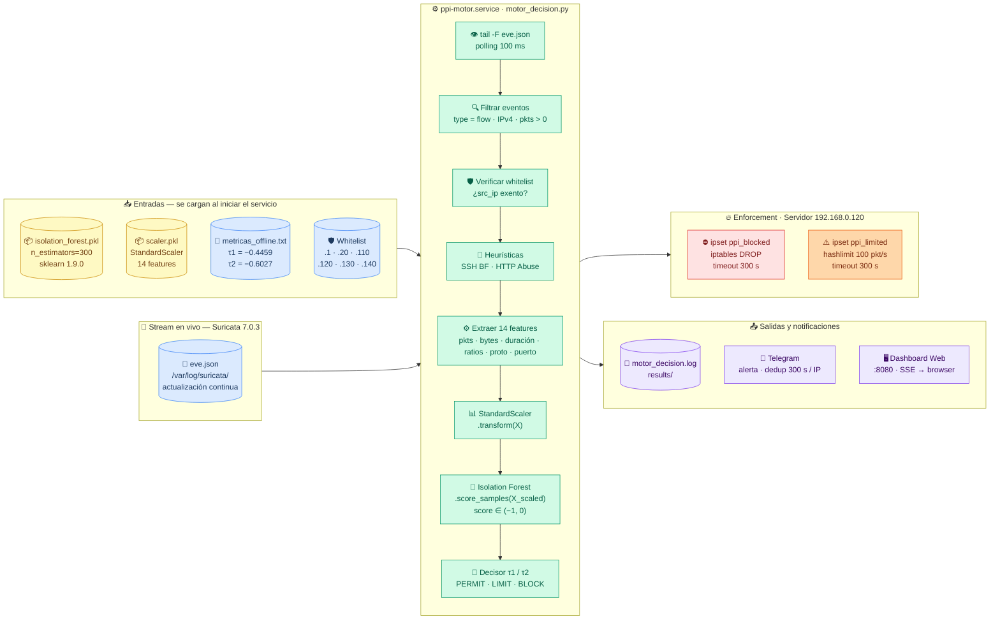
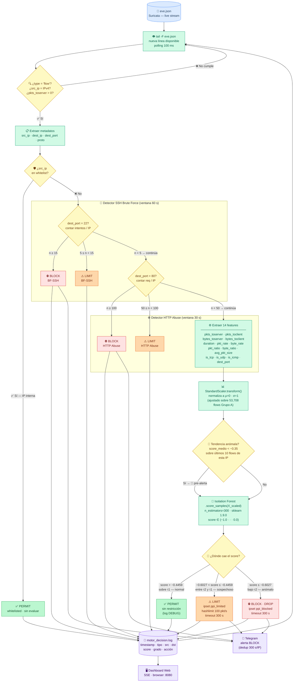

# F4 — Flujo del Motor de Decisión en Tiempo Real

**Fase 4 · PPI — Universidad Peruana Unión · 2026**
Archivo: `scripts/motor_decision.py` · Servicio: `ppi-motor.service`

---

## Diagrama 1 — Arquitectura general (entradas → motor → salidas)



---

## Diagrama 2 — Flujo de decisión por flow (lógica interna detallada)



---

## Diagrama 3 — Escala de score y zonas de decisión

```
  score ∈  (−1.0) ────────────────────────────────── (0.0)
            │                    │             │
          −0.80    ⛔ BLOCK     −0.6027  ⚠️ LIMIT  −0.4459   ✅ PERMIT
                   DROP          τ2 ──────────── τ1          normal
                                 hashlimit 100 pkt/s
```

| Zona | Rango | Acción | Criterio derivación |
|---|---|---|---|
| ✅ **PERMIT** | score > −0.4459 | Sin restricción | τ1 = índice de Youden (max TPR−FPR) |
| ⚠️ **LIMIT** | −0.6027 < score ≤ −0.4459 | hashlimit 100 pkt/s · timeout 300 s | τ2 = FPR ≤ 2 % en tráfico normal |
| ⛔ **BLOCK** | score ≤ −0.6027 | iptables DROP · timeout 300 s | Bajo τ2 |

---

## Tabla de componentes

| Componente | Tipo | Ruta / Nodo | Descripción |
|---|---|---|---|
| `eve.json` | 📜 Stream | `/var/log/suricata/` · Sensor .110 | Eventos de red en tiempo real — Suricata 7.0.3 |
| `isolation_forest.pkl` | 📦 Modelo | `models/` · Sensor .110 | IF n=300, entrenado sobre 53,708 flows normales |
| `scaler.pkl` | 📦 Modelo | `models/` · Sensor .110 | StandardScaler ajustado sobre Grupo A |
| `metricas_offline.txt` | 📄 Config | `results/` · Sensor .110 | τ1=−0.4459 · τ2=−0.6027 (leídos en arranque) |
| `motor_decision.py` | ⚙️ Script | `scripts/` · Sensor .110 | Bucle principal: tail → features → score → decisión |
| `ppi-motor.service` | 🔧 Servicio | systemd · Sensor .110 | Restart=on-failure · Requires=suricata.service |
| `WHITELIST` | 🛡️ Constante | motor_decision.py | IPs internas exentas de evaluación |
| Detector SSH BF | 🔎 Heurística | motor_decision.py | Ventana 60 s · ≥5→LIMIT · ≥15→BLOCK |
| Detector HTTP Abuse | 🔎 Heurística | motor_decision.py | Ventana 30 s · ≥50→LIMIT · ≥100→BLOCK |
| `ipset ppi_blocked` | 🔥 Kernel | Servidor .120 | hash:ip · timeout 300 s · iptables DROP |
| `ipset ppi_limited` | 🔥 Kernel | Servidor .120 | hash:ip · timeout 300 s · hashlimit 100 pkt/s |
| `motor_decision.log` | 📝 Log | `results/` · Sensor .110 | Registro de cada decisión con score y features |
| Telegram Bot | 📱 Alerta | relay :8889 → api.telegram.org | Alertas BLOCK/LIMIT · dedup 300 s por IP |
| `dashboard_web.py` | 🖥️ Web | `:8080` · Sensor .110 | Dashboard en tiempo real vía SSE |

---

## Constantes clave

| Constante | Valor | Descripción |
|---|---|---|
| `TAU1` | −0.4459 | Umbral PERMIT/LIMIT — índice de Youden |
| `TAU2` | −0.6027 | Umbral LIMIT/BLOCK — FPR ≤ 2 % |
| `TAU_AVISO` | −0.35 | Score medio de pre-alerta de tendencia |
| `AVISO_MIN_FL` | 10 | Flows mínimos para activar pre-alerta |
| `TIMEOUT_SEC` | 300 | Duración del bloqueo/límite en ipset |
| `BF_VENTANA_SEG` | 60 | Ventana SSH Brute Force |
| `BF_UMBRAL_LIMIT` | 5 | Intentos SSH → LIMIT |
| `BF_UMBRAL_BLOCK` | 15 | Intentos SSH → BLOCK |
| `HTTP_VENTANA_SEG` | 30 | Ventana HTTP Abuse |
| `HTTP_UMBRAL_LIMIT` | 50 | Requests HTTP → LIMIT |
| `HTTP_UMBRAL_BLOCK` | 100 | Requests HTTP → BLOCK |
| `TG_DEDUP_SEG` | 300 | Supresión de alertas duplicadas por IP |

---

*Fase 4 completada y validada · sklearn 1.9.0 · Suricata 7.0.3 · 2026-06-16*
