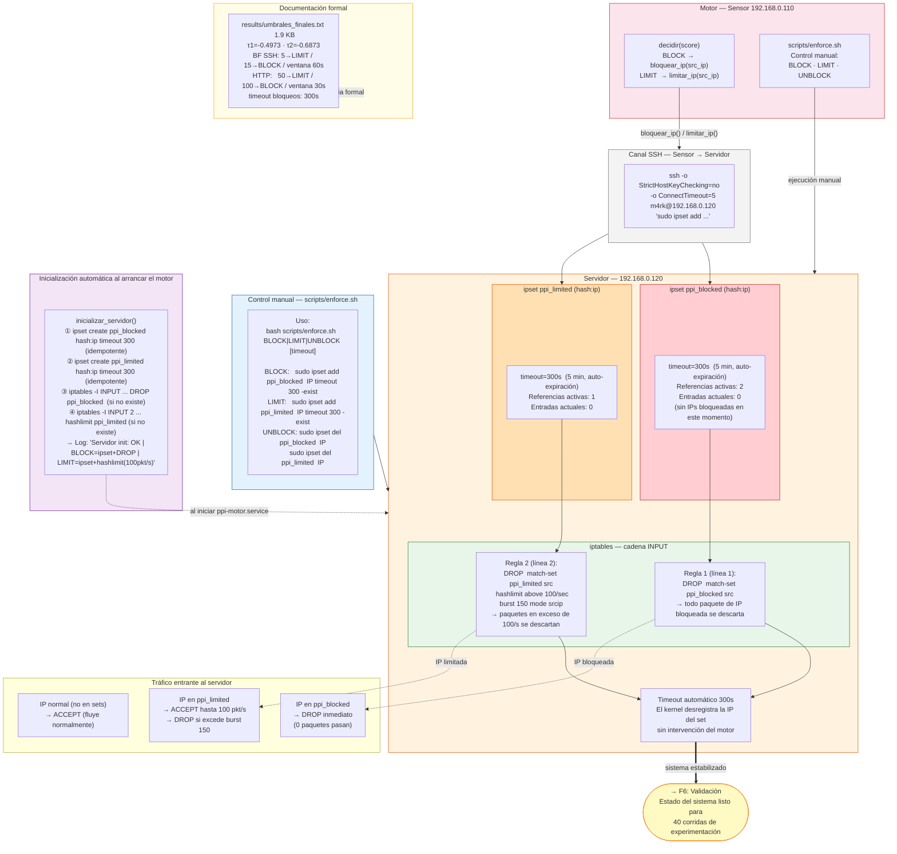

# F5 — Control Inline

**Fecha de ejecución:** 2 – 4 de junio 2026
**Objetivo:** Aplicar las decisiones del motor (BLOCK/LIMIT) sobre el tráfico real en el servidor objetivo mediante ipset e iptables, con timeout automático y control manual.

---

## Diagrama



---

## Descripción por nodo

### Canal SSH — Sensor → Servidor

El motor en el sensor `192.168.0.110` aplica acciones remotamente en el servidor `192.168.0.120` vía SSH. La conexión usa claves configuradas y `StrictHostKeyChecking=no` para no bloquearse en prompts interactivos:

```python
def _ssh(cmd):
    result = subprocess.run(
        ['ssh', '-o', 'StrictHostKeyChecking=no', '-o', 'ConnectTimeout=5',
         'm4rk@192.168.0.120', cmd],
        capture_output=True, text=True, timeout=8
    )
    return (result.stdout + result.stderr).strip()
```

---

### ipset en el servidor — estado verificado

#### `ppi_blocked` — hash:ip timeout 300

```bash
# Comando de verificación:
sudo ipset list ppi_blocked

# Salida real:
Name: ppi_blocked
Type: hash:ip
Header: family inet hashsize 1024 maxelem 65536 timeout 300 bucketsize 12
References: 2
Number of entries: 0
Members:
```

Cuando una IP es bloqueada:
```bash
sudo ipset add ppi_blocked 192.168.0.100 timeout 300 -exist
# La IP permanece en el set 300 segundos
# El kernel la elimina automáticamente al expirar
# -exist evita error si ya estaba en el set (idempotente)
```

#### `ppi_limited` — hash:ip timeout 300

```bash
# Salida real:
Name: ppi_limited
Type: hash:ip
Header: family inet hashsize 1024 maxelem 65536 timeout 300 bucketsize 12
References: 1
Number of entries: 0
Members:
```

---

### Reglas iptables — estado verificado en servidor

```bash
# Comando de verificación:
sudo iptables -L INPUT -n --line-numbers | grep ppi

# Salida real:
1    DROP  0  --  0.0.0.0/0  0.0.0.0/0  match-set ppi_blocked src
2    DROP  0  --  0.0.0.0/0  0.0.0.0/0  match-set ppi_limited src limit: above 100/sec burst 150 mode srcip
```

#### Regla 1 — BLOCK (DROP total)
```bash
sudo iptables -I INPUT -m set --match-set ppi_blocked src -j DROP
```
Cualquier paquete cuyo `src_ip` esté en `ppi_blocked` → **DROP inmediato**, sin procesar.

#### Regla 2 — LIMIT (rate limit hashlimit)
```bash
sudo iptables -I INPUT 2 \
  -m set --match-set ppi_limited src \
  -m hashlimit \
    --hashlimit-name ppi_limit \
    --hashlimit-above 100/sec \
    --hashlimit-mode srcip \
    --hashlimit-burst 150 \
  -j DROP
```
IPs en `ppi_limited` pueden enviar hasta **100 paquetes/segundo** con burst de 150. El exceso es descartado. El módulo `hashlimit` mantiene contadores independientes por IP (`--hashlimit-mode srcip`).

---

### Timeout automático de 300 segundos

El timeout es gestionado directamente por el kernel de Linux a través del módulo `ipset`. Garantías:
- Las IPs se desbloquean automáticamente sin que el motor intervenga
- No se acumulan bloqueos permanentes de IPs legítimas mal clasificadas
- El servidor mantiene disponibilidad ante falsos positivos del modelo (FPR=5.1%)
- En validación F6: **ITL=0%** — ningún flow legítimo fue afectado

---

### `scripts/enforce.sh` — Control manual

```bash
# Bloquear IP manualmente (para demo o emergencia)
bash scripts/enforce.sh 192.168.0.100 BLOCK 300

# Limitar IP manualmente
bash scripts/enforce.sh 192.168.0.100 LIMIT 300

# Desbloquear IP
bash scripts/enforce.sh 192.168.0.100 UNBLOCK
```

Salida real:
```
2026-06-04 20:30:00 | BLOCK | 192.168.0.100 | timeout=300s
2026-06-04 20:35:00 | UNBLOCK | 192.168.0.100
```

---

### `inicializar_servidor()` — Arranque idempotente

Al iniciar `ppi-motor.service`, el motor configura automáticamente el servidor si los sets o reglas no existen:

```python
# Crear sets si no existen (|| true = idempotente)
_ssh('sudo ipset create ppi_blocked hash:ip timeout 300 2>/dev/null || true')
_ssh('sudo ipset create ppi_limited hash:ip timeout 300 2>/dev/null || true')

# Insertar regla iptables solo si no existe (-C verifica, -I inserta)
_ssh('sudo iptables -C INPUT -m set --match-set ppi_blocked src -j DROP 2>/dev/null '
     '|| sudo iptables -I INPUT -m set --match-set ppi_blocked src -j DROP')
```

Log de confirmación al iniciar:
```
2026-06-04 19:42:21 | INFO | Servidor init: OK | BLOCK=ipset+DROP | LIMIT=ipset+hashlimit(100pkt/s) | τ1=-0.4973 τ2=-0.6873
```

---

### Validaciones del control inline realizadas (F5)

| Prueba | Ataque ejecutado | Resultado observado |
|---|---|---|
| BLOCK por modelo | nmap -sS (port scan) | IP bloqueada en < 60s, DROP confirmado |
| BLOCK Brute Force | 25 intentos SSH simultáneos | BLOCK tras 15/60s + Telegram |
| BLOCK HTTP Abuse | curl en bucle continuo | BLOCK tras 100 req/30s + Telegram |
| LIMIT validado | curl en bucle lento (B5) | score=-0.51 → LIMIT → hashlimit activo |
| UNBLOCK automático | Esperar 300s | IP removida automáticamente por kernel |
| IPs broadcast/DHCP | Tráfico 0.0.0.0→255.255.255.255 | Filtradas silenciosamente en motor |

---

### `results/umbrales_finales.txt` — Documento formal

Ubicación real: `/home/m4rk/ppi-surikata-producto/results/umbrales_finales.txt` (1.9 KB)

Registra todos los umbrales del sistema como referencia oficial:

| Umbral | Valor | Criterio |
|---|---|---|
| `clf.offset_` | -0.5481 | contamination=0.05 del modelo |
| τ1 (PERMIT/LIMIT) | -0.4973 | Youden index máximo |
| τ2 (LIMIT/BLOCK) | -0.6873 | FPR ≤ 2% |
| BF SSH LIMIT | 5 intentos/60s | Heurístico temporal |
| BF SSH BLOCK | 15 intentos/60s | Heurístico temporal |
| HTTP LIMIT | 50 requests/30s | Heurístico temporal |
| HTTP BLOCK | 100 requests/30s | Heurístico temporal |
| Timeout bloqueos | 300s | Desbloqueo automático kernel |

---

## Conector → F6

Con el sistema completo funcionando (Suricata → Motor → ipset/iptables), F6 ejecuta 40 corridas controladas midiendo si el control inline opera correctamente: detecta ataques, aplica acciones, no impacta el tráfico legítimo.
