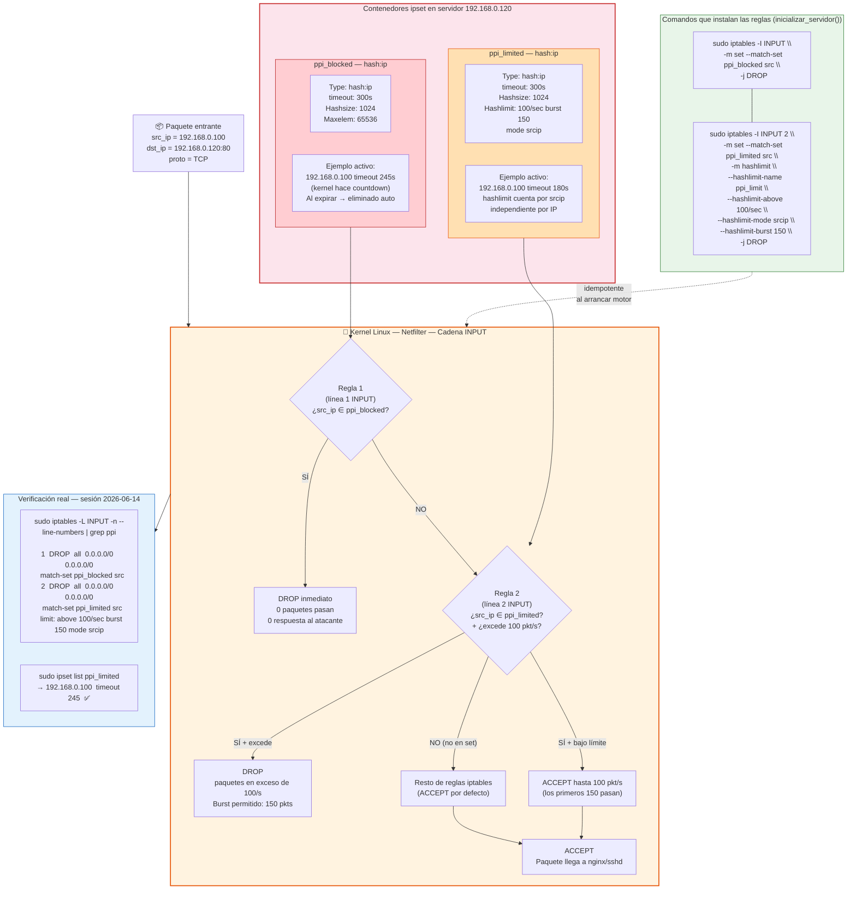
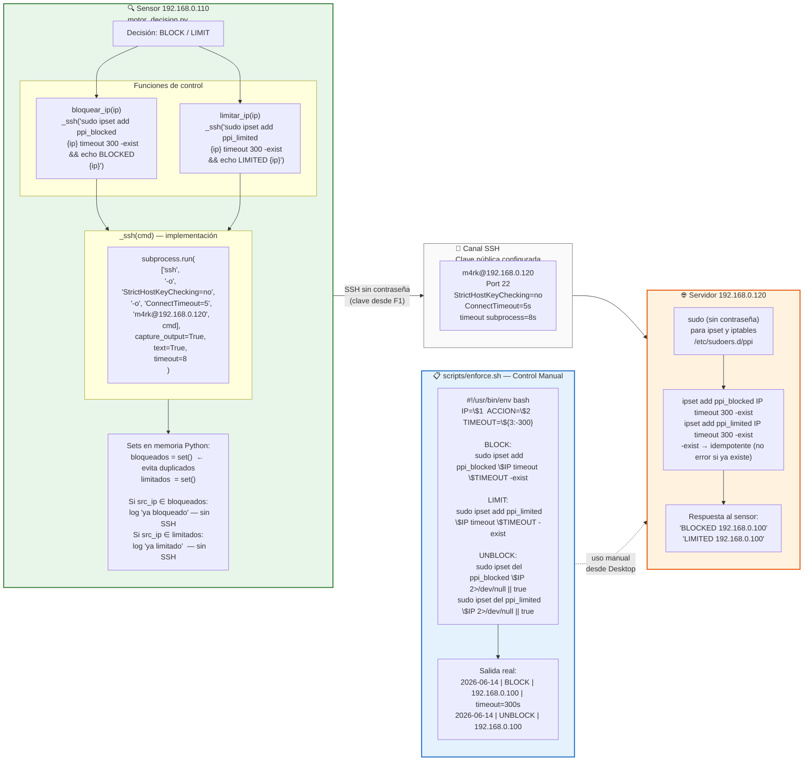
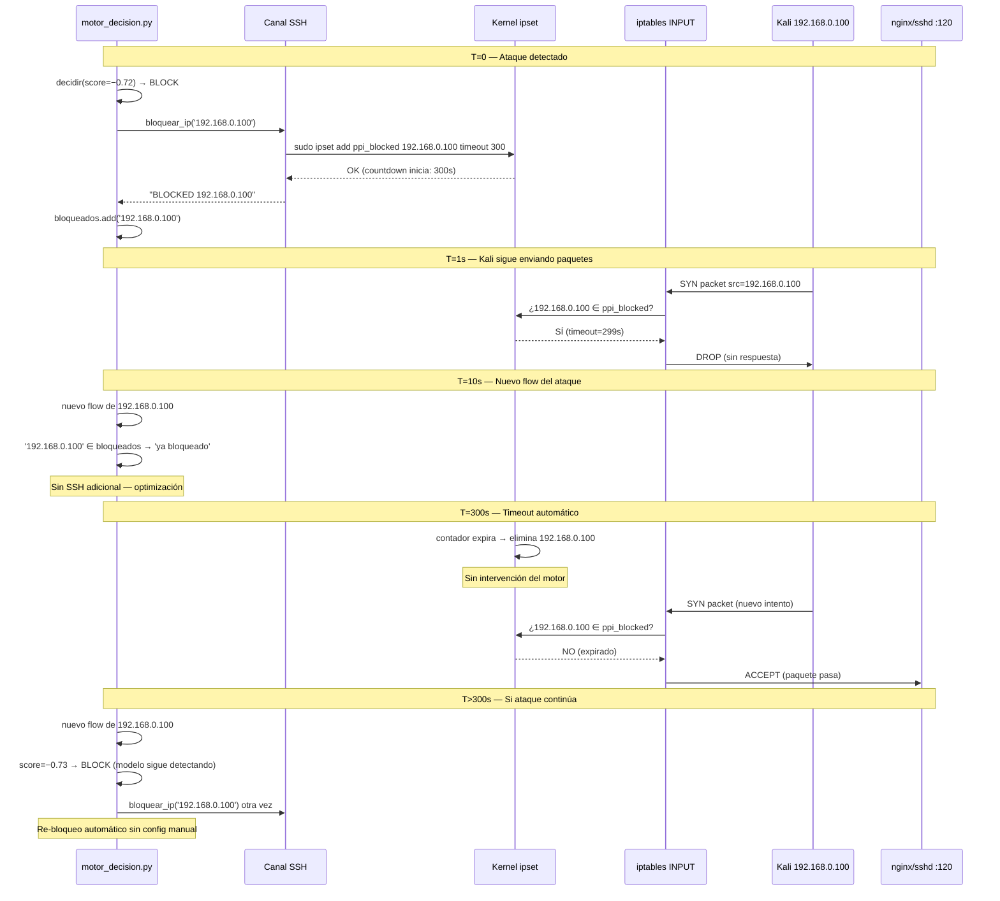
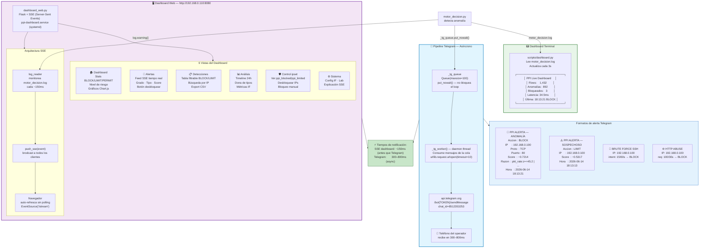
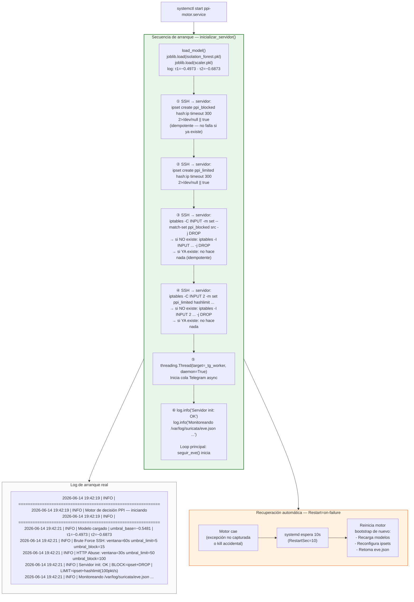
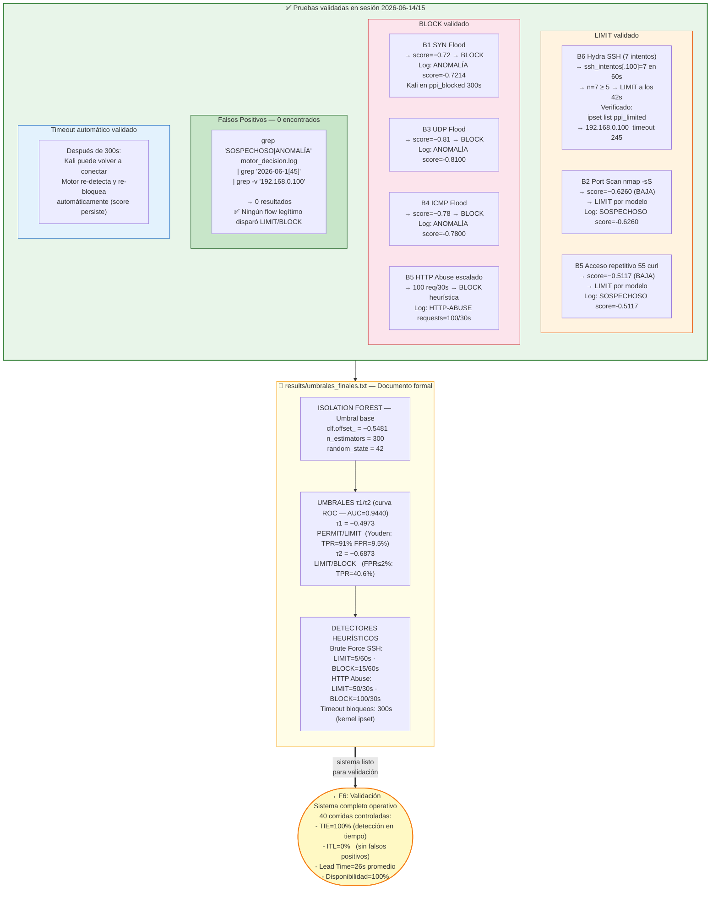

# F5 — Diagrama: Control Inline e Integración

**Proyecto:** Sistema de Detección Temprana de Comportamientos Anómalos en Redes de Datos  
**Institución:** Universidad Peruana Unión — PPI 2026  
**Estudiante:** Rubén Mark Salazar Tocas  
**Fase:** F5 — Control Inline, Telegram y Dashboard  
**Estado:** ✅ En producción — ipset/iptables activos · Telegram operativo · Dashboard web en :8080  

---

## Diagrama 1 — Pipeline Completo de Detección y Respuesta (9 Etapas)

```mermaid
flowchart LR

    subgraph RED["🌐 Red LAN 192.168.0.0/24"]
        direction TB
        KL["Kali 192.168.0.100\nhping3 · nmap · hydra"]
        DT["Desktop 192.168.0.20\ncurl · ssh · scp"]
        SV_T["Servidor 192.168.0.120\nnginx :80 · SSH :22"]
        KL -->|"ataque"| SV_T
        DT -->|"normal"| SV_T
    end

    subgraph E1_2["① Captura  ② Eventos\n< 1ms cada etapa"]
        direction TB
        SURI["Suricata 7.0.3\nens35 — modo pasivo\nlibpcap / AF_PACKET\nDPI por flow"]
        EVE_F["/var/log/suricata/eve.json\nJSON-lines streaming\nevent_type: flow"]
        SURI --> EVE_F
    end

    subgraph E3_4["③ Data Eng  ④ Inferencia\n2–15ms"]
        direction TB
        PARSE["parse_flow()\nextract_features()\n→ vector numpy 1×14"]
        INFER["Isolation Forest\nscaler.transform(X)\nclf.score_samples(X)\n→ score ∈ (−1, 0)"]
        PARSE --> INFER
    end

    subgraph E5_6["⑤ Clasificación  ⑥ Decisión\n< 1ms + 5–10ms"]
        direction TB
        CLASS["score vs τ1/τ2\n+ detectores SSH/HTTP"]
        DEC3["PERMIT / LIMIT / BLOCK"]
        CLASS --> DEC3
    end

    subgraph E7["⑦ Control Inline\n< 1ms (kernel)"]
        direction TB
        IPSET_K["ipset add ppi_blocked\nipset add ppi_limited\niptables DROP / hashlimit"]
    end

    subgraph E8["⑧ Notificación\n100–500ms async"]
        direction TB
        TG_N["📱 Telegram Bot\nCola async daemon\n🚨 BLOCK  ⚠️ LIMIT\n🔑 BruteForce  🌐 HTTP"]
    end

    subgraph E9["⑨ Visualización\n3s refresh"]
        direction TB
        DASH_W["🖥️ Dashboard Web\nhttp://192.168.0.110:8080\nFlask + SSE + Chart.js\nAuto-refresca vía SSE"]
        DASH_T["📟 Dashboard Terminal\nscripts/dashboard.py\nLee motor_decision.log\ncada 3s"]
    end

    RED -->|"tráfico LAN"| E1_2
    E1_2 -->|"seguir_eve()\ntail-f"| E3_4
    E3_4 --> E5_6
    E5_6 -->|"bloquear_ip()\nlimitar_ip()\nSSH al servidor"| E7
    E5_6 -->|"telegram_alerta()\nasync"| E8
    E5_6 -->|"log.warning()"| E9

    LATENCIA(["⏱️ Latencia Total\nP95 = 34.8ms\nRequisito < 500ms\nCumple con margen 14×"])
    E7 --> LATENCIA

    style RED    fill:#fce4ec,stroke:#c62828,stroke-width:2px
    style E1_2   fill:#e3f2fd,stroke:#1565c0,stroke-width:2px
    style E3_4   fill:#e8f5e9,stroke:#2e7d32,stroke-width:2px
    style E5_6   fill:#fff3e0,stroke:#e65100,stroke-width:2px
    style E7     fill:#ffcdd2,stroke:#b71c1c,stroke-width:2px
    style E8     fill:#e1f5fe,stroke:#0277bd,stroke-width:2px
    style E9     fill:#f3e5f5,stroke:#6a1b9a,stroke-width:2px
    style LATENCIA fill:#c8e6c9,stroke:#1b5e20,stroke-width:2px
```

---

## Diagrama 2 — Mecanismo ipset + iptables en el Servidor (Netfilter)

---

## Diagrama 3 — Canal SSH: Motor → Servidor (Control Remoto)

---

## Diagrama 4 — Ciclo de Vida de un Bloqueo (Motor → Timeout)

---

## Diagrama 5 — Telegram y Dashboard Web: Arquitectura SSE

---

## Diagrama 6 — Inicialización del Sistema (boot del motor)

---

## Diagrama 7 — Pruebas Live y Evidencia de Control Inline

---

## Resumen de componentes F5

| Componente | Ubicación | Rol |
|---|---|---|
| `motor_decision.py` | Sensor :110 | Toma la decisión e invoca SSH |
| `_ssh(cmd)` | Sensor :110 | Canal subprocess SSH al servidor |
| `bloquear_ip()` / `limitar_ip()` | Sensor :110 | Funciones de control remoto |
| `inicializar_servidor()` | Sensor :110 | Boot idempotente de ipsets/iptables |
| `ppi_blocked` (ipset) | Servidor :120 | Hash:ip con timeout 300s → DROP |
| `ppi_limited` (ipset) | Servidor :120 | Hash:ip con timeout 300s → hashlimit |
| iptables INPUT regla 1 | Servidor :120 | DROP match-set ppi_blocked |
| iptables INPUT regla 2 | Servidor :120 | hashlimit 100/s ppi_limited |
| `enforce.sh` | Sensor :110 | Control manual BLOCK/LIMIT/UNBLOCK |
| `dashboard_web.py` | Sensor :110 | Flask+SSE en :8080 |
| `dashboard.py` | Sensor :110 | Dashboard terminal cada 3s |
| `ppi-motor.service` | Sensor :110 | systemd gestiona el proceso |
| `ppi-dashboard.service` | Sensor :110 | systemd para Flask web |
| Telegram Bot | Cloud | Notificación async 🚨⚠️🔑🌐 |
