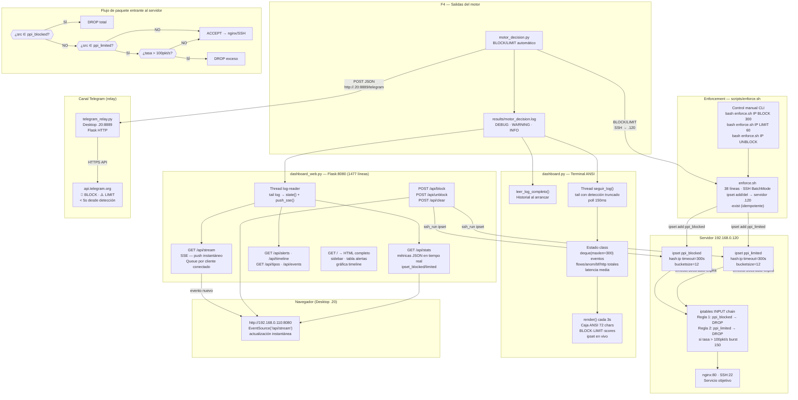

# F5 — Diagrama: Control Inline y Monitoreo

**Instrucciones Draw.io:** Extras → Edit Diagram → pegar XML → OK

---

## Diagrama Mermaid (flujo completo)



---

## Tabla de componentes

| Componente | Líneas | Ruta | Función principal |
|---|---|---|---|
| `enforce.sh` | 38 | `scripts/enforce.sh` | BLOCK/LIMIT/UNBLOCK manual via SSH → servidor |
| `dashboard.py` | 343 | `scripts/dashboard.py` | Terminal ANSI: log→Estado→render cada 3s |
| `dashboard_web.py` | 1,477 | `scripts/dashboard_web.py` | Flask:8080 + SSE + API REST + HTML |
| `telegram_relay.py` | ~50 | Desktop `/home/m4rk/Descargas/` | Flask:8889 → api.telegram.org |
| `ppi_blocked` (ipset) | — | Servidor .120 kernel | hash:ip timeout=300s → iptables DROP |
| `ppi_limited` (ipset) | — | Servidor .120 kernel | hash:ip timeout=300s → hashlimit 100pkt/s |

---

## Estado real de iptables/ipset en servidor (verificado)

```bash
# sudo iptables -L INPUT -n --line-numbers  (en 192.168.0.120)
Chain INPUT (policy ACCEPT)
num  target  prot  opt  source      destination
1    DROP    all   --   0.0.0.0/0   0.0.0.0/0   match-set ppi_blocked src
2    DROP    all   --   0.0.0.0/0   0.0.0.0/0   match-set ppi_limited src
                                                  limit: above 100/sec burst 150 mode srcip

# sudo ipset list ppi_blocked  (cuando vacío)
Name: ppi_blocked
Header: family inet hashsize 1024 maxelem 65536 timeout 300
        bucketsize 12 initval 0xa4c9efb6
Members:

# sudo ipset list ppi_blocked  (durante un ataque)
Name: ppi_blocked
Members:
192.168.0.100 timeout 287    ← 287s restantes antes de auto-expirar
```

---

## Diagrama Draw.io (XML)

```xml
<?xml version="1.0" encoding="UTF-8"?>
<mxGraphModel dx="1422" dy="762" grid="1" gridSize="10" guides="1"
  tooltips="1" connect="1" arrows="1" fold="1" page="0"
  pageScale="1" pageWidth="1900" pageHeight="1200" math="0" shadow="0">
  <root>
    <mxCell id="0"/><mxCell id="1" parent="0"/>

    <!-- TÍTULO -->
    <mxCell id="title" value="F5 — Control Inline y Monitoreo  |  PPI UPeU 2026"
      style="text;html=1;strokeColor=none;fillColor=#002060;fontColor=#ffffff;
             align=center;verticalAlign=middle;fontSize=13;fontStyle=1;rounded=1;"
      vertex="1" parent="1">
      <mxGeometry x="40" y="12" width="1820" height="38" as="geometry"/>
    </mxCell>

    <!-- ══ MOTOR (fuente) ══ -->
    <mxCell id="motor" value="&lt;b&gt;motor_decision.py (F4)&lt;/b&gt;&lt;br/&gt;BLOCK → bloquear_ip()&lt;br/&gt;LIMIT → limitar_ip()&lt;br/&gt;→ enforce.sh interno"
      style="rounded=1;whiteSpace=wrap;html=1;fillColor=#dae8fc;strokeColor=#6c8ebf;fontSize=10;"
      vertex="1" parent="1"><mxGeometry x="40" y="80" width="200" height="80" as="geometry"/></mxCell>

    <mxCell id="cli" value="&lt;b&gt;Control manual CLI&lt;/b&gt;&lt;br/&gt;bash enforce.sh IP BLOCK 300&lt;br/&gt;bash enforce.sh IP LIMIT 60&lt;br/&gt;bash enforce.sh IP UNBLOCK"
      style="rounded=1;whiteSpace=wrap;html=1;fillColor=#f5f5f5;strokeColor=#666;fontSize=10;"
      vertex="1" parent="1"><mxGeometry x="40" y="185" width="200" height="80" as="geometry"/></mxCell>

    <!-- ══ ENFORCE.SH ══ -->
    <mxCell id="enf" value="&lt;b&gt;enforce.sh (38 líneas)&lt;/b&gt;&lt;br/&gt;SSH BatchMode → m4rk@.120&lt;br/&gt;sudo ipset add ppi_blocked IP timeout T -exist&lt;br/&gt;sudo ipset add ppi_limited IP timeout T -exist&lt;br/&gt;sudo ipset del (UNBLOCK)"
      style="rounded=1;whiteSpace=wrap;html=1;fillColor=#dae8fc;strokeColor=#6c8ebf;fontSize=10;align=left;spacingLeft=6;"
      vertex="1" parent="1"><mxGeometry x="300" y="115" width="300" height="100" as="geometry"/></mxCell>

    <!-- ══ SERVIDOR .120 ══ -->
    <mxCell id="srv_bg" value=""
      style="rounded=1;whiteSpace=wrap;html=1;fillColor=#f5f5f5;strokeColor=#444;"
      vertex="1" parent="1"><mxGeometry x="660" y="60" width="580" height="360" as="geometry"/></mxCell>
    <mxCell id="srv_hdr" value="&lt;b&gt;Servidor 192.168.0.120 — nginx:80 · SSH:22&lt;/b&gt;"
      style="text;html=1;strokeColor=none;fillColor=#444;fontColor=#fff;align=center;fontSize=11;fontStyle=1;rounded=1;"
      vertex="1" parent="1"><mxGeometry x="660" y="60" width="580" height="26" as="geometry"/></mxCell>

    <mxCell id="ipbl" value="&lt;b&gt;ipset ppi_blocked&lt;/b&gt;&lt;br/&gt;hash:ip timeout=300s bucketsize=12&lt;br/&gt;hashsize=1024 maxelem=65536&lt;br/&gt;Members: (192.168.0.100 timeout 287)"
      style="rounded=1;whiteSpace=wrap;html=1;fillColor=#f8cecc;strokeColor=#b85450;fontSize=10;"
      vertex="1" parent="1"><mxGeometry x="675" y="100" width="260" height="80" as="geometry"/></mxCell>

    <mxCell id="iplt" value="&lt;b&gt;ipset ppi_limited&lt;/b&gt;&lt;br/&gt;hash:ip timeout=300s bucketsize=12&lt;br/&gt;hashlimit: above 100/sec burst 150&lt;br/&gt;mode srcip"
      style="rounded=1;whiteSpace=wrap;html=1;fillColor=#ffe6cc;strokeColor=#d6790a;fontSize=10;"
      vertex="1" parent="1"><mxGeometry x="675" y="200" width="260" height="80" as="geometry"/></mxCell>

    <mxCell id="ipt" value="&lt;b&gt;iptables INPUT chain&lt;/b&gt;&lt;br/&gt;Regla 1: match-set ppi_blocked src → DROP&lt;br/&gt;Regla 2: match-set ppi_limited src → DROP&lt;br/&gt;         (si tasa &gt; 100/sec burst 150)&lt;br/&gt;Policy: ACCEPT"
      style="rounded=1;whiteSpace=wrap;html=1;fillColor=#e6e6e6;strokeColor=#444;fontSize=10;align=left;spacingLeft=6;"
      vertex="1" parent="1"><mxGeometry x="675" y="300" width="310" height="100" as="geometry"/></mxCell>

    <mxCell id="nginx" value="&lt;b&gt;nginx:80 · SSH:22&lt;/b&gt;&lt;br/&gt;Tráfico que pasa iptables"
      style="rounded=1;whiteSpace=wrap;html=1;fillColor=#d5e8d4;strokeColor=#82b366;fontSize=10;"
      vertex="1" parent="1"><mxGeometry x="1000" y="185" width="200" height="70" as="geometry"/></mxCell>

    <!-- ══ FLUJO DE PAQUETE ══ -->
    <mxCell id="pkt_bg" value=""
      style="rounded=1;whiteSpace=wrap;html=1;fillColor=#fffde7;strokeColor=#f0a500;"
      vertex="1" parent="1"><mxGeometry x="660" y="450" width="580" height="280" as="geometry"/></mxCell>
    <mxCell id="pkt_hdr" value="&lt;b&gt;Flujo de paquete entrante al servidor&lt;/b&gt;"
      style="text;html=1;strokeColor=none;fillColor=#f0a500;fontColor=#fff;align=center;fontSize=11;fontStyle=1;rounded=1;"
      vertex="1" parent="1"><mxGeometry x="660" y="450" width="580" height="26" as="geometry"/></mxCell>

    <mxCell id="pkt1" value="¿src_ip ∈ ppi_blocked?"
      style="rhombus;whiteSpace=wrap;html=1;fillColor=#f8cecc;strokeColor=#b85450;fontSize=10;"
      vertex="1" parent="1"><mxGeometry x="700" y="490" width="190" height="60" as="geometry"/></mxCell>
    <mxCell id="drop1" value="DROP total&lt;br/&gt;(Regla 1)"
      style="rounded=1;whiteSpace=wrap;html=1;fillColor=#b85450;strokeColor=#800000;fontColor=#fff;fontSize=10;fontStyle=1;"
      vertex="1" parent="1"><mxGeometry x="930" y="490" width="120" height="60" as="geometry"/></mxCell>
    <mxCell id="pkt2" value="¿src_ip ∈ ppi_limited?"
      style="rhombus;whiteSpace=wrap;html=1;fillColor=#ffe6cc;strokeColor=#d6790a;fontSize=10;"
      vertex="1" parent="1"><mxGeometry x="700" y="570" width="190" height="60" as="geometry"/></mxCell>
    <mxCell id="pkt3" value="¿tasa &gt; 100pkt/s?"
      style="rhombus;whiteSpace=wrap;html=1;fillColor=#ffe6cc;strokeColor=#d6790a;fontSize=10;"
      vertex="1" parent="1"><mxGeometry x="700" y="650" width="190" height="60" as="geometry"/></mxCell>
    <mxCell id="drop2" value="DROP exceso&lt;br/&gt;(Regla 2)"
      style="rounded=1;whiteSpace=wrap;html=1;fillColor=#d6790a;strokeColor=#994400;fontColor=#fff;fontSize=10;fontStyle=1;"
      vertex="1" parent="1"><mxGeometry x="930" y="650" width="120" height="60" as="geometry"/></mxCell>
    <mxCell id="accept" value="ACCEPT&lt;br/&gt;→ nginx/SSH"
      style="rounded=1;whiteSpace=wrap;html=1;fillColor=#d5e8d4;strokeColor=#82b366;fontSize=10;fontStyle=1;"
      vertex="1" parent="1"><mxGeometry x="930" y="570" width="120" height="60" as="geometry"/></mxCell>

    <!-- ══ LOG ══ -->
    <mxCell id="log" value="&lt;b&gt;motor_decision.log&lt;/b&gt;&lt;br/&gt;WARNING: BLOCK/LIMIT/BF/HTTP&lt;br/&gt;INFO: stats cada 500 flows&lt;br/&gt;DEBUG: PERMIT (silencioso)"
      style="shape=cylinder3;whiteSpace=wrap;html=1;boundedLbl=1;backgroundOutline=1;size=10;
             fillColor=#fff2cc;strokeColor=#d6b656;fontSize=10;"
      vertex="1" parent="1"><mxGeometry x="40" y="340" width="200" height="100" as="geometry"/></mxCell>

    <!-- ══ DASHBOARD TERMINAL ══ -->
    <mxCell id="dt_bg" value=""
      style="rounded=1;whiteSpace=wrap;html=1;fillColor=#f0fff0;strokeColor=#82b366;"
      vertex="1" parent="1"><mxGeometry x="40" y="480" width="580" height="195" as="geometry"/></mxCell>
    <mxCell id="dt_hdr" value="&lt;b&gt;dashboard.py (343 líneas) — Terminal ANSI&lt;/b&gt;"
      style="text;html=1;strokeColor=none;fillColor=#82b366;fontColor=#fff;align=center;fontSize=11;fontStyle=1;rounded=1;"
      vertex="1" parent="1"><mxGeometry x="40" y="480" width="580" height="26" as="geometry"/></mxCell>

    <mxCell id="dt_load" value="leer_log_completo()&lt;br/&gt;historial al arrancar"
      style="rounded=1;whiteSpace=wrap;html=1;fillColor=#d5e8d4;strokeColor=#82b366;fontSize=10;"
      vertex="1" parent="1"><mxGeometry x="55" y="516" width="170" height="50" as="geometry"/></mxCell>
    <mxCell id="dt_tail" value="Thread seguir_log()&lt;br/&gt;tail log · poll 150ms&lt;br/&gt;detecta truncado"
      style="rounded=1;whiteSpace=wrap;html=1;fillColor=#d5e8d4;strokeColor=#82b366;fontSize=10;"
      vertex="1" parent="1"><mxGeometry x="235" y="516" width="175" height="50" as="geometry"/></mxCell>
    <mxCell id="dt_est" value="Estado class&lt;br/&gt;deque(maxlen=300)&lt;br/&gt;counters · latencia"
      style="rounded=1;whiteSpace=wrap;html=1;fillColor=#d5e8d4;strokeColor=#82b366;fontSize=10;"
      vertex="1" parent="1"><mxGeometry x="55" y="580" width="170" height="50" as="geometry"/></mxCell>
    <mxCell id="dt_rend" value="render() cada 3s&lt;br/&gt;Caja ANSI 72 chars&lt;br/&gt;BLOCK·LIMIT·ipset en vivo"
      style="rounded=1;whiteSpace=wrap;html=1;fillColor=#d5e8d4;strokeColor=#82b366;fontSize=10;"
      vertex="1" parent="1"><mxGeometry x="235" y="580" width="175" height="50" as="geometry"/></mxCell>
    <mxCell id="dt_out" value="╔══PPI-SURIKATA══╗&lt;br/&gt;║ BLOCK: 12 LIMIT: 3 ║&lt;br/&gt;║ Lat: 34.5ms ITL:0% ║&lt;br/&gt;║ SYN_FLOOD ████75% ║&lt;br/&gt;╚════════════════╝"
      style="rounded=1;whiteSpace=wrap;html=1;fillColor=#f5f5f5;strokeColor=#999;fontSize=9;fontFamily=Courier;"
      vertex="1" parent="1"><mxGeometry x="420" y="516" width="185" height="120" as="geometry"/></mxCell>

    <!-- ══ DASHBOARD WEB ══ -->
    <mxCell id="dw_bg" value=""
      style="rounded=1;whiteSpace=wrap;html=1;fillColor=#f0f8ff;strokeColor=#6c8ebf;"
      vertex="1" parent="1"><mxGeometry x="40" y="700" width="580" height="230" as="geometry"/></mxCell>
    <mxCell id="dw_hdr" value="&lt;b&gt;dashboard_web.py (1477 líneas) — Flask:8080&lt;/b&gt;"
      style="text;html=1;strokeColor=none;fillColor=#6c8ebf;fontColor=#fff;align=center;fontSize=11;fontStyle=1;rounded=1;"
      vertex="1" parent="1"><mxGeometry x="40" y="700" width="580" height="26" as="geometry"/></mxCell>

    <mxCell id="dw_rdr" value="Thread log-reader&lt;br/&gt;tail log → state{}&lt;br/&gt;push_sse(ev)"
      style="rounded=1;whiteSpace=wrap;html=1;fillColor=#dae8fc;strokeColor=#6c8ebf;fontSize=10;"
      vertex="1" parent="1"><mxGeometry x="55" y="736" width="155" height="60" as="geometry"/></mxCell>
    <mxCell id="dw_sse" value="GET /api/stream&lt;br/&gt;SSE push instantáneo&lt;br/&gt;Queue por cliente"
      style="rounded=1;whiteSpace=wrap;html=1;fillColor=#dae8fc;strokeColor=#6c8ebf;fontSize=10;"
      vertex="1" parent="1"><mxGeometry x="220" y="736" width="155" height="60" as="geometry"/></mxCell>
    <mxCell id="dw_api" value="GET /api/stats&lt;br/&gt;GET /api/alerts&lt;br/&gt;GET /api/timeline · tipos"
      style="rounded=1;whiteSpace=wrap;html=1;fillColor=#dae8fc;strokeColor=#6c8ebf;fontSize=10;"
      vertex="1" parent="1"><mxGeometry x="55" y="810" width="155" height="60" as="geometry"/></mxCell>
    <mxCell id="dw_ctrl" value="POST /api/block&lt;br/&gt;POST /api/unblock&lt;br/&gt;ssh_run ipset"
      style="rounded=1;whiteSpace=wrap;html=1;fillColor=#dae8fc;strokeColor=#6c8ebf;fontSize=10;"
      vertex="1" parent="1"><mxGeometry x="220" y="810" width="155" height="60" as="geometry"/></mxCell>
    <mxCell id="nav" value="Navegador&lt;br/&gt;http://192.168.0.110:8080&lt;br/&gt;EventSource('/api/stream')&lt;br/&gt;actualización instantánea"
      style="rounded=1;whiteSpace=wrap;html=1;fillColor=#e6f0ff;strokeColor=#4488aa;fontSize=10;"
      vertex="1" parent="1"><mxGeometry x="390" y="765" width="215" height="80" as="geometry"/></mxCell>

    <!-- ══ TELEGRAM ══ -->
    <mxCell id="tg1" value="telegram_relay.py&lt;br/&gt;Desktop .20:8889&lt;br/&gt;Flask HTTP&lt;br/&gt;recibe POST del motor"
      style="rounded=1;whiteSpace=wrap;html=1;fillColor=#dae8fc;strokeColor=#6c8ebf;fontSize=10;"
      vertex="1" parent="1"><mxGeometry x="1300" y="130" width="185" height="80" as="geometry"/></mxCell>
    <mxCell id="tg2" value="🚨 Bot Telegram&lt;br/&gt;api.telegram.org&lt;br/&gt;Operador &lt; 5s"
      style="rounded=1;whiteSpace=wrap;html=1;fillColor=#2AABEE;strokeColor=#1a8abc;
             fontColor=#fff;fontSize=10;fontStyle=1;"
      vertex="1" parent="1"><mxGeometry x="1300" y="240" width="185" height="70" as="geometry"/></mxCell>
    <mxCell id="tg_res" value="Si relay no disponible:&lt;br/&gt;motor registra ERROR en log&lt;br/&gt;enforcement continúa OK"
      style="rounded=1;whiteSpace=wrap;html=1;fillColor=#fff2cc;strokeColor=#d6b656;fontSize=10;"
      vertex="1" parent="1"><mxGeometry x="1300" y="330" width="185" height="65" as="geometry"/></mxCell>

    <!-- ══ CONECTORES ══ -->
    <mxCell id="e1" value="BLOCK/LIMIT" style="edgeStyle=orthogonalEdgeStyle;strokeColor=#6c8ebf;strokeWidth=2;fontSize=9;" edge="1" source="motor" target="enf" parent="1"><mxGeometry relative="1" as="geometry"/></mxCell>
    <mxCell id="e2" value="" style="edgeStyle=orthogonalEdgeStyle;strokeColor=#666;" edge="1" source="cli" target="enf" parent="1"><mxGeometry relative="1" as="geometry"/></mxCell>
    <mxCell id="e3" value="ipset add ppi_blocked" style="edgeStyle=orthogonalEdgeStyle;strokeColor=#b85450;strokeWidth=2;fontSize=9;" edge="1" source="enf" target="ipbl" parent="1"><mxGeometry relative="1" as="geometry"/></mxCell>
    <mxCell id="e4" value="ipset add ppi_limited" style="edgeStyle=orthogonalEdgeStyle;strokeColor=#d6790a;strokeWidth=2;fontSize=9;" edge="1" source="enf" target="iplt" parent="1"><mxGeometry relative="1" as="geometry"/></mxCell>
    <mxCell id="e5" value="" style="edgeStyle=orthogonalEdgeStyle;strokeColor=#b85450;" edge="1" source="ipbl" target="ipt" parent="1"><mxGeometry relative="1" as="geometry"/></mxCell>
    <mxCell id="e6" value="" style="edgeStyle=orthogonalEdgeStyle;strokeColor=#d6790a;" edge="1" source="iplt" target="ipt" parent="1"><mxGeometry relative="1" as="geometry"/></mxCell>
    <mxCell id="e7" value="ACCEPT" style="edgeStyle=orthogonalEdgeStyle;strokeColor=#82b366;strokeWidth=2;fontSize=9;" edge="1" source="ipt" target="nginx" parent="1"><mxGeometry relative="1" as="geometry"/></mxCell>
    <mxCell id="e8" value="" style="edgeStyle=orthogonalEdgeStyle;strokeColor=#b85450;" edge="1" source="pkt1" target="drop1" parent="1"><mxGeometry relative="1" as="geometry"/></mxCell>
    <mxCell id="e9" value="NO" style="edgeStyle=orthogonalEdgeStyle;strokeColor=#82b366;fontSize=9;" edge="1" source="pkt1" target="pkt2" parent="1"><mxGeometry relative="1" as="geometry"/></mxCell>
    <mxCell id="e10" value="NO" style="edgeStyle=orthogonalEdgeStyle;strokeColor=#82b366;fontSize=9;" edge="1" source="pkt2" target="accept" parent="1"><mxGeometry relative="1" as="geometry"/></mxCell>
    <mxCell id="e11" value="SÍ" style="edgeStyle=orthogonalEdgeStyle;strokeColor=#d6790a;fontSize=9;" edge="1" source="pkt2" target="pkt3" parent="1"><mxGeometry relative="1" as="geometry"/></mxCell>
    <mxCell id="e12" value="SÍ" style="edgeStyle=orthogonalEdgeStyle;strokeColor=#b85450;fontSize=9;" edge="1" source="pkt3" target="drop2" parent="1"><mxGeometry relative="1" as="geometry"/></mxCell>
    <mxCell id="e13" value="NO" style="edgeStyle=orthogonalEdgeStyle;strokeColor=#82b366;fontSize=9;" edge="1" source="pkt3" target="accept" parent="1"><mxGeometry relative="1" as="geometry"/></mxCell>
    <mxCell id="e14" value="escribe" style="edgeStyle=orthogonalEdgeStyle;strokeColor=#d6b656;fontSize=9;" edge="1" source="motor" target="log" parent="1"><mxGeometry relative="1" as="geometry"/></mxCell>
    <mxCell id="e15" value="" style="edgeStyle=orthogonalEdgeStyle;" edge="1" source="log" target="dt_load" parent="1"><mxGeometry relative="1" as="geometry"/></mxCell>
    <mxCell id="e16" value="" style="edgeStyle=orthogonalEdgeStyle;" edge="1" source="log" target="dt_tail" parent="1"><mxGeometry relative="1" as="geometry"/></mxCell>
    <mxCell id="e17" value="" style="edgeStyle=orthogonalEdgeStyle;" edge="1" source="dt_tail" target="dt_est" parent="1"><mxGeometry relative="1" as="geometry"/></mxCell>
    <mxCell id="e18" value="" style="edgeStyle=orthogonalEdgeStyle;" edge="1" source="dt_est" target="dt_rend" parent="1"><mxGeometry relative="1" as="geometry"/></mxCell>
    <mxCell id="e19" value="" style="edgeStyle=orthogonalEdgeStyle;" edge="1" source="log" target="dw_rdr" parent="1"><mxGeometry relative="1" as="geometry"/></mxCell>
    <mxCell id="e20" value="push_sse" style="edgeStyle=orthogonalEdgeStyle;fontSize=9;" edge="1" source="dw_rdr" target="dw_sse" parent="1"><mxGeometry relative="1" as="geometry"/></mxCell>
    <mxCell id="e21" value="SSE push" style="edgeStyle=orthogonalEdgeStyle;strokeColor=#4488aa;strokeWidth=2;fontSize=9;" edge="1" source="dw_sse" target="nav" parent="1"><mxGeometry relative="1" as="geometry"/></mxCell>
    <mxCell id="e22" value="ipset" style="edgeStyle=orthogonalEdgeStyle;strokeColor=#b85450;dashed=1;fontSize=9;" edge="1" source="dw_ctrl" target="ipbl" parent="1"><mxGeometry relative="1" as="geometry"/></mxCell>
    <mxCell id="e23" value="POST JSON" style="edgeStyle=orthogonalEdgeStyle;strokeColor=#2AABEE;strokeWidth=2;fontSize=9;" edge="1" source="motor" target="tg1" parent="1"><mxGeometry relative="1" as="geometry"/></mxCell>
    <mxCell id="e24" value="HTTPS" style="edgeStyle=orthogonalEdgeStyle;dashed=1;fontSize=9;" edge="1" source="tg1" target="tg2" parent="1"><mxGeometry relative="1" as="geometry"/></mxCell>

    <!-- LEYENDA -->
    <mxCell id="leg" value="" style="rounded=1;whiteSpace=wrap;html=1;fillColor=#f9f9f9;strokeColor=#ccc;"
      vertex="1" parent="1"><mxGeometry x="40" y="960" width="1580" height="48" as="geometry"/></mxCell>
    <mxCell id="l1" value="BLOCK (DROP total)" style="rounded=1;html=1;fillColor=#f8cecc;strokeColor=#b85450;fontSize=9;" vertex="1" parent="1"><mxGeometry x="55" y="974" width="140" height="26" as="geometry"/></mxCell>
    <mxCell id="l2" value="LIMIT (hashlimit 100/s)" style="rounded=1;html=1;fillColor=#ffe6cc;strokeColor=#d6790a;fontSize=9;" vertex="1" parent="1"><mxGeometry x="205" y="974" width="155" height="26" as="geometry"/></mxCell>
    <mxCell id="l3" value="ACCEPT / Dashboard" style="rounded=1;html=1;fillColor=#d5e8d4;strokeColor=#82b366;fontSize=9;" vertex="1" parent="1"><mxGeometry x="370" y="974" width="135" height="26" as="geometry"/></mxCell>
    <mxCell id="l4" value="Scripts Python/Bash" style="rounded=1;html=1;fillColor=#dae8fc;strokeColor=#6c8ebf;fontSize=9;" vertex="1" parent="1"><mxGeometry x="515" y="974" width="135" height="26" as="geometry"/></mxCell>
    <mxCell id="l5" value="ipset/iptables kernel" style="rounded=1;html=1;fillColor=#e6e6e6;strokeColor=#444;fontSize=9;" vertex="1" parent="1"><mxGeometry x="660" y="974" width="135" height="26" as="geometry"/></mxCell>
    <mxCell id="l6" value="Telegram relay" style="rounded=1;html=1;fillColor=#2AABEE;strokeColor=#1a8abc;fontColor=#fff;fontSize=9;" vertex="1" parent="1"><mxGeometry x="805" y="974" width="130" height="26" as="geometry"/></mxCell>
    <mxCell id="l7" value="Auto-expiry 300s" style="rounded=1;html=1;fillColor=#fffde7;strokeColor=#f0a500;fontSize=9;" vertex="1" parent="1"><mxGeometry x="945" y="974" width="130" height="26" as="geometry"/></mxCell>
    <mxCell id="l8" value="Log / Artefactos" style="rounded=1;html=1;fillColor=#fff2cc;strokeColor=#d6b656;fontSize=9;" vertex="1" parent="1"><mxGeometry x="1085" y="974" width="120" height="26" as="geometry"/></mxCell>
    <mxCell id="l9" value="Navegador (SSE)" style="rounded=1;html=1;fillColor=#e6f0ff;strokeColor=#4488aa;fontSize=9;" vertex="1" parent="1"><mxGeometry x="1215" y="974" width="120" height="26" as="geometry"/></mxCell>

  </root>
</mxGraphModel>
```
