# F6 — Validación y Experimentación

**Fecha de ejecución:** 2 – 4 de junio 2026
**Objetivo:** Validar el sistema completo con 40 corridas controladas midiendo disponibilidad, impacto en tráfico legítimo (ITL), tasa de intervención efectiva (TIE), Lead Time y latencia.

---

## Diagrama

```mermaid
flowchart TD

    subgraph SISTEMA["Sistema completo activo (F1–F5)"]
        S["Suricata → Motor → ipset/iptables\nTodo el pipeline operativo"]
    end

    subgraph CORRIDAS["scripts/f6_corridas.py — 40 corridas automatizadas"]
        direction TB

        GN["Grupo Normal  (corridas 1–10)\nSolo tráfico legítimo\nA1-A4 desde Desktop 192.168.0.20\nDuración: 5 min por corrida\nPausa: 60s entre corridas"]

        GM["Grupo Mixto  (corridas 11–20)\nDesktop + ataque Kali\nRotación: synflood·portscan·udpflood·httpabuse\nDuración: 5 min por corrida"]

        GR["Grupo Re-evaluación  (corridas 21–30)\nMisma configuración que Mixto\nVerifica consistencia de τ1/τ2"]

        GF["Grupo Final  (corridas 31–40)\nCorridas definitivas del entregable"]
    end

    subgraph METRICAS["Métricas medidas por corrida"]
        M["Disponibilidad: curl → HTTP 200 durante el ataque\nITL: % flows legítimos afectados por el sistema\nTIE: % anomalías con acción BLOCK o LIMIT\nLead Time: s desde inicio ataque → primera detección en log\nMTTC: s desde inicio ataque → primera acción aplicada\nLatencia: ms entre flows procesados por el motor\nFlows_normal · Flows_anom · Bloqueados · Limitados"]
    end

    subgraph RESULTADOS["Archivos de resultados — results/"]
        R1["resultados_normal.csv  899 B\n10 corridas · Disponibilidad=100% · ITL=0%\nLatencia media: 6.6ms"]
        R2["resultados_mixto.csv  1.2 KB\n10 corridas · TIE=100% · ITL=0%\nLead Time: 26s · MTTC: 28s"]
        R3["resultados_reeval.csv  1.2 KB\n10 corridas · consistencia τ1/τ2 confirmada"]
        R4["resultados_final.csv  1.2 KB\n10 corridas definitivas"]
        R5["resultados_f6_completo.csv  3.9 KB\n40 corridas consolidadas ← entregable principal"]
    end

    subgraph ESCENARIOS_VIVO["Validaciones en vivo documentadas"]
        V1["A2 + B2 simultáneos (2026-06-02 19:41)\nSSH Desktop → 0 falsas alarmas\nPort scan Kali → 1705/1705 detectados\nScore SSH: -0.434  Score scan: -0.655\nBLOCK en el 1er flow · Lead Time: 26s"]
        V2["Brute Force SSH (2026-06-03 18:50)\n25 intentos simultáneos → BLOCK 15/60s\nAlerta Telegram recibida ✓"]
        V3["HTTP Abuse (2026-06-04 15:10)\ncurl en bucle → BLOCK 100 req/30s\nAlerta Telegram recibida ✓"]
        V4["Acción LIMIT (2026-06-03 23:28)\nHTTP abuse lento score=-0.4985\n→ LIMIT · hashlimit 100pkt/s activo"]
    end

    subgraph AUCS["scripts/auc_por_escenario.py"]
        AUC["results/reports/auc_por_escenario.txt\n\nB3 UDP Flood   AUC=0.9905  Det=100%\nB4 ICMP Flood  AUC=0.9861  Det=100%\nC3 Mixto UDP   AUC=0.9801  Det=99.3%\nC1 Mixto HTTP  AUC=0.9737  Det=100%\nB2 Port Scan   AUC=0.9721  Det=99.9%\nB1 SYN Flood   AUC=0.9529  Det=72.2%\nC2 Mixto SSH   AUC=0.9277  Det=57.1%\nB5 HTTP Abuse  AUC=0.8630  Det=56.6%\nB6 BruteForce  AUC=0.6770  Det=0.9%→~90% con det.temporal"]
    end

    subgraph ENTREGABLES["Entregables finales"]
        PDF["results/reporte_validacion_final.pdf  7.4 KB\nGenerado: 2026-06-04 20:06\n3 páginas · métricas completas\n← entregable formal PPI"]
        ZIP["results/MVP_funcional.zip  25 MB\n40 archivos · sistema completo\n← entregable técnico PPI"]
    end

    subgraph METRICAS_FINALES["Métricas globales finales"]
        MF["Recall (modelo base)    87.6%\nRecall (con detectores)  ~92-95%\nPrecision               99.96%\nF1-Score                 0.9338\nAUC-ROC global           0.9440\nFP Rate                  5.1%\nFP SSH legítimo          0%\nFP Transferencia         0%\nLatencia P95            34.8ms  (< 500ms ✓)\nDisponibilidad          100%  (40/40 corridas)\nITL                      0%\nTIE                    100%\nLead Time               26s\nMTTC                    28s"]
    end

    SISTEMA --> CORRIDAS
    GN --> R1
    GM --> R2
    GR --> R3
    GF --> R4
    R1 & R2 & R3 & R4 --> R5
    CORRIDAS --> METRICAS
    METRICAS --> RESULTADOS
    ESCENARIOS_VIVO -.->|"evidencia en\nmotor_decision.log"| RESULTADOS
    R5 --> AUCS
    R5 --> METRICAS_FINALES
    METRICAS_FINALES --> PDF
    AUCS --> PDF
    PDF --> ZIP

    subgraph GENERACION["Generación de reportes"]
        GP["scripts/generar_pdf_final.py\n→ results/reporte_validacion_final.pdf"]
        GZ["scripts/generar_pdf_zip.py\n→ results/MVP_funcional.zip"]
    end

    METRICAS_FINALES --> GP --> PDF
    GP --> GZ --> ZIP

    style SISTEMA fill:#e8f5e9,stroke:#2e7d32
    style CORRIDAS fill:#e3f2fd,stroke:#1565c0
    style RESULTADOS fill:#fff3e0,stroke:#e65100
    style ESCENARIOS_VIVO fill:#fce4ec,stroke:#c62828
    style AUCS fill:#f3e5f5,stroke:#6a1b9a
    style ENTREGABLES fill:#fffde7,stroke:#f9a825
    style METRICAS_FINALES fill:#e1f5fe,stroke:#0277bd
    style GENERACION fill:#efebe9,stroke:#4e342e
```



---

## Descripción por nodo

### `scripts/f6_corridas.py` — Automatización de 40 corridas

El script coordina los 4 grupos de corridas midiendo métricas en tiempo real desde el log del motor:

```python
DURACION_NORMAL = 300   # 5 min por corrida
PAUSA_ENTRE     = 60    # 1 min de pausa entre corridas
N_NORMAL        = 10    # grupo normal
N_MIXTO         = 10    # grupo mixto
N_REEVAL        = 10    # re-evaluación
N_FINAL         = 10    # corridas finales
```

Por cada corrida mide:
- **Disponibilidad:** `curl → HTTP 200` durante el ataque → servidor respondió durante todo el experimento
- **ITL:** flows del Desktop clasificados como BLOCK o LIMIT → debe ser 0
- **Lead Time:** timestamp primera línea WARNING en el log tras inicio del ataque
- **TIE:** `anomalías_con_acción / anomalías_totales`

---

### Resultados por grupo — rutas reales verificadas

| Grupo | Archivo | Tamaño | Corridas | Métricas clave |
|---|---|---|---|---|
| Normal | `results/resultados_normal.csv` | 899 B | 1–10 | Disponibilidad=100% · ITL=0% · Latencia=6.6ms |
| Mixto | `results/resultados_mixto.csv` | 1.2 KB | 11–20 | TIE=100% · ITL=0% · Lead Time=26s · MTTC=28s |
| Re-eval | `results/resultados_reeval.csv` | 1.2 KB | 21–30 | Consistencia τ1/τ2 confirmada |
| Final | `results/resultados_final.csv` | 1.2 KB | 31–40 | Corridas definitivas del entregable |
| **Completo** | **`results/resultados_f6_completo.csv`** | **3.9 KB** | **1–40** | **Consolidado — entregable principal** |

---

### Validación en vivo — evidencia en `motor_decision.log`

#### Escenario A2 + B2 simultáneos (2026-06-02 19:41–19:50)

```
# SSH legítimo Desktop — clasificado PERMIT (no hay entrada WARNING)
# Score: -0.434  →  > τ1 (-0.4973)  →  PERMIT

# Port scan Kali — 1705 flows detectados:
2026-06-02 19:47:XX | WARNING | ANOMALÍA | src=192.168.0.100 dst=192.168.0.120:* 
    proto=TCP score=-0.655 razón=[dest_port:z=+X | pkt_ratio:z=+X | duration:z=-X] | BLOCK → BLOCKED 192.168.0.100
```

Resultado: **0 falsas alarmas en SSH** · **1705/1705 flows de port scan detectados** · Lead Time real: **26 segundos**

#### Brute Force SSH (2026-06-03 18:50)

```
2026-06-03 18:50:03,237 | WARNING | BRUTE-FORCE | src=192.168.0.100 dst=192.168.0.120:22
    proto=TCP intentos=15/60s | BLOCK → BLOCKED 192.168.0.100
```

#### HTTP Abuse (2026-06-04 15:10)

```
2026-06-04 15:10:28,019 | WARNING | HTTP-ABUSE | src=192.168.0.100 dst=192.168.0.120:80
    proto=TCP requests=100/30s | BLOCK → BLOCKED 192.168.0.100
```

#### Validación LIMIT (2026-06-03 23:28)

```
2026-06-03 23:28:58 | WARNING | SOSPECHOSO | src=192.168.0.100 dst=192.168.0.120:80
    proto=TCP score=-0.4985 razón=[...] | LIMIT → LIMITED 192.168.0.100
```

---

### Métricas finales globales

| Métrica | Valor | Criterio del plan | Estado |
|---|---|---|---|
| Disponibilidad | **100%** | ≥ 99% | ✅ |
| ITL (impacto legítimo) | **0%** | ≤ 2% | ✅ |
| TIE (intervención efectiva) | **100%** | — | ✅ |
| Lead Time | **26 segundos** | medido en vivo | ✅ |
| MTTC | **28 segundos** | medido en vivo | ✅ |
| Latencia pipeline P95 | **34.8 ms** | < 500ms | ✅ |
| Recall (modelo base) | **87.6%** | — | ✅ |
| Recall (con detectores) | **~92–95%** | — | ✅ |
| Precision | **99.96%** | — | ✅ |
| F1-Score | **0.9338** | — | ✅ |
| AUC-ROC global | **0.9440** | — | ✅ |

---

### Limitaciones documentadas

| Limitación | Causa | Solución implementada |
|---|---|---|
| B6 BruteForce modelo base ~1% | Flows SSH individuales = SSH legítimo | Detector temporal F4 → ~90% con 15/60s |
| B5 HTTP Abuse modelo base 31% | curl lento = HTTP normal por flow | Detector temporal F4 → ~80% con 100/30s |
| Lead Time incluye timeout Suricata | Flow de Suricata demora ~15-20s en cerrarse | Lead Time real medido manualmente: 26s |
| eve.json acumula historial | Suricata no rota sola | Fix: rotación en exportar_eve + motor detecta truncado |

---

### Entregables finales

#### `results/reporte_validacion_final.pdf` (7.4 KB)
Generado el 2026-06-04 20:06 por `scripts/generar_pdf_final.py`.
3 páginas: descripción del sistema · configuración del modelo · detectores temporales · métricas globales · AUC por escenario · resultados 40 corridas · validaciones en vivo · limitaciones · conclusión.
**Entregable formal del PPI.**

#### `results/MVP_funcional.zip` (25 MB — 40 archivos)
Generado por `scripts/generar_pdf_zip.py`. Contiene:
- Todos los scripts Python y Bash del sistema
- Modelos serializados (`isolation_forest.pkl`, `scaler.pkl`, `features.csv`)
- Dataset clean y particiones (train/val/test)
- Todos los resultados CSV, PNG, TXT, PDF
- README.txt con instrucciones de uso
**Entregable técnico del PPI.**
