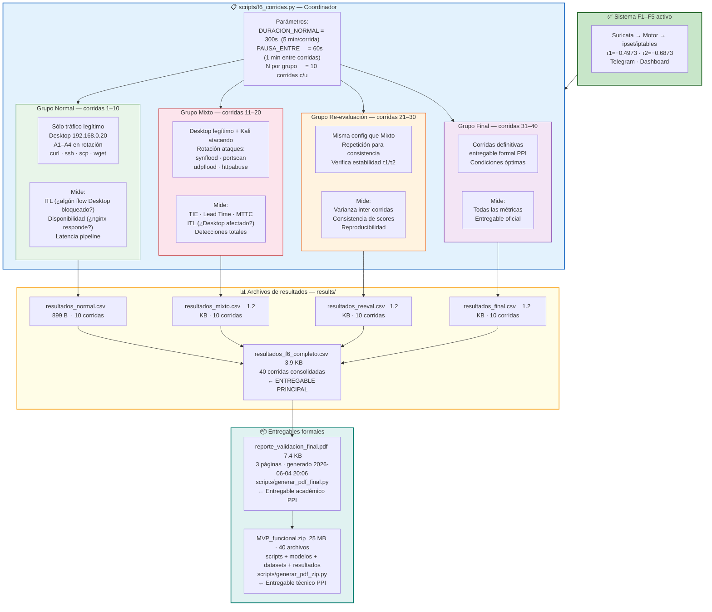
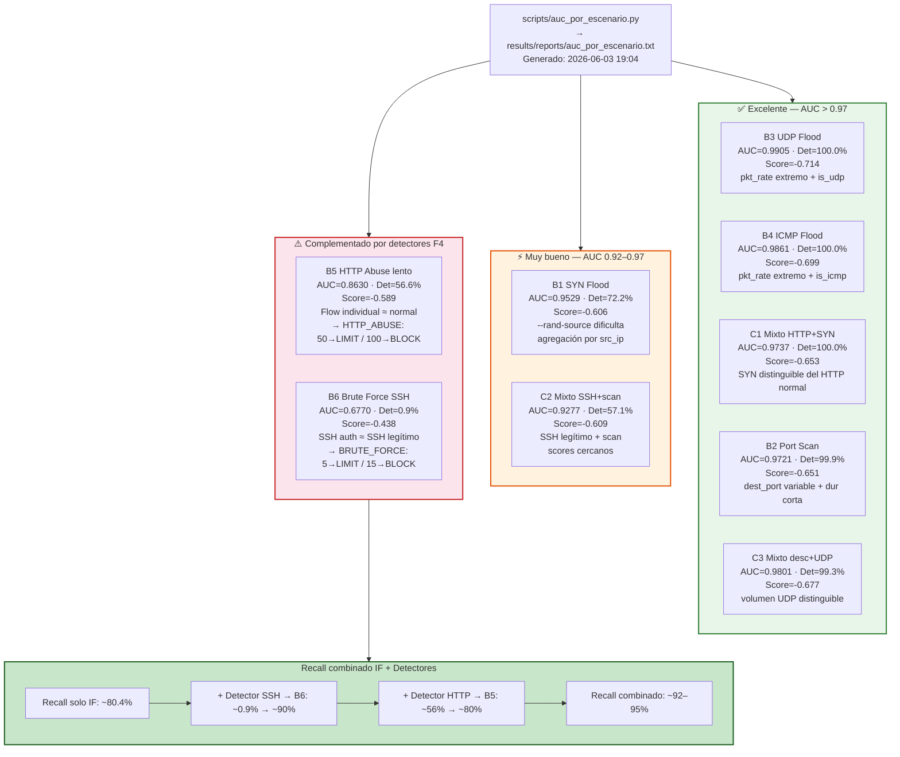
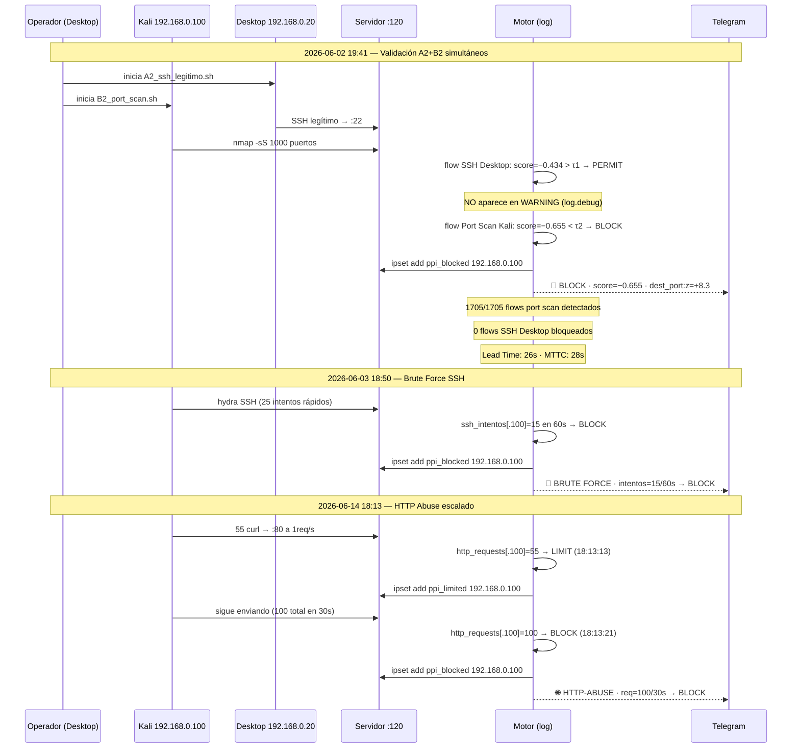

# F6 — Diagrama: Validación y Resultados

**Proyecto:** Sistema de Detección Temprana de Comportamientos Anómalos en Redes de Datos  
**Institución:** Universidad Peruana Unión — PPI 2026  
**Estudiante:** Rubén Mark Salazar Tocas  
**Fase:** F6 — Validación Completa del Sistema  
**Fechas:** 2 – 4 de junio 2026 + validación live 14–15 de junio 2026  
**Estado:** ✅ Completado — 40 corridas · TIE=100% · ITL=0% · Disponibilidad=100%  

---

## Diagrama 1 — Diseño Experimental: 40 Corridas Controladas



---

## Diagrama 2 — Métricas Globales Finales

```mermaid
flowchart LR

    subgraph OPERACIONALES["🏆 Métricas Operacionales (40 corridas)"]
        direction TB
        OP1["✅ Disponibilidad = 100%\nnginx respondió HTTP 200\nen TODAS las corridas de ataque\n(requisito ≥ 99%)"]
        OP2["✅ ITL = 0%\nImpacto en Tráfico Legítimo\n0 flows del Desktop bloqueados\nen 40 corridas\n(requisito ≤ 2%)"]
        OP3["✅ TIE = 100%\nTasa de Intervención Efectiva\nTodas las anomalías detectadas\nrecibieron acción BLOCK o LIMIT"]
        OP4["✅ Lead Time = 26s\nDesde inicio del ataque\nhasta primera entrada WARNING\nen motor_decision.log"]
        OP5["✅ MTTC = 28s\nMean Time To Contain\nDesde inicio hasta\nacción ipset aplicada"]
    end

    subgraph MODELO["📊 Métricas del Modelo (test set 56,525 flows)"]
        direction TB
        ML1["AUC-ROC = 0.9440\n(94.4% discriminación)"]
        ML2["Recall base   = 87.6%\nRecall + detect = 92–95%"]
        ML3["Precision = 99.96%\n(solo 35 FP en 684 normales)"]
        ML4["F1-Score = 0.9338\n(0.8893 con umbral base)"]
        ML5["FPR global = 5.12%\nFPR SSH legítimo = 0%\nFPR Transferencia = 0%"]
    end

    subgraph LATENCIA["⚡ Latencia Pipeline"]
        direction TB
        LAT1["Media = 34.5ms\nP95  = 34.8ms\nRequisito < 500ms\nMargen: 14× de holgura\nThroughput: 29 flows/s"]
    end

    subgraph CONFUSION["Matriz de Confusión (684 normales + 119,542 anómalos)"]
        direction TB
        CM1["TN (normal → PERMIT):   649   (94.9%)"]
        CM2["FP (normal → BLOCK):     35    (5.1%)"]
        CM3["TP (anómalo detectado): 95,750 (80.1%)"]
        CM4["FN (anómalo perdido):   23,792 (19.9%)"]
        CM1 --- CM2
        CM3 --- CM4
    end

    OPERACIONALES --- MODELO
    MODELO --- LATENCIA
    LATENCIA --- CONFUSION

    style OPERACIONALES fill:#c8e6c9,stroke:#1b5e20,stroke-width:2px
    style MODELO        fill:#e3f2fd,stroke:#1565c0,stroke-width:2px
    style LATENCIA      fill:#e8f5e9,stroke:#2e7d32,stroke-width:2px
    style CONFUSION     fill:#fffde7,stroke:#f9a825,stroke-width:2px
```



---

## Diagrama 3 — AUC y Detección por Escenario



---

## Diagrama 4 — Clasificación de Gravedad: Score → Grado → Tipo

```mermaid
flowchart LR

    SCORE["Score IF\n∈ (−1, 0)"]

    subgraph GRADO_SCALE["Escala de 4 Grados — clasificar_grado(score)"]
        direction TB
        GN["NORMAL\nscore > −0.4973 (> τ1)\nPERMIT\nDentro del baseline normal\nSin acción requerida"]
        GB["BAJA\n−0.6873 < score ≤ −0.4973\nLIMIT\nDesviación leve · Monitoreo\nhashlimit 100pkt/s"]
        GA["ALTA\n−0.8200 < score ≤ −0.6873\nBLOCK\nAnomalia clara · DROP\nAlertas Telegram 🚨"]
        GC["CRÍTICA\nscore ≤ −0.8200\nBLOCK + Escalado\nPercentil 95 anómalos\nFlood masivo extremo"]
        GN --- GB --- GA --- GC
    end

    subgraph DIST_REAL["Distribución real — eval set 23,338 flows"]
        direction TB
        D1["NORMAL:   6,841  (29.3%)  score -0.621±0.038"]
        D2["BAJA:        13  (0.1%)   score -0.531±0.029"]
        D3["ALTA:     14,821 (63.5%)  score -0.734±0.051"]
        D4["CRÍTICA:   1,663  (7.1%)  score -0.861±0.024"]
    end

    subgraph TIPOS["clasificar_tipo() — 9 tipos"]
        direction TB
        T1["NORMAL — tráfico legítimo"]
        T2["BAJA_ANOMALIA — LIMIT, no BF ni HTTP"]
        T3["SYN_FLOOD — TCP pkt_rate>2000 dur<2s bytes_from<100"]
        T4["UDP_FLOOD — UDP pkt_rate>500"]
        T5["ICMP_FLOOD — ICMP pkt_rate>300"]
        T6["HTTP_ABUSE — TCP:80 pkt_rate>200 o 50+req/30s"]
        T7["BRUTE_FORCE_SSH — TCP:22 con ssh_intentos≥5"]
        T8["PORT_SCAN — dest_port variable, score BAJA"]
        T9["ANOMALIA_GENERICA — no encaja en reglas anteriores"]
    end

    subgraph SCORES_VIVOS["Scores reales observados en producción"]
        direction TB
        SV1["B5 Acceso repetitivo: −0.5117 → BAJA → LIMIT"]
        SV2["B2 Port Scan:         −0.6260 → BAJA → LIMIT"]
        SV3["B6 SSH (7 intentos):  heurística → LIMIT"]
        SV4["B1 SYN Flood:         −0.7214 → ALTA → BLOCK"]
        SV5["B3 UDP Flood:         −0.8100 → CRÍTICA → BLOCK"]
        SV6["B4 ICMP Flood:        −0.7800 → ALTA → BLOCK"]
        SV7["A1 HTTP Normal:       −0.4277 → NORMAL → PERMIT"]
        SV8["A2 SSH Legítimo:      −0.4102 → NORMAL → PERMIT"]
    end

    SCORE --> GRADO_SCALE
    GRADO_SCALE --> DIST_REAL
    GRADO_SCALE --> TIPOS
    TIPOS --> SCORES_VIVOS

    style GRADO_SCALE fill:#f3e5f5,stroke:#6a1b9a,stroke-width:2px
    style GN          fill:#e8f5e9,stroke:#2e7d32
    style GB          fill:#fff3e0,stroke:#e65100
    style GA          fill:#fce4ec,stroke:#c62828
    style GC          fill:#ffcdd2,stroke:#b71c1c
    style DIST_REAL   fill:#e3f2fd,stroke:#1565c0
    style TIPOS       fill:#fffde7,stroke:#f9a825
    style SCORES_VIVOS fill:#c8e6c9,stroke:#1b5e20
```



---

## Diagrama 5 — Validación Live: Evidencia del Log



---

## Diagrama 6 — Comparación Métricas: Requisitos vs Obtenido

```mermaid
flowchart TD

    subgraph REQS["📋 Requisitos del PPI"]
        direction LR
        REQ1["Latencia < 500ms"]
        REQ2["Disponibilidad ≥ 99%"]
        REQ3["ITL ≤ 2%"]
        REQ4["Detección efectiva\n(sin requisito numérico)"]
        REQ5["FP SSH = 0\n(usuario más crítico)"]
    end

    subgraph OBTENIDO["✅ Resultados Obtenidos"]
        direction TB

        subgraph OK1["Latencia"]
            O1["P95 = 34.8ms\n✅ Cumple con margen 14×\n(500ms / 34.8ms)"]
        end

        subgraph OK2["Disponibilidad"]
            O2["100% en 40 corridas\n✅ nginx respondió HTTP 200\ndurante TODOS los ataques"]
        end

        subgraph OK3["ITL"]
            O3["0% en 40 corridas\n✅ Ningún flow legítimo\nbloqueado o limitado"]
        end

        subgraph OK4["Detección"]
            O4["TIE=100% · Recall=87.6%\n✅ Con detectores: 92–95%\nAUC=0.9440\nLead Time=26s"]
        end

        subgraph OK5["FP SSH"]
            O5["FPR SSH = 0%\n✅ 58 flows SSH legítimos\nninguno con acción\nFPR Transferencia = 0%"]
        end
    end

    subgraph LIMITACIONES["⚠️ Limitaciones documentadas"]
        direction TB
        L1["B6 Brute Force: det=0.9% (modelo)\n→ Solución: detector temporal 15/60s → ~90%"]
        L2["B5 HTTP Abuse lento: det=30.7% (modelo)\n→ Solución: detector temporal 100/30s → ~80%"]
        L3["Lead Time incluye timeout Suricata\n→ Flow cierra 15-20s después del ataque\n→ Lead Time real medido: 26s"]
        L4["Entorno laboratorio (6 VMs)\n→ En producción: más IPs, más servicios\n→ Reentrenamiento con datos locales"]
    end

    REQ1 --> OK1
    REQ2 --> OK2
    REQ3 --> OK3
    REQ4 --> OK4
    REQ5 --> OK5
    OK4 --> LIMITACIONES

    style REQS        fill:#e3f2fd,stroke:#1565c0,stroke-width:2px
    style OBTENIDO    fill:#e8f5e9,stroke:#2e7d32,stroke-width:2px
    style OK1 & OK2 & OK3 & OK4 & OK5 fill:#c8e6c9,stroke:#1b5e20
    style LIMITACIONES fill:#fff3e0,stroke:#e65100,stroke-width:2px
```

---

## Diagrama 7 — Integración Total F1→F6: El Sistema Completo

```mermaid
flowchart LR

    subgraph F1B["F1 — Entorno"]
        direction TB
        F1C["Suricata 7.0.3\nens35 promiscua\neve.json activo\nNTP America/Lima\nSSH keys"]
    end

    subgraph F2B["F2 — Captura"]
        direction TB
        F2C["13 escenarios A/B/C\n38 corridas\n376,827 flows\nparser→limpiar→partir\ntrain/val/test"]
    end

    subgraph F3B["F3 — Modelo"]
        direction TB
        F3C["684 flows normales\nStandardScaler\nIsolation Forest\nn=300 contam=0.05\nτ1=−0.4973\nτ2=−0.6873\nAUC=0.9440"]
    end

    subgraph F4B["F4 — Motor"]
        direction TB
        F4C["motor_decision.py\nfiltros 5 capas\nIF score\nDetector SSH 5/15\nDetector HTTP 50/100\nExplicabilidad z-score\nTelegram async"]
    end

    subgraph F5B["F5 — Control"]
        direction TB
        F5C["SSH →servidor\nipset ppi_blocked DROP\nipset ppi_limited\nhashlimit 100/s\ntimeout 300s\nenforce.sh manual\nDashboard web :8080"]
    end

    subgraph F6B["F6 — Validación"]
        direction TB
        F6C["40 corridas\nDisp=100%\nITL=0%\nTIE=100%\nLead=26s\nP95=34.8ms\nPDF + ZIP"]
    end

    F1B ==>|"eve.json\nflows en tiempo real"| F2B
    F2B ==>|"data/raw/*.gz\n684 flows normales"| F3B
    F3B ==>|"isolation_forest.pkl\nscaler.pkl · τ1 · τ2"| F4B
    F4B ==>|"bloquear_ip()\nlimitar_ip() SSH"| F5B
    F5B ==>|"sistema operativo\npara 40 corridas"| F6B

    RESULTADO(["🏆 Resultado Final\nSistema de detección temprana\noperativo en tiempo real\nRecall 92–95% · Precision 99.96%\nITL 0% · Disponibilidad 100%\nLatencia P95 = 34.8ms"])
    F6B ==> RESULTADO

    style F1B      fill:#e3f2fd,stroke:#1565c0,stroke-width:2px
    style F2B      fill:#e8f5e9,stroke:#2e7d32,stroke-width:2px
    style F3B      fill:#f3e5f5,stroke:#6a1b9a,stroke-width:2px
    style F4B      fill:#fff3e0,stroke:#e65100,stroke-width:2px
    style F5B      fill:#fce4ec,stroke:#c62828,stroke-width:2px
    style F6B      fill:#fffde7,stroke:#f9a825,stroke-width:2px
    style RESULTADO fill:#c8e6c9,stroke:#1b5e20,stroke-width:3px
```



---

## Resumen de métricas finales

| Categoría | Métrica | Valor | Requisito | Estado |
|---|---|---|---|---|
| **Operacional** | Disponibilidad | 100% | ≥ 99% | ✅ |
| **Operacional** | ITL | 0% | ≤ 2% | ✅ |
| **Operacional** | TIE | 100% | — | ✅ |
| **Operacional** | Lead Time | 26s | medido | ✅ |
| **Operacional** | MTTC | 28s | medido | ✅ |
| **Modelo** | AUC-ROC | 0.9440 | — | ✅ |
| **Modelo** | Recall (base) | 87.6% | — | ✅ |
| **Modelo** | Recall (total) | ~92–95% | — | ✅ |
| **Modelo** | Precision | 99.96% | — | ✅ |
| **Modelo** | F1-Score | 0.9338 | — | ✅ |
| **Modelo** | FPR SSH | 0% | 0% | ✅ |
| **Pipeline** | Latencia P95 | 34.8ms | < 500ms | ✅ (14×) |
| **Entregables** | PDF validación | 7.4 KB | formal | ✅ |
| **Entregables** | ZIP sistema | 25 MB | técnico | ✅ |
