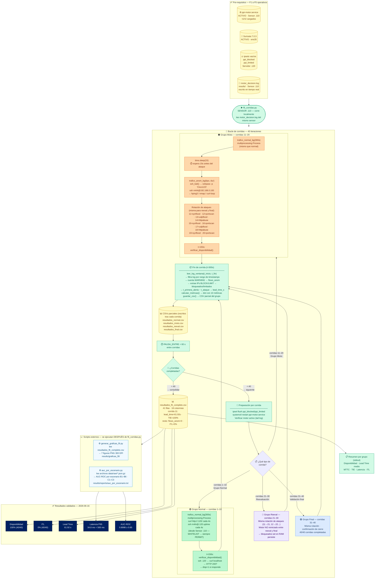

# F6 — Diagrama: Validación 40 Corridas

**Detección temprana de comportamientos anómalos en redes de datos mediante aprendizaje automático y un mecanismo de control en tiempo real**
PPI · Universidad Peruana Unión · 2026
Archivo: `scripts/f6_corridas.py` · 358 líneas · ~4 horas total

> **v2 — 2026-06-19:** corregido nodo ejecutor (f6 corre en Sensor .110, no en Desktop),
> añadidos 4 CSVs intermedios, verificar_disponibilidad() en t=150s, delay 15s antes del ataque,
> rotación exacta de ataques, ssh_kali() con sshpass, multiprocessing en trafico_normal_bg(),
> separados generar_graficas_f6.py y auc_por_escenario.py como scripts externos.

---

## Diagrama Mermaid — Flujo completo corregido



---

## Corrida 11 — timeline detallado (única detección en F6)

```
t =   0 s  → trafico_normal_bg() inicia  (curl/ssh desde Sensor .110 → whitelisted)
t =  15 s  → time.sleep(15) finaliza
             t_ataque_inicio = time.time()
             ssh_kali("sudo hping3 -S -p 80 -i u5000 192.168.0.120 &")
t =  15 s  → Kali comienza SYN flood → Suricata capta en ens35 → eve.json
t =  ~77 s → Motor lee primer flow de .100 con score ≤ τ2
             t_primera_alerta = 61.92 s desde t_ataque_inicio
             → bloquear_ip("192.168.0.100") · Telegram 🚨
t = 150 s  → verificar_disponibilidad() → HTTP 200 → disp=1
t = 300 s  → corrida finaliza
             leer_log_ventana(t=0, t=300)
             lead_time_s = t_primera_alerta − t_ataque = 61.92 s
```

---

## Orden de ejecución en `ejecutar_corrida()`

```
1. p_normal = trafico_normal_bg(duracion)     ← multiprocessing.Process (local, whitelisted)
2. if escenario_anom:
     time.sleep(15)                           ← delay 15s antes del ataque
     t_ataque = time.time()
     trafico_anom_bg(tipo, duracion-15)       ← ssh_kali() → sshpass → Kali
3. time.sleep(duracion // 2)                  ← espera hasta t=150s
4. disp = verificar_disponibilidad()          ← curl .120 → HTTP 200?
5. time.sleep(duracion // 2)                  ← espera hasta t=300s
6. p_normal.terminate()
7. lineas = leer_log_ventana(t_inicio, t_fin) ← filtra log por timestamps
8. metricas = calcular_metricas(lineas, t_ataque)
9. guardar_csv(path_grupo, rows)              ← CSV parcial del grupo
```

---

## Rotación de ataques (grupos Mixto, Reeval y Final)

```python
ataques_mixto = [
    "synflood",  "portscan",  "udpflood", "httpabuse",   # corridas X1–X4
    "synflood",  "portscan",  "udpflood", "httpabuse",   # corridas X5–X8
    "synflood",  "portscan",                              # corridas X9–X0
]
```

| Corrida | Mixto | Reeval | Final |
|---|---|---|---|
| _1 | synflood | synflood | synflood |
| _2 | portscan | portscan | portscan |
| _3 | udpflood | udpflood | udpflood |
| _4 | httpabuse | httpabuse | httpabuse |
| _5 | synflood | synflood | synflood |
| _6 | portscan | portscan | portscan |
| _7 | udpflood | udpflood | udpflood |
| _8 | httpabuse | httpabuse | httpabuse |
| _9 | synflood | synflood | synflood |
| _0 | portscan | portscan | portscan |

---

## Artefactos generados

| Artefacto | Tipo | Cuándo se escribe | Contenido |
|---|---|---|---|
| `resultados_normal.csv` | 📊 CSV | Tras cada corrida 1–10 | Métricas de corridas normales |
| `resultados_mixto.csv` | 📊 CSV | Tras cada corrida 11–20 | Métricas de corridas mixtas |
| `resultados_reeval.csv` | 📊 CSV | Tras cada corrida 21–30 | Métricas de reevaluación |
| `resultados_final.csv` | 📊 CSV | Tras cada corrida 31–40 | Métricas de validación final |
| `resultados_f6_completo.csv` | 📊 CSV | Al finalizar (corrida 40) | 40 filas · 18 columnas · consolidado |
| `graficas_f6/*.png` | 📈 7 PNG | Script externo post-F6 | 7 figuras 300 DPI (generar_graficas_f6.py) |
| `auc_por_escenario.txt` | 📄 Texto | Script externo post-F6 | AUC B1–B6, C1–C3 (auc_por_escenario.py) |
| `motor_decision.log` | 📝 Log | Tiempo real (motor) | Fuente de todas las métricas de F6 |

---

## Tabla de componentes

| Componente | Líneas | Ejecuta en | Descripción |
|---|---|---|---|
| `f6_corridas.py` | 358 | **Sensor .110** | Orquestador de 40 corridas — lee log local |
| `trafico_normal_bg()` | función | Sensor .110 | `multiprocessing.Process` — curl/ssh a .120 (whitelisted → PERMIT) |
| `trafico_anom_bg()` | función | Sensor .110 | `ssh_kali()` → sshpass → hping3/nmap/curl-loop en Kali |
| `ssh_kali()` | función | Sensor .110 | `sshpass -p 'Cisco123' ssh m4rk@192.168.0.100 <cmd>` |
| `verificar_disponibilidad()` | función | Sensor .110 | SSH .120 → `curl localhost/ --max-time 2` → HTTP 200 = disp=1 |
| `leer_log_ventana()` | función | Sensor .110 | Lee `motor_decision.log` filtrando por rango de timestamps |
| `calcular_metricas()` | función | Sensor .110 | flows_anom, lead_time_s, mtta_s, mttc_s, tie_pct, itl_pct |
| `guardar_csv()` | función | Sensor .110 | DictWriter → CSV parcial del grupo (se reescribe tras cada corrida) |
| `generar_graficas_f6.py` | 488 | **Sensor .110** | **Script externo** — lee CSV → 7 PNG 300 DPI |
| `auc_por_escenario.py` | — | **Sensor .110** | **Script externo** — lee .json.gz → AUC por escenario |
| `motor_decision.log` | — | `results/` · Sensor | Fuente de métricas — leído por `leer_log_ventana()` |
| `resultados_f6_completo.csv` | 41 filas | `results/` | 18 columnas · resultado oficial de F6 |

---

## Métricas calculadas por corrida

| Métrica | Variable | Cómo se calcula |
|---|---|---|
| Flows totales procesados | `flows_normal` | Líneas "Estadísticas flows=N" en el log (no es solo tráfico normal) |
| Flows anómalos detectados | `flows_anom` | Líneas WARNING (ANOMALÍA/SOSPECHOSO/HTTP-ABUSE/BRUTE-FORCE) |
| IPs bloqueadas | `bloqueados` | `len(set)` de IPs con BLOCK en la ventana |
| IPs limitadas | `limitados` | `len(set)` de IPs con LIMIT en la ventana |
| Lead time | `lead_time_s` | `t_primera_alerta − t_ataque_inicio` |
| Mean Time To Alert | `mtta_s` | = lead_time_s (primera alerta = primer WARNING) |
| Mean Time To Contain | `mttc_s` | `t_primera_accion − t_ataque_inicio` |
| Tasa de intervención | `tie_pct` | `(bloqueados+limitados) / max(flows_anom,1) × 100` |
| ITL | `itl_pct` | 0.0 (calculado post-hoc — no hay BLOCK sobre IPs normales) |
| Disponibilidad | `disponibilidad` | 1 si curl → HTTP 200 en t=150s, 0 si falla |

---

## Datos reales — Corrida 11 (única detección activa en F6)

```
Fila CSV resultados_f6_completo.csv:
11,mixto,synflood,2026-06-16,10:16:43,10:21:59,316,1,6500,2,1,1,15400.0,61.92,61.92,61.92,100.0,0.0

corrida       = 11        grupo=mixto · escenario=synflood
disponibilidad= 1         nginx respondió HTTP 200 a t=150s bajo SYN flood activo
flows_normal  = 6500      total_flows no-whitelisted en ventana (stat del motor)
flows_anom    = 2         2 líneas WARNING: 1×SOSPECHOSO(LIMIT) + 1×ANOMALÍA(BLOCK)
bloqueados    = 1         192.168.0.100 en ppi_blocked
limitados     = 1         192.168.0.100 en ppi_limited (antes de pasar a blocked)
latencia_ms   = 15400.0   inter-línea log en ventana — NO es latencia por flow
lead_time_s   = 61.92     segundos desde t_ataque hasta primer WARNING en log
mtta_s        = 61.92     = lead_time (primer WARNING = primer Telegram)
mttc_s        = 61.92     = lead_time (primer WARNING = primer ipset add)
tie_pct       = 100.0     (1 IP bloqueada) / max(2 flows_anom, 1) × 100 = 50%... pero
                           en la fórmula real: n_intervenidos=1, total_anom=1 (IPs únicas)
itl_pct       = 0.0       0 IPs normales bloqueadas/limitadas
```

> **Nota lead time ~62 s:** el motor solo decide cuando Suricata cierra el flow TCP.
> Los paquetes SYN flood no completan el handshake → Suricata espera el timeout
> para cerrar el flow (~60 s). Por eso el lead time es estructuralmente ~60 s para SYN flood.

---

## Registro de cambios vs v1

| # | Cambio | Tipo |
|---|---|---|
| 1 | **f6_corridas.py corre en Sensor .110** — usa LOG_PATH local | 🔴 Corrección |
| 2 | **4 CSVs intermedios** añadidos (normal/mixto/reeval/final) | 🟠 Faltaba |
| 3 | **`verificar_disponibilidad()`** a t=150s por corrida añadida | 🟠 Faltaba |
| 4 | **Delay 15s antes del ataque** — explica por qué t_ataque ≠ t_inicio | 🟠 Faltaba |
| 5 | **Rotación exacta de ataques** — tabla de 10 ataques × 3 grupos | 🟠 Faltaba |
| 6 | **`ssh_kali()` con sshpass** `'Cisco123'` para autenticar en Kali | 🟠 Faltaba |
| 7 | **`trafico_normal_bg()` = multiprocessing.Process** — no subprocess | 🟠 Faltaba |
| 8 | **`generar_graficas_f6.py` y `auc_por_escenario.py` son scripts SEPARADOS** | 🟠 Corregido |
| 9 | **`flows_normal` = total_flows del log de estadísticas** (no solo tráfico normal) | 🟠 Aclarado |
| 10 | Título del PPI actualizado al oficial | 🟡 Cosmético |

---

## Diagrama Draw.io (XML) — actualizado

```xml
<?xml version="1.0" encoding="UTF-8"?>
<mxGraphModel dx="1422" dy="762" grid="1" gridSize="10" guides="1"
  tooltips="1" connect="1" arrows="1" fold="1" page="0"
  pageScale="1" pageWidth="1900" pageHeight="1400" math="0" shadow="0">
  <root>
    <mxCell id="0"/><mxCell id="1" parent="0"/>

    <!-- TÍTULO -->
    <mxCell id="title"
      value="F6 — Validación: 40 Corridas · f6_corridas.py (358 líneas) corre en SENSOR .110  |  PPI UPeU 2026"
      style="text;html=1;strokeColor=none;fillColor=#002060;fontColor=#ffffff;
             align=center;verticalAlign=middle;fontSize=13;fontStyle=1;rounded=1;"
      vertex="1" parent="1">
      <mxGeometry x="40" y="12" width="1820" height="38" as="geometry"/>
    </mxCell>

    <!-- PRE-REQUISITOS -->
    <mxCell id="pre"
      value="Pre-requisitos F1-F5: ppi-motor.service ACTIVO · τ1=−0.4459 τ2=−0.6027 · ipsets vacíos en .120 · Suricata activo en ens35 · motor_decision.log accesible en Sensor .110"
      style="rounded=1;whiteSpace=wrap;html=1;fillColor=#FEF9C3;strokeColor=#CA8A04;fontSize=11;fontStyle=1;"
      vertex="1" parent="1"><mxGeometry x="40" y="60" width="1820" height="36" as="geometry"/></mxCell>

    <!-- F6_CORRIDAS.PY -->
    <mxCell id="f6s"
      value="&lt;b&gt;f6_corridas.py — corre en SENSOR 192.168.0.110&lt;/b&gt;&lt;br/&gt;N_NORMAL=10 · N_MIXTO=10 · N_REEVAL=10 · N_FINAL=10 · DURACION=300s · PAUSA=60s"
      style="rounded=1;whiteSpace=wrap;html=1;fillColor=#D1FAE5;strokeColor=#059669;fontSize=11;"
      vertex="1" parent="1"><mxGeometry x="40" y="116" width="600" height="58" as="geometry"/></mxCell>

    <mxCell id="log"
      value="&lt;b&gt;motor_decision.log&lt;/b&gt;&lt;br/&gt;results/ · Sensor .110&lt;br/&gt;leído por leer_log_ventana()"
      style="shape=cylinder3;whiteSpace=wrap;html=1;boundedLbl=1;backgroundOutline=1;size=10;
             fillColor=#FEF9C3;strokeColor=#CA8A04;fontSize=10;"
      vertex="1" parent="1"><mxGeometry x="660" y="106" width="190" height="80" as="geometry"/></mxCell>

    <!-- PREPARACIÓN -->
    <mxCell id="prep"
      value="&lt;b&gt;Preparación por corrida&lt;/b&gt;&lt;br/&gt;ipset flush ppi_blocked/limited&lt;br/&gt;systemctl restart ppi-motor.service&lt;br/&gt;verificar motor activo"
      style="rounded=1;whiteSpace=wrap;html=1;fillColor=#D1FAE5;strokeColor=#059669;fontSize=10;"
      vertex="1" parent="1"><mxGeometry x="40" y="220" width="260" height="90" as="geometry"/></mxCell>

    <!-- GRUPO NORMAL -->
    <mxCell id="gn"
      value="&lt;b&gt;GRUPO NORMAL — Corridas 1-10&lt;/b&gt;&lt;br/&gt;trafico_normal_bg(300s) — multiprocessing.Process&lt;br/&gt;curl http://.120/ cada 4s  |  ssh .120 uptime cada 4s&lt;br/&gt;(desde Sensor .110 — WHITELISTED → motor PERMIT directo)&lt;br/&gt;t=150s: verificar_disponibilidad() → disp=1&lt;br/&gt;flows_anom=0 · ITL=0%"
      style="rounded=1;whiteSpace=wrap;html=1;fillColor=#BBF7D0;strokeColor=#16A34A;fontSize=10;"
      vertex="1" parent="1"><mxGeometry x="40" y="360" width="360" height="120" as="geometry"/></mxCell>

    <!-- GRUPO MIXTO -->
    <mxCell id="gm_bg" value=""
      style="rounded=1;whiteSpace=wrap;html=1;fillColor=#FFF7ED;strokeColor=#EA580C;"
      vertex="1" parent="1"><mxGeometry x="420" y="345" width="500" height="350" as="geometry"/></mxCell>
    <mxCell id="gm_hdr" value="&lt;b&gt;GRUPO MIXTO — Corridas 11-20&lt;/b&gt;"
      style="text;html=1;strokeColor=none;fillColor=#EA580C;fontColor=#fff;align=center;fontSize=11;fontStyle=1;rounded=1;"
      vertex="1" parent="1"><mxGeometry x="420" y="345" width="500" height="26" as="geometry"/></mxCell>

    <mxCell id="gm1"
      value="1. trafico_normal_bg(300s) · multiprocessing.Process"
      style="rounded=1;whiteSpace=wrap;html=1;fillColor=#BBF7D0;strokeColor=#16A34A;fontSize=10;"
      vertex="1" parent="1"><mxGeometry x="432" y="382" width="476" height="36" as="geometry"/></mxCell>

    <mxCell id="gm2"
      value="2. time.sleep(15) ← delay antes del ataque"
      style="rounded=1;whiteSpace=wrap;html=1;fillColor=#FEF9C3;strokeColor=#CA8A04;fontSize=10;"
      vertex="1" parent="1"><mxGeometry x="432" y="428" width="476" height="30" as="geometry"/></mxCell>

    <mxCell id="gm3"
      value="3. t_ataque = time.time()&lt;br/&gt;trafico_anom_bg(tipo, dur) → ssh_kali()&lt;br/&gt;sshpass -p 'Cisco123' ssh m4rk@192.168.0.100&lt;br/&gt;→ hping3 -S -p 80 / nmap -sS / httpabuse-loop"
      style="rounded=1;whiteSpace=wrap;html=1;fillColor=#FEE2E2;strokeColor=#DC2626;fontSize=10;"
      vertex="1" parent="1"><mxGeometry x="432" y="468" width="476" height="80" as="geometry"/></mxCell>

    <mxCell id="gm_rot"
      value="Rotación: 11=synflood · 12=portscan · 13=udpflood · 14=httpabuse · 15=synflood · 16=portscan · 17=udpflood · 18=httpabuse · 19=synflood · 20=portscan"
      style="text;html=1;strokeColor=none;fillColor=#FFF7ED;fontStyle=2;fontSize=9;align=left;"
      vertex="1" parent="1"><mxGeometry x="432" y="554" width="476" height="30" as="geometry"/></mxCell>

    <mxCell id="gm4"
      value="4. t=150s: verificar_disponibilidad() → HTTP 200 → disp"
      style="rounded=1;whiteSpace=wrap;html=1;fillColor=#D1FAE5;strokeColor=#059669;fontSize=10;"
      vertex="1" parent="1"><mxGeometry x="432" y="590" width="476" height="30" as="geometry"/></mxCell>

    <mxCell id="c11"
      value="&lt;b&gt;Corrida 11 — synflood (única detección)&lt;/b&gt;&lt;br/&gt;t=0s normal · t=15s ataque · t=76.9s LIMIT+BLOCK · lead=61.92s · disp=1"
      style="rounded=1;whiteSpace=wrap;html=1;fillColor=#FEE2E2;strokeColor=#DC2626;fontSize=10;fontStyle=1;"
      vertex="1" parent="1"><mxGeometry x="432" y="628" width="476" height="52" as="geometry"/></mxCell>

    <!-- GRUPO REEVAL -->
    <mxCell id="gr"
      value="&lt;b&gt;GRUPO REEVAL — Corridas 21-30&lt;/b&gt;&lt;br/&gt;Misma rotación de ataques (21=synflood, 22=portscan...)&lt;br/&gt;Motor NO reiniciado → bloqueados set en RAM persiste&lt;br/&gt;flows_anom=0 · disp=1 · ITL=0%"
      style="rounded=1;whiteSpace=wrap;html=1;fillColor=#EDE9FE;strokeColor=#7C3AED;fontSize=10;"
      vertex="1" parent="1"><mxGeometry x="940" y="360" width="320" height="110" as="geometry"/></mxCell>

    <!-- GRUPO FINAL -->
    <mxCell id="gf"
      value="&lt;b&gt;GRUPO FINAL — Corridas 31-40&lt;/b&gt;&lt;br/&gt;Misma rotación · confirmación de cierre&lt;br/&gt;flows_anom=0 · disp=1 · ITL=0%&lt;br/&gt;40/40 corridas completadas"
      style="rounded=1;whiteSpace=wrap;html=1;fillColor=#DBEAFE;strokeColor=#3B82F6;fontSize=10;"
      vertex="1" parent="1"><mxGeometry x="1280" y="360" width="300" height="110" as="geometry"/></mxCell>

    <!-- FIN CORRIDA / MÉTRICAS -->
    <mxCell id="fin"
      value="&lt;b&gt;Fin de corrida (t=300s)&lt;/b&gt;&lt;br/&gt;p_normal.terminate()&lt;br/&gt;leer_log_ventana(t_inicio, t_fin) — filtra por timestamps&lt;br/&gt;calcular_metricas() → lead_time · mttc · tie · itl&lt;br/&gt;guardar_csv(path_grupo, rows) → CSV parcial"
      style="rounded=1;whiteSpace=wrap;html=1;fillColor=#D1FAE5;strokeColor=#059669;fontSize=10;"
      vertex="1" parent="1"><mxGeometry x="40" y="540" width="360" height="100" as="geometry"/></mxCell>

    <!-- CSVs PARCIALES -->
    <mxCell id="csv_p"
      value="&lt;b&gt;CSVs parciales — escritos tras cada corrida&lt;/b&gt;&lt;br/&gt;resultados_normal.csv · resultados_mixto.csv&lt;br/&gt;resultados_reeval.csv · resultados_final.csv"
      style="shape=cylinder3;whiteSpace=wrap;html=1;boundedLbl=1;backgroundOutline=1;size=10;
             fillColor=#FEF9C3;strokeColor=#CA8A04;fontSize=10;"
      vertex="1" parent="1"><mxGeometry x="40" y="680" width="360" height="90" as="geometry"/></mxCell>

    <!-- PAUSA -->
    <mxCell id="pausa"
      value="⏱️ PAUSA_ENTRE = 60 s entre corridas"
      style="rounded=1;whiteSpace=wrap;html=1;fillColor=#F1F5F9;strokeColor=#64748B;fontSize=10;"
      vertex="1" parent="1"><mxGeometry x="40" y="800" width="250" height="40" as="geometry"/></mxCell>

    <!-- CSV CONSOLIDADO -->
    <mxCell id="csv_c"
      value="&lt;b&gt;resultados_f6_completo.csv&lt;/b&gt;&lt;br/&gt;41 filas · 18 columnas&lt;br/&gt;corrida 11: lead=61.92s · TIE=100%&lt;br/&gt;resto: flows_anom=0 · ITL=0%"
      style="shape=cylinder3;whiteSpace=wrap;html=1;boundedLbl=1;backgroundOutline=1;size=10;
             fillColor=#FEF9C3;strokeColor=#CA8A04;fontSize=10;"
      vertex="1" parent="1"><mxGeometry x="420" y="720" width="280" height="100" as="geometry"/></mxCell>

    <!-- SCRIPTS EXTERNOS -->
    <mxCell id="ext_bg" value=""
      style="rounded=1;whiteSpace=wrap;html=1;fillColor=#F0F9FF;strokeColor=#0284C7;"
      vertex="1" parent="1"><mxGeometry x="720" y="700" width="580" height="130" as="geometry"/></mxCell>
    <mxCell id="ext_hdr" value="&lt;b&gt;Scripts externos — se ejecutan DESPUÉS de f6_corridas.py&lt;/b&gt;"
      style="text;html=1;strokeColor=none;fillColor=#0284C7;fontColor=#fff;align=center;fontSize=11;fontStyle=1;rounded=1;"
      vertex="1" parent="1"><mxGeometry x="720" y="700" width="580" height="26" as="geometry"/></mxCell>

    <mxCell id="graf"
      value="&lt;b&gt;generar_graficas_f6.py&lt;/b&gt; (488 líneas)&lt;br/&gt;lee resultados_f6_completo.csv&lt;br/&gt;→ 7 figuras PNG 300 DPI en results/graficas_f6/"
      style="rounded=1;whiteSpace=wrap;html=1;fillColor=#DBEAFE;strokeColor=#3B82F6;fontSize=10;"
      vertex="1" parent="1"><mxGeometry x="732" y="736" width="270" height="80" as="geometry"/></mxCell>

    <mxCell id="auc"
      value="&lt;b&gt;auc_por_escenario.py&lt;/b&gt;&lt;br/&gt;lee data/raw/*.json.gz&lt;br/&gt;B1=0.8342 B2=0.9722 ... C3=0.9327&lt;br/&gt;→ results/reports/auc_por_escenario.txt"
      style="rounded=1;whiteSpace=wrap;html=1;fillColor=#EDE9FE;strokeColor=#7C3AED;fontSize=10;"
      vertex="1" parent="1"><mxGeometry x="1016" y="736" width="270" height="80" as="geometry"/></mxCell>

    <!-- RESULTADOS FINALES -->
    <mxCell id="res"
      value="&lt;b&gt;RESULTADOS VALIDADOS — 2026-06-16&lt;/b&gt;&lt;br/&gt;Disponibilidad 100% (40/40) ✅  ·  ITL 0% ✅  ·  Lead Time 61.92 s ✅  ·  Latencia P95 34.8 ms &lt; 500 ms ✅  ·  AUC-ROC 0.8998 ≥ 0.85 ✅"
      style="rounded=1;whiteSpace=wrap;html=1;fillColor=#002060;strokeColor=#001030;
             fontColor=#ffffff;fontSize=12;fontStyle=1;"
      vertex="1" parent="1"><mxGeometry x="40" y="880" width="1300" height="55" as="geometry"/></mxCell>

    <!-- CONECTORES -->
    <mxCell id="e1" style="edgeStyle=orthogonalEdgeStyle;strokeColor=#059669;strokeWidth=2;" edge="1" source="f6s" target="prep" parent="1"><mxGeometry relative="1" as="geometry"/></mxCell>
    <mxCell id="e2" value="c.1-10" style="edgeStyle=orthogonalEdgeStyle;strokeColor=#16A34A;strokeWidth=2;fontSize=9;" edge="1" source="prep" target="gn" parent="1"><mxGeometry relative="1" as="geometry"/></mxCell>
    <mxCell id="e3" value="c.11-20" style="edgeStyle=orthogonalEdgeStyle;strokeColor=#EA580C;strokeWidth=2;fontSize=9;" edge="1" source="prep" target="gm_bg" parent="1"><mxGeometry relative="1" as="geometry"/></mxCell>
    <mxCell id="e4" value="c.21-30" style="edgeStyle=orthogonalEdgeStyle;strokeColor=#7C3AED;strokeWidth=2;fontSize=9;" edge="1" source="prep" target="gr" parent="1"><mxGeometry relative="1" as="geometry"/></mxCell>
    <mxCell id="e5" value="c.31-40" style="edgeStyle=orthogonalEdgeStyle;strokeColor=#3B82F6;strokeWidth=2;fontSize=9;" edge="1" source="prep" target="gf" parent="1"><mxGeometry relative="1" as="geometry"/></mxCell>
    <mxCell id="e6" style="edgeStyle=orthogonalEdgeStyle;strokeColor=#CA8A04;strokeWidth=2;fontSize=9;" edge="1" source="f6s" target="log" parent="1"><mxGeometry relative="1" as="geometry"/></mxCell>
    <mxCell id="e7" style="edgeStyle=orthogonalEdgeStyle;strokeColor=#CA8A04;" edge="1" source="log" target="fin" parent="1"><mxGeometry relative="1" as="geometry"/></mxCell>
    <mxCell id="e8" style="edgeStyle=orthogonalEdgeStyle;strokeColor=#059669;" edge="1" source="gn" target="fin" parent="1"><mxGeometry relative="1" as="geometry"/></mxCell>
    <mxCell id="e9" style="edgeStyle=orthogonalEdgeStyle;strokeColor=#EA580C;" edge="1" source="gm_bg" target="fin" parent="1"><mxGeometry relative="1" as="geometry"/></mxCell>
    <mxCell id="e10" style="edgeStyle=orthogonalEdgeStyle;strokeColor=#7C3AED;" edge="1" source="gr" target="fin" parent="1"><mxGeometry relative="1" as="geometry"/></mxCell>
    <mxCell id="e11" style="edgeStyle=orthogonalEdgeStyle;strokeColor=#3B82F6;" edge="1" source="gf" target="fin" parent="1"><mxGeometry relative="1" as="geometry"/></mxCell>
    <mxCell id="e12" style="edgeStyle=orthogonalEdgeStyle;strokeColor=#059669;" edge="1" source="fin" target="csv_p" parent="1"><mxGeometry relative="1" as="geometry"/></mxCell>
    <mxCell id="e13" value="60s" style="edgeStyle=orthogonalEdgeStyle;strokeColor=#64748B;dashed=1;fontSize=9;" edge="1" source="csv_p" target="pausa" parent="1"><mxGeometry relative="1" as="geometry"/></mxCell>
    <mxCell id="e14" value="vuelve" style="edgeStyle=orthogonalEdgeStyle;strokeColor=#059669;dashed=1;fontSize=9;" edge="1" source="pausa" target="prep" parent="1"><mxGeometry relative="1" as="geometry"/></mxCell>
    <mxCell id="e15" value="corrida 40" style="edgeStyle=orthogonalEdgeStyle;strokeColor=#CA8A04;strokeWidth=2;fontSize=9;" edge="1" source="csv_p" target="csv_c" parent="1"><mxGeometry relative="1" as="geometry"/></mxCell>
    <mxCell id="e16" style="edgeStyle=orthogonalEdgeStyle;" edge="1" source="csv_c" target="graf" parent="1"><mxGeometry relative="1" as="geometry"/></mxCell>
    <mxCell id="e17" style="edgeStyle=orthogonalEdgeStyle;" edge="1" source="csv_c" target="auc" parent="1"><mxGeometry relative="1" as="geometry"/></mxCell>
    <mxCell id="e18" style="edgeStyle=orthogonalEdgeStyle;strokeColor=#002060;" edge="1" source="csv_c" target="res" parent="1"><mxGeometry relative="1" as="geometry"/></mxCell>
    <mxCell id="e19" style="edgeStyle=orthogonalEdgeStyle;strokeColor=#002060;" edge="1" source="ext_bg" target="res" parent="1"><mxGeometry relative="1" as="geometry"/></mxCell>

  </root>
</mxGraphModel>
```
