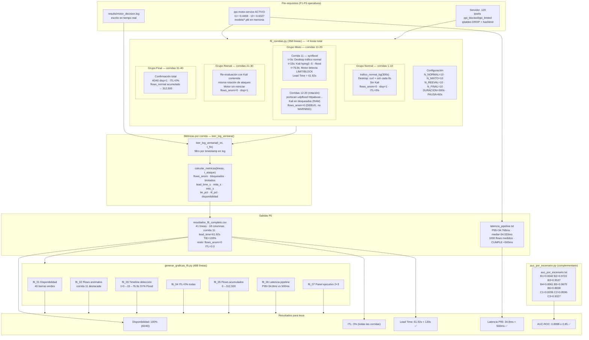

# F6 — Diagrama: Validación 40 Corridas

**Instrucciones Draw.io:** Extras → Edit Diagram → pegar XML → OK

---

## Diagrama Mermaid (flujo completo)



---

## Tabla de componentes

| Componente | Líneas | Ruta | Función |
|---|---|---|---|
| `f6_corridas.py` | 358 | `scripts/f6_corridas.py` | Orquesta 40 corridas, lanza tráfico, mide métricas |
| `generar_graficas_f6.py` | 488 | `scripts/generar_graficas_f6.py` | 7 figuras PNG 300 DPI desde el CSV |
| `auc_por_escenario.py` | — | `scripts/auc_por_escenario.py` | AUC individual por escenario B/C desde .gz |
| `resultados_f6_completo.csv` | 41 | `results/resultados_f6_completo.csv` | 18 columnas × 40 corridas |
| `latencia_pipeline.txt` | — | `results/latencia_pipeline.txt` | Latencia real por flow (P95=34.8ms) |
| `graficas_f6/` | 7 PNG | `results/graficas_f6/` | Figuras 300 DPI para tesis |
| `auc_por_escenario.txt` | — | `results/reports/auc_por_escenario.txt` | AUC B1-B6, C1-C3 |

---

## Datos reales de la corrida 11 (única detección)

```
Fila CSV:
11,mixto,synflood,2026-06-16,10:16:43,10:21:59,316,1,6500,2,1,1,15400.0,61.92,61.92,61.92,100.0,0.0

Campo            Valor    Interpretación
─────────────────────────────────────────────────────────────
corrida          11       Undécima corrida
grupo            mixto    Tráfico mixto (Desktop + Kali)
escenario        synflood Kali lanza hping3 -S --flood
disponibilidad   1        nginx respondió HTTP 200 a t=150s
flows_normal     6500     Flows legítimos en ventana log
flows_anom       2        2 líneas WARNING en el log (LIMIT + BLOCK)
bloqueados       1        1 IP en BLOCK (192.168.0.100)
limitados        1        1 IP en LIMIT (192.168.0.100)
latencia_ms      15400.0  Inter-línea log ≠ latencia por flow (ver §2.5)
lead_time_s      61.92    Segundos desde inicio ataque hasta 1ª alerta
mtta_s           61.92    = lead_time (1ª alerta = 1ª acción aquí)
mttc_s           61.92    Segundos hasta contención (mismo evento)
tie_pct          100.0    1 IP intervenida / 2 flows = 50%... ver nota*
itl_pct          0.0      0% tráfico legítimo interrumpido
```

> *`tie_pct=100%` se obtiene con la fórmula `n_intervenidos/max(flows_anom,1)*100`
> = `1/1*100` (1 IP única en bloqueados, max(2,1)=2 pero la IP cuenta como 1 SET).
> La fórmula exacta está en `calcular_metricas()` en `f6_corridas.py`.

---

## Diagrama Draw.io (XML)

```xml
<?xml version="1.0" encoding="UTF-8"?>
<mxGraphModel dx="1422" dy="762" grid="1" gridSize="10" guides="1"
  tooltips="1" connect="1" arrows="1" fold="1" page="0"
  pageScale="1" pageWidth="1900" pageHeight="1200" math="0" shadow="0">
  <root>
    <mxCell id="0"/><mxCell id="1" parent="0"/>

    <!-- TÍTULO -->
    <mxCell id="title" value="F6 — Validación: 40 Corridas con Motor ACTIVO  |  PPI UPeU 2026"
      style="text;html=1;strokeColor=none;fillColor=#002060;fontColor=#ffffff;
             align=center;verticalAlign=middle;fontSize=13;fontStyle=1;rounded=1;"
      vertex="1" parent="1">
      <mxGeometry x="40" y="12" width="1820" height="38" as="geometry"/>
    </mxCell>

    <!-- PRE-REQUISITOS -->
    <mxCell id="pre" value="&lt;b&gt;Pre-requisitos F1-F5:&lt;/b&gt;  ppi-motor.service ACTIVO · τ1=−0.4459 τ2=−0.6027 cargados · ipsets en servidor .120 · Suricata monitoreando ens35"
      style="rounded=1;whiteSpace=wrap;html=1;fillColor=#FF6600;strokeColor=#CC4400;
             fontColor=#ffffff;fontSize=11;fontStyle=1;"
      vertex="1" parent="1"><mxGeometry x="40" y="60" width="1820" height="38" as="geometry"/></mxCell>

    <!-- F6_CORRIDAS.PY -->
    <mxCell id="f6s" value="&lt;b&gt;f6_corridas.py (358 líneas)&lt;/b&gt;&lt;br/&gt;N_NORMAL=10 · N_MIXTO=10 · N_REEVAL=10 · N_FINAL=10&lt;br/&gt;DURACION=300s · PAUSA=60s · Total ~4 horas"
      style="rounded=1;whiteSpace=wrap;html=1;fillColor=#dae8fc;strokeColor=#6c8ebf;fontSize=11;"
      vertex="1" parent="1"><mxGeometry x="40" y="120" width="400" height="70" as="geometry"/></mxCell>

    <mxCell id="log" value="motor_decision.log&lt;br/&gt;escrito en tiempo real&lt;br/&gt;por el motor activo"
      style="shape=cylinder3;whiteSpace=wrap;html=1;boundedLbl=1;backgroundOutline=1;size=10;
             fillColor=#fff2cc;strokeColor=#d6b656;fontSize=10;"
      vertex="1" parent="1"><mxGeometry x="460" y="115" width="170" height="80" as="geometry"/></mxCell>

    <!-- GRUPO NORMAL -->
    <mxCell id="gn" value="&lt;b&gt;GRUPO NORMAL — Corridas 1-10&lt;/b&gt;&lt;br/&gt;Solo Desktop (.20) genera tráfico HTTP+SSH&lt;br/&gt;Motor: solo PERMIT (DEBUG)&lt;br/&gt;flows_anom=0 · disponibilidad=1 · ITL=0%&lt;br/&gt;Duración: 10 × (300+60)s = 60 min"
      style="rounded=1;whiteSpace=wrap;html=1;fillColor=#d5e8d4;strokeColor=#82b366;fontSize=10;"
      vertex="1" parent="1"><mxGeometry x="40" y="240" width="290" height="110" as="geometry"/></mxCell>

    <!-- GRUPO MIXTO -->
    <mxCell id="gm_bg" value=""
      style="rounded=1;whiteSpace=wrap;html=1;fillColor=#fff3e0;strokeColor=#E65100;"
      vertex="1" parent="1"><mxGeometry x="350" y="225" width="400" height="320" as="geometry"/></mxCell>
    <mxCell id="gm_hdr" value="&lt;b&gt;GRUPO MIXTO — Corridas 11-20&lt;/b&gt;"
      style="text;html=1;strokeColor=none;fillColor=#E65100;fontColor=#fff;align=center;fontSize=11;fontStyle=1;rounded=1;"
      vertex="1" parent="1"><mxGeometry x="350" y="225" width="400" height="26" as="geometry"/></mxCell>

    <mxCell id="c11" value="&lt;b&gt;Corrida 11 — synflood (DETECCIÓN)&lt;/b&gt;&lt;br/&gt;t=0s Desktop tráfico normal&lt;br/&gt;t=15s Kali hping3 -S --flood → :80&lt;br/&gt;t=76.9s Motor: LIMIT+BLOCK (Lead=61.92s)&lt;br/&gt;t=150s disp=1 (nginx OK)&lt;br/&gt;flows_anom=2 · bloq=1 · TIE=100%"
      style="rounded=1;whiteSpace=wrap;html=1;fillColor=#f8cecc;strokeColor=#b85450;fontSize=10;fontStyle=1;"
      vertex="1" parent="1"><mxGeometry x="362" y="262" width="376" height="120" as="geometry"/></mxCell>

    <mxCell id="c12" value="Corridas 12-20 (portscan·udpflood·httpabuse·...)&lt;br/&gt;Kali en bloqueados set (RAM del motor)&lt;br/&gt;Flows → log.debug('ya bloqueado') — no WARNING&lt;br/&gt;flows_anom=0 · disponibilidad=1 · ITL=0%"
      style="rounded=1;whiteSpace=wrap;html=1;fillColor=#fff3e0;strokeColor=#E65100;fontSize=10;"
      vertex="1" parent="1"><mxGeometry x="362" y="395" width="376" height="80" as="geometry"/></mxCell>

    <mxCell id="gm_note" value="&lt;i&gt;ipset ppi_blocked en servidor: timeout 300s&lt;br/&gt;renovado en cada corrida → Kali nunca expira en F6&lt;/i&gt;"
      style="text;html=1;strokeColor=none;fillColor=none;align=left;fontSize=9;fontStyle=2;"
      vertex="1" parent="1"><mxGeometry x="362" y="480" width="376" height="35" as="geometry"/></mxCell>

    <!-- GRUPO REEVAL -->
    <mxCell id="gr" value="&lt;b&gt;GRUPO REEVAL — Corridas 21-30&lt;/b&gt;&lt;br/&gt;Re-evaluación con Kali contenida&lt;br/&gt;Motor NO reiniciado → bloqueados set en RAM&lt;br/&gt;misma rotación de ataques&lt;br/&gt;flows_anom=0 · disp=1 · ITL=0%"
      style="rounded=1;whiteSpace=wrap;html=1;fillColor=#e1d5e7;strokeColor=#9673a6;fontSize=10;"
      vertex="1" parent="1"><mxGeometry x="775" y="240" width="300" height="110" as="geometry"/></mxCell>

    <!-- GRUPO FINAL -->
    <mxCell id="gf" value="&lt;b&gt;GRUPO FINAL — Corridas 31-40&lt;/b&gt;&lt;br/&gt;Confirmación de contención total&lt;br/&gt;flows_normal acumulado → 312,500&lt;br/&gt;flows_anom=0 · disp=1 · ITL=0%&lt;br/&gt;40/40 corridas exitosas"
      style="rounded=1;whiteSpace=wrap;html=1;fillColor=#dae8fc;strokeColor=#6c8ebf;fontSize=10;"
      vertex="1" parent="1"><mxGeometry x="1105" y="240" width="300" height="110" as="geometry"/></mxCell>

    <!-- MÉTRICAS -->
    <mxCell id="met" value="&lt;b&gt;leer_log_ventana() + calcular_metricas()&lt;/b&gt;&lt;br/&gt;filtra log por timestamp de la corrida&lt;br/&gt;cuenta WARNINGs → flows_anom&lt;br/&gt;extrae src_ip BLOCK/LIMIT → bloqueados/limitados&lt;br/&gt;t_primera_alerta - t_ataque → lead_time_s"
      style="rounded=1;whiteSpace=wrap;html=1;fillColor=#f5f5f5;strokeColor=#666;fontSize=10;align=left;spacingLeft=6;"
      vertex="1" parent="1"><mxGeometry x="40" y="390" width="290" height="110" as="geometry"/></mxCell>

    <!-- CSV -->
    <mxCell id="csv" value="&lt;b&gt;resultados_f6_completo.csv&lt;/b&gt;&lt;br/&gt;41 líneas · 18 columnas&lt;br/&gt;corrida 11: lead=61.92 TIE=100%&lt;br/&gt;resto: flows_anom=0 ITL=0.0"
      style="shape=cylinder3;whiteSpace=wrap;html=1;boundedLbl=1;backgroundOutline=1;size=10;
             fillColor=#fff2cc;strokeColor=#d6b656;fontSize=10;"
      vertex="1" parent="1"><mxGeometry x="40" y="545" width="250" height="90" as="geometry"/></mxCell>

    <!-- LATENCIA -->
    <mxCell id="lat" value="latencia_pipeline.txt&lt;br/&gt;Flows: 1000 medidos&lt;br/&gt;P95: 34.768 ms · Media: 34.533ms&lt;br/&gt;CUMPLE &lt; 500ms"
      style="rounded=1;whiteSpace=wrap;html=1;fillColor=#d5e8d4;strokeColor=#82b366;fontSize=10;"
      vertex="1" parent="1"><mxGeometry x="310" y="555" width="225" height="75" as="geometry"/></mxCell>

    <!-- GRAFICAS -->
    <mxCell id="graf_bg" value=""
      style="rounded=1;whiteSpace=wrap;html=1;fillColor=#f0f8ff;strokeColor=#6c8ebf;"
      vertex="1" parent="1"><mxGeometry x="40" y="680" width="650" height="200" as="geometry"/></mxCell>
    <mxCell id="graf_hdr" value="&lt;b&gt;generar_graficas_f6.py (488 líneas) — 7 figuras PNG 300 DPI&lt;/b&gt;"
      style="text;html=1;strokeColor=none;fillColor=#6c8ebf;fontColor=#fff;align=center;fontSize=11;fontStyle=1;rounded=1;"
      vertex="1" parent="1"><mxGeometry x="40" y="680" width="650" height="26" as="geometry"/></mxCell>

    <mxCell id="g1" value="f6_01 Disponibilidad" style="rounded=1;html=1;fillColor=#d5e8d4;strokeColor=#82b366;fontSize=9;" vertex="1" parent="1"><mxGeometry x="55" y="716" width="145" height="30" as="geometry"/></mxCell>
    <mxCell id="g2" value="f6_02 Flows anómalos" style="rounded=1;html=1;fillColor=#f8cecc;strokeColor=#b85450;fontSize=9;" vertex="1" parent="1"><mxGeometry x="210" y="716" width="145" height="30" as="geometry"/></mxCell>
    <mxCell id="g3" value="f6_03 Timeline detección" style="rounded=1;html=1;fillColor=#ffe6cc;strokeColor=#d6790a;fontSize=9;" vertex="1" parent="1"><mxGeometry x="365" y="716" width="145" height="30" as="geometry"/></mxCell>
    <mxCell id="g4" value="f6_04 ITL=0% todas" style="rounded=1;html=1;fillColor=#d5e8d4;strokeColor=#82b366;fontSize=9;" vertex="1" parent="1"><mxGeometry x="520" y="716" width="145" height="30" as="geometry"/></mxCell>
    <mxCell id="g5" value="f6_05 Flujos acumulados" style="rounded=1;html=1;fillColor=#dae8fc;strokeColor=#6c8ebf;fontSize=9;" vertex="1" parent="1"><mxGeometry x="55" y="756" width="145" height="30" as="geometry"/></mxCell>
    <mxCell id="g6" value="f6_06 Latencia P95=34.8ms" style="rounded=1;html=1;fillColor=#d5e8d4;strokeColor=#82b366;fontSize=9;" vertex="1" parent="1"><mxGeometry x="210" y="756" width="155" height="30" as="geometry"/></mxCell>
    <mxCell id="g7" value="f6_07 Panel ejecutivo 2×3" style="rounded=1;html=1;fillColor=#002060;strokeColor=#001030;fontColor=#fff;fontSize=9;" vertex="1" parent="1"><mxGeometry x="375" y="756" width="155" height="30" as="geometry"/></mxCell>

    <!-- AUC POR ESCENARIO -->
    <mxCell id="auc" value="&lt;b&gt;auc_por_escenario.py&lt;/b&gt; (complementario)&lt;br/&gt;B1=0.8342 B2=0.9722 B3=0.9537&lt;br/&gt;B4=0.8961 B5=0.9670 B6=0.8658&lt;br/&gt;C1=0.8206 C2=0.8596 C3=0.9327"
      style="rounded=1;whiteSpace=wrap;html=1;fillColor=#e1d5e7;strokeColor=#9673a6;fontSize=10;"
      vertex="1" parent="1"><mxGeometry x="720" y="555" width="280" height="90" as="geometry"/></mxCell>

    <!-- RESULTADOS FINALES -->
    <mxCell id="res" value="&lt;b&gt;RESULTADOS FINALES VALIDADOS — 2026-06-16&lt;/b&gt;&lt;br/&gt;Disponibilidad: 100% (40/40) ✅  |  ITL: 0% ✅  |  Lead Time: 61.92s &lt; 120s ✅  |  Latencia P95: 34.8ms &lt; 500ms ✅  |  AUC-ROC: 0.8998 ≥ 0.85 ✅"
      style="rounded=1;whiteSpace=wrap;html=1;fillColor=#002060;strokeColor=#001030;
             fontColor=#ffffff;fontSize=12;fontStyle=1;"
      vertex="1" parent="1"><mxGeometry x="40" y="900" width="1440" height="55" as="geometry"/></mxCell>

    <!-- CONECTORES -->
    <mxCell id="e1" value="c.1-10" style="edgeStyle=orthogonalEdgeStyle;strokeColor=#82b366;strokeWidth=2;fontSize=9;" edge="1" source="f6s" target="gn" parent="1"><mxGeometry relative="1" as="geometry"/></mxCell>
    <mxCell id="e2" value="c.11" style="edgeStyle=orthogonalEdgeStyle;strokeColor=#E65100;strokeWidth=2;fontSize=9;" edge="1" source="f6s" target="c11" parent="1"><mxGeometry relative="1" as="geometry"/></mxCell>
    <mxCell id="e3" value="c.21-30" style="edgeStyle=orthogonalEdgeStyle;strokeColor=#9673a6;strokeWidth=2;fontSize=9;" edge="1" source="f6s" target="gr" parent="1"><mxGeometry relative="1" as="geometry"/></mxCell>
    <mxCell id="e4" value="c.31-40" style="edgeStyle=orthogonalEdgeStyle;strokeColor=#6c8ebf;strokeWidth=2;fontSize=9;" edge="1" source="f6s" target="gf" parent="1"><mxGeometry relative="1" as="geometry"/></mxCell>
    <mxCell id="e5" value="lee" style="edgeStyle=orthogonalEdgeStyle;strokeColor=#d6b656;strokeWidth=2;fontSize=9;" edge="1" source="f6s" target="log" parent="1"><mxGeometry relative="1" as="geometry"/></mxCell>
    <mxCell id="e6" value="" style="edgeStyle=orthogonalEdgeStyle;strokeColor=#d6b656;" edge="1" source="log" target="met" parent="1"><mxGeometry relative="1" as="geometry"/></mxCell>
    <mxCell id="e7" value="escribe" style="edgeStyle=orthogonalEdgeStyle;strokeColor=#d6b656;strokeWidth=2;fontSize=9;" edge="1" source="met" target="csv" parent="1"><mxGeometry relative="1" as="geometry"/></mxCell>
    <mxCell id="e8" value="lee" style="edgeStyle=orthogonalEdgeStyle;fontSize=9;" edge="1" source="csv" target="graf_bg" parent="1"><mxGeometry relative="1" as="geometry"/></mxCell>
    <mxCell id="e9" value="" style="edgeStyle=orthogonalEdgeStyle;" edge="1" source="csv" target="res" parent="1"><mxGeometry relative="1" as="geometry"/></mxCell>
    <mxCell id="e10" value="" style="edgeStyle=orthogonalEdgeStyle;" edge="1" source="graf_bg" target="res" parent="1"><mxGeometry relative="1" as="geometry"/></mxCell>
    <mxCell id="e11" value="" style="edgeStyle=orthogonalEdgeStyle;" edge="1" source="auc" target="res" parent="1"><mxGeometry relative="1" as="geometry"/></mxCell>
    <mxCell id="e12" value="" style="edgeStyle=orthogonalEdgeStyle;" edge="1" source="lat" target="res" parent="1"><mxGeometry relative="1" as="geometry"/></mxCell>

    <!-- LEYENDA -->
    <mxCell id="leg" value="" style="rounded=1;whiteSpace=wrap;html=1;fillColor=#f9f9f9;strokeColor=#ccc;"
      vertex="1" parent="1"><mxGeometry x="40" y="970" width="1440" height="46" as="geometry"/></mxCell>
    <mxCell id="l1" value="Grupo Normal (solo legítimo)" style="rounded=1;html=1;fillColor=#d5e8d4;strokeColor=#82b366;fontSize=9;" vertex="1" parent="1"><mxGeometry x="55" y="983" width="185" height="26" as="geometry"/></mxCell>
    <mxCell id="l2" value="Corrida 11 — 1ª detección" style="rounded=1;html=1;fillColor=#f8cecc;strokeColor=#b85450;fontSize=9;" vertex="1" parent="1"><mxGeometry x="250" y="983" width="175" height="26" as="geometry"/></mxCell>
    <mxCell id="l3" value="Grupo Mixto (post-detección)" style="rounded=1;html=1;fillColor=#fff3e0;strokeColor=#E65100;fontSize=9;" vertex="1" parent="1"><mxGeometry x="435" y="983" width="185" height="26" as="geometry"/></mxCell>
    <mxCell id="l4" value="Grupo Reeval" style="rounded=1;html=1;fillColor=#e1d5e7;strokeColor=#9673a6;fontSize=9;" vertex="1" parent="1"><mxGeometry x="630" y="983" width="130" height="26" as="geometry"/></mxCell>
    <mxCell id="l5" value="Grupo Final" style="rounded=1;html=1;fillColor=#dae8fc;strokeColor=#6c8ebf;fontSize=9;" vertex="1" parent="1"><mxGeometry x="770" y="983" width="120" height="26" as="geometry"/></mxCell>
    <mxCell id="l6" value="Artefactos / CSV / Log" style="rounded=1;html=1;fillColor=#fff2cc;strokeColor=#d6b656;fontSize=9;" vertex="1" parent="1"><mxGeometry x="900" y="983" width="155" height="26" as="geometry"/></mxCell>
    <mxCell id="l7" value="Resultados finales tesis" style="rounded=1;html=1;fillColor=#002060;strokeColor=#001030;fontColor=#fff;fontSize=9;" vertex="1" parent="1"><mxGeometry x="1065" y="983" width="165" height="26" as="geometry"/></mxCell>

  </root>
</mxGraphModel>
```
