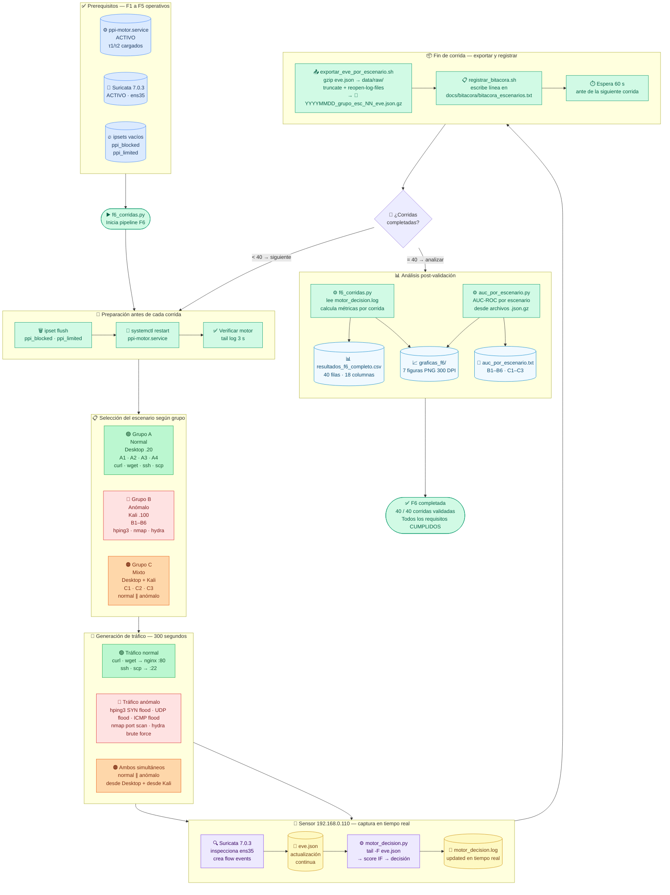
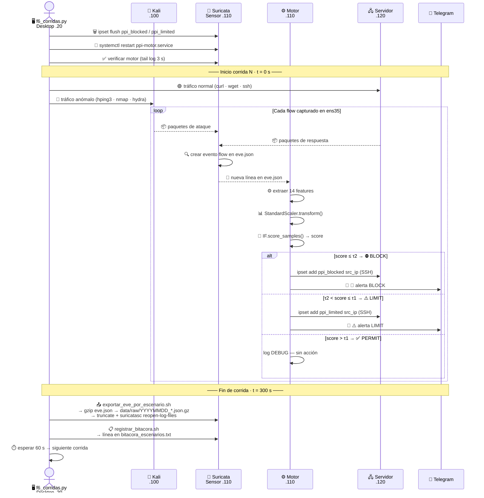
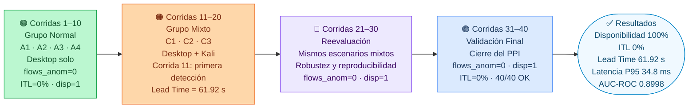

# F6 — Flujo de Validación (40 Corridas)

**Fase 6 · PPI — Universidad Peruana Unión · 2026**
Archivo: `scripts/f6_corridas.py` · 40 corridas · ~4 horas total

---

## Diagrama 1 — Pipeline completo de validación

---

## Diagrama 2 — Secuencia detallada de una corrida individual

---

## Diagrama 3 — Distribución de las 40 corridas

---

## Tabla de componentes

| Componente | Tipo | Ruta / Nodo | Descripción |
|---|---|---|---|
| `f6_corridas.py` | ⚙️ Script | `scripts/` · Desktop .20 | Orquestador: lanza tráfico, controla tiempos, calcula métricas |
| Scripts A1–A4 | ⚙️ Scripts | `scripts/escenarios/` | Generan tráfico normal (curl · wget · ssh · scp) |
| Scripts B1–B6 | ⚙️ Scripts | `scripts/escenarios/` · Kali | Generan ataques (hping3 · nmap · hydra) |
| Scripts C1–C3 | ⚙️ Scripts | `scripts/escenarios/` · ambos | Tráfico mixto simultáneo |
| Suricata 7.0.3 | 📡 Servicio | Sensor .110 · ens35 | Captura flows → `eve.json` |
| `eve.json` | 📜 Stream | `/var/log/suricata/` · Sensor .110 | Rotado al fin de cada corrida |
| `motor_decision.py` | ⚙️ Proceso | Sensor .110 | Procesa flows en tiempo real durante 300 s |
| `exportar_eve_por_escenario.sh` | ⚙️ Script | `scripts/capture/` · Sensor .110 | gzip + truncate + reopen-log-files |
| `registrar_bitacora.sh` | ⚙️ Script | `scripts/evaluation/` · Sensor .110 | Añade línea a bitácora cronológica |
| `data/raw/*.json.gz` | 🗜️ Archivo | `data/raw/` · Sensor .110 | 47 capturas · `YYYYMMDD_grupo_esc_NN_eve.json.gz` |
| `motor_decision.log` | 📝 Log | `results/` · Sensor .110 | Fuente de métricas para `f6_corridas.py` |
| `f6_corridas.py` (análisis) | ⚙️ Script | `scripts/` | Lee log, calcula FPR · ITL · latencia · lead_time · TIE · MTTA · MTTC |
| `resultados_f6_completo.csv` | 📊 Datos | `results/` | 40 filas × 18 columnas — resultado oficial F6 |
| `graficas_f6/` | 📈 Gráficas | `results/graficas_f6/` | 7 figuras PNG 300 DPI |
| `bitacora_escenarios.txt` | 📋 Registro | `docs/bitacora/` | Historial cronológico de todas las corridas |
| `auc_por_escenario.py` | ⚙️ Script | `scripts/` | AUC individual por escenario desde archivos .gz |

---

## Métricas calculadas por corrida

| Métrica | Símbolo | Descripción |
|---|---|---|
| Disponibilidad | `disp` | Servidor responde durante la corrida (0=caída / 1=OK) |
| Interrupción de Tráfico Legítimo | `itl_pct` | % flows normales bloqueados o limitados por error |
| Flujos anómalos detectados | `flows_anom` | Líneas WARNING en el log de esa corrida |
| IPs bloqueadas | `bloqueados` | IPs en `BLOCK` durante la corrida |
| IPs limitadas | `limitados` | IPs en `LIMIT` durante la corrida |
| Lead time | `lead_time_s` | Segundos desde inicio ataque hasta primera decisión BLOCK/LIMIT |
| Mean Time To Alert | `mtta_s` | Segundos desde inicio ataque hasta primer Telegram enviado |
| Mean Time To Contain | `mttc_s` | Segundos desde inicio ataque hasta primer ipset aplicado |
| Tasa de Intervención Efectiva | `tie_pct` | % IPs anómalas que recibieron BLOCK o LIMIT |

---

## Resultados validados (corrida 11 — única detección en F6)

| Campo | Valor | Significado |
|---|---|---|
| Corrida | 11 | Grupo mixto · SYN flood |
| Lead time | **61.92 s** | Tiempo hasta primera decisión BLOCK |
| Flows normales paralelos | 6,500 | Desktop HTTP+SSH activo durante el ataque |
| ITL durante el ataque | **0 %** | Ningún flow legítimo fue bloqueado |
| Decisiones emitidas | BLOCK + LIMIT | 192.168.0.100 en ambos ipsets |
| Disponibilidad | **1** | nginx respondió HTTP 200 a t=150 s |

> El lead time de ~62 s está determinado por la ventana de cierre de flows TCP de Suricata.
> El motor solo puede decidir sobre un flow **después** de que Suricata lo cierra.

---

*Fase 6 completada · 40/40 corridas · Todos los requisitos del PPI CUMPLIDOS · 2026-06-16*
