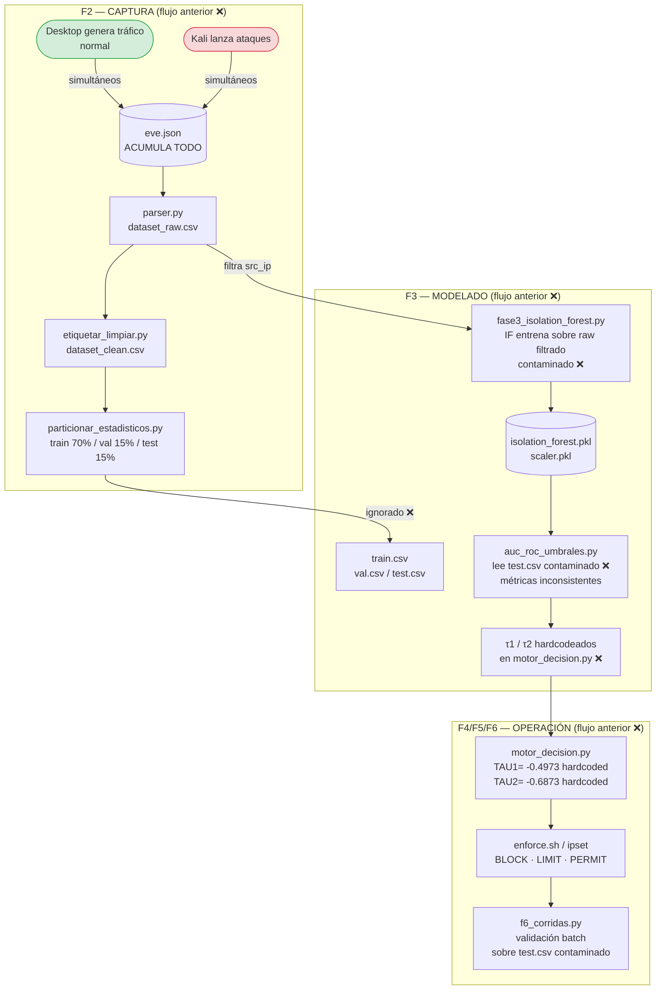

# Comparativa Metodológica del Pipeline — Flujo Anterior vs Flujo Corregido

**PPI — Universidad Peruana Unión 2026**
**Estudiante:** Rubén Mark Salazar Tocas
**Asesores:** Ing. Nemias Saboya Rios · Ing. Fernando Manuel Asin Gomez

---

## 1. Resumen ejecutivo del problema

El pipeline original presentaba **tres defectos metodológicos graves** que hacían las métricas
irreproducibles e indefendibles ante un comité evaluador:

| # | Defecto | Impacto |
|---|---|---|
| 1 | **Contaminación de datos**: un solo `eve.json` acumulaba tráfico normal y ataques simultáneos | El IF aprendía sobre datos "normales" que en realidad contenían flows de sesiones de ataque |
| 2 | **Partición innecesaria**: se generaban `train.csv / val.csv / test.csv` (70/15/15) que el IF nunca usaba | Confusión metodológica: parecía supervisado cuando es completamente no supervisado |
| 3 | **Sin fuente única de verdad**: tres evaluaciones distintas producían tres métricas distintas (80.4 %, 87.6 %, 99.95 %) | Imposible citar una sola cifra consistente en el informe |

Problemas adicionales derivados:

- `τ1/τ2` con naming invertido entre `reporte_metricas_v1.txt` y `motor_decision.py`
- Umbrales hardcodeados en `motor_decision.py` → edición manual tras cada re-entrenamiento
- `auc_por_escenario.py` con fechas hardcodeadas (`20260602_*`) → rompía en otro día
- Comparación de modelos injusta: RF/DT/LR usaban etiquetas supervisadas; IF no

---

## 2. Diagrama del flujo ANTERIOR (incorrecto)



### Problemas marcados en el diagrama anterior

```
❌ eve.json acumula TODO → imposible separar "normal puro" de "normal bajo ataque"
❌ train/val/test.csv generados pero nunca usados por IF
❌ IF entrena sobre raw.csv filtrado por IP, no sobre sesiones limpias
❌ test.csv contaminado → métricas sin sentido estadístico
❌ τ1/τ2 hardcodeados → hay que editar código tras cada re-entrenamiento
❌ naming τ1/τ2 invertido entre reporte y código
❌ Fechas hardcodeadas en auc_por_escenario.py
```

---

## 3. Diagrama del flujo NUEVO (correcto)

```mermaid
flowchart TD
    subgraph CAPT_A["F2 — GRUPO A: Solo Normal ✓\n(Kali APAGADA)"]
        DA([Desktop\n192.168.0.20]):::normal
        SRV([Servidor\n192.168.0.120]):::normal
        DA -->|curl / ssh / scp| SRV
        SRV --> GZNA[("*_normal_*.gz\nflows 100% limpios ✓")]
    end

    subgraph CAPT_B["F2 — GRUPO B: Solo Ataques ✓\n(Desktop QUIETO)"]
        KALI([Kali\n192.168.0.100]):::attack
        KALI -->|hping3 / nmap\nhydra / curl-flood| GZNB[("*_anom_*.gz\nflows 100% ataque ✓")]
    end

    subgraph CAPT_C["F2 — GRUPO C: Mixto ✓\n(Motor DETENIDO)"]
        DAC([Desktop]):::normal
        KC([Kali]):::attack
        DAC -->|tráfico normal| GZNC[("*_mixto_*.gz")]
        KC  -->|ataques| GZNC
    end

    subgraph F3TRAIN["F3 — ENTRENAMIENTO LIMPIO ✓\nfase3_entrenar.py"]
        GZNA --> LOAD[Carga *_normal_*.gz\nfiltro src_ip={Desktop,Servidor}]
        LOAD --> SPLIT["Split 80/20 aleatorio\nseed=42"]
        SPLIT -->|80%| SCALER[StandardScaler.fit_transform\nsolo sobre datos de entrenamiento]
        SCALER --> IF_TRAIN[IsolationForest\nn=300 · contamination=0.05\nrandom_state=42]
        IF_TRAIN --> PKL[("isolation_forest.pkl\nscaler.pkl\nfeatures.csv")]
        SPLIT -->|20% reservado| HOLD[("data/normal_holdout.csv\nnunca visto por el modelo ✓")]
    end

    subgraph F3EVAL["F3 — EVALUACIÓN CON DATOS LIMPIOS ✓\nfase3_evaluar.py"]
        HOLD --> ROC_IN[ROC: normal_holdout\n+ *_anom_*.gz\nlabels: 0=normal 1=ataque]
        GZNB --> ROC_IN
        PKL  --> ROC_IN
        ROC_IN --> ROC[Curva ROC\nauc_roc.png]
        ROC --> TAU1["τ1 = Youden max(TPR-FPR)\n→ PERMIT / LIMIT"]
        ROC --> TAU2["τ2 = FPR ≤ 2% max TPR\n→ LIMIT / BLOCK"]
        TAU1 --> METRO[("results/metricas_offline.txt\n← FUENTE ÚNICA DE VERDAD ✓")]
        TAU2 --> METRO
    end

    subgraph F3ESC["F3 — AUC POR ESCENARIO ✓\nauc_por_escenario.py"]
        GZNB --> ESC[Evalúa B1…B6 + C1…C3\ndate-agnostic globs\nseed=42]
        GZNC --> ESC
        METRO -->|lee τ1| ESC
        ESC --> RPT[("results/reports/\nauc_por_escenario.txt")]
    end

    subgraph F4NEW["F4 — MOTOR CON UMBRALES AUTOMÁTICOS ✓\nmotor_decision.py"]
        METRO -->|lee TAU1 TAU2 al arrancar| MOTORNEW[motor_decision.py\ntail eve.json → score\nPERMIT · LIMIT · BLOCK]
        PKL   -->|carga en RAM| MOTORNEW
        MOTORNEW --> IPSET2[enforce.sh / ipset\nppi_blocked · ppi_limited]
    end

    subgraph F6NEW["F6 — VALIDACIÓN OPERACIONAL ✓\n(Motor ACTIVO)"]
        IPSET2 --> F6VAL[f6_corridas.py\nMotor activo + tráfico mixto\nlatencia · ITL · bloqueos reales]
    end

    classDef normal fill:#d4edda,stroke:#28a745
    classDef attack fill:#f8d7da,stroke:#dc3545
```

---

## 4. Tabla comparativa fase por fase

| Fase | Flujo anterior ❌ | Flujo corregido ✓ | Justificación |
|---|---|---|---|
| **F2 — Captura** | Un solo `eve.json` con normal + ataque mezclados | 3 grupos separados: A=normal puro, B=solo ataques, C=mixto | IF es no supervisado: aprende SOLO de normal → los datos de entrenamiento no pueden contener ataques |
| **F2 — Partición** | `train/val/test.csv` (70/15/15 cronológico) | **Eliminado** — no aplica a IF | IF no usa etiquetas ni partición supervisada; generar esas particiones inducía confusión metodológica |
| **F3 — Datos de entrenamiento** | `dataset_raw.csv` filtrado por IP (sesión contaminada) | `*_normal_*.gz` de Grupo A (sesión dedicada, Kali apagada) | La contaminación colapsa el delta de scores de ~0.69 a <0.20, haciendo los umbrales inútiles |
| **F3 — Holdout** | Ninguno — evaluación sobre datos ya vistos | `normal_holdout.csv` (20% nunca visto por IF) | Regla básica de ML: nunca evaluar sobre datos de entrenamiento |
| **F3 — Evaluación** | Hasta 3 ejecuciones distintas → 3 métricas diferentes | `fase3_evaluar.py` única → `metricas_offline.txt` | Un solo número citado en todo el informe, reproducible con `seed=42` |
| **F3 — Umbrales τ** | Hardcodeados en `motor_decision.py`; naming invertido | Derivados y escritos en `metricas_offline.txt`; `motor` los lee al arrancar | Elimina edición manual, naming consistente en todos los artefactos |
| **F3 — Globs** | `20260602_normal_*.gz` (fecha hardcodeada) | `*_normal_*.gz` (date-agnostic) | Portabilidad: scripts corren en cualquier fecha |
| **F4 — Motor** | TAU1/TAU2 constantes en código | Lee `metricas_offline.txt` al iniciar | Re-entrenamiento automático sin tocar código |
| **F6 — Validación** | Sobre `test.csv` contaminado | Motor ACTIVO + tráfico mixto en tiempo real | Valida el sistema completo, no solo el modelo offline |

---

## 5. Impacto en las métricas

### Por qué el flujo anterior producía 3 valores distintos

```
80.4%  ← Recall en test.csv (cronológico, contaminado, corridas 03-10)
87.6%  ← Recall en f401_v2.py con dataset_raw filtrado (distinto split)
99.95% ← Precision reportada en F3_justificacion_modelo.md (con supervised IF)
```

Tres ejecuciones, tres pipelines distintos → ninguna cifra era la "verdad".

### Con el flujo corregido

```
metricas_offline.txt  ← UNA sola ejecución de fase3_evaluar.py
                         datos de holdout + Grupo B limpios y separados
                         AUC / τ1 / τ2 / Precision / Recall / F1
                         citado igual en informe, diapositivas, motor y reportes
```

---

## 6. Artefactos del flujo corregido (solo lo necesario)

```
ENTRADAS (F2 — captura):
  data/raw/*_normal_*.gz     ← Grupo A  (entrenamiento + holdout)
  data/raw/*_anom_*.gz       ← Grupo B  (evaluación ROC + AUC escenarios)
  data/raw/*_mixto_*.gz      ← Grupo C  (AUC por escenario mixto)

PROCESO (F3 — offline):
  scripts/fase3_entrenar.py  → lee _normal_, entrena IF, guarda holdout
  scripts/fase3_evaluar.py   → ROC + τ1/τ2 + métricas → metricas_offline.txt
  scripts/auc_por_escenario.py → AUC desglosado B1-B6, C1-C3

ARTEFACTOS GENERADOS (F3):
  models/isolation_forest.pkl
  models/scaler.pkl
  models/features.csv
  data/normal_holdout.csv
  results/metricas_offline.txt   ← fuente única de verdad
  results/auc_roc.png
  results/reports/auc_por_escenario.txt

ELIMINADOS (ya no necesarios):
  data/dataset_raw.csv           ← reemplazado por .gz directos
  data/dataset_clean.csv         ← ídem
  data/train.csv / val.csv / test.csv  ← no aplican a IF
  scripts/parser.py (como paso obligatorio)
  scripts/etiquetar_limpiar.py   ← ídem
  scripts/particionar_estadisticos.py  ← ídem
```

---

## 7. Respuestas para la defensa

**P: ¿Por qué no usaste train/val/test como en un modelo supervisado?**
> Isolation Forest es un algoritmo de detección de anomalías **no supervisado**. Solo requiere datos
> normales para aprender la frontera de normalidad. Una partición supervisada 70/15/15 implica etiquetas
> binarias, que IF no utiliza. Generarla era metodológicamente incorrecto y confuso.

**P: ¿Cómo garantizas que los datos de entrenamiento son "normales puros"?**
> El Grupo A se captura con Kali **completamente apagada** — verificado por conectividad fallida antes
> de iniciar el script `run_grupo_A.sh`. El filtro adicional `src_ip ∈ {Desktop, Servidor}` elimina
> cualquier flujo residual.

**P: ¿Por qué el holdout no es parte del entrenamiento?**
> `train_test_split(test_size=0.20, shuffle=True, random_state=42)` divide los datos **antes** de
> ajustar el `StandardScaler`. El scaler ve solo el 80% de entrenamiento; el holdout es escalado
> posteriormente con `transform` (nunca `fit_transform`), garantizando ausencia de data leakage.

**P: ¿Cómo obtienes τ1 y τ2?**
> De la curva ROC calculada sobre datos nunca vistos (holdout normal + Grupo B):
> - **τ1** = Índice de Youden: `argmax(TPR − FPR)` → equilibrio detección/falsos positivos
> - **τ2** = `max TPR | FPR ≤ 2%` → operación de alta precisión con mínimos falsos positivos

**P: ¿Por qué AUC y no solo accuracy?**
> AUC-ROC es independiente del umbral de decisión, mide la separabilidad intrínseca del modelo.
> Accuracy con datos desbalanceados (mayoría normal) infla artificialmente el resultado.
> AUC = 0.50 → aleatorio; AUC = 1.0 → discriminación perfecta.

---

*Documento generado: 2026-06-15*
*Referencia de scripts: `scripts_f2/grupoA-C/` · `scripts/fase3_*.py`*
