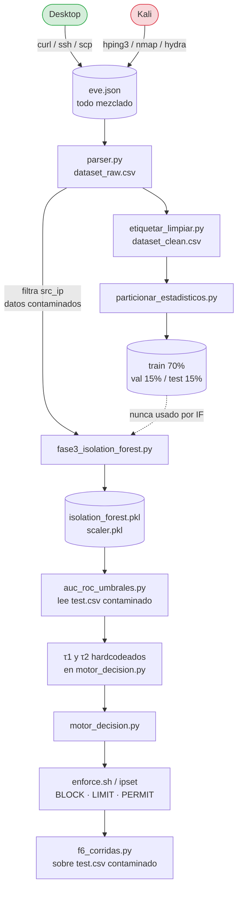
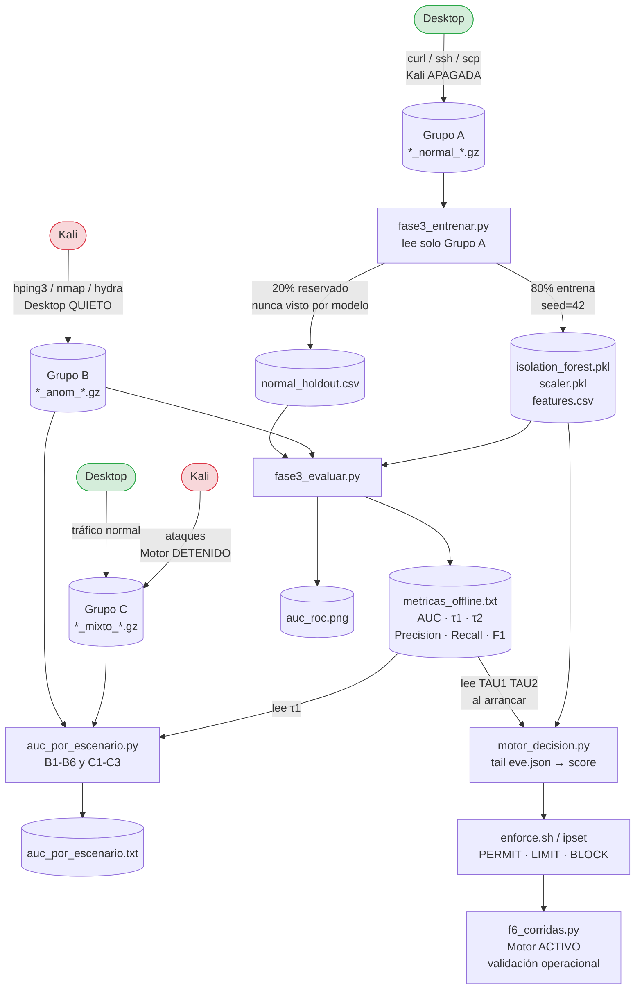

# Comparativa Metodológica del Pipeline — Flujo Anterior vs Flujo Corregido

**PPI — Universidad Peruana Unión 2026**
**Estudiante:** Rubén Mark Salazar Tocas
**Asesores:** Ing. Nemias Saboya Rios · Ing. Fernando Manuel Asin Gomez

---

## 1. ¿Por qué se rediseñó el pipeline?

El flujo original fue construido siguiendo la lógica de un modelo **supervisado** (train/val/test),
pero Isolation Forest es **no supervisado** — solo necesita datos normales para aprender.
Ese desajuste generó tres problemas que hacían las métricas indefendibles:

| # | Problema en el flujo anterior | Consecuencia |
|---|---|---|
| 1 | `eve.json` acumulaba tráfico normal **y** ataques en la misma sesión | IF aprendía sobre datos "normales" contaminados por flujos de ataque |
| 2 | Se generaba `train/val/test.csv` (70/15/15) que IF **nunca usaba** | Confusión metodológica; parecía supervisado cuando no lo es |
| 3 | Tres evaluaciones distintas → tres métricas distintas (80.4 %, 87.6 %, 99.95 %) | Imposible citar una sola cifra en el informe |

**Solución aplicada:** separar la captura en tres grupos con propósito único cada uno,
eliminar las particiones supervisadas y establecer `metricas_offline.txt` como
**fuente única de verdad** para AUC, τ1, τ2, Precision, Recall y F1.

---

## 1.1 Justificación de cada decisión del flujo mejorado

### ¿Por qué 80/20 en lugar de 70/15/15?

El split 70/15/15 es una convención de modelos **supervisados** que necesitan tres conjuntos:
entrenamiento, ajuste de hiperparámetros (validación) y prueba final.
Isolation Forest no tiene hiperparámetros que ajustar por validación — `n_estimators=300`
y `contamination=0.05` son decisiones de diseño, no resultados de búsqueda en grid.
Por eso solo se necesitan **dos subconjuntos**:

| Subconjunto | Proporción | Uso |
|---|---|---|
| Entrenamiento | 80 % | `IsolationForest.fit()` + `StandardScaler.fit_transform()` |
| Holdout | 20 % | Referencia de "normal" en la curva ROC — nunca visto por el modelo |

El 80/20 maximiza los datos de entrenamiento (más árboles con mayor variedad de flows normales)
sin sacrificar representatividad del holdout. El `shuffle=True, random_state=42` garantiza
que la división sea aleatoria y reproducible, sin sesgo cronológico.

### ¿Por qué archivos `.gz` en lugar de `.csv`?

| Formato | Flujo anterior | Flujo corregido |
|---|---|---|
| Fuente de datos | `dataset_raw.csv` (único, todo mezclado) | `*_normal_*.gz`, `*_anom_*.gz`, `*_mixto_*.gz` |
| Trazabilidad | Imposible saber qué sesión originó cada fila | Cada `.gz` = una sesión, una fecha, un escenario |
| Separación | Filtrado por `src_ip` en tiempo de entrenamiento | Separación garantizada en tiempo de **captura** |
| Tamaño | CSV descomprimido ocupa 5-10× más espacio | gzip reduce a ~10-20 % del tamaño original |
| Re-ejecutable | Regenerar implica repetir toda la cadena parser→limpieza | Leer directamente el `.gz` con `gzip.open` en cada script |

Los `.gz` son los archivos originales de Suricata comprimidos — no hay transformación intermedia
que pueda introducir errores. Si se descubre un bug en el preprocesamiento, se re-ejecuta
el script sobre el mismo `.gz` sin repetir la captura.

### ¿Por qué estos tres scripts de F3 y no uno solo?

| Script | Responsabilidad única | Por qué separado |
|---|---|---|
| `fase3_entrenar.py` | Leer Grupo A → scaler → IF → guardar `.pkl` + `holdout.csv` | Se ejecuta una vez; si se cambia `n_estimators` o `contamination`, solo se re-corre este |
| `fase3_evaluar.py` | Holdout + Grupo B → ROC → τ1/τ2 → `metricas_offline.txt` | Fuente única de verdad; puede re-ejecutarse sin re-entrenar si ya existe el `.pkl` |
| `auc_por_escenario.py` | AUC individual por B1-B6 y C1-C3 | Reporte exploratorio; no altera `metricas_offline.txt` |

Separar los scripts aplica el principio de **responsabilidad única**: si la evaluación
falla (p. ej. faltan `.gz` del Grupo B), el modelo entrenado no se pierde.
Si se agrega un nuevo escenario de captura, solo se re-corre `auc_por_escenario.py`.

### ¿Por qué tres grupos de escenarios (A, B, C)?

| Grupo | Condición de captura | Dato que produce | Para qué sirve |
|---|---|---|---|
| **A — Normal puro** | Kali **apagada**, Desktop genera tráfico legítimo | `*_normal_*.gz` | Entrenar IF + holdout de referencia |
| **B — Ataque puro** | Desktop **quieto**, Kali lanza ataques | `*_anom_*.gz` | Calcular ROC, derivar τ1/τ2, AUC por escenario |
| **C — Mixto** | Ambos activos, motor **detenido** | `*_mixto_*.gz` | Validar AUC en condiciones reales de red |

El Grupo C existe porque en producción el tráfico nunca es exclusivamente normal o
exclusivamente ataque — siempre hay mezcla. El motor se detiene durante la captura
para que Suricata registre **todos** los flows sin que ipset descarte paquetes antes
de que lleguen al sensor. La validación con motor **activo** se hace en F6.

### ¿Por qué `metricas_offline.txt` como fuente única de verdad?

Antes había tres archivos con métricas: `reporte_metricas_v1.txt`, `umbrales_finales.txt`
y valores hardcodeados en `motor_decision.py` — cada uno con cifras distintas y naming
de τ1/τ2 invertido entre ellos. `metricas_offline.txt` resuelve esto con una sola
ejecución determinista:

```
metricas_offline.txt
  ├── AUC-ROC          → mismo valor en informe, diapositivas y auc_por_escenario.py
  ├── tau1 / tau2      → motor_decision.py los lee al arrancar (sin edición manual)
  ├── Precision/Recall → misma cifra citada en toda la documentación
  └── n_train / n_eval → trazabilidad del dataset usado
```

Si se re-entrena el modelo, se ejecuta `fase3_evaluar.py` y el motor toma los nuevos
umbrales automáticamente en el próximo inicio — sin tocar código.

---

## 2. Flujo ANTERIOR — incorrecto



**Problemas en este flujo:**

```
❌ Desktop y Kali generan tráfico simultáneo → eve.json contamina datos normales
❌ train/val/test.csv creados pero IF los ignora completamente
❌ IF entrena con datos de sesión contaminada (no sesión "normal pura")
❌ Evaluación sobre test.csv contaminado → métricas sin validez estadística
❌ τ1/τ2 hardcodeados → edición manual en cada re-entrenamiento
❌ Naming de τ1/τ2 invertido entre reporte_metricas_v1.txt y motor_decision.py
❌ auc_por_escenario.py con fecha hardcodeada (20260602_*) → rompía otro día
```

---

## 3. Flujo NUEVO — correcto



**Mejoras en este flujo:**

```
✓ Grupo A: captura dedicada con Kali apagada → datos normales 100% limpios
✓ Grupo B: Desktop quieto → datos de ataque puros, sin mezcla
✓ Grupo C: ambos activos con motor detenido → escenario mixto controlado
✓ Split 80/20 aleatorio (seed=42) sobre normales puros → holdout nunca visto
✓ fase3_evaluar.py produce UNA sola ejecución → metricas_offline.txt
✓ τ1/τ2 derivados automáticamente de ROC; motor los lee sin edición manual
✓ Naming consistente: τ1=PERMIT/LIMIT, τ2=LIMIT/BLOCK en todos los artefactos
✓ Globs date-agnostic (*_normal_*.gz) → scripts corren en cualquier fecha
✓ F6 valida con motor ACTIVO sobre tráfico real, no sobre CSV contaminado
```

---

## 4. Comparativa fase por fase

| Fase | Antes ❌ | Ahora ✓ | Por qué cambia |
|---|---|---|---|
| **F2 — Captura** | Un solo `eve.json` con normal + ataque mezclados | 3 grupos separados: A=normal, B=ataques, C=mixto | IF entrena SOLO con normales; mezclar contamina el aprendizaje |
| **F2 — Partición** | `train/val/test.csv` (70/15/15 cronológico) | Eliminado | IF no usa etiquetas ni partición supervisada |
| **F3 — Entrenamiento** | `dataset_raw.csv` filtrado por IP (sesión contaminada) | `*_normal_*.gz` de Grupo A (sesión dedicada) | Contaminación colapsa delta de scores de 0.69 a <0.20 |
| **F3 — Holdout** | Ninguno — evaluación sobre datos ya vistos | `normal_holdout.csv` 20% nunca visto por IF | Regla básica de ML: no evaluar sobre datos de entrenamiento |
| **F3 — Métricas** | Hasta 3 ejecuciones → 3 cifras distintas | `fase3_evaluar.py` → `metricas_offline.txt` único | Una sola cifra citada en informe, diapositivas y motor |
| **F3 — Umbrales τ** | Hardcodeados; naming invertido entre archivos | Escritos en `metricas_offline.txt`; motor los lee al arrancar | Reproducible y sin edición manual tras re-entrenamiento |
| **F4 — Motor** | `TAU1=-0.4973` constante en código | Lee `metricas_offline.txt` al iniciar | Actualización automática al re-entrenar |
| **F6 — Validación** | Sobre `test.csv` contaminado | Motor ACTIVO + tráfico mixto en tiempo real | Valida el sistema completo, no solo el modelo offline |

---

## 5. Por qué el flujo anterior producía 3 métricas distintas

```
Recall 80.4%  ← test.csv cronológico (corridas 03-10, contaminado con ataques)
Recall 87.6%  ← dataset_raw filtrado en f401_v2.py (distinto split, misma sesión)
Precision 99.95% ← F3_justificacion_modelo.md (comparación con modelos supervisados)
```

Tres pipelines distintos, tres "verdades" → ninguna era defendible.

Con el flujo corregido:

```
metricas_offline.txt ← UNA ejecución de fase3_evaluar.py
                        holdout normal (20%) + Grupo B (ataques puros)
                        AUC / τ1 / τ2 / Precision / Recall / F1
                        mismo valor en informe, diapositivas y motor
```

---

## 6. Artefactos: antes vs ahora

```
ANTES (generados, mayoría innecesarios para IF):        AHORA (solo lo necesario):
  data/dataset_raw.csv                                    data/raw/*_normal_*.gz  (Grupo A)
  data/dataset_clean.csv                                  data/raw/*_anom_*.gz    (Grupo B)
  data/train.csv  ← IF nunca lo usó                      data/raw/*_mixto_*.gz   (Grupo C)
  data/val.csv    ← IF nunca lo usó                      data/normal_holdout.csv
  data/test.csv   ← IF nunca lo usó                      models/isolation_forest.pkl
  models/isolation_forest.pkl                             models/scaler.pkl
  models/scaler.pkl                                       models/features.csv
  results/reporte_metricas_v1.txt  (τ naming invertido)  results/metricas_offline.txt ← único
  results/umbrales_finales.txt     (duplicado)            results/auc_roc.png
  results/auc_roc_umbrales.png     (nombre distinto)      results/reports/auc_por_escenario.txt
```

---

## 7. Respuestas clave para la defensa

**¿Por qué no usaste train/val/test?**
> IF es no supervisado — no usa etiquetas. Generar esas particiones era metodológicamente
> incorrecto y generaba la falsa apariencia de un modelo supervisado.

**¿Cómo garantizas datos normales puros?**
> Grupo A se captura con Kali **completamente apagada**. El script verifica conectividad
> fallida a Kali antes de iniciar. Adicionalmente, `src_filter={Desktop, Servidor}` descarta
> cualquier flujo residual de otra IP.

**¿Por qué el holdout no contamina el entrenamiento?**
> `train_test_split` divide los datos **antes** de ajustar el `StandardScaler`.
> El scaler hace `fit_transform` solo sobre el 80%; el holdout recibe solo `transform` →
> cero data leakage.

**¿Cómo se derivan τ1 y τ2?**
> De la curva ROC sobre datos nunca vistos (holdout + Grupo B):
> τ1 = `argmax(TPR − FPR)` (Youden) · τ2 = `max TPR donde FPR ≤ 2%`

**¿Por qué AUC y no accuracy?**
> AUC es independiente del umbral y mide separabilidad intrínseca. Con datos
> desbalanceados (mayoría normal), accuracy infla el resultado artificialmente.

---

## 8. Nota para el asesor — Ing. Nemias Saboya Rios

Estimado ingeniero Nemias:

El pipeline original fue construido de forma incremental durante las primeras corridas,
lo que llevó a una inconsistencia metodológica central: se aplicó la lógica de un modelo
supervisado (partición 70/15/15, evaluación sobre test.csv) a un algoritmo que es
inherentemente no supervisado (Isolation Forest). Esa inconsistencia produjo métricas
que variaban según qué script se ejecutara, haciendo imposible citar una cifra única
y reproducible en el informe.

El rediseño que documenta este archivo corrige esa inconsistencia en tres niveles:

**1. Nivel de datos:** la captura ahora se organiza en tres grupos con propósito único
(A = normal puro, B = ataques puros, C = mixto controlado), garantizando que los datos
de entrenamiento nunca contengan tráfico anómalo. Esto es un requisito fundamental de
los algoritmos de detección de anomalías basados en densidad o aislamiento.

**2. Nivel de evaluación:** se eliminaron las particiones supervisadas (train/val/test)
que no aplicaban al modelo. En su lugar, se usa un holdout del 20% de los datos
normales (nunca visto durante el entrenamiento) combinado con el Grupo B de ataques
para construir la curva ROC. Esto sigue el protocolo estándar de evaluación para
detectores de anomalías no supervisados.

**3. Nivel de trazabilidad:** todas las métricas, umbrales y parámetros del modelo
se escriben en un único archivo (`metricas_offline.txt`) generado por una sola
ejecución determinista. Cualquier cifra citada en el informe es directamente
rastreable a ese archivo y a los `.gz` de captura que lo originaron.

Con estas correcciones, el pipeline cumple con los principios de reproducibilidad,
separación limpia de datos y coherencia metodológica exigibles en un trabajo de
investigación aplicada a nivel universitario.

Atentamente,
**Rubén Mark Salazar Tocas**

---

## 9. Glosario de términos técnicos

| Término | Qué significa en este proyecto |
|---|---|
| **Isolation Forest (IF)** | Algoritmo de detección de anomalías. Construye árboles de decisión aleatorios; los flows que se "aíslan" rápido (pocos cortes) son anómalos. No necesita etiquetas — aprende solo viendo tráfico normal. |
| **Flow / flujo** | Resumen de una conexión de red: IP origen, IP destino, puerto, protocolo, cuántos paquetes y bytes se enviaron en cada dirección, y cuánto duró. Suricata escribe un evento `flow` en `eve.json` al cerrar cada conexión. |
| **eve.json** | Archivo de logs de Suricata. Cada línea es un evento JSON: puede ser `flow`, `alert`, `dns`, etc. Este proyecto solo usa eventos `flow`. |
| **Score IF** | Número entre -1 y 0 que IF asigna a cada flow. Cercano a 0 = normal (difícil de aislar). Cercano a -1 = anómalo (fácil de aislar). |
| **τ1 (tau1)** | Umbral superior. Si `score > τ1` → el flow es PERMIT (normal). Si `score ≤ τ1` → sospechoso. Derivado con el índice de Youden. |
| **τ2 (tau2)** | Umbral inferior. Si `τ2 < score ≤ τ1` → LIMIT (limitar velocidad). Si `score ≤ τ2` → BLOCK (bloquear). Derivado donde FPR ≤ 2 %. |
| **AUC-ROC** | Área bajo la curva ROC. Mide qué tan bien separa el modelo los flows normales de los anómalos, sin depender de un umbral fijo. AUC = 1.0 → perfecto; AUC = 0.5 → aleatorio. |
| **Curva ROC** | Gráfico que muestra TPR vs FPR para todos los posibles umbrales. Cuanto más hacia la esquina superior izquierda, mejor el modelo. |
| **TPR (True Positive Rate / Recall)** | De todos los ataques reales, ¿cuántos detectó el modelo? `TPR = TP / (TP + FN)`. |
| **FPR (False Positive Rate)** | De todo el tráfico normal, ¿cuánto clasificó como ataque (falsa alarma)? `FPR = FP / (FP + TN)`. |
| **Precision** | De todos los flows que el modelo marcó como ataque, ¿cuántos realmente lo eran? `Precision = TP / (TP + FP)`. Alta precision = pocas falsas alarmas. |
| **F1-Score** | Media armónica de Precision y Recall. Equilibra ambas métricas en un solo número. `F1 = 2 · P · R / (P + R)`. |
| **Índice de Youden** | Criterio para elegir el mejor umbral de la curva ROC: el punto donde `TPR - FPR` es máximo. Equilibra detección y falsas alarmas. |
| **Holdout** | Porción de datos reservada y nunca usada durante el entrenamiento. Se usa solo para evaluar — simula datos "nuevos" que el modelo no ha visto. |
| **Data leakage** | Error metodológico donde información del conjunto de evaluación "se filtra" al entrenamiento, inflando artificialmente las métricas. |
| **StandardScaler** | Transforma cada feature para que tenga media 0 y desviación estándar 1. Necesario porque IF es sensible a la escala de los valores. El scaler aprende (fit) solo con los datos de entrenamiento. |
| **split 80/20** | División del dataset: 80 % para entrenar el modelo, 20 % reservado como holdout de evaluación. |
| **contamination=0.05** | Parámetro de IF que indica que se espera que ~5 % de los datos de entrenamiento sean anómalos. Ajusta el umbral interno del modelo. |
| **n_estimators=300** | Número de árboles de aislamiento que construye IF. Más árboles = resultado más estable y reproducible. |
| **random_state=42 / seed** | Semilla para los generadores de números aleatorios. Garantiza que el mismo código produzca exactamente el mismo resultado en cualquier ejecución. |
| **PERMIT / LIMIT / BLOCK** | Tres decisiones del motor: PERMIT = dejar pasar, LIMIT = permitir pero limitar a 100 pkt/s con hashlimit, BLOCK = descartar todos los paquetes con iptables DROP. |
| **ipset** | Herramienta del kernel Linux para gestionar conjuntos de IPs de forma eficiente. `ppi_blocked` y `ppi_limited` son los dos conjuntos que usa el motor. |
| **iptables** | Firewall del kernel Linux. El motor inserta reglas que consultan ipset para decidir qué hacer con cada paquete. |
| **hping3** | Herramienta de Kali para generar paquetes TCP/UDP/ICMP artificiales a alta velocidad. Usada para simular SYN flood, UDP flood e ICMP flood. |
| **nmap** | Escáner de red. En este proyecto simula un port scan (B2): intenta conectarse a muchos puertos para descubrir servicios abiertos. |
| **hydra** | Herramienta de fuerza bruta. En B6 intenta adivinar contraseñas SSH enviando cientos de intentos de login. |
| **Suricata** | Motor IDS/IPS de código abierto que monitorea el tráfico de red en tiempo real y escribe eventos en `eve.json`. |
| **glob date-agnostic** | Patrón de búsqueda de archivos que no depende de la fecha (`*_normal_*.gz` en lugar de `20260602_normal_*.gz`). Funciona en cualquier día. |
| **metricas_offline.txt** | Archivo generado por `fase3_evaluar.py` con todas las métricas del modelo. Es la única fuente de verdad — todos los demás scripts y documentos citan este archivo. |
| **ITL (Interrupción de Tráfico Legítimo)** | Porcentaje de flows normales que el motor bloqueó por error. Objetivo: ITL = 0 %. |
| **P95 de latencia** | El percentil 95 del tiempo que tarda el motor en procesar un flow. Significa que el 95 % de los flows se procesan en ese tiempo o menos. |

---

*Generado: 2026-06-15 | Scripts: `scripts_f2/grupoA-C/` · `scripts/fase3_*.py`*
