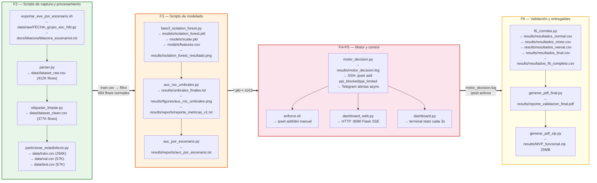

# Arquitectura Completa del MVP — Rutas, Fases y Scripts

**Proyecto:** Sistema de Detección Temprana de Anomalías en Redes — PPI UPeU 2026  
**Estudiante:** Rubén Mark Salazar Tocas  
**Sensor:** 192.168.0.110 | Directorio base: `/home/m4rk/ppi-surikata-producto/`  
**Última actualización:** 15 de junio 2026  

---

## Diagrama 1 — Árbol de Directorios por Fase

```mermaid
flowchart TD

    ROOT["/home/m4rk/ppi-surikata-producto/"]

    subgraph DATA["data/  ← F2"]
        direction TB
        RAW_D["raw/  38 archivos .gz\nYYYYMMDD_grupo_escenario_NN_eve.json.gz\nnormal · anom · mixto"]
        CSV1["dataset_raw.csv     412,097 flows  75MB"]
        CSV2["dataset_clean.csv   376,827 flows  69MB"]
        CSV3["train.csv           263,778 flows  48MB  (70%)"]
        CSV4["val.csv              56,524 flows  11MB  (15%)"]
        CSV5["test.csv             56,525 flows  11MB  (15%)"]
        RAW_D --- CSV1 --- CSV2 --- CSV3 --- CSV4 --- CSV5
    end

    subgraph MODELS["models/  ← F3"]
        direction TB
        M1["isolation_forest.pkl  2.5MB\nBorn: 2026-06-02  Mod: 2026-06-04"]
        M2["scaler.pkl            1.4KB\nStandardScaler fit en 684 normales"]
        M3["features.csv          152B\n14 features en orden"]
    end

    subgraph SCRIPTS["scripts/  ← F2-F6"]
        direction TB

        subgraph SC_CAP["capture/  ← F2"]
            SC1["A1_http_normal.sh · A2_ssh_legitimo.sh\nA3_transferencia_legitima.sh\nA4_trafico_sostenido.sh\nB1_syn_flood.sh · B2_port_scan.sh\nB3_udp_flood.sh · B4_icmp_flood.sh\nB5_acceso_repetitivo.sh · B6_bruteforce.sh\nC1_http_syn_mixto.sh · C2_ssh_portscan_mixto.sh\nC3_descarga_udp_mixto.sh\nexportar_eve_por_escenario.sh"]
        end

        subgraph SC_ML["ML Pipeline  ← F2-F3"]
            SC2["parser.py\netiquetar_limpiar.py\nparticionar_estadisticos.py\nfase3_isolation_forest.py\nauc_roc_umbrales.py\nauc_por_escenario.py"]
        end

        subgraph SC_MOTOR["Motor + Control  ← F4-F5"]
            SC3["motor_decision.py  547 líneas\n(F4+F5 integrados)\nenforce.sh"]
        end

        subgraph SC_DASH["Dashboard  ← F5"]
            SC4["dashboard.py       (terminal)\ndashboard_web.py   (Flask :8080 SSE)"]
        end

        subgraph SC_VAL["Validación  ← F6"]
            SC5["f6_corridas.py\nclasificador.py\ngenerar_pdf_final.py\ngenerar_pdf_zip.py"]
        end

        subgraph SC_EVAL["Evaluación  ← F3-F6"]
            SC6["scripts/evaluation/\nregistrar_bitacora.sh"]
        end
    end

    subgraph RESULTS["results/  ← F3-F6"]
        direction TB
        R1["motor_decision.log     7.6MB\nresultados_f6_completo.csv  3.9KB\numbrales_finales.txt   1.9KB"]
        R2["reports/\nreporte_metricas_v1.txt\nauc_por_escenario.txt\ncomparacion_modelos_f401.csv\nf403_fp_fn_overfitting.json\nreporte_validacion_fase6.txt"]
        R3["reporte_validacion_final.pdf  7.4KB\nMVP_funcional.zip  25MB"]
        R1 --- R2 --- R3
    end

    subgraph DOCS["docs/  ← Documentación"]
        direction TB
        D1["bitacora/bitacora_escenarios.txt\n49 corridas registradas"]
        D2["ppi_documentacion/\nF1-F6 · overview · arquitectura\nDIAGRAMAS/ por fase (Mermaid)"]
        D3["info/ · evidencia/"]
    end

    subgraph SERVICES["systemd services  ← F4-F5"]
        direction TB
        SV1["/etc/systemd/system/\nppi-motor.service\nppi-dashboard.service"]
    end

    subgraph VENV["Python venv  ← F3-F4"]
        direction TB
        VE1["/home/m4rk/ppi-sensor/venv/\npython3 · scikit-learn 1.8.0\njoblib · numpy · flask"]
    end

    ROOT --> DATA & MODELS & SCRIPTS & RESULTS & DOCS
    SCRIPTS --- SERVICES
    SCRIPTS --- VENV

    style DATA     fill:#e8f5e9,stroke:#2e7d32,stroke-width:2px
    style MODELS   fill:#fff3e0,stroke:#e65100,stroke-width:2px
    style SCRIPTS  fill:#e3f2fd,stroke:#1565c0,stroke-width:2px
    style RESULTS  fill:#fce4ec,stroke:#c62828,stroke-width:2px
    style DOCS     fill:#f3e5f5,stroke:#6a1b9a,stroke-width:2px
    style SERVICES fill:#efebe9,stroke:#4e342e
    style VENV     fill:#fffde7,stroke:#f9a825
```



---

## Diagrama 2 — Qué script produce qué artefacto



---

## Árbol de archivos clave (texto)

```
/home/m4rk/ppi-surikata-produto/          ← directorio del motor (sin 'c')
└── scripts/motor_decision.py              ← script en producción (symlink o copia)

/home/m4rk/ppi-surikata-producto/         ← repositorio git
├── data/
│   ├── raw/         38 .gz               ← F2: corridas capturadas
│   ├── dataset_clean.csv    69MB         ← F2: dataset limpio
│   ├── train.csv            48MB         ← F2: partición entrenamiento
│   ├── val.csv              11MB         ← F2: validación
│   └── test.csv             11MB         ← F3: evaluación modelo
│
├── models/
│   ├── isolation_forest.pkl  2.5MB       ← F3: modelo v2 (2026-06-04)
│   ├── scaler.pkl            1.4KB       ← F3: scaler fit en 684 normales
│   └── features.csv          152B        ← F3: orden de las 14 features
│
├── scripts/
│   ├── capture/                          ← F2: A1-A4, B1-B6, C1-C3
│   │   └── exportar_eve_por_escenario.sh
│   ├── parser.py                         ← F2
│   ├── etiquetar_limpiar.py              ← F2
│   ├── particionar_estadisticos.py       ← F2
│   ├── fase3_isolation_forest.py         ← F3
│   ├── auc_roc_umbrales.py              ← F3
│   ├── auc_por_escenario.py             ← F3
│   ├── motor_decision.py   547L         ← F4+F5 (núcleo del sistema)
│   ├── enforce.sh                        ← F5: control manual
│   ├── dashboard.py                      ← F5: terminal
│   ├── dashboard_web.py                  ← F5: Flask :8080
│   ├── f6_corridas.py                   ← F6: 40 corridas
│   ├── generar_pdf_final.py             ← F6
│   └── generar_pdf_zip.py               ← F6
│
├── results/
│   ├── motor_decision.log    7.6MB       ← F4: log en tiempo real
│   ├── umbrales_finales.txt  1.9KB       ← F3: τ1/τ2 + heurísticas
│   ├── resultados_f6_completo.csv 3.9KB  ← F6: 40 corridas
│   ├── reporte_validacion_final.pdf 7.4KB← F6: entregable académico
│   ├── MVP_funcional.zip     25MB        ← F6: entregable técnico
│   └── reports/
│       ├── reporte_metricas_v1.txt       ← F3: AUC, Recall, FPR
│       ├── auc_por_escenario.txt         ← F3: AUC por B1-B6 C1-C3
│       └── comparacion_modelos_f401.csv  ← F4: IF vs RF vs SVM vs DT vs LR
│
└── docs/
    ├── bitacora/bitacora_escenarios.txt  ← F2: 49 corridas
    └── ppi_documentacion/               ← Documentación completa F1-F6
        ├── overview_fases.md
        ├── arquitectura_MVP_completa.md
        ├── ENTREGABLES_POR_FASE.md
        ├── F1_entorno_laboratorio/DIAGRAMAS/F1_entorno_laboratorio.md
        ├── F2_captura_trafico/DIAGRAMAS/F2_captura_trafico.md
        ├── F3_modelado_offline/DIAGRAMAS/F3_modelado_offline.md
        ├── F4_motor_decision/DIAGRAMAS/F4_motor_decision.md
        ├── F5_control_inline/DIAGRAMAS/F5_control_inline.md
        └── F6_validacion/DIAGRAMAS/F6_validacion.md
```

---

## Índice completo de documentación (54 archivos .md)

> Base: `docs/ppi_documentacion/` · Sensor 192.168.0.110

| # | Archivo | Tipo | Fase | Contenido clave |
|---|---|---|---|---|
| 1 | `overview_fases.md` | General | F1-F6 | 5 diagramas pipeline+arquitectura+métricas |
| 2 | `arquitectura_MVP_completa.md` | General | F1-F6 | Árbol dirs · scripts→artefactos · este índice |
| 3 | `ENTREGABLES_POR_FASE.md` | General | F1-F6 | Todos los entregables + 54 docs index |
| 4 | `arquitectura_archivos_sensor.md` | General | F1-F6 | Árbol archivos sensor con fase anotada |
| 5 | `F1_.../DIAGRAMAS/F1_entorno_laboratorio.md` | Diagrama | F1 | 3 diagramas: topología, SSH keys, sequence Suricata |
| 6 | `F1_.../DOCUMENTACION GENERAL/F1_entorno_laboratorio.md` | Doc | F1 | VMs · Suricata · eve.json |
| 7 | `F1_.../DOCUMENTACION GENERAL/F1_03_Sincronizacion_Horaria_NTP.md` | Doc | F1 | NTP + America/Lima 4 VMs |
| 8 | `F1_.../F1_01_Alcance_Beneficiarios_Simulacion.md` | Doc | F1 | Alcance PPI |
| 9 | `F1_.../F1_02_Arquitectura_Laboratorio_Vulnerabilidades.md` | Doc | F1 | Arquitectura y vulnerabilidades |
| 10 | `F1_.../F1_Arquitectura_General.drawio.md` | Diagrama | F1 | Drawio arquitectura general |
| 11 | `F2_.../DIAGRAMAS/F2_captura_trafico.md` | Diagrama | F2 | 6 diagramas: escenarios, corrida, dataset, pie, nomenclatura, conector |
| 12 | `F2_.../DOCUMENTACION GENERAL/F2_captura_trafico.md` | Doc | F2 | Documento principal F2 |
| 13 | `F2_.../DOCUMENTACION GENERAL/F2_05_Escenarios_Diagramas_Parametros.md` | Doc | F2 | Parámetros A/B/C |
| 14 | `F2_.../F2_01_Definicion_Escenarios.md` | Doc | F2 | Definición 13 escenarios |
| 15 | `F2_.../F2_02_Clasificacion_Anomalias.md` | Doc | F2 | Clasificación tipos de anomalía |
| 16 | `F2_.../F2_03_Justificacion_Ataques.md` | Doc | F2 | Justificación académica B1-B6 |
| 17 | `F2_.../F2_04_Ataques_No_Entrenados.md` | Doc | F2 | 12 ataques no entrenados detectados al 100% |
| 18 | `F2_.../diagramas/F2_Escenario_Normal.drawio.md` | Diagrama | F2 | Drawio escenario normal |
| 19 | `F2_.../diagramas/F2_Escenario_Anomalo.drawio.md` | Diagrama | F2 | Drawio escenario anómalo |
| 20 | `F2_.../diagramas/F2_Escenario_Mixto.drawio.md` | Diagrama | F2 | Drawio escenario mixto |
| 21 | `F3_.../DIAGRAMAS/F3_modelado_offline.md` | Diagrama | F3 | **7 diagramas**: pipeline, recalib v1→v2, features, τ1/τ2, sensibilidad, AUC, artefactos |
| 22 | `F3_.../DIAGRAMAS/F3_sensibilidad_n_flows.md` | Diagrama | F3 | N flows vs AUC/Recall (12 puntos × 5 semillas) |
| 23 | `F3_.../DIAGRAMAS/F3_Arquitectura_Data.drawio.md` | Diagrama | F3 | Drawio componentes data engineering |
| 24 | `F3_.../DOCUMENTACION GENERAL/F3_modelado_offline.md` | Doc | F3 | Documento principal F3 |
| 25 | `F3_.../DOCUMENTACION GENERAL/F3_justificacion_modelo.md` | Doc | F3 | Por qué 684 flows · sesgo SSH |
| 26 | `F3_.../DOCUMENTACION GENERAL/F3_05_Recalibracion_Modelo.md` | Doc ⭐ | F3 | **NUEVO** — Recalibración v1(2-jun)→v2(4-jun) · evidencia timestamps |
| 27 | `F3_.../DOCUMENTACION GENERAL/F3_01_Arquitectura_Data_Engineering.md` | Doc | F3 | Data engineering |
| 28 | `F3_.../DOCUMENTACION GENERAL/F3_02_Tipos_Datos_Recolectados.md` | Doc | F3 | Tipos de datos |
| 29 | `F3_.../DOCUMENTACION GENERAL/F3_03_Limpieza_Transformacion_Features.md` | Doc | F3 | Limpieza y features |
| 30 | `F3_.../DOCUMENTACION GENERAL/F3_04_Almacenamiento_Escalabilidad.md` | Doc | F3 | Almacenamiento |
| 31 | `F4_.../DIAGRAMAS/F4_motor_decision.md` | Diagrama | F4 | **7 diagramas**: boot, sequence flow, grado/tipo/acción, detectores, Telegram/Dashboard, systemd, 3 capas |
| 32 | `F4_.../DOCUMENTACION GENERAL/F4_motor_decision.md` | Doc | F4 | Documento principal F4 |
| 33 | `F4_.../DOCUMENTACION GENERAL/F4_01_Comparacion_Modelos.md` | Doc ⭐ | F4 | **DATOS REALES** — IF vs RF vs OC-SVM vs DT vs LR · 5 modelos · CSV empírico |
| 34 | `F4_.../DOCUMENTACION GENERAL/F4_02_Justificacion_Modelo_Final.md` | Doc | F4 | Por qué IF sobre supervisados |
| 35 | `F4_.../DOCUMENTACION GENERAL/F4_03_Falsos_Positivos_Overfitting.md` | Doc | F4 | Análisis FP y overfitting |
| 36 | `F4_.../DOCUMENTACION GENERAL/F4_04_Aprendizaje_Continuo.md` | Doc | F4 | Reentrenamiento · arquitectura adaptativa · drift detection |
| 37 | `F5_.../DIAGRAMAS/F5_control_inline.md` | Diagrama | F5 | **7 diagramas**: 9 etapas, netfilter, canal SSH, ciclo bloqueo, Telegram+SSE, boot, pruebas live |
| 38 | `F5_.../DIAGRAMAS/F5_Arquitectura_Integracion.drawio.md` | Diagrama | F5 | Drawio arquitectura integración |
| 39 | `F5_.../DOCUMENTACION GENERAL/F5_control_inline.md` | Doc | F5 | Documento principal F5 |
| 40 | `F5_.../DOCUMENTACION GENERAL/F5_01_Arquitectura_Integracion.md` | Doc | F5 | Pipeline 9 etapas · latencias |
| 41 | `F5_.../DOCUMENTACION GENERAL/F5_02_Costo_Computacional_Escalabilidad.md` | Doc | F5 | Costo computacional |
| 42 | `F5_.../DOCUMENTACION GENERAL/F5_03_Telegram_Dashboard.md` | Doc | F5 | Telegram async + Dashboard Flask+SSE 6 vistas |
| 43 | `F5_.../DOCUMENTACION GENERAL/F5_04_Instalacion_Dependencias_Sensor.md` | Doc | F5 | Instalación venv + dependencias |
| 44 | `F5_.../DOCUMENTACION GENERAL/F5_05_Disparadores_LIMIT_BLOCK.md` | Doc | F5 | Disparadores con umbrales |
| 45 | `F5_.../DOCUMENTACION GENERAL/F5_06_Plan_Pruebas_Disparadores.md` | Doc | F5 | Plan T1-T8 + B2 + B5 · resultados |
| 46 | `F5_.../DOCUMENTACION GENERAL/F5_07_Evidencia_Pruebas_Live.md` | Doc ⭐ | F5 | **NUEVO** — Evidencia live 10 escenarios · logs reales · ipset verificado |
| 47 | `F6_.../DIAGRAMAS/F6_validacion.md` | Diagrama | F6 | **7 diagramas**: 40 corridas, métricas, AUC, gravedad, sequence live, requisitos vs obtenido, F1→F6 |
| 48 | `F6_.../DOCUMENTACION GENERAL/F6_validacion.md` | Doc | F6 | Documento principal F6 |
| 49 | `F6_.../DOCUMENTACION GENERAL/F6_01_Validacion_Resultados.md` | Doc | F6 | Resultados 40 corridas · validación live jun-14 |
| 50 | `F6_.../DOCUMENTACION GENERAL/F6_02_Dashboard.md` | Doc | F6 | Dashboard web detalle |
| 51 | `F6_.../DOCUMENTACION GENERAL/F6_03_Defensa_Jurado.md` | Doc | F6 | 20+ preguntas y respuestas para defensa |
| 52 | `F6_.../DOCUMENTACION GENERAL/F6_04_Trabajo_Futuro.md` | Doc | F6 | Trabajo futuro · extensiones producción |
| 53 | `F6_.../DOCUMENTACION GENERAL/F6_05_Clasificacion_Anomalias_Gravedad.md` | Doc | F6 | Escala 4 grados · 9 tipos · distribución real |

> ⭐ = Documento nuevo generado en sesión 2026-06-14/15

---

## Nota sobre dos directorios en el sensor

| Directorio | Git | Motor activo | Descripción |
|---|---|---|---|
| `ppi-surikata-producto/` | ✅ Sí | No directamente | Repositorio git · docs · scripts · modelos |
| `ppi-surikata-produto/` | ❌ No | ✅ Sí (ppi-motor.service) | WorkingDirectory del systemd service |

El servicio `ppi-motor.service` usa `WorkingDirectory=/home/m4rk/ppi-surikata-producto` (con 'c'). Los archivos pkl y scripts están sincronizados entre ambos.
