# Overview — Pipeline Completo F1 → F6

**Sistema de Detección Temprana de Comportamientos Anómalos en Redes de Datos**
Universidad Peruana Unión · PPI 2026 · Rubén Mark Salazar Tocas

---

## Diagrama general

```mermaid
flowchart LR

    subgraph F1["F1 — Entorno de Laboratorio\n10 may 2026"]
        F1A["VMs · 192.168.0.0/24\nSuricata 7.0.3 en ens35\nnginx :80 · SSH :22"]
        F1B["/etc/suricata/suricata.yaml\n/var/log/suricata/eve.json\nscripts/validation/\nsuricata_revision.txt"]
        F1A --> F1B
    end

    subgraph F2["F2 — Captura de Tráfico\n2-4 jun 2026"]
        F2A["13 escenarios A/B/C\nscripts/capture/\n49 corridas en bitácora"]
        F2B["data/raw/ 38 archivos .gz\nparser · etiquetar · particionar\ndataset_clean.csv 376,827 flows"]
        F2A --> F2B
    end

    subgraph F3["F3 — Modelado Offline\n2-4 jun 2026"]
        F3A["scripts/fase3_isolation_forest.py\n684 flows normales\nn_estimators=300 contamination=0.05"]
        F3B["models/isolation_forest.pkl  2.5MB\nmodels/scaler.pkl  1.4KB\nAUC-ROC=0.9440 · τ1=-0.4973 · τ2=-0.6873"]
        F3A --> F3B
    end

    subgraph F4["F4 — Motor de Decisión\n2-4 jun 2026 · mejora 8 jun 2026"]
        F4A["scripts/motor_decision.py\ntail eve.json · extract_features\nscore_samples · decidir · explicar_anomalia\ndetectores SSH/HTTP"]
        F4B["ppi-motor.service  activo\nresults/motor_decision.log  7.6MB\nTelegram · dashboard.py"]
        F4A --> F4B
    end

    subgraph F5["F5 — Control Inline\n2-4 jun 2026"]
        F5A["SSH sensor→servidor\nipset ppi_blocked · ppi_limited\ntimeout=300s automático"]
        F5B["iptables DROP ppi_blocked\niptables hashlimit 100pkt/s\nscripts/enforce.sh · umbrales_finales.txt"]
        F5A --> F5B
    end

    subgraph F6["F6 — Validación\n2-4 jun 2026"]
        F6A["scripts/f6_corridas.py\n40 corridas · 4 grupos × 10\nDisponibilidad=100% · ITL=0% · TIE=100%"]
        F6B["results/resultados_f6_completo.csv\nresults/reporte_validacion_final.pdf\nresults/MVP_funcional.zip  25MB"]
        F6A --> F6B
    end

    F1B ===>|"/var/log/suricata/eve.json\nentrada de corridas A/B/C"| F2A
    F2B ===>|"data/raw/*_normal_*\n684 flows filtrados"| F3A
    F3B ===>|"models/*.pkl\nTAU1=-0.4973 TAU2=-0.6873"| F4A
    F4B ===>|"bloquear_ip()\nlimitar_ip()"| F5A
    F5B ===>|"sistema operativo\nlisto para validar"| F6A

    style F1 fill:#e3f2fd,stroke:#1565c0
    style F2 fill:#e8f5e9,stroke:#2e7d32
    style F3 fill:#fff3e0,stroke:#e65100
    style F4 fill:#fce4ec,stroke:#c62828
    style F5 fill:#f3e5f5,stroke:#6a1b9a
    style F6 fill:#fffde7,stroke:#f9a825
```

---

## Conectores entre fases — detalle

| Conector | Desde | Hacia | Qué se transfiere |
|---|---|---|---|
| **eve.json** | F1 | F2 | `/var/log/suricata/eve.json` — Suricata captura el tráfico generado por los scripts A/B/C; `exportar_eve_por_escenario.sh` lo copia a `data/raw/` al final de cada corrida |
| **data/raw/*.gz** | F2 | F3 | 38 archivos `.gz` en `data/raw/` — `fase3_isolation_forest.py` filtra los de prefijo `normal` y aplica filtro `src_ip ∈ {192.168.0.20}` para obtener 684 flows puros de entrenamiento |
| **models/*.pkl + τ** | F3 | F4 | `models/isolation_forest.pkl` y `models/scaler.pkl` cargados con `joblib.load()` al iniciar el motor; `TAU1=-0.4973` y `TAU2=-0.6873` hardcodeados en `motor_decision.py` |
| **bloquear_ip() / limitar_ip()** | F4 | F5 | El motor llama `_ssh('sudo ipset add ppi_blocked IP timeout 300')` vía SSH desde el sensor al servidor `192.168.0.120`; el kernel aplica DROP o hashlimit inmediatamente |
| **sistema operativo** | F5 | F6 | Con ipset e iptables configurados y el motor corriendo, `f6_corridas.py` ejecuta los 40 experimentos leyendo `motor_decision.log` para extraer métricas por corrida |

---

## Resumen de entregables por fase

| Fase | Entregable principal | Ruta en sensor | Tamaño |
|---|---|---|---|
| F1 | Evidencia formal Suricata | `scripts/validation/suricata_revision.txt` | — |
| F2 | Dataset limpio + bitácora | `data/dataset_clean.csv` · `docs/bitacora/bitacora_escenarios.txt` | 69 MB |
| F3 | Modelo + métricas | `models/isolation_forest.pkl` · `results/reports/reporte_metricas_v1.txt` | 2.5 MB |
| F4 | Motor en producción | `scripts/motor_decision.py` · `results/motor_decision.log` | 7.6 MB log |
| F5 | Control inline | `scripts/enforce.sh` · `results/umbrales_finales.txt` | — |
| **F6** | **PDF + ZIP del MVP** | `results/reporte_validacion_final.pdf` · `results/MVP_funcional.zip` | **7.4 KB + 25 MB** |

---

## Estado actual del sistema (verificado 2026-06-08)

| Componente | VM | Estado |
|---|---|---|
| Suricata 7.0.3 | 192.168.0.110 | ✅ active — eve.json 136 MB en tiempo real |
| ppi-motor.service | 192.168.0.110 | ✅ active — detectando flows |
| nginx :80 | 192.168.0.120 | ✅ active — HTTP 200 |
| openssh-server :22 | 192.168.0.120 | ✅ active |
| ipset ppi_blocked | 192.168.0.120 | ✅ configurado — 0 IPs activas |
| ipset ppi_limited | 192.168.0.120 | ✅ configurado — 0 IPs activas |
| iptables DROP/hashlimit | 192.168.0.120 | ✅ reglas líneas 1 y 2 activas |
