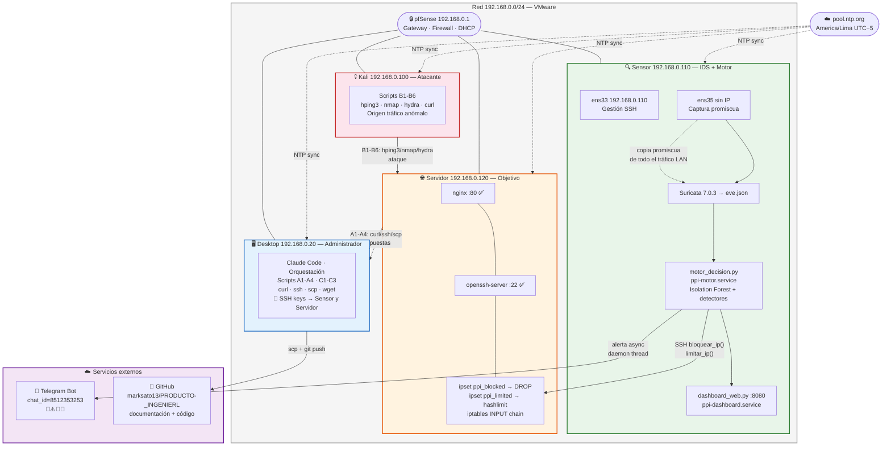
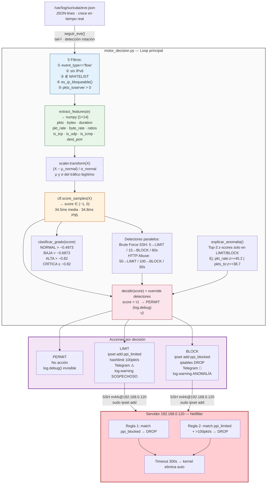
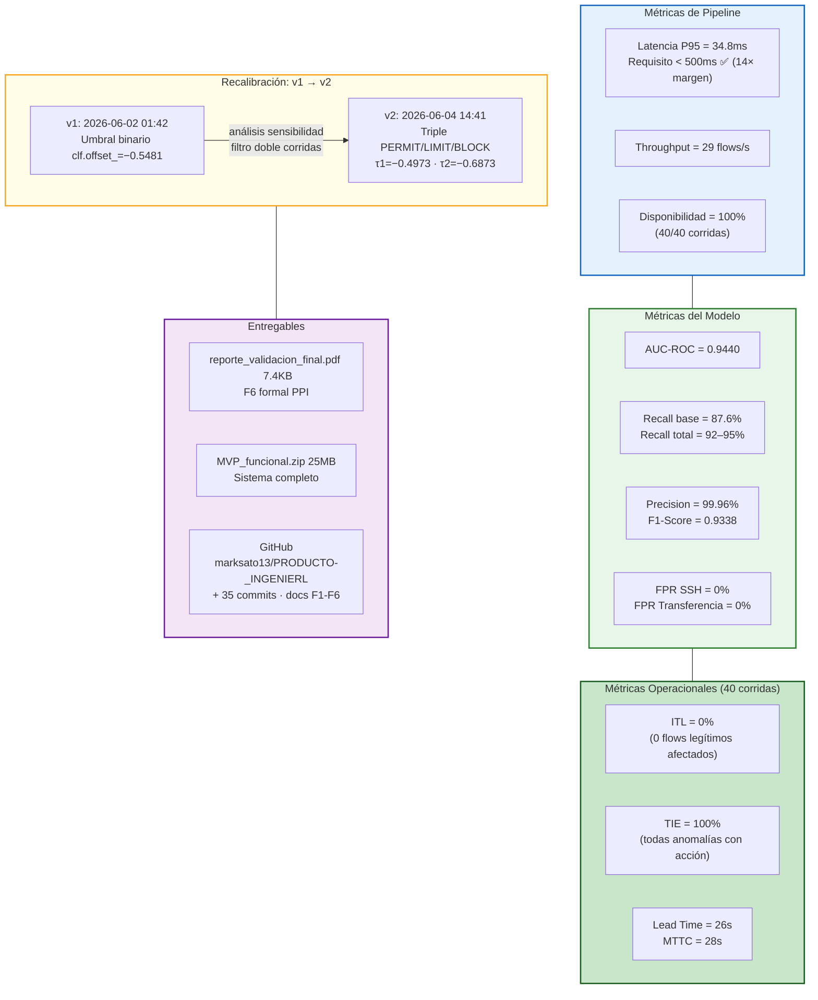

# Overview — Pipeline Completo F1 → F6

**Sistema de Detección Temprana de Comportamientos Anómalos en Redes de Datos**  
**Universidad Peruana Unión · PPI 2026 · Rubén Mark Salazar Tocas**  
**Asesores:** Ing. Nemias Saboya Rios · Ing. Fernando Manuel Asin Gomez  
**Última actualización:** 15 de junio 2026  

---

## Diagrama 1 — Pipeline General F1 → F6 con Scripts y Artefactos

```mermaid
flowchart LR

    subgraph F1["F1 — Entorno\n10 may 2026"]
        direction TB
        F1A["🔍 Suricata 7.0.3\nens35 promiscua\n192.168.0.110"]
        F1B["/var/log/suricata/eve.json\nJSON-lines · tiempo real\nflow|alert|ssh|stats"]
        F1C["revisar_suricata.sh\n→ suricata_revision.txt\nNTP America/Lima\nSSH keys Desktop↔Sensor/Server"]
        F1A --> F1B --> F1C
    end

    subgraph F2["F2 — Captura\n2-4 jun 2026"]
        direction TB
        F2A["13 escenarios A/B/C\n38 corridas · 49 bitácora\nexportar_eve_por_escenario.sh"]
        F2B["parser.py\n412,097 flows · 75MB"]
        F2C["etiquetar_limpiar.py\n376,827 flows · 69MB\n(dedup · IP inválidas)"]
        F2D["particionar_estadisticos.py\ntrain 70% · val 15% · test 15%\ncronológico sin leakage"]
        F2A --> F2B --> F2C --> F2D
    end

    subgraph F3["F3 — Modelo\n2-4 jun 2026"]
        direction TB
        F3A["fase3_isolation_forest.py\n684 flows normales\n(corridas 01-02 · src_ip Desktop)"]
        F3B["StandardScaler\n→ scaler.pkl  1.4KB"]
        F3C["IsolationForest\nn=300 contam=0.05\n→ isolation_forest.pkl  2.5MB"]
        F3D["auc_roc_umbrales.py\nAUC=0.9440\nτ1=−0.4973 · τ2=−0.6873"]
        F3A --> F3B --> F3C --> F3D
    end

    subgraph F4["F4 — Motor\n2-4 jun 2026"]
        direction TB
        F4A["motor_decision.py\n547 líneas\nPID activo como ppi-motor.service"]
        F4B["Filtros (5)\nWhitelist · IPv4 · es_ip_bloqueable\npkts_toserver > 0"]
        F4C["Pipeline: extract→scale→score\nLatencia P95=34.8ms"]
        F4D["3 Capas decisión:\nIF score · Det.SSH · Det.HTTP\n+ Telegram async 🚨⚠️"]
        F4A --> F4B --> F4C --> F4D
    end

    subgraph F5["F5 — Control\n2-4 jun 2026"]
        direction TB
        F5A["SSH sensor→servidor\nbloquear_ip() · limitar_ip()"]
        F5B["ipset ppi_blocked\niptables DROP total"]
        F5C["ipset ppi_limited\nhashlimit 100pkt/s"]
        F5D["enforce.sh manual\ntimeout 300s auto\nDashboard :8080 SSE"]
        F5A --> F5B & F5C --> F5D
    end

    subgraph F6["F6 — Validación\n2-4 jun 2026"]
        direction TB
        F6A["f6_corridas.py\n40 corridas · 4 grupos × 10"]
        F6B["resultados_f6_completo.csv\nDisp=100% · ITL=0%\nTIE=100% · Lead=26s"]
        F6C["reporte_validacion_final.pdf\nMVP_funcional.zip  25MB"]
        F6A --> F6B --> F6C
    end

    F1B ===>|"eve.json\ncada corrida"| F2A
    F2D ===>|"data/raw/\n684 flows normales\ncorridas 01-02"| F3A
    F3D ===>|"*.pkl\nτ1 · τ2"| F4A
    F4D ===>|"bloquear/limitar\nvía SSH"| F5A
    F5D ===>|"sistema operativo\n40 corridas"| F6A

    style F1 fill:#e3f2fd,stroke:#1565c0,stroke-width:2px
    style F2 fill:#e8f5e9,stroke:#2e7d32,stroke-width:2px
    style F3 fill:#fff3e0,stroke:#e65100,stroke-width:2px
    style F4 fill:#fce4ec,stroke:#c62828,stroke-width:2px
    style F5 fill:#f3e5f5,stroke:#6a1b9a,stroke-width:2px
    style F6 fill:#fffde7,stroke:#f9a825,stroke-width:2px
```

---

## Diagrama 2 — Arquitectura Física del Laboratorio

---

## Diagrama 3 — Flujo de Datos Completo: eve.json → Acción

---

## Diagrama 4 — Las 3 Capas de Detección + Telegram + Dashboard

```mermaid
flowchart LR

    FLOW["Flow\nevento\neve.json"]

    subgraph CAPA1["Capa 1 — Modelo IF\n(score continuo −1→0)"]
        direction TB
        C1A["✅ B1 SYN Flood  AUC=0.9529"]
        C1B["✅ B2 Port Scan  AUC=0.9721"]
        C1C["✅ B3 UDP Flood  AUC=0.9905"]
        C1D["✅ B4 ICMP Flood AUC=0.9861"]
        C1E["✅ C1 C2 C3 Mixtos"]
        C1F["⚠️ B5 HTTP Abuse Det=56%"]
        C1G["⚠️ B6 BruteForce Det=0.9%"]
    end

    subgraph CAPA2["Capa 2 — Detector SSH\n(ventana 60s)"]
        direction TB
        C2A["5  intentos → LIMIT"]
        C2B["15 intentos → BLOCK"]
        C2C["✅ B6 BruteForce → ~90%"]
    end

    subgraph CAPA3["Capa 3 — Detector HTTP\n(ventana 30s)"]
        direction TB
        C3A["50  req/30s → LIMIT"]
        C3B["100 req/30s → BLOCK"]
        C3C["✅ B5 HTTP Abuse → ~80%"]
    end

    subgraph RESULTADO["Resultado Combinado"]
        direction TB
        R1["Recall base IF:   80.4%"]
        R2["+ SSH detector:  +~10%"]
        R3["+ HTTP detector: +~4%"]
        R4["Recall total:  ~92-95%"]
        R5["Precision:     99.96%"]
        R6["ITL:           0%"]
        R1 --> R2 --> R3 --> R4
    end

    subgraph NOTIF["Notificaciones"]
        direction TB
        TG2["📱 Telegram Bot\n🚨 BLOCK · ⚠️ LIMIT\n🔑 BruteForce · 🌐 HTTP\nCola async daemon\n300-800ms"]
        DW["🖥️ Dashboard Web :8080\nFlask + SSE\nAuto-refresca 150ms\n6 vistas: alerts/control/análisis"]
        DT2["📟 Dashboard Terminal\ndashboard.py cada 3s\nStats en tiempo real"]
    end

    FLOW --> CAPA1 & CAPA2 & CAPA3
    CAPA1 & CAPA2 & CAPA3 --> RESULTADO
    RESULTADO --> NOTIF

    style CAPA1    fill:#e8f5e9,stroke:#2e7d32,stroke-width:2px
    style CAPA2    fill:#fce4ec,stroke:#c62828,stroke-width:2px
    style CAPA3    fill:#fff3e0,stroke:#e65100,stroke-width:2px
    style RESULTADO fill:#c8e6c9,stroke:#1b5e20,stroke-width:2px
    style NOTIF    fill:#e1f5fe,stroke:#0277bd,stroke-width:2px
```

---

## Diagrama 5 — Resumen de Métricas Finales

---

## Conectores entre fases

| Conector | Desde | Hacia | Artefacto transferido |
|---|---|---|---|
| **eve.json** | F1 | F2 | `/var/log/suricata/eve.json` — `exportar_eve_por_escenario.sh` gzip+rota al fin de cada corrida |
| **data/raw/*.gz** | F2 | F3 | 38 archivos · `fase3_isolation_forest.py` filtra corridas 01-02 + src_ip Desktop → 684 flows |
| **models/*.pkl + τ** | F3 | F4 | `isolation_forest.pkl` + `scaler.pkl` por `joblib.load()` · TAU1=−0.4973 TAU2=−0.6873 hardcoded |
| **bloquear/limitar** | F4 | F5 | `_ssh('sudo ipset add ppi_blocked IP timeout 300')` via subprocess SSH |
| **sistema activo** | F5 | F6 | ipsets + iptables configurados · motor corriendo · `f6_corridas.py` mide desde log |

---

## Estado del sistema (verificado 2026-06-15)

| Componente | VM | Estado |
|---|---|---|
| Suricata 7.0.3 | 192.168.0.110 | ✅ active — eve.json tiempo real |
| ppi-motor.service | 192.168.0.110 | ✅ active — P95=34.8ms |
| ppi-dashboard.service | 192.168.0.110 | ✅ active — http://192.168.0.110:8080 |
| Telegram Bot | cloud | ✅ activo — alertas 🚨⚠️🔑🌐 |
| nginx :80 | 192.168.0.120 | ✅ active |
| openssh-server :22 | 192.168.0.120 | ✅ active |
| ipset ppi_blocked | 192.168.0.120 | ✅ configurado · timeout 300s |
| ipset ppi_limited | 192.168.0.120 | ✅ configurado · hashlimit 100/s |
| iptables DROP/hashlimit | 192.168.0.120 | ✅ reglas líneas 1 y 2 activas |
| GitHub repo | cloud | ✅ main · d07e0a4 · docs F1-F6 completos |
