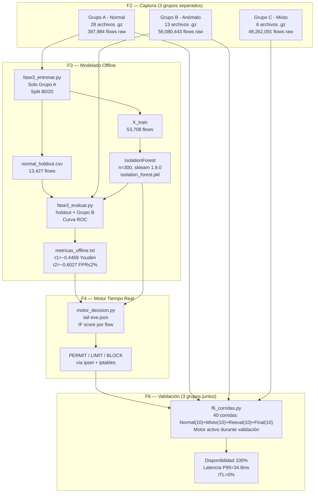

# Overview — Pipeline Completo F1→F6 (Sistema Actual)

**Versión:** 2026-06-17 — Pipeline corregido (sin CSVs intermedios, splits correctos)
**Nota:** El XML Draw.io de esta versión refleja el pipeline **real implementado**.
Ver `docs/METODOLOGIA_PIPELINE_COMPARATIVA.md` para la comparación con el flujo anterior (eliminado).

---

## Scripts reales por fase

| Fase | Script(s) | Entrada | Salida |
|---|---|---|---|
| **F1 — Entorno** | — (configuración manual) | Topología física | Suricata activo, SSH keys |
| **F2 — Captura** | `exportar_eve_por_escenario.sh` | `/var/log/suricata/eve.json` | `data/raw/*_{normal,anom,mixto}_*.gz` |
| **F3 — Modelado** | `fase3_entrenar.py` → `fase3_evaluar.py` → `auc_por_escenario.py` | `data/raw/*_normal_*.gz` (Grupo A) | `models/*.pkl` + `results/metricas_offline.txt` |
| **F4 — Motor** | `motor_decision.py` | `eve.json` live + `models/*.pkl` + `metricas_offline.txt` | `results/motor_decision.log` + ipset actions |
| **F5 — Control** | `enforce.sh` + `dashboard.py` + `dashboard_web.py` | `motor_decision.log` | Bloqueos ipset + visualización |
| **F6 — Validación** | `f6_corridas.py` + `generar_graficas_f6.py` | Motor activo + tráfico A+B+C | `results/resultados_f6_completo.csv` + 7 PNGs |

## Qué grupos se usan en cada fase

| Grupo | F2 Captura | F3 Entrenamiento | F3 Evaluación | F4 Motor | F6 Validación |
|---|---|---|---|---|---|
| **A — Normal** | ✅ captura | ✅ solo este | ✅ holdout 20% | monitor | ✅ 10 corridas |
| **B — Anómalo** | ✅ captura | ❌ NO | ✅ ROC/τ | trigger | ✅ corridas 11-40 |
| **C — Mixto** | ✅ captura | ❌ NO | ❌ NO | operativo | ✅ 10 corridas mixto (11-20) |

> **Estructura interna F6 (`f6_corridas.py`):** 4 fases de 10 corridas:
> Normal(1-10) solo Desktop | Mixto(11-20) Desktop+Kali |
> Reeval(21-30) Kali bloqueada en memoria | Final(31-40) confirmación.
> Los grupos A/B/C de la tabla indican el tipo de tráfico, no las fases internas de F6.

**Principio central:** IF aprende SOLO de tráfico normal (Grupo A). Nunca ve ataques en entrenamiento.

## Splits de datos (flujo real)

```
Grupo A (data/raw/*_normal_*.gz)
  └─ fase3_entrenar.py — Split 80/20 aleatorio (random_state=42)
       ├─ 80% → X_train (53,708 flows) → IsolationForest.fit()
       └─ 20% → data/normal_holdout.csv (13,427 flows) → nunca visto por el modelo

  NO existe: train.csv, val.csv, test.csv (70/15/15)
  NO existe: dataset_raw.csv, dataset_clean.csv
  NO existen: parser.py, etiquetar_limpiar.py, particionar_estadisticos.py
```

## Diagrama Mermaid (pipeline actual)



## Diagrama de imagen (300 DPI)

El archivo `results/comparacion/diagrama_pipeline.png` contiene el diagrama visual completo del pipeline con código de colores por grupo (azul=normal, rojo=anómalo, naranja=mixto, verde=experimento comparativo, morado=F6).

---

**Ver también:**
- `docs/METODOLOGIA_PIPELINE_COMPARATIVA.md` — comparación flujo anterior vs actual
- `results/comparacion/eda_distribucion_grupos.png` — EDA de distribución de flows por grupo
- `results/comparacion/diagrama_pipeline.png` — diagrama de pipeline visual
