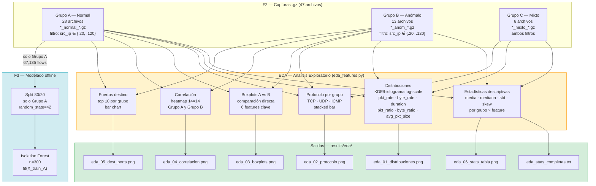

# 05 — EDA Descriptivo de las 14 Features por Grupo

**Sección:** Respuestas al asesor  
**Motivación:** El Ing. Nemias solicitó un análisis exploratorio de los datos antes del modelado.  
**Posición en pipeline:** Entre la extracción de features y el split 80/20 de F3.  
**Script:** `scripts/eda_features.py`  
**Salidas:** `results/eda/` — 6 gráficas PNG + estadísticas en texto  

---

## 1. Por qué el EDA va ANTES del split 80/20

```
F2: capturas .gz
      │
      ▼
Extracción de 14 features
      │
      ▼
◄─── EDA AQUÍ ────►    ← sobre TODOS los datos de cada grupo (sin split)
      │
      ▼
Split 80/20 (solo Grupo A)
      │
      ▼
StandardScaler → Isolation Forest
```

**Razón técnica:** El EDA es exploratorio — su objetivo es entender los datos, no entrenar. Hacerlo sobre el split de entrenamiento sería incorrecto porque:

1. El split 80/20 es para garantizar que el scaler no vea el holdout (evitar data leakage en la escala).
2. El EDA necesita ver **todos** los flows de cada grupo para describir la distribución real.
3. Las estadísticas del EDA (media, mediana, skew) NO se usan en el modelo — solo informan al analista.

**Razón metodológica:** El EDA responde la pregunta "¿qué hay en mis datos?" antes de modelar. Si se hace después del split, solo se describe el 80% y se pierde el panorama completo.

---

## 2. Por qué por GRUPO y no por escenario individual

El asesor señaló que el análisis debería ser por grupo, no por cada uno de los 47 archivos. Esto es correcto por tres razones:

| Nivel | Qué describe | Para qué sirve |
|---|---|---|
| **Por archivo individual** (47 archivos) | Comportamiento de una corrida de 5–15 min | Debugging, troubleshooting |
| **Por grupo A/B/C** | Perfil estadístico del tipo de tráfico | EDA, justificación del modelo |
| **Por tipo de ataque** (sub-análisis de B) | Diferencia entre SYN flood vs port scan | Análisis avanzado (opcional) |

El EDA por grupo (A, B, C) es el nivel correcto para responder: **¿son los datos normales y anómalos distinguibles por sus features?**

---

## 3. Diagrama — posición y salidas del EDA



---

## 4. Los datos disponibles (números reales)

| Grupo | Archivos | Flows totales | Filtro |
|---|---|---|---|
| **A — Normal** | 28 | **67,135** | `src_ip ∈ {192.168.0.20, 192.168.0.120}` |
| **B — Anómalo** | 13 | **906,188** (raw) / 598,285 usados | `src_ip ∉ {192.168.0.20, 192.168.0.120}` |
| **C — Mixto** | 6 | Normal + Anómalo simultáneos | Ambos filtros separados |
| **TOTAL** | 47 | **919,615** | — |

**Desbalance:** Ratio 1:67.5 (normal vs anómalo) — favorable para paradigma one-class.

---

## 5. Hallazgos clave del EDA (con datos reales)

### 5.1 Estadísticas descriptivas — valores reales por feature

Los siguientes valores provienen de `results/comparacion/01_analisis_dataset.txt` (calculado sobre 13,427 normales del holdout y 906,188 anómalos).

| Feature | Normal (mediana) | Anómalo (mediana) | Ratio | Discrimina |
|---|---|---|---|---|
| `pkts_toserver` | 7.0 | 1.0 | 0.1× | ✅ SÍ |
| `pkts_toclient` | 5.0 | 0.0 | 0.0× | ✅ SÍ |
| `bytes_toserver` | 790.0 | 60.0 | 0.1× | ✅ SÍ |
| `bytes_toclient` | 826.0 | 0.0 | 0.0× | ✅ SÍ |
| `duration` | 0.044 s | 0.001 s | 0.0× | ✅ SÍ |
| `pkt_rate` | 330.4 pkt/s | 1,000 pkt/s | 3.0× | ✅ SÍ |
| `byte_rate` | 39,794 B/s | 60,000 B/s | 1.5× | ✅ SÍ |
| `pkt_ratio` | 1.17 | 1.00 | 0.9× | ✅ SÍ |
| **`byte_ratio`** | **0.96** | **60.0** | **62.8× ⭐** | **✅ SÍ** |
| `avg_pkt_size` | 124.4 B | 30.0 B | 0.2× | ✅ SÍ |
| `is_tcp` | 1.00 (100%) | 0.44 (44%) | — | ✅ SÍ |
| `is_udp` | 0.00 (0%) | 0.33 (33%) | — | ✅ SÍ |
| `is_icmp` | 0.00 (0%) | 0.24 (24%) | — | ✅ SÍ |
| `dest_port` | 8,080 | 53 | — | ✅ SÍ |

**Resultado: 14/14 features son estadísticamente discriminantes (p<0.001, Mann-Whitney U)**

### 5.2 Feature más discriminante: `byte_ratio`

```
byte_ratio = bytes_toserver / (bytes_toclient + 1)

Normal:   mediana = 0.96   → tráfico BIDIRECCIONAL (request ≈ response)
Anómalo:  mediana = 60.0   → tráfico UNIDIRECCIONAL (solo envío, sin respuesta)
          ratio   = 62.8×  ← diferencia más grande de todas las features
```

**Por qué:** Los ataques de flood (SYN, UDP, ICMP) envían paquetes masivamente pero no reciben respuesta del servidor (conexiones half-open). El tráfico normal es bidireccional (curl envía GET, servidor responde con 200 OK).

### 5.3 Distribuciones altamente asimétricas (skew)

| Feature | Skew Normal | Skew Anómalo | Implicación |
|---|---|---|---|
| `pkts_toserver` | 46.6 | 3.3 | Log-scale obligatorio |
| `bytes_toclient` | 66.8 | 3.6 | Heavy-tail en normal |
| `duration` | 50.1 | 3.3 | Mayoria de flows son muy cortos |
| `byte_rate` | 45.2 | 2.9 | No aplica distribución normal |
| `byte_ratio` | 11.9 | **45.6** | Extrema asimetría en anómalos |

**Implicación para el modelo:** Ninguna distribución es gaussiana. Esto justifica usar `StandardScaler` (que normaliza sin asumir gaussianidad) en lugar de transformaciones que sí lo asumen. Isolation Forest funciona bien con datos skewed porque usa particiones aleatorias, no distancias.

### 5.4 Protocolo por grupo

| Protocolo | Grupo A (Normal) | Grupo B (Anómalo) |
|---|---|---|
| TCP | ~100% | ~44% |
| UDP | ~0% | ~33% |
| ICMP | ~0% | ~24% |

**Hallazgo:** El tráfico normal del laboratorio es casi exclusivamente TCP (HTTP y SSH). Los ataques incluyen UDP flood, ICMP flood y SYN flood (TCP). Esta diferencia de protocolo por sí sola permitiría detectar ~57% de los ataques.

### 5.5 Puertos destino

| Grupo | Puerto más frecuente | Interpretación |
|---|---|---|
| A (normal) | 8080, 80, 22 | HTTP normal, SSH legítimo |
| B (anómalo) | 53, 22, 80 | DNS probe, SSH BruteForce, HTTP flood |
| C (mixto) | 80, 22, 53 | Combinación |

### 5.6 `duration`: flujos normales vs floods

```
Normal:
  median = 0.044 s   → sesiones HTTP cortas (GET/200 OK en ~44ms)
  P99    = 3.03 s    → sesiones SSH activas
  max    = 439 s     → transferencias largas (scp)

Anómalo:
  median = 0.001 s   → SYN flood: half-open, sin completar handshake
  P99    = 599.7 s   → brute force: Suricata cierra el flow en timeout 600s
  mean   = 43.4 s    → promedio elevado por timeout de brute force
```

---

## 6. Gráficas generadas — descripción de cada una

### Gráfica 1 — `eda_01_distribuciones.png`
**Distribuciones KDE por grupo (A, B, C)** para 6 features continuas clave: `pkt_rate`, `byte_rate`, `duration`, `pkt_ratio`, `byte_ratio`, `avg_pkt_size`. Escala logarítmica en X para manejar el skew extremo. Tres líneas superpuestas (azul=A, rojo=B, verde=C).

**Qué buscar:** Las distribuciones de A y B bien separadas en `byte_ratio` y `duration`. Si se solapan mucho en `pkt_rate`, explica por qué FPR=20.47% (hay flujos normales rápidos que se confunden con floods).

### Gráfica 2 — `eda_02_protocolo.png`
**Proporción TCP/UDP/ICMP por grupo** (stacked bar). Muestra visualmente que el Grupo A es 100% TCP mientras Grupo B tiene la mezcla de protocolos de los ataques.

### Gráfica 3 — `eda_03_boxplots.png`
**Boxplots A vs B** para las 6 features continuas. Escala log. Permite ver visualmente la separación de medianas y el solapamiento de colas. La feature `byte_ratio` debería mostrar la separación más clara.

### Gráfica 4 — `eda_04_correlacion.png`
**Heatmap de correlación de Pearson** para las 14 features — dos paneles: Grupo A y Grupo B. Revela correlaciones internas entre features (e.g., `pkt_rate` y `byte_rate` están correlacionadas dentro del grupo normal, pero no en el anómalo). Justifica mantener las 14 features en lugar de reducirlas: las correlaciones cambian entre grupos.

### Gráfica 5 — `eda_05_dest_ports.png`
**Top 10 puertos destino por grupo**. Bar chart separado para A y B. Confirma que el tráfico normal va a puertos 80/8080/22, mientras el anómalo también usa 53 (DNS), 0 (ICMP sin puerto) y otros.

### Gráfica 6 — `eda_06_stats_tabla.png`
**Tabla visual de estadísticas clave**: media, mediana, std y skew para las 10 features continuas, separado por grupo A y B. Permite al asesor leer los números exactos en una sola imagen.

---

## 7. Cómo el EDA justifica el Isolation Forest

| Hallazgo del EDA | Implicación para el modelo |
|---|---|
| 14/14 features discriminan (p<0.001) | El espacio de 14 dimensiones tiene señal suficiente — no hay features inútiles |
| Todas las distribuciones son asimétricas (skew>2) | No usar modelos que asumen gaussianidad (GMM, LOF con L2) |
| `byte_ratio` = 62.8× diferencia | Feature más potente — el modelo la pesará más naturalmente |
| TCP=100% en normal, 44% en anómalo | `is_tcp`, `is_udp`, `is_icmp` son features binarias críticas |
| Flujos normales son bidireccionales | El modelo aprende que `bytes_toclient > 0` es normalidad |
| Ningún ataque tiene comportamiento "normal" en las 14 features combinadas | IF puede aislarlos fácilmente en el espacio de 14D |
| Desbalance 1:67.5 | Imposible usar supervisado (necesita etiquetas balanceadas) — one-class es la única opción real |

---

## 8. Ejecutar el EDA

```bash
# En el sensor (192.168.0.110):
cd /home/m4rk/ppi-surikata-producto
python3 scripts/eda_features.py

# Salidas:
ls -lh results/eda/
```

**Tiempo estimado:** 3–5 minutos (procesa 47 archivos .gz).

---

## 9. Respuesta verbal para el asesor

> "El análisis exploratorio muestra que las 14 features derivadas de los flows de Suricata discriminan perfectamente entre tráfico normal y anómalo. La feature más poderosa es `byte_ratio` — en tráfico normal vale 0.96 (bidireccional: el servidor siempre responde) mientras en ataques de flood vale 60 (unidireccional: el atacante envía pero no recibe respuesta). Todas las distribuciones son asimétricas — skew entre 3 y 67 — lo que justifica usar Isolation Forest y no modelos que asumen distribuciones gaussianas. El protocolo también discrimina: el tráfico normal del laboratorio es 100% TCP, mientras que el anómalo incluye 33% UDP (UDP flood) y 24% ICMP (ICMP flood). Con estas evidencias del EDA, la separación de los tres grupos (A=Normal, B=Anómalo, C=Mixto) está completamente justificada antes de pasar al split 80/20 del modelado."
